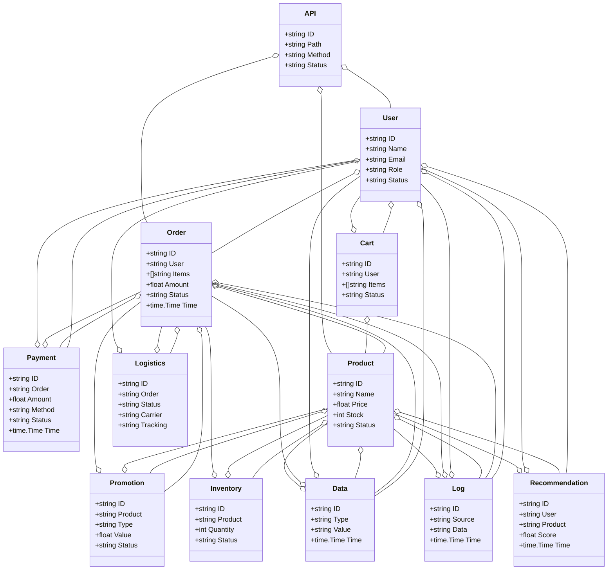
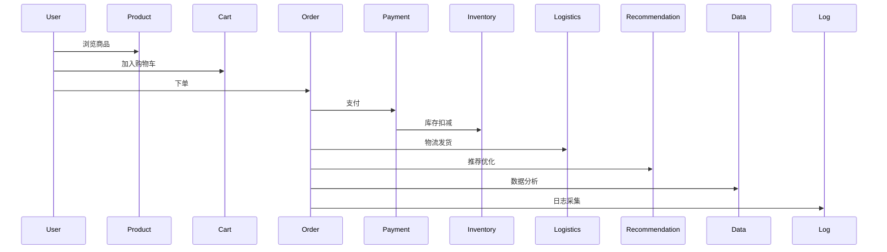
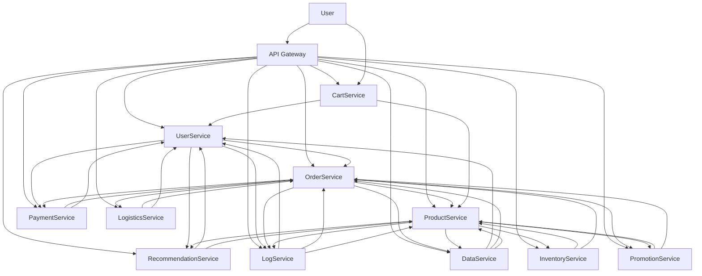

# 电商/智慧电商架构（Golang国际主流实践）

## 1. 目录

- [电商/智慧电商架构（Golang国际主流实践）](#电商智慧电商架构golang国际主流实践)
  - [1. 目录](#1-目录)
  - [2. 电商/智慧电商架构概述](#2-电商智慧电商架构概述)
    - [2.1 国际标准定义](#21-国际标准定义)
    - [2.2 发展历程与核心思想](#22-发展历程与核心思想)
    - [2.3 典型应用场景](#23-典型应用场景)
    - [2.4 与传统电商IT对比](#24-与传统电商it对比)
  - [3. 信息概念架构](#3-信息概念架构)
    - [3.1 领域建模方法](#31-领域建模方法)
    - [3.2 核心实体与关系](#32-核心实体与关系)
      - [3.2.1 UML 类图（Mermaid）](#321-uml-类图mermaid)
    - [3.3 典型数据流](#33-典型数据流)
      - [3.3.1 数据流时序图（Mermaid）](#331-数据流时序图mermaid)
    - [3.4 Golang 领域模型代码示例](#34-golang-领域模型代码示例)
  - [4. 分布式系统挑战](#4-分布式系统挑战)
    - [4.1 弹性与高可用](#41-弹性与高可用)
    - [4.2 数据一致性与安全合规](#42-数据一致性与安全合规)
    - [4.3 实时性与可观测性](#43-实时性与可观测性)
  - [5. 架构设计解决方案](#5-架构设计解决方案)
    - [5.1 微服务与标准接口](#51-微服务与标准接口)
    - [5.2 智能推荐与弹性扩展](#52-智能推荐与弹性扩展)
    - [5.3 数据安全与合规设计](#53-数据安全与合规设计)
    - [5.4 架构图（Mermaid）](#54-架构图mermaid)
    - [5.5 Golang代码示例](#55-golang代码示例)
  - [6. Golang实现范例](#6-golang实现范例)
    - [6.1 工程结构示例](#61-工程结构示例)
    - [6.2 关键代码片段](#62-关键代码片段)
    - [6.3 CI/CD 配置（GitHub Actions 示例）](#63-cicd-配置github-actions-示例)
  - [7. 形式化建模与证明](#7-形式化建模与证明)
    - [7.1 订单-支付-库存建模](#71-订单-支付-库存建模)
      - [7.1.1 性质1：一致性](#711-性质1一致性)
      - [7.1.2 性质2：弹性扩展性](#712-性质2弹性扩展性)
    - [7.2 符号说明](#72-符号说明)
  - [8. 参考与外部链接](#8-参考与外部链接)

---

## 2. 电商/智慧电商架构概述

### 2.1 国际标准定义

电商/智慧电商架构是指以分布式、弹性、智能、数据驱动、安全合规为核心，支持商品、订单、支付、库存、促销、用户、推荐、物流、API、数据分析等场景的现代化系统架构。

- **国际主流参考**：ISO/IEC 29110、ISO/IEC 27001、PCI DSS、GDPR、OAuth2、OpenID、OpenAPI、gRPC、GraphQL、OpenTelemetry、Prometheus、Kubernetes、Docker、Microservices、Event Sourcing、CQRS、REST、ISO 8583（支付）、ISO 20022（金融）、W3C Web标准。

### 2.2 发展历程与核心思想

- 1990s：单体电商、静态页面、集中式数据库。
- 2000s：多层架构、分布式部署、支付集成、初步安全合规。
- 2010s：微服务、云原生、弹性扩展、移动端、API化、推荐系统、智能营销。
- 2020s：AI驱动、全渠道、实时数据、智能推荐、自动化运营、全球化、合规治理。
- 核心思想：分布式、弹性、智能、数据驱动、安全合规、标准互操作。

### 2.3 典型应用场景

- B2C、B2B、C2C、O2O、跨境电商、移动电商、社交电商、智能推荐、实时营销、自动化运营、全渠道零售。

### 2.4 与传统电商IT对比

| 维度         | 传统电商IT         | 智慧电商架构           |
|--------------|-------------------|----------------------|
| 架构模式     | 单体、集中式      | 微服务、云原生、弹性   |
| 通信协议     | HTTP、SOAP        | REST、gRPC、GraphQL   |
| 智能化       | 规则、人工         | AI驱动、智能推荐      |
| 数据处理     | 批量、离线         | 实时、流式、全渠道     |
| 安全合规     | 基础、被动         | PCI DSS、GDPR、主动   |
| 适用场景     | 单一渠道           | 全渠道、全球化        |

---

## 3. 信息概念架构

### 3.1 领域建模方法

- 采用分层建模（用户层、商品层、订单层、支付层、物流层、推荐层、数据层）、UML、ER图。
- 核心实体：用户、商品、订单、支付、库存、促销、购物车、物流、推荐、API、数据、日志。

### 3.2 核心实体与关系

| 实体    | 属性                        | 关系           |
|---------|-----------------------------|----------------|
| 用户    | ID, Name, Email, Role, Status| 关联订单/购物车/支付/推荐 |
| 商品    | ID, Name, Price, Stock, Status| 关联库存/促销/订单/推荐 |
| 订单    | ID, User, Items, Amount, Status, Time| 关联用户/商品/支付/物流 |
| 支付    | ID, Order, Amount, Method, Status, Time| 关联订单/用户 |
| 库存    | ID, Product, Quantity, Status| 关联商品/订单 |
| 促销    | ID, Product, Type, Value, Status| 关联商品/订单 |
| 购物车  | ID, User, Items, Status      | 关联用户/商品 |
| 物流    | ID, Order, Status, Carrier, Tracking| 关联订单/用户 |
| 推荐    | ID, User, Product, Score, Time| 关联用户/商品 |
| API     | ID, Path, Method, Status     | 关联用户/订单/商品 |
| 数据    | ID, Type, Value, Time        | 关联用户/订单/商品 |
| 日志    | ID, Source, Data, Time       | 关联用户/订单/商品 |

#### 3.2.1 UML 类图（Mermaid）



### 3.3 典型数据流

1. 用户注册/登录→浏览商品→加入购物车→下单→支付→库存扣减→物流发货→订单完成→推荐优化→数据分析→日志采集。

#### 3.3.1 数据流时序图（Mermaid）



### 3.4 Golang 领域模型代码示例

```go
// 用户实体
type User struct {
    ID     string
    Name   string
    Email  string
    Role   string
    Status string
}
// 商品实体
type Product struct {
    ID     string
    Name   string
    Price  float64
    Stock  int
    Status string
}
// 订单实体
type Order struct {
    ID     string
    User   string
    Items  []string
    Amount float64
    Status string
    Time   time.Time
}
// 支付实体
type Payment struct {
    ID     string
    Order  string
    Amount float64
    Method string
    Status string
    Time   time.Time
}
// 库存实体
type Inventory struct {
    ID      string
    Product string
    Quantity int
    Status  string
}
// 促销实体
type Promotion struct {
    ID      string
    Product string
    Type    string
    Value   float64
    Status  string
}
// 购物车实体
type Cart struct {
    ID     string
    User   string
    Items  []string
    Status string
}
// 物流实体
type Logistics struct {
    ID       string
    Order    string
    Status   string
    Carrier  string
    Tracking string
}
// 推荐实体
type Recommendation struct {
    ID      string
    User    string
    Product string
    Score   float64
    Time    time.Time
}
// API实体
type API struct {
    ID     string
    Path   string
    Method string
    Status string
}
// 数据实体
type Data struct {
    ID    string
    Type  string
    Value string
    Time  time.Time
}
// 日志实体
type Log struct {
    ID     string
    Source string
    Data   string
    Time   time.Time
}

```

---

## 4. 分布式系统挑战

### 4.1 弹性与高可用

- 自动扩缩容、负载均衡、容灾备份、全球部署、秒级恢复。
- 国际主流：Kubernetes、Prometheus、云服务、CDN、微服务、边缘计算。

### 4.2 数据一致性与安全合规

- 分布式事务、最终一致性、数据加密、访问控制、合规治理。
- 国际主流：OAuth2、OpenID、PCI DSS、GDPR、ISO/IEC 27001、OpenAPI。

### 4.3 实时性与可观测性

- 实时推荐、流式处理、全链路追踪、指标采集、异常检测。
- 国际主流：OpenTelemetry、Prometheus、AI分析。

---

## 5. 架构设计解决方案

### 5.1 微服务与标准接口

- 用户、商品、订单、支付、库存、促销、购物车、物流、推荐、API、数据、日志等服务解耦，API网关统一入口。
- 采用REST、gRPC、GraphQL、消息队列、事件驱动等协议，支持异步事件。

### 5.2 智能推荐与弹性扩展

- AI驱动推荐、弹性扩缩容、智能营销、自动化运营。
- AI推理、Kubernetes、Prometheus、边缘计算。

### 5.3 数据安全与合规设计

- TLS、OAuth2、PCI DSS、GDPR、数据加密、访问审计、合规治理。

### 5.4 架构图（Mermaid）



### 5.5 Golang代码示例

```go
// 订单数量Prometheus监控
var orderCount = prometheus.NewGauge(prometheus.GaugeOpts{Name: "order_total"})
orderCount.Set(1000000)

```

---

## 6. Golang实现范例

### 6.1 工程结构示例

```text
ecommerce-demo/
├── cmd/
├── internal/
│   ├── user/
│   ├── product/
│   ├── order/
│   ├── payment/
│   ├── inventory/
│   ├── promotion/
│   ├── cart/
│   ├── logistics/
│   ├── recommendation/
│   ├── data/
│   ├── log/
├── api/
├── pkg/
├── configs/
├── scripts/
├── build/
└── README.md

```

### 6.2 关键代码片段

// 见4.5

### 6.3 CI/CD 配置（GitHub Actions 示例）

```yaml
name: Go CI
on:
  push:
    branches: [ main ]
jobs:
  build:
    runs-on: ubuntu-latest
    steps:
      - uses: actions/checkout@v3
      - name: Set up Go
        uses: actions/setup-go@v4
        with:
          go-version: '1.21'
      - name: Build
        run: go build ./...
      - name: Test
        run: go test ./...

```

---

## 7. 形式化建模与证明

### 7.1 订单-支付-库存建模

- 用户集合 $U = \{u_1, ..., u_n\}$，商品集合 $P = \{p_1, ..., p_m\}$，订单集合 $O = \{o_1, ..., o_k\}$，支付集合 $Pay = \{pay_1, ..., pay_l\}$。
- 下单函数 $f: (u, p, q) \rightarrow o$，支付函数 $g: (o, a) \rightarrow pay$，库存函数 $h: (p, q) \rightarrow s$。

#### 7.1.1 性质1：一致性

- 所有订单 $o$，其支付 $pay$ 与库存 $s$ 保持一致。

#### 7.1.2 性质2：弹性扩展性

- 所有用户 $u$、订单 $o$，其服务可弹性扩展。

### 7.2 符号说明

- $U$：用户集合
- $P$：商品集合
- $O$：订单集合
- $Pay$：支付集合
- $S$：库存集合
- $f$：下单函数
- $g$：支付函数
- $h$：库存函数

---

## 8. 参考与外部链接

- [ISO/IEC 29110](https://www.iso.org/standard/62767.html)
- [ISO/IEC 27001](https://www.iso.org/isoiec-27001-information-security.html)
- [PCI DSS](https://www.pcisecuritystandards.org/)
- [GDPR](https://gdpr.eu/)
- [OAuth2](https://oauth.net/2/)
- [OpenID](https://openid.net/)
- [OpenAPI](https://www.openapis.org/)
- [gRPC](https://grpc.io/)
- [GraphQL](https://graphql.org/)
- [OpenTelemetry](https://opentelemetry.io/)
- [Prometheus](https://prometheus.io/)
- [Kubernetes](https://kubernetes.io/)
- [Docker](https://www.docker.com/)
- [ISO 8583](https://www.iso.org/standard/31628.html)
- [ISO 20022](https://www.iso20022.org/)
- [W3C Web标准](https://www.w3.org/standards/webdesign/)
