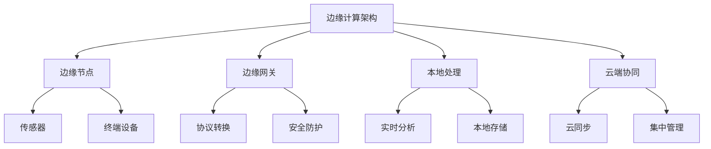
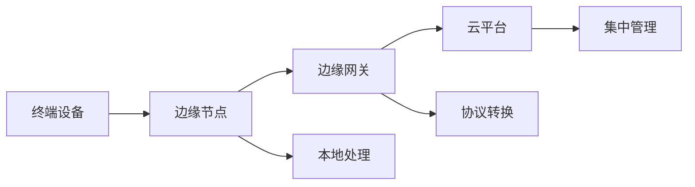
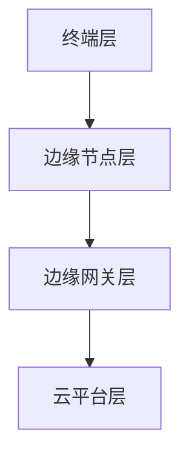

# 边缘计算架构 - Golang实现指南

<!-- TOC START -->
- [边缘计算架构 - Golang实现指南](#边缘计算架构---golang实现指南)
  - [1.1 目录](#11-目录)
  - [1.2 1. 概述](#12-1-概述)
    - [1.2.1 定义与发展历程](#121-定义与发展历程)
    - [1.2.2 核心特征](#122-核心特征)
  - [1.3 2. 边缘计算基础](#13-2-边缘计算基础)
    - [1.3.1 边缘节点](#131-边缘节点)
    - [1.3.2 边缘网关](#132-边缘网关)
    - [1.3.3 边缘与云的协同](#133-边缘与云的协同)
    - [1.3.4 典型应用场景](#134-典型应用场景)
  - [1.4 3. 国际标准与主流框架](#14-3-国际标准与主流框架)
    - [1.4.1 国际标准](#141-国际标准)
    - [1.4.2 主流开源框架](#142-主流开源框架)
    - [1.4.3 云厂商方案](#143-云厂商方案)
  - [1.5 4. 领域建模](#15-4-领域建模)
    - [1.5.1 核心实体](#151-核心实体)
    - [1.5.2 典型数据流](#152-典型数据流)
  - [1.6 5. 分布式挑战](#16-5-分布式挑战)
    - [1.6.1 网络异构与不稳定](#161-网络异构与不稳定)
    - [1.6.2 资源受限与动态变化](#162-资源受限与动态变化)
    - [1.6.3 安全与隐私](#163-安全与隐私)
    - [1.6.4 管理与运维](#164-管理与运维)
  - [1.7 6. 设计解决方案](#17-6-设计解决方案)
    - [1.7.1 分层架构设计](#171-分层架构设计)
    - [1.7.2 任务调度与协同](#172-任务调度与协同)
    - [1.7.3 安全机制](#173-安全机制)
    - [1.7.4 资源管理](#174-资源管理)
  - [1.8 7. Golang实现](#18-7-golang实现)
    - [1.8.1 边缘节点与网关建模](#181-边缘节点与网关建模)
    - [1.8.2 任务调度与执行](#182-任务调度与执行)
    - [1.8.3 边云协同通信](#183-边云协同通信)
  - [1.9 8. 形式化建模](#19-8-形式化建模)
    - [1.9.1 边缘系统形式化](#191-边缘系统形式化)
    - [1.9.2 可靠性与一致性证明](#192-可靠性与一致性证明)
  - [1.10 9. 最佳实践](#110-9-最佳实践)
    - [1.10.1 架构设计](#1101-架构设计)
    - [1.10.2 安全与合规](#1102-安全与合规)
    - [1.10.3 运维与监控](#1103-运维与监控)
  - [1.11 10. 参考资源](#111-10-参考资源)
    - [1.11.1 标准与规范](#1111-标准与规范)
    - [1.11.2 开源项目](#1112-开源项目)
    - [1.11.3 书籍与论文](#1113-书籍与论文)
<!-- TOC END -->

## 1.1 目录

## 1.2 1. 概述

### 1.2.1 定义与发展历程

边缘计算（Edge Computing）是一种将计算、存储和网络能力下沉到靠近数据源头（如终端设备、传感器、基站等）的位置的分布式计算范式。它旨在降低延迟、节省带宽、提升实时性和数据隐私。

**发展历程：**

- 2010年前后：MEC（移动边缘计算）概念提出
- 2015年：ETSI发布MEC标准
- 2018年：边缘云、雾计算等概念兴起
- 2020年后：5G+AIoT推动边缘计算大规模落地

### 1.2.2 核心特征



## 1.3 2. 边缘计算基础

### 1.3.1 边缘节点

- 传感器、摄像头、工业设备、移动终端等
- 具备一定计算、存储、网络能力

### 1.3.2 边缘网关

- 连接边缘节点与云端
- 协议转换、安全防护、数据聚合

### 1.3.3 边缘与云的协同

- 数据分级处理：本地实时、云端深度分析
- 任务动态迁移与负载均衡

### 1.3.4 典型应用场景

- 智能制造、智慧城市、车联网、远程医疗、视频监控等

## 1.4 3. 国际标准与主流框架

### 1.4.1 国际标准

- ETSI MEC（欧洲电信标准协会移动边缘计算）
- OpenFog Reference Architecture（雾计算参考架构）
- 3GPP 5G Edge Computing
- IEEE P1934（雾计算参考架构）

### 1.4.2 主流开源框架

- KubeEdge（基于Kubernetes的边缘计算）
- EdgeX Foundry（IoT边缘平台）
- OpenYurt（阿里云原生边缘计算）
- Baetyl（百度开源边缘计算）

### 1.4.3 云厂商方案

- AWS IoT Greengrass
- Azure IoT Edge
- Google Distributed Cloud Edge

## 1.5 4. 领域建模

### 1.5.1 核心实体

```go
// 边缘节点
 type EdgeNode struct {
     ID         string
     Location   string
     Resources  ResourceProfile
     Status     NodeStatus
 }

// 边缘网关
 type EdgeGateway struct {
     ID         string
     Protocols  []string
     Security   SecurityProfile
     ConnectedNodes []EdgeNode
 }

// 任务建模
 type EdgeTask struct {
     ID         string
     Type       TaskType
     DataSource string
     TargetNode string
     Priority   int
     Status     TaskStatus
 }
```

### 1.5.2 典型数据流



## 1.6 5. 分布式挑战

### 1.6.1 网络异构与不稳定

- 多种接入协议、带宽受限、网络延迟大
- 断网容忍与数据同步

### 1.6.2 资源受限与动态变化

- 节点计算/存储能力有限，资源动态变化
- 任务调度与负载均衡复杂

### 1.6.3 安全与隐私

- 边缘侧攻击面大，数据隐私保护难
- 端到端加密、可信执行环境

### 1.6.4 管理与运维

- 大规模节点自动化管理、监控、升级
- 故障自愈与弹性伸缩

## 1.7 6. 设计解决方案

### 1.7.1 分层架构设计



### 1.7.2 任务调度与协同

- 采用分布式调度器（如KubeEdge、OpenYurt）
- 支持任务动态迁移、边云协同

### 1.7.3 安全机制

- 零信任架构、端到端加密、设备认证
- 可信执行环境（TEE）、安全启动

### 1.7.4 资源管理

- 资源感知调度、弹性伸缩、边缘自治

## 1.8 7. Golang实现

### 1.8.1 边缘节点与网关建模

```go
// 资源感知
 type ResourceProfile struct {
     CPU    float64
     Memory float64
     Storage float64
     NetworkBandwidth float64
 }

// 节点状态
 type NodeStatus string
 const (
     NodeActive   NodeStatus = "Active"
     NodeInactive NodeStatus = "Inactive"
     NodeError    NodeStatus = "Error"
 )

// 安全配置
 type SecurityProfile struct {
     TLSCert   string
     AuthToken string
     Trusted   bool
 }
```

### 1.8.2 任务调度与执行

```go
// 简单任务调度器
 type TaskScheduler struct {
     Nodes []EdgeNode
 }

 func (ts *TaskScheduler) Schedule(task EdgeTask) (string, error) {
     // 按资源和状态选择合适节点
     for _, node := range ts.Nodes {
         if node.Status == NodeActive && node.Resources.CPU > 1.0 {
             return node.ID, nil
         }
     }
     return "", fmt.Errorf("no available node")
 }
```

### 1.8.3 边云协同通信

```go
// 边缘与云通信接口
 type EdgeCloudInterface struct {
     Gateway EdgeGateway
     CloudAPI string
 }

 func (eci *EdgeCloudInterface) SyncData(data []byte) error {
     // 伪代码：通过安全通道同步数据到云
     return SecureSend(eci.CloudAPI, data)
 }
```

## 1.9 8. 形式化建模

### 1.9.1 边缘系统形式化

- 节点集合 N = {n1, n2, ..., nn}
- 任务集合 T = {t1, t2, ..., tm}
- 资源约束 R(n, t)
- 调度函数 S: T → N

### 1.9.2 可靠性与一致性证明

- 分布式一致性协议（如Raft、Paxos）
- 容错性分析：f个节点失效，系统可用性证明

## 1.10 9. 最佳实践

### 1.10.1 架构设计

- 分层解耦、接口标准化、模块化
- 充分利用开源边缘平台

### 1.10.2 安全与合规

- 端到端加密、最小权限原则
- 合规标准（如GDPR、ISO/IEC 27001）

### 1.10.3 运维与监控

- 自动化部署、集中监控、日志采集
- 故障自愈与弹性伸缩

## 1.11 10. 参考资源

### 1.11.1 标准与规范

- ETSI MEC: <https://www.etsi.org/technologies/multi-access-edge-computing>
- OpenFog RA: <https://www.openfogconsortium.org/ra/>
- 3GPP Edge: <https://www.3gpp.org/>

### 1.11.2 开源项目

- KubeEdge: <https://kubeedge.io/>
- EdgeX Foundry: <https://www.edgexfoundry.org/>
- OpenYurt: <https://openyurt.io/>
- Baetyl: <https://baetyl.io/>

### 1.11.3 书籍与论文

- Edge Computing: A Primer, Research Opportunities, and Future Directions (IEEE)
- Multi-access Edge Computing (MEC); Framework and Reference Architecture (ETSI)

---

*本文档为边缘计算架构的系统性指南，涵盖理论、设计、实现与最佳实践，适用于Golang开发者与架构师。*
