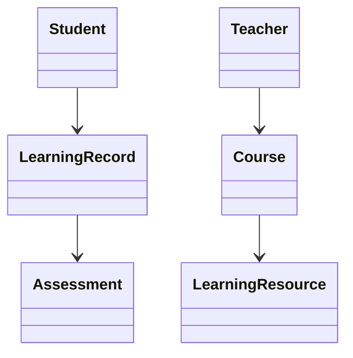
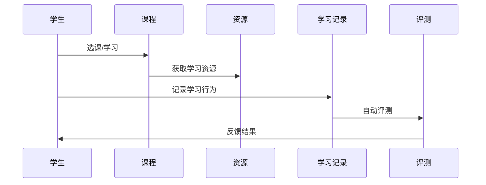
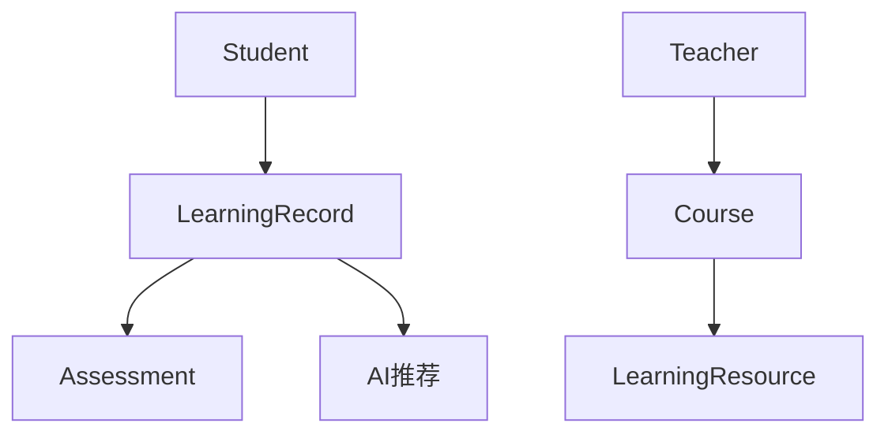

# 1 1 1 1 1 1 1 教育科技架构（EdTech Architecture）

<!-- TOC START -->
- [1 1 1 1 1 1 1 教育科技架构（EdTech Architecture）](#1-1-1-1-1-1-1-教育科技架构edtech-architecture)
  - [1.1 国际标准定义与发展历程](#11-国际标准定义与发展历程)
  - [1.2 核心思想与典型应用场景](#12-核心思想与典型应用场景)
  - [1.3 与传统方案对比](#13-与传统方案对比)
  - [1.4 领域建模（核心实体、关系、UML类图）](#14-领域建模核心实体关系uml类图)
  - [1.5 典型数据流与时序图](#15-典型数据流与时序图)
  - [1.6 Golang领域模型代码示例](#16-golang领域模型代码示例)
  - [1.7 分布式系统挑战](#17-分布式系统挑战)
  - [1.8 主流解决方案](#18-主流解决方案)
  - [1.9 形式化建模与证明](#19-形式化建模与证明)
  - [1.10 国际权威参考链接](#110-国际权威参考链接)
<!-- TOC END -->

## 1.1 国际标准定义与发展历程

- 定义：教育科技架构指支持在线教育、智能学习、教育资源共享的系统架构，遵循LTI、SCORM、xAPI等国际标准。
- 发展历程：从本地LMS到云端SaaS、AI自适应学习，标准推动全球教育互操作。

## 1.2 核心思想与典型应用场景

- 核心思想：互操作性、个性化、可扩展、智能化。
- 应用场景：在线教育平台、MOOC、智能题库、教育大数据分析、虚拟实验室。

## 1.3 与传统方案对比

| 维度         | 传统教育IT     | 现代教育科技架构     |
|--------------|--------------|---------------------|
| 部署方式     | 本地/单体     | 云端/分布式         |
| 互操作性     | 弱            | 强（LTI/SCORM）     |
| 个性化       | 低            | 高（AI/自适应）     |
| 数据分析     | 基本          | 深度（大数据/AI）   |

## 1.4 领域建模（核心实体、关系、UML类图）

- 核心实体：学生（Student）、教师（Teacher）、课程（Course）、学习资源、学习记录、评测模块。
- UML类图：



## 1.5 典型数据流与时序图

- 在线学习与评测时序：



## 1.6 Golang领域模型代码示例

```go
// 学生、教师、课程等核心结构体
 type Student struct {
   ID   string
   Name string
 }
 type Teacher struct {
   ID   string
   Name string
 }
 type Course struct {
   ID    string
   Title string
 }
```

## 1.7 分布式系统挑战

- 资源分发、并发访问、数据一致性、个性化推荐、隐私保护。

## 1.8 主流解决方案

- 架构图（LMS为核心，集成资源、评测、AI推荐）：



- 关键代码：Golang实现LTI/xAPI接口、学习行为采集、评测自动化。
- CI/CD：自动化测试、持续集成。
- 监控：学习行为分析、异常检测。

## 1.9 形式化建模与证明

- 数学建模：
  - 学习记录L = {l1, l2, ..., ln}，每条记录li关联学生、课程、评测
  - 互操作性映射：f: L → xAPI
- 性质：数据一致性、个性化推荐、互操作性
- 符号说明：L-学习记录，f-互操作映射

## 1.10 国际权威参考链接

- [IMS Global LTI](https://www.imsglobal.org/activity/learning-tools-interoperability)
- [SCORM](https://scorm.com/)
- [xAPI](https://xapi.com/)
- [EdTech Europe](https://edtecheurope.com/)
