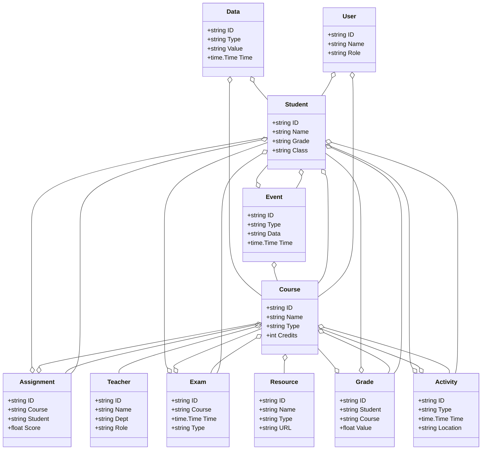
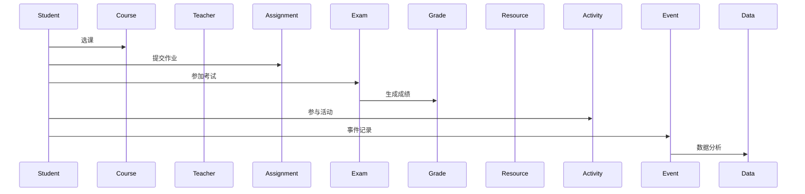
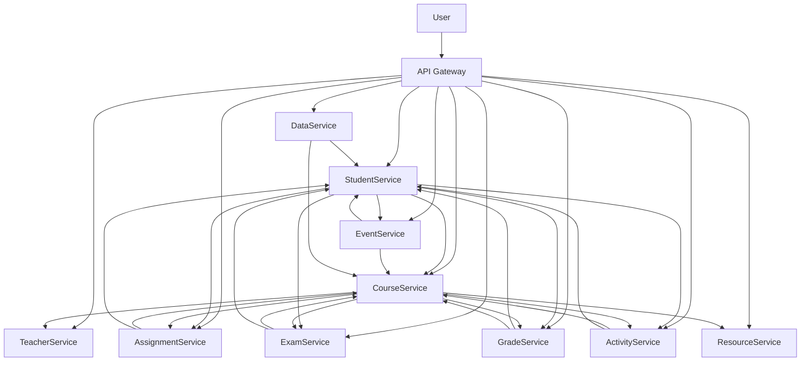

# 教育/智慧教育架构（Golang国际主流实践）

## 1.1 目录

<!-- TOC START -->
- [教育/智慧教育架构（Golang国际主流实践）](#教育智慧教育架构golang国际主流实践)
  - [1.1 目录](#11-目录)
  - [1.2 1. 教育/智慧教育架构概述](#12-1-教育智慧教育架构概述)
    - [1.2.1 国际标准定义](#121-国际标准定义)
    - [1.2.2 发展历程与核心思想](#122-发展历程与核心思想)
    - [1.2.3 典型应用场景](#123-典型应用场景)
    - [1.2.4 与传统教育IT对比](#124-与传统教育it对比)
  - [1.3 2. 信息概念架构](#13-2-信息概念架构)
    - [1.3.1 领域建模方法](#131-领域建模方法)
    - [1.3.2 核心实体与关系](#132-核心实体与关系)
      - [1.3.2.1 UML 类图（Mermaid）](#1321-uml-类图mermaid)
    - [1.3.3 典型数据流](#133-典型数据流)
      - [1.3.3.1 数据流时序图（Mermaid）](#1331-数据流时序图mermaid)
    - [1.3.4 Golang 领域模型代码示例](#134-golang-领域模型代码示例)
  - [1.4 3. 分布式系统挑战](#14-3-分布式系统挑战)
    - [1.4.1 弹性与实时性](#141-弹性与实时性)
    - [1.4.2 数据安全与互操作性](#142-数据安全与互操作性)
    - [1.4.3 可观测性与智能优化](#143-可观测性与智能优化)
  - [1.5 4. 架构设计解决方案](#15-4-架构设计解决方案)
    - [1.5.1 服务解耦与标准接口](#151-服务解耦与标准接口)
    - [1.5.2 智能推荐与个性化学习](#152-智能推荐与个性化学习)
    - [1.5.3 数据安全与互操作设计](#153-数据安全与互操作设计)
    - [1.5.4 架构图（Mermaid）](#154-架构图mermaid)
    - [1.5.5 Golang代码示例](#155-golang代码示例)
  - [1.6 5. Golang实现范例](#16-5-golang实现范例)
    - [1.6.1 工程结构示例](#161-工程结构示例)
    - [1.6.2 关键代码片段](#162-关键代码片段)
    - [1.6.3 CI/CD 配置（GitHub Actions 示例）](#163-cicd-配置github-actions-示例)
  - [1.7 6. 形式化建模与证明](#17-6-形式化建模与证明)
    - [1.7.1 学生-课程-成绩建模](#171-学生-课程-成绩建模)
      - [1.7.1.1 性质1：个性化学习性](#1711-性质1个性化学习性)
      - [1.7.1.2 性质2：数据安全性](#1712-性质2数据安全性)
    - [1.7.2 符号说明](#172-符号说明)
  - [1.8 7. 参考与外部链接](#18-7-参考与外部链接)
<!-- TOC END -->

## 1.2 1. 教育/智慧教育架构概述

### 1.2.1 国际标准定义

教育/智慧教育架构是指以个性化学习、智能推荐、弹性协同、数据驱动为核心，支持在线教育、混合教学、智能评测、教育大数据等场景的分布式系统架构。

- **国际主流参考**：IMS Global、xAPI、SCORM、LTI、ISO/IEC 19796、Ed-Fi、IEEE LTSC、PESC。

### 1.2.2 发展历程与核心思想

- 2000s：数字化教学、在线课程、学习管理系统（LMS）。
- 2010s：移动学习、MOOC、智能评测、数据分析。
- 2020s：AI个性化推荐、混合教学、教育大数据、全球协同。
- 核心思想：个性化、智能驱动、弹性协同、开放标准、数据赋能。

### 1.2.3 典型应用场景

- 在线教育、混合教学、智能评测、学习分析、教育大数据、个性化推荐等。

### 1.2.4 与传统教育IT对比

| 维度         | 传统教育IT         | 智慧教育架构           |
|--------------|-------------------|----------------------|
| 教学模式     | 线下、统一         | 在线、混合、个性化      |
| 数据采集     | 手工、离线         | 实时、自动化          |
| 智能化       | 规则、人工         | AI驱动、智能分析      |
| 协同         | 单点、割裂         | 多方、弹性、协同      |
| 适用场景     | 学校、单一课程     | 全域、跨校、全球协同    |

---

## 1.3 2. 信息概念架构

### 1.3.1 领域建模方法

- 采用分层建模（感知层、服务层、数据层、应用层）、UML、ER图。
- 核心实体：学生、教师、课程、作业、考试、成绩、资源、活动、事件、数据、用户。

### 1.3.2 核心实体与关系

| 实体    | 属性                        | 关系           |
|---------|-----------------------------|----------------|
| 学生    | ID, Name, Grade, Class      | 关联课程/作业   |
| 教师    | ID, Name, Dept, Role        | 管理课程/作业   |
| 课程    | ID, Name, Type, Credits     | 关联学生/教师   |
| 作业    | ID, Course, Student, Score  | 关联课程/学生   |
| 考试    | ID, Course, Time, Type      | 关联课程/学生   |
| 成绩    | ID, Student, Course, Value  | 关联学生/课程   |
| 资源    | ID, Name, Type, URL         | 属于课程       |
| 活动    | ID, Type, Time, Location    | 关联课程/学生   |
| 事件    | ID, Type, Data, Time        | 关联学生/课程   |
| 数据    | ID, Type, Value, Time       | 关联学生/课程   |
| 用户    | ID, Name, Role              | 管理学生/课程   |

#### 1.3.2.1 UML 类图（Mermaid）



### 1.3.3 典型数据流

1. 学生注册→课程选课→作业提交→考试评测→成绩分析→活动参与→事件记录→数据分析。

#### 1.3.3.1 数据流时序图（Mermaid）



### 1.3.4 Golang 领域模型代码示例

```go
// 学生实体
type Student struct {
    ID    string
    Name  string
    Grade string
    Class string
}
// 教师实体
type Teacher struct {
    ID   string
    Name string
    Dept string
    Role string
}
// 课程实体
type Course struct {
    ID      string
    Name    string
    Type    string
    Credits int
}
// 作业实体
type Assignment struct {
    ID      string
    Course  string
    Student string
    Score   float64
}
// 考试实体
type Exam struct {
    ID      string
    Course  string
    Time    time.Time
    Type    string
}
// 成绩实体
type Grade struct {
    ID      string
    Student string
    Course  string
    Value   float64
}
// 资源实体
type Resource struct {
    ID   string
    Name string
    Type string
    URL  string
}
// 活动实体
type Activity struct {
    ID       string
    Type     string
    Time     time.Time
    Location string
}
// 事件实体
type Event struct {
    ID   string
    Type string
    Data string
    Time time.Time
}
// 数据实体
type Data struct {
    ID    string
    Type  string
    Value string
    Time  time.Time
}
// 用户实体
type User struct {
    ID   string
    Name string
    Role string
}

```

---

## 1.4 3. 分布式系统挑战

### 1.4.1 弹性与实时性

- 自动扩缩容、毫秒级响应、负载均衡、容灾备份。
- 国际主流：Kubernetes、Prometheus、云服务、CDN。

### 1.4.2 数据安全与互操作性

- 数据加密、标准协议、互操作、访问控制。
- 国际主流：xAPI、OAuth2、OpenID、TLS、GDPR、LTI。

### 1.4.3 可观测性与智能优化

- 全链路追踪、指标采集、AI优化、异常检测。
- 国际主流：OpenTelemetry、Prometheus、AI分析。

---

## 1.5 4. 架构设计解决方案

### 1.5.1 服务解耦与标准接口

- 学生、教师、课程、作业、考试、成绩、资源、活动、数据等服务解耦，API网关统一入口。
- 采用REST、gRPC、消息队列等协议，支持异步事件驱动。

### 1.5.2 智能推荐与个性化学习

- AI推荐、个性化学习、自动扩缩容、智能分析。
- AI推理、Kubernetes、Prometheus。

### 1.5.3 数据安全与互操作设计

- TLS、OAuth2、数据加密、标准协议、访问审计。

### 1.5.4 架构图（Mermaid）



### 1.5.5 Golang代码示例

```go
// 学生数量Prometheus监控
var studentCount = prometheus.NewGauge(prometheus.GaugeOpts{Name: "student_total"})
studentCount.Set(100000)

```

---

## 1.6 5. Golang实现范例

### 1.6.1 工程结构示例

```text
education-demo/
├── cmd/
├── internal/
│   ├── student/
│   ├── teacher/
│   ├── course/
│   ├── assignment/
│   ├── exam/
│   ├── grade/
│   ├── resource/
│   ├── activity/
│   ├── event/
│   ├── data/
│   ├── user/
├── api/
├── pkg/
├── configs/
├── scripts/
├── build/
└── README.md

```

### 1.6.2 关键代码片段

// 见4.5

### 1.6.3 CI/CD 配置（GitHub Actions 示例）

```yaml
name: Go CI
on:
  push:
    branches: [ main ]
jobs:
  build:
    runs-on: ubuntu-latest
    steps:
      - uses: actions/checkout@v3
      - name: Set up Go
        uses: actions/setup-go@v4
        with:
          go-version: '1.21'
      - name: Build
        run: go build ./...
      - name: Test
        run: go test ./...

```

---

## 1.7 6. 形式化建模与证明

### 1.7.1 学生-课程-成绩建模

- 学生集合 $S = \{s_1, ..., s_n\}$，课程集合 $C = \{c_1, ..., c_k\}$，成绩集合 $G = \{g_1, ..., g_l\}$。
- 选课函数 $f: (s, c) \rightarrow g$，数据采集函数 $h: (s, t) \rightarrow a$。

#### 1.7.1.1 性质1：个性化学习性

- 所有学生 $s$ 与课程 $c$，其成绩 $g$ 能个性化评测。

#### 1.7.1.2 性质2：数据安全性

- 所有数据 $a$ 满足安全策略 $p$，即 $\forall a, \exists p, p(a) = true$。

### 1.7.2 符号说明

- $S$：学生集合
- $C$：课程集合
- $G$：成绩集合
- $A$：数据集合
- $P$：安全策略集合
- $f$：选课函数
- $h$：数据采集函数

---

## 1.8 7. 参考与外部链接

- [IMS Global](https://www.imsglobal.org/)
- [xAPI](https://xapi.com/)
- [SCORM](https://scorm.com/)
- [LTI](https://www.imsglobal.org/activity/learning-tools-interoperability)
- [ISO/IEC 19796](https://www.iso.org/standard/33957.html)
- [Ed-Fi](https://www.ed-fi.org/)
- [IEEE LTSC](https://standards.ieee.org/ieee/1484/993/)
- [PESC](https://www.pesc.org/)
- [Prometheus](https://prometheus.io/)
- [OpenTelemetry](https://opentelemetry.io/)
