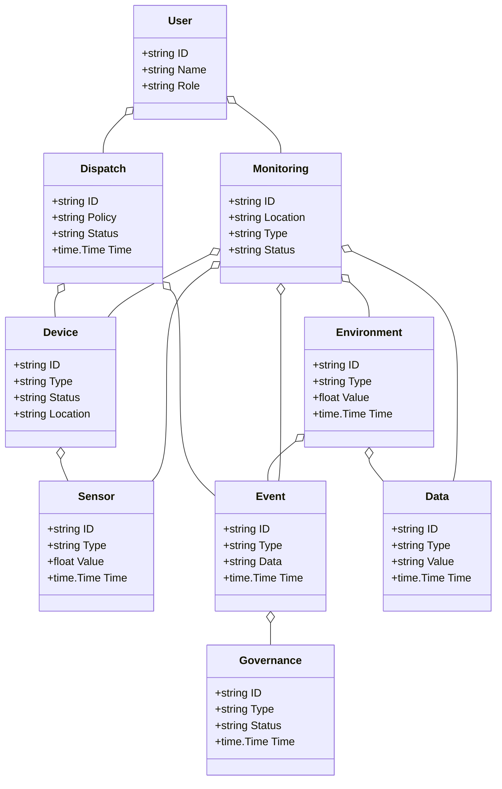
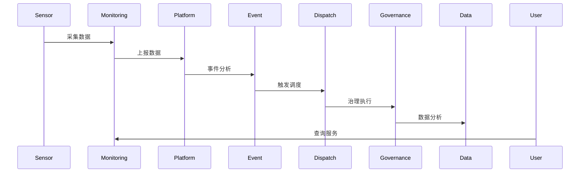
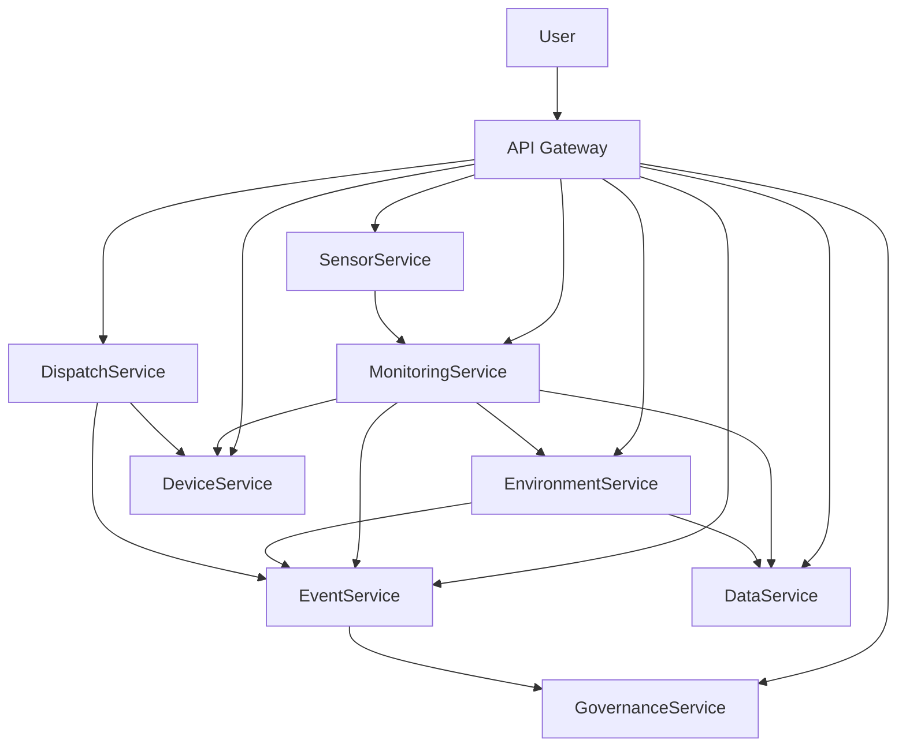

# 环保/智慧环境架构（Golang国际主流实践）

## 1. 目录

- [环保/智慧环境架构（Golang国际主流实践）](#环保智慧环境架构golang国际主流实践)
  - [1. 目录](#1-目录)
  - [2. 环保/智慧环境架构概述](#2-环保智慧环境架构概述)
    - [2.1 国际标准定义](#21-国际标准定义)
    - [2.2 发展历程与核心思想](#22-发展历程与核心思想)
    - [2.3 典型应用场景](#23-典型应用场景)
    - [2.4 与传统环保IT对比](#24-与传统环保it对比)
  - [3. 信息概念架构](#3-信息概念架构)
    - [3.1 领域建模方法](#31-领域建模方法)
    - [3.2 核心实体与关系](#32-核心实体与关系)
      - [3.2.1 UML 类图（Mermaid）](#321-uml-类图mermaid)
    - [3.3 典型数据流](#33-典型数据流)
      - [3.3.1 数据流时序图（Mermaid）](#331-数据流时序图mermaid)
    - [3.4 Golang 领域模型代码示例](#34-golang-领域模型代码示例)
  - [4. 分布式系统挑战](#4-分布式系统挑战)
    - [4.1 弹性与实时性](#41-弹性与实时性)
    - [4.2 数据安全与互操作性](#42-数据安全与互操作性)
    - [4.3 可观测性与智能优化](#43-可观测性与智能优化)
  - [5. 架构设计解决方案](#5-架构设计解决方案)
    - [5.1 服务解耦与标准接口](#51-服务解耦与标准接口)
    - [5.2 智能调度与绿色治理](#52-智能调度与绿色治理)
    - [5.3 数据安全与互操作设计](#53-数据安全与互操作设计)
    - [5.4 架构图（Mermaid）](#54-架构图mermaid)
    - [5.5 Golang代码示例](#55-golang代码示例)
  - [6. Golang实现范例](#6-golang实现范例)
    - [6.1 工程结构示例](#61-工程结构示例)
    - [6.2 关键代码片段](#62-关键代码片段)
    - [6.3 CI/CD 配置（GitHub Actions 示例）](#63-cicd-配置github-actions-示例)
  - [7. 形式化建模与证明](#7-形式化建模与证明)
    - [7.1 监测-事件-治理建模](#71-监测-事件-治理建模)
      - [7.1.1 性质1：弹性治理性](#711-性质1弹性治理性)
      - [7.1.2 性质2：数据安全性](#712-性质2数据安全性)
    - [7.2 符号说明](#72-符号说明)
  - [8. 参考与外部链接](#8-参考与外部链接)

---

## 2. 环保/智慧环境架构概述

### 2.1 国际标准定义

环保/智慧环境架构是指以环境感知、实时监测、弹性调度、数据驱动为核心，支持多源数据采集、智能分析、绿色治理的分布式系统架构。

- **国际主流参考**：ISO 14001、OGC SensorThings、WMO、INSPIRE、EPA、GEOSS、UN SDG、OpenAQ。

### 2.2 发展历程与核心思想

- 2000s：环境监测、数据采集、污染治理。
- 2010s：物联网感知、云平台、数据集成、标准化接口。
- 2020s：AI分析、绿色治理、碳中和、全球协同、智能决策。
- 核心思想：多源感知、智能驱动、弹性协同、开放标准、数据赋能。

### 2.3 典型应用场景

- 空气质量监测、水质监测、噪声监测、碳排放管理、污染溯源、绿色治理、环境大数据等。

### 2.4 与传统环保IT对比

| 维度         | 传统环保IT         | 智慧环境架构           |
|--------------|-------------------|----------------------|
| 数据采集     | 手工、离线         | 实时、自动化          |
| 协同         | 单点、割裂         | 多方、弹性、协同      |
| 智能化       | 规则、人工         | AI驱动、智能分析      |
| 扩展性       | 静态、难扩展       | 弹性、自动扩缩容      |
| 适用场景     | 单一监测           | 多源、全域、绿色治理  |

---

## 3. 信息概念架构

### 3.1 领域建模方法

- 采用分层建模（感知层、监测层、平台层、应用层）、UML、ER图。
- 核心实体：传感器、监测点、环境、事件、调度、用户、数据、设备、治理。

### 3.2 核心实体与关系

| 实体    | 属性                        | 关系           |
|---------|-----------------------------|----------------|
| 传感器  | ID, Type, Value, Time       | 属于监测点/设备 |
| 监测点  | ID, Location, Type, Status  | 包含传感器/环境 |
| 环境    | ID, Type, Value, Time       | 关联监测点/数据 |
| 事件    | ID, Type, Data, Time        | 关联监测点/环境 |
| 调度    | ID, Policy, Status, Time    | 管理事件/设备   |
| 用户    | ID, Name, Role              | 管理监测/调度   |
| 数据    | ID, Type, Value, Time       | 关联监测点/环境 |
| 设备    | ID, Type, Status, Location  | 关联监测点/传感器 |
| 治理    | ID, Type, Status, Time      | 关联环境/事件   |

#### 3.2.1 UML 类图（Mermaid）



### 3.3 典型数据流

1. 传感器采集→监测点上报→平台分析→事件触发→治理调度→数据分析→用户服务。

#### 3.3.1 数据流时序图（Mermaid）



### 3.4 Golang 领域模型代码示例

```go
// 传感器实体
type Sensor struct {
    ID    string
    Type  string
    Value float64
    Time  time.Time
}
// 监测点实体
type Monitoring struct {
    ID       string
    Location string
    Type     string
    Status   string
}
// 环境实体
type Environment struct {
    ID    string
    Type  string
    Value float64
    Time  time.Time
}
// 事件实体
type Event struct {
    ID   string
    Type string
    Data string
    Time time.Time
}
// 调度实体
type Dispatch struct {
    ID     string
    Policy string
    Status string
    Time   time.Time
}
// 用户实体
type User struct {
    ID   string
    Name string
    Role string
}
// 数据实体
type Data struct {
    ID    string
    Type  string
    Value string
    Time  time.Time
}
// 设备实体
type Device struct {
    ID       string
    Type     string
    Status   string
    Location string
}
// 治理实体
type Governance struct {
    ID     string
    Type   string
    Status string
    Time   time.Time
}
```

---

## 4. 分布式系统挑战

### 4.1 弹性与实时性

- 自动扩缩容、毫秒级响应、负载均衡、容灾备份。
- 国际主流：OGC SensorThings、Kubernetes、Prometheus、云服务。

### 4.2 数据安全与互操作性

- 数据加密、标准协议、互操作、访问控制。
- 国际主流：OGC、TLS、OAuth2、INSPIRE。

### 4.3 可观测性与智能优化

- 全链路追踪、指标采集、AI优化、异常检测。
- 国际主流：OpenTelemetry、Prometheus、AI分析。

---

## 5. 架构设计解决方案

### 5.1 服务解耦与标准接口

- 传感器、监测点、环境、事件、调度、治理、数据等服务解耦，API网关统一入口。
- 采用REST、gRPC、消息队列等协议，支持异步事件驱动。

### 5.2 智能调度与绿色治理

- AI调度、绿色治理、自动扩缩容、智能分析。
- AI推理、Kubernetes、Prometheus。

### 5.3 数据安全与互操作设计

- TLS、OAuth2、数据加密、标准协议、访问审计。

### 5.4 架构图（Mermaid）



### 5.5 Golang代码示例

```go
// 传感器数据采集示例
// ...
// Prometheus 监控
var sensorCount = prometheus.NewGauge(prometheus.GaugeOpts{Name: "sensor_online_total"})
sensorCount.Set(10000)
```

---

## 6. Golang实现范例

### 6.1 工程结构示例

```text
environment-demo/
├── cmd/
├── internal/
│   ├── sensor/
│   ├── monitoring/
│   ├── environment/
│   ├── event/
│   ├── dispatch/
│   ├── governance/
│   ├── data/
│   ├── device/
├── api/
├── pkg/
├── configs/
├── scripts/
├── build/
└── README.md
```

### 6.2 关键代码片段

// 见4.5

### 6.3 CI/CD 配置（GitHub Actions 示例）

```yaml
name: Go CI
on:
  push:
    branches: [ main ]
jobs:
  build:
    runs-on: ubuntu-latest
    steps:
      - uses: actions/checkout@v3
      - name: Set up Go
        uses: actions/setup-go@v4
        with:
          go-version: '1.21'
      - name: Build
        run: go build ./...
      - name: Test
        run: go test ./...
```

---

## 7. 形式化建模与证明

### 7.1 监测-事件-治理建模

- 监测点集合 $M = \{m_1, ..., m_n\}$，事件集合 $E = \{e_1, ..., e_k\}$，治理集合 $G = \{g_1, ..., g_l\}$。
- 事件函数 $f: (m, t) \rightarrow e$，治理函数 $g: (e, t) \rightarrow g$。

#### 7.1.1 性质1：弹性治理性

- 所有监测点 $m$，其事件 $e$ 能弹性治理。

#### 7.1.2 性质2：数据安全性

- 所有数据 $a$ 满足安全策略 $p$，即 $\forall a, \exists p, p(a) = true$。

### 7.2 符号说明

- $M$：监测点集合
- $E$：事件集合
- $G$：治理集合
- $A$：数据集合
- $P$：安全策略集合
- $f$：事件函数
- $g$：治理函数

---

## 8. 参考与外部链接

- [ISO 14001](https://www.iso.org/iso-14001-environmental-management.html)
- [OGC SensorThings](https://www.ogc.org/standards/sensorthings/)
- [WMO](https://public.wmo.int/)
- [INSPIRE](https://inspire.ec.europa.eu/)
- [EPA](https://www.epa.gov/)
- [GEOSS](https://www.earthobservations.org/geoss.php)
- [UN SDG](https://sdgs.un.org/)
- [OpenAQ](https://openaq.org/)
- [Prometheus](https://prometheus.io/)
- [OpenTelemetry](https://opentelemetry.io/)
