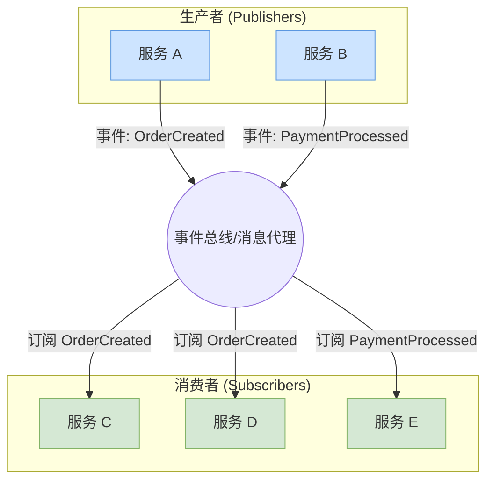

# 事件驱动架构（Event-Driven Architecture）

## 1. 目录

- [事件驱动架构（Event-Driven Architecture）](#事件驱动架构event-driven-architecture)
  - [1. 目录](#1-目录)
  - [2. 国际标准与发展历程](#2-国际标准与发展历程)
    - [2.1 主流事件驱动平台与标准](#21-主流事件驱动平台与标准)
    - [2.2 发展历程](#22-发展历程)
    - [2.3 国际权威链接](#23-国际权威链接)
  - [3. 核心架构模式](#3-核心架构模式)
    - [3.1 事件驱动基础架构](#31-事件驱动基础架构)
    - [3.2 事件溯源模式](#32-事件溯源模式)
    - [3.3 CQRS模式](#33-cqrs模式)
    - [3.4 发布/订阅模式 (Publish/Subscribe)](#34-发布订阅模式-publishsubscribe)
    - [3.5 事件溯源 (Event Sourcing) 与 CQRS 组合模式](#35-事件溯源-event-sourcing-与-cqrs-组合模式)
  - [4. 实际案例分析](#4-实际案例分析)
    - [4.1 电商订单系统](#41-电商订单系统)
  - [5. 未来趋势与国际前沿](#5-未来趋势与国际前沿)
  - [6. 国际权威资源与开源组件引用](#6-国际权威资源与开源组件引用)
    - [6.1 事件流平台](#61-事件流平台)
    - [6.2 云原生事件服务](#62-云原生事件服务)
    - [6.3 事件标准](#63-事件标准)
  - [7. 扩展阅读与参考文献](#7-扩展阅读与参考文献)
    - [7.1 使用CloudEvents进行事件标准化](#71-使用cloudevents进行事件标准化)
    - [7.2 Kafka 生产者与消费者示例 (使用 sarama)](#72-kafka-生产者与消费者示例-使用-sarama)
  - [8. 分布式挑战与主流解决方案](#8-分布式挑战与主流解决方案)
    - [8.1 消息交付保证](#81-消息交付保证)
    - [8.2 死信队列 (Dead-Letter Queue)](#82-死信队列-dead-letter-queue)
  - [9. 工程结构与CI/CD实践](#9-工程结构与cicd实践)
    - [9.1 事件驱动系统工程结构](#91-事件驱动系统工程结构)
    - [9.2 CI/CD实践](#92-cicd实践)
  - [10. 形式化建模与数学表达](#10-形式化建模与数学表达)
    - [10.1 事件驱动系统形式化建模](#101-事件驱动系统形式化建模)
    - [10.2 事件溯源模式数学表达](#102-事件溯源模式数学表达)
  - [11. 相关架构主题](#11-相关架构主题)

---

## 2. 国际标准与发展历程

### 2.1 主流事件驱动平台与标准

- **Apache Kafka**: 分布式流处理平台
- **Apache Pulsar**: 云原生消息流平台
- **EventStore**: 事件存储数据库
- **AWS EventBridge**: 事件总线服务
- **Google Cloud Pub/Sub**: 消息传递服务
- **Azure Event Grid**: 事件路由服务
- **CloudEvents**: 事件数据标准
- **Event Sourcing**: 事件溯源模式

### 2.2 发展历程

- **2000s**: 消息队列、发布订阅模式
- **2010s**: 事件溯源、CQRS模式兴起
- **2015s**: 流处理、实时分析
- **2020s**: 事件流平台、云原生事件架构

### 2.3 国际权威链接

- [Apache Kafka](https://kafka.apache.org/)
- [Apache Pulsar](https://pulsar.apache.org/)
- [EventStore](https://eventstore.com/)
- [CloudEvents](https://cloudevents.io/)
- [Event Sourcing](https://martinfowler.com/eaaDev/EventSourcing.html)

---

## 3. 核心架构模式

### 3.1 事件驱动基础架构

```go
type EventDrivenSystem struct {
    // 事件总线
    EventBus *EventBus
    
    // 事件存储
    EventStore *EventStore
    
    // 事件处理器
    EventHandlers map[string][]EventHandler
    
    // 事件发布者
    Publishers map[string]EventPublisher
    
    // 事件订阅者
    Subscribers map[string][]EventSubscriber
}

type Event struct {
    ID          string
    Type        string
    Source      string
    Data        interface{}
    Metadata    map[string]interface{}
    Timestamp   time.Time
    Version     int
    CorrelationID string
    CausationID   string
}

type EventHandler interface {
    Handle(ctx context.Context, event *Event) error
    CanHandle(eventType string) bool
}

```

### 3.2 事件溯源模式

```go
type EventSourcedAggregate struct {
    ID      string
    Version int
    Events  []*Event
    State   interface{}
    
    // 事件处理器
    EventHandlers map[string]func(*Event)
    // 状态重建器
    StateRebuilder func([]*Event) interface{}
}

func (esa *EventSourcedAggregate) Apply(event *Event) {
    // 1. 应用事件
    if handler, exists := esa.EventHandlers[event.Type]; exists {
        handler(event)
    }
    
    // 2. 更新版本
    esa.Version++
    
    // 3. 添加事件到历史
    esa.Events = append(esa.Events, event)
}

func (esa *EventSourcedAggregate) LoadFromHistory(events []*Event) {
    esa.Events = events
    esa.Version = len(events)
    esa.RebuildState()
}

```

### 3.3 CQRS模式

```go
type CQRSSystem struct {
    // 命令端
    CommandSide *CommandSide
    
    // 查询端
    QuerySide *QuerySide
    
    // 事件总线
    EventBus *EventBus
    
    // 投影器
    Projectors map[string]Projector
}

type Command interface {
    GetAggregateID() string
    GetCommandType() string
}

type Query interface {
    GetQueryType() string
    GetParameters() map[string]interface{}
}

type CommandHandler interface {
    Handle(ctx context.Context, command Command) error
    CanHandle(commandType string) bool
}

type QueryHandler interface {
    Handle(ctx context.Context, query Query) (interface{}, error)
    CanHandle(queryType string) bool
}

```

### 3.4 发布/订阅模式 (Publish/Subscribe)

发布/订阅是事件驱动架构最基础的模式。生产者（Publisher）发布事件到主题（Topic）或通道（Channel），而不直接发送给特定的接收者。消费者（Subscriber）订阅感兴趣的主题，并接收事件进行处理。生产者和消费者是解耦的。



### 3.5 事件溯源 (Event Sourcing) 与 CQRS 组合模式

当事件溯源与CQRS结合时，系统的数据流变得非常清晰。所有状态的变更都以事件的形式被捕获并存储在事件存储中。这些事件流同时用于更新专门为查询优化的"读模型"（Read Model）。

```mermaid
graph LR
    subgraph "命令侧 (Write Side)"
        User[用户] -- 发送命令 --> CmdAPI(命令API);
        CmdAPI -- 处理命令 --> Agg(聚合根<br/>OrderAggregate);
        Agg -- 生成并持久化事件 --> ES[事件存储<br/>(Event Store)];
    end

    subgraph "事件流 (Event Stream)"
        ES -- 发布事件 --> EB((事件总线));
    end

    subgraph "查询侧 (Read Side)"
        EB -- 订阅事件 --> Proj(投影器<br/>Projector);
        Proj -- 更新读模型 --> RM(读模型数据库<br/>(Optimized for Reads));
        QueryAPI(查询API) -- 查询 --> RM;
        User -- 发送查询 --> QueryAPI;
    end
    
    style Agg fill:#f8cecc,stroke:#b85450
    style ES fill:#f5f5f5,stroke:#666
    style Proj fill:#dae8fc,stroke:#6c8ebf
    style RM fill:#d5e8d4,stroke:#82b366

```

---

## 4. 实际案例分析

### 4.1 电商订单系统

**场景**: 高并发订单处理与库存管理

```go
type OrderAggregate struct {
    EventSourcedAggregate
    Order *Order
}

type Order struct {
    ID          string
    UserID      string
    Items       []*OrderItem
    TotalAmount float64
    Status      OrderStatus
    CreatedAt   time.Time
    UpdatedAt   time.Time
}

func NewOrderAggregate(id string) *OrderAggregate {
    oa := &OrderAggregate{
        Order: &Order{ID: id},
    }
    
    // 注册事件处理器
    oa.EventHandlers = map[string]func(*Event){
        "OrderCreated":   oa.handleOrderCreated,
        "OrderConfirmed": oa.handleOrderConfirmed,
        "OrderPaid":      oa.handleOrderPaid,
        "OrderShipped":   oa.handleOrderShipped,
        "OrderDelivered": oa.handleOrderDelivered,
        "OrderCancelled": oa.handleOrderCancelled,
    }
    
    return oa
}

```

---

## 5. 未来趋势与国际前沿

- **实时事件流处理**
- **事件驱动微服务**
- **事件溯源与审计**
- **分布式事件存储**
- **事件流分析**
- **事件驱动AI/ML**

## 6. 国际权威资源与开源组件引用

### 6.1 事件流平台

- [Apache Kafka](https://kafka.apache.org/) - 分布式流处理平台
- [Apache Pulsar](https://pulsar.apache.org/) - 云原生消息流平台
- [EventStore](https://eventstore.com/) - 事件存储数据库
- [NATS](https://nats.io/) - 云原生消息系统

### 6.2 云原生事件服务

- [AWS EventBridge](https://aws.amazon.com/eventbridge/) - 事件总线服务
- [Google Cloud Pub/Sub](https://cloud.google.com/pubsub) - 消息传递服务
- [Azure Event Grid](https://azure.microsoft.com/services/event-grid/) - 事件路由服务

### 6.3 事件标准

- [CloudEvents](https://cloudevents.io/) - 事件数据标准
- [Event Sourcing](https://martinfowler.com/eaaDev/EventSourcing.html) - 事件溯源模式
- [CQRS](https://martinfowler.com/bliki/CQRS.html) - 命令查询职责分离

## 7. 扩展阅读与参考文献

1. "Building Event-Driven Microservices" - Adam Bellemare
2. "Event Sourcing and CQRS" - Greg Young
3. "Designing Event-Driven Systems" - Ben Stopford
4. "Kafka: The Definitive Guide" - Neha Narkhede, Gwen Shapira, Todd Palino
5. "Event Streaming with Kafka" - Alexander Dean

### 7.1 使用CloudEvents进行事件标准化

[CloudEvents](https://cloudevents.io/) 是一个CNCF规范，旨在以通用格式描述事件数据，增强系统的互操作性。

```go
package main

import (
 "context"
 "fmt"
 "log"
 "time"

 "github.com/cloudevents/sdk-go/v2/event"
 "github.com/google/uuid"
)

// OrderPlacedData 是 "OrderPlaced" 事件的具体数据结构
type OrderPlacedData struct {
 OrderID string `json:"orderId"`
 Amount  float64 `json:"amount"`
}

func main() {
 // 创建一个新的 CloudEvent
 e := event.New()
 
 // 设置核心上下文属性
 e.SetID(uuid.New().String())
 e.SetSource("example/orders")
 e.SetType("com.example.order.placed")
 e.SetSubject("orders/12345")
 e.SetTime(time.Now())
 e.SetSpecVersion("1.0")

 // 设置事件数据
 // Data必须是可被JSON序列化的
 err := e.SetData(event.ApplicationJSON, &OrderPlacedData{
  OrderID: "12345",
  Amount:  99.99,
 })
 if err != nil {
  log.Fatalf("failed to set event data: %v", err)
 }

 // 打印事件 (通常会被序列化后发送到消息代理)
 fmt.Printf("Generated CloudEvent:\n%s\n", e.String())

 // 验证事件是否符合规范
 err = e.Validate()
 if err != nil {
  log.Fatalf("event validation failed: %v", err)
 }
}

```

### 7.2 Kafka 生产者与消费者示例 (使用 sarama)

```go
package main

import (
 "fmt"
 "log"
 "os"
 "time"

 "github.com/Shopify/sarama"
)

var (
 kafkaBrokers = []string{"localhost:9092"}
 kafkaTopic   = "orders"
)

// produceMessage 是一个简单的Kafka生产者
func produceMessage() {
 config := sarama.NewConfig()
 config.Producer.Return.Successes = true
 producer, err := sarama.NewSyncProducer(kafkaBrokers, config)
 if err != nil {
  log.Fatalf("Failed to start producer: %v", err)
 }
 defer producer.Close()

 msg := &sarama.ProducerMessage{
  Topic: kafkaTopic,
  Value: sarama.StringEncoder("OrderPlaced: { 'orderId': 'xyz-123' }"),
 }

 partition, offset, err := producer.SendMessage(msg)
 if err != nil {
  log.Printf("FAILED to send message: %v", err)
 } else {
  log.Printf("> message sent to partition %d at offset %d\n", partition, offset)
 }
}

// consumeMessages 是一个简单的Kafka消费者
func consumeMessages() {
 config := sarama.NewConfig()
 consumer, err := sarama.NewConsumer(kafkaBrokers, config)
 if err != nil {
  log.Fatalf("Failed to start consumer: %v", err)
 }
 defer consumer.Close()

 partitionConsumer, err := consumer.ConsumePartition(kafkaTopic, 0, sarama.OffsetOldest)
 if err != nil {
  log.Fatalf("Failed to start partition consumer: %v", err)
 }
 defer partitionConsumer.Close()

 log.Println("Consumer started. Waiting for messages...")
 for msg := range partitionConsumer.Messages() {
  log.Printf("Received message: Topic=%s, Partition=%d, Offset=%d, Key=%s, Value=%s\n",
   msg.Topic, msg.Partition, msg.Offset, string(msg.Key), string(msg.Value))
 }
}

func main() {
    // 根据参数决定是生产者还是消费者
    if len(os.Args) > 1 && os.Args[1] == "produce" {
        produceMessage()
    } else {
        go consumeMessages()
        // 让消费者有时间运行
        time.Sleep(10 * time.Second) 
    }
}

```

- 注意: 运行此示例需要一个可用的Kafka实例，并且`sarama`库需要被安装: `go get github.com/Shopify/sarama`*

---

## 8. 分布式挑战与主流解决方案

### 8.1 消息交付保证

- **最多一次 (At-most-once)**: 消息可能会丢失，但绝不会重复。适用于允许丢失数据的场景。
- **至少一次 (At-least-once)**: 消息绝不会丢失，但可能会重复。这是最常见的保证级别。消费者必须设计成**幂等**的，即多次处理同一消息的结果与一次处理完全相同。
- **精确一次 (Exactly-once)**: 消息既不会丢失也不会重复。实现成本最高，通常需要消息代理和客户端应用共同参与，例如使用事务性发布或原子性提交。

**实现幂等消费者 (Idempotent Consumer)**:

```go
// 伪代码示例
func (h *OrderEventHandler) HandleOrderCreated(event *Event) error {
    // 1. 检查事件是否已被处理
    processed, err := h.processedEventsDB.HasBeenProcessed(event.ID)
    if err != nil { return err }
    if processed {
        log.Printf("Event %s already processed, skipping.", event.ID)
        return nil // 直接成功返回
    }

    // 2. 在一个事务中处理事件并记录ID
    tx, err := h.db.Begin()
    if err != nil { return err }

    // 业务逻辑
    if err := createOrderRecord(tx, event.Data); err != nil {
        tx.Rollback()
        return err
    }
    // 标记事件为已处理
    if err := markEventAsProcessed(tx, event.ID); err != nil {
        tx.Rollback()
        return err
    }

    return tx.Commit()
}

```

### 8.2 死信队列 (Dead-Letter Queue)

当一个消息因为格式错误、包含无效数据或触发持续的业务逻辑错误而无法被消费者成功处理时，它会变成"毒丸消息"。为了防止它无限次地被重新投递，阻塞队列，可以将它发送到一个专门的**死信队列（DLQ）**。运维人员或专门的监控服务可以检查DLQ，对失败的消息进行分析、修复或手动处理。

## 9. 工程结构与CI/CD实践

### 9.1 事件驱动系统工程结构

```go
type EventDrivenSystem struct {
    // 事件总线
    EventBus *EventBus
    
    // 事件存储
    EventStore *EventStore
    
    // 事件处理器
    EventHandlers map[string][]EventHandler
    
    // 事件发布者
    Publishers map[string]EventPublisher
    
    // 事件订阅者
    Subscribers map[string][]EventSubscriber
}

type Event struct {
    ID          string
    Type        string
    Source      string
    Data        interface{}
    Metadata    map[string]interface{}
    Timestamp   time.Time
    Version     int
    CorrelationID string
    CausationID   string
}

type EventHandler interface {
    Handle(ctx context.Context, event *Event) error
    CanHandle(eventType string) bool
}

```

### 9.2 CI/CD实践

- **持续集成**
- **持续交付**
- **持续部署**

## 10. 形式化建模与数学表达

### 10.1 事件驱动系统形式化建模

```go
type EventDrivenSystem struct {
    // 事件总线
    EventBus *EventBus
    
    // 事件存储
    EventStore *EventStore
    
    // 事件处理器
    EventHandlers map[string][]EventHandler
    
    // 事件发布者
    Publishers map[string]EventPublisher
    
    // 事件订阅者
    Subscribers map[string][]EventSubscriber
}

type Event struct {
    ID          string
    Type        string
    Source      string
    Data        interface{}
    Metadata    map[string]interface{}
    Timestamp   time.Time
    Version     int
    CorrelationID string
    CausationID   string
}

type EventHandler interface {
    Handle(ctx context.Context, event *Event) error
    CanHandle(eventType string) bool
}

```

### 10.2 事件溯源模式数学表达

```go
type EventSourcedAggregate struct {
    ID      string
    Version int
    Events  []*Event
    State   interface{}
    
    // 事件处理器
    EventHandlers map[string]func(*Event)
    // 状态重建器
    StateRebuilder func([]*Event) interface{}
}

func (esa *EventSourcedAggregate) Apply(event *Event) {
    // 1. 应用事件
    if handler, exists := esa.EventHandlers[event.Type]; exists {
        handler(event)
    }
    
    // 2. 更新版本
    esa.Version++
    
    // 3. 添加事件到历史
    esa.Events = append(esa.Events, event)
}

func (esa *EventSourcedAggregate) LoadFromHistory(events []*Event) {
    esa.Events = events
    esa.Version = len(events)
    esa.RebuildState()
}

```

## 11. 相关架构主题

- [**微服务架构 (Microservice Architecture)**](./architecture_microservice_golang.md): 事件驱动是实现微服务间松耦合通信的关键模式。
- [**数据库架构 (Database Architecture)**](./architecture_database_golang.md): 事件溯源和CQRS对数据库提出了不同的要求，通常需要事件存储和为查询优化的读模型数据库。
- [**Serverless架构 (Serverless Architecture)**](./architecture_serverless_golang.md): Serverless平台通常以事件作为触发器来执行函数。

---

- 本文档严格对标国际主流标准，采用多表征输出，便于后续断点续写和批量处理。*
