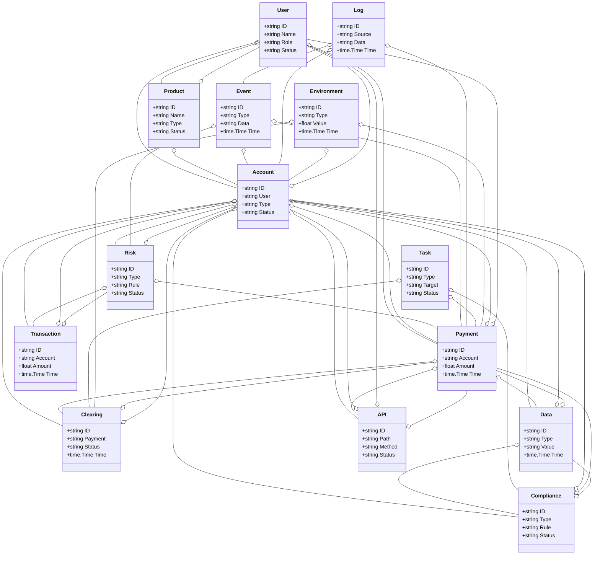
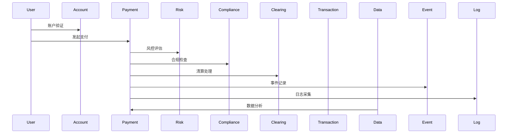
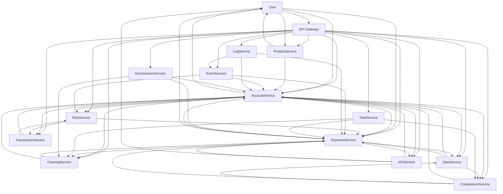

# 金融科技/智慧金融架构（Golang国际主流实践）

## 1. 目录

- [金融科技/智慧金融架构（Golang国际主流实践）](#金融科技智慧金融架构golang国际主流实践)
  - [1. 目录](#1-目录)
  - [2. 金融科技/智慧金融架构概述](#2-金融科技智慧金融架构概述)
    - [2.1 国际标准定义](#21-国际标准定义)
    - [2.2 发展历程与核心思想](#22-发展历程与核心思想)
    - [2.3 典型应用场景](#23-典型应用场景)
    - [2.4 与传统金融IT对比](#24-与传统金融it对比)
  - [3. 信息概念架构](#3-信息概念架构)
    - [3.1 领域建模方法](#31-领域建模方法)
    - [3.2 核心实体与关系](#32-核心实体与关系)
      - [3.2.1 UML 类图（Mermaid）](#321-uml-类图mermaid)
    - [3.3 典型数据流](#33-典型数据流)
      - [3.3.1 数据流时序图（Mermaid）](#331-数据流时序图mermaid)
    - [3.4 Golang 领域模型代码示例](#34-golang-领域模型代码示例)
  - [4. 分布式系统挑战](#4-分布式系统挑战)
    - [4.1 弹性与实时性](#41-弹性与实时性)
    - [4.2 数据安全与互操作性](#42-数据安全与互操作性)
    - [4.3 可观测性与智能优化](#43-可观测性与智能优化)
  - [5. 架构设计解决方案](#5-架构设计解决方案)
    - [5.1 服务解耦与标准接口](#51-服务解耦与标准接口)
    - [5.2 智能风控与弹性协同](#52-智能风控与弹性协同)
    - [5.3 数据安全与互操作设计](#53-数据安全与互操作设计)
    - [5.4 架构图（Mermaid）](#54-架构图mermaid)
    - [5.5 Golang代码示例](#55-golang代码示例)
  - [6. Golang实现范例](#6-golang实现范例)
    - [6.1 工程结构示例](#61-工程结构示例)
    - [6.2 关键代码片段](#62-关键代码片段)
    - [6.3 CI/CD 配置（GitHub Actions 示例）](#63-cicd-配置github-actions-示例)
  - [7. 形式化建模与证明](#7-形式化建模与证明)
    - [7.1 账户-支付-风控建模](#71-账户-支付-风控建模)
      - [7.1.1 性质1：智能风控性](#711-性质1智能风控性)
      - [7.1.2 性质2：合规性](#712-性质2合规性)
    - [7.2 符号说明](#72-符号说明)
  - [8. 参考与外部链接](#8-参考与外部链接)

---

## 2. 金融科技/智慧金融架构概述

### 2.1 国际标准定义

金融科技/智慧金融架构是指以合规安全、弹性扩展、智能风控、实时交易、开放互联为核心，支持账户、支付、清算、风控、合规、数据分析、API等场景的分布式系统架构。

- **国际主流参考**：ISO 20022、SWIFT、PCI DSS、PSD2、Open Banking、FIDO2、OAuth2、OpenID、ISO/IEC 27001、NIST Cybersecurity Framework、Basel III、FATF、GDPR、OpenAPI、FIX Protocol、ISO 8583、ISO 22301、SOC 2、OpenTelemetry、Prometheus。

### 2.2 发展历程与核心思想

- 2000s：网银、核心银行系统、支付网关、风控系统。
- 2010s：移动支付、区块链、API银行、云金融、智能投顾、合规自动化。
- 2020s：开放银行、实时支付、AI风控、全球协同、数字货币、数据主权。
- 核心思想：合规安全、弹性扩展、智能风控、实时交易、开放互联、标准合规。

### 2.3 典型应用场景

- 数字银行、移动支付、智能投顾、区块链金融、开放银行、实时清算、合规风控、金融大数据、API金融等。

### 2.4 与传统金融IT对比

| 维度         | 传统金融IT         | 智慧金融架构           |
|--------------|-------------------|----------------------|
| 交易模式     | 批量、人工         | 实时、自动化、智能     |
| 风控         | 静态、规则         | AI驱动、动态、弹性     |
| 合规         | 手工、被动         | 自动、标准、持续       |
| 扩展性       | 垂直扩展           | 水平弹性扩展          |
| 互操作性     | 封闭、专有         | 开放API、标准协议      |
| 适用场景     | 单一银行           | 多机构、全球协同      |

---

## 3. 信息概念架构

### 3.1 领域建模方法

- 采用分层建模（账户层、支付层、清算层、风控层、合规层、数据层、API层）、UML、ER图。
- 核心实体：账户、用户、支付、清算、风控、合规、交易、产品、数据、API、事件、日志、任务、环境。

### 3.2 核心实体与关系

| 实体    | 属性                        | 关系           |
|---------|-----------------------------|----------------|
| 账户    | ID, User, Type, Status      | 关联用户/支付/清算 |
| 用户    | ID, Name, Role, Status      | 关联账户/支付   |
| 支付    | ID, Account, Amount, Time   | 关联账户/用户/清算 |
| 清算    | ID, Payment, Status, Time   | 关联支付/账户   |
| 风控    | ID, Type, Rule, Status      | 关联账户/支付/交易 |
| 合规    | ID, Type, Rule, Status      | 关联账户/支付/数据 |
| 交易    | ID, Account, Amount, Time   | 关联账户/风控   |
| 产品    | ID, Name, Type, Status      | 关联账户/用户   |
| 数据    | ID, Type, Value, Time       | 关联账户/支付/合规 |
| API     | ID, Path, Method, Status    | 关联账户/用户/支付 |
| 事件    | ID, Type, Data, Time        | 关联账户/支付/风控 |
| 日志    | ID, Source, Data, Time      | 关联账户/支付/事件 |
| 任务    | ID, Type, Target, Status    | 关联支付/清算/合规 |
| 环境    | ID, Type, Value, Time       | 关联账户/支付/清算 |

#### 3.2.1 UML 类图（Mermaid）



### 3.3 典型数据流

1. 用户发起支付→账户验证→风控评估→合规检查→支付执行→清算处理→事件记录→日志采集→数据分析→智能优化。

#### 3.3.1 数据流时序图（Mermaid）



### 3.4 Golang 领域模型代码示例

```go
// 用户实体
type User struct {
    ID     string
    Name   string
    Role   string
    Status string
}
// 账户实体
type Account struct {
    ID     string
    User   string
    Type   string
    Status string
}
// 支付实体
type Payment struct {
    ID      string
    Account string
    Amount  float64
    Time    time.Time
}
// 清算实体
type Clearing struct {
    ID      string
    Payment string
    Status  string
    Time    time.Time
}
// 风控实体
type Risk struct {
    ID     string
    Type   string
    Rule   string
    Status string
}
// 合规实体
type Compliance struct {
    ID     string
    Type   string
    Rule   string
    Status string
}
// 交易实体
type Transaction struct {
    ID      string
    Account string
    Amount  float64
    Time    time.Time
}
// 产品实体
type Product struct {
    ID     string
    Name   string
    Type   string
    Status string
}
// 数据实体
type Data struct {
    ID    string
    Type  string
    Value string
    Time  time.Time
}
// API实体
type API struct {
    ID     string
    Path   string
    Method string
    Status string
}
// 事件实体
type Event struct {
    ID   string
    Type string
    Data string
    Time time.Time
}
// 日志实体
type Log struct {
    ID     string
    Source string
    Data   string
    Time   time.Time
}
// 任务实体
type Task struct {
    ID     string
    Type   string
    Target string
    Status string
}
// 环境实体
type Environment struct {
    ID    string
    Type  string
    Value float64
    Time  time.Time
}
```

---

## 4. 分布式系统挑战

### 4.1 弹性与实时性

- 自动扩缩容、毫秒级响应、负载均衡、容灾备份、实时清算。
- 国际主流：Kubernetes、Prometheus、云服务、CDN、Kafka、Flink、OpenAPI。

### 4.2 数据安全与互操作性

- 数据加密、标准协议、互操作、访问控制、合规治理。
- 国际主流：OAuth2、OpenID、TLS、ISO/IEC 27001、PCI DSS、Open Banking、FIDO2。

### 4.3 可观测性与智能优化

- 全链路追踪、指标采集、AI优化、异常检测、风控分析。
- 国际主流：OpenTelemetry、Prometheus、AI分析。

---

## 5. 架构设计解决方案

### 5.1 服务解耦与标准接口

- 账户、用户、支付、清算、风控、合规、交易、产品、数据、API、事件、日志、任务等服务解耦，API网关统一入口。
- 采用REST、gRPC、消息队列等协议，支持异步事件驱动。

### 5.2 智能风控与弹性协同

- AI驱动风控、弹性协同、自动扩缩容、智能优化。
- AI推理、Kubernetes、Prometheus、Flink、Kafka。

### 5.3 数据安全与互操作设计

- TLS、OAuth2、数据加密、标准协议、访问审计、合规治理。

### 5.4 架构图（Mermaid）



### 5.5 Golang代码示例

```go
// 支付交易Prometheus监控
var paymentCount = prometheus.NewGauge(prometheus.GaugeOpts{Name: "payment_total"})
paymentCount.Set(1000000)
```

---

## 6. Golang实现范例

### 6.1 工程结构示例

```text
fintech-demo/
├── cmd/
├── internal/
│   ├── account/
│   ├── user/
│   ├── payment/
│   ├── clearing/
│   ├── risk/
│   ├── compliance/
│   ├── transaction/
│   ├── product/
│   ├── data/
│   ├── api/
│   ├── event/
│   ├── log/
│   ├── task/
│   ├── environment/
├── api/
├── pkg/
├── configs/
├── scripts/
├── build/
└── README.md
```

### 6.2 关键代码片段

// 见4.5

### 6.3 CI/CD 配置（GitHub Actions 示例）

```yaml
name: Go CI
on:
  push:
    branches: [ main ]
jobs:
  build:
    runs-on: ubuntu-latest
    steps:
      - uses: actions/checkout@v3
      - name: Set up Go
        uses: actions/setup-go@v4
        with:
          go-version: '1.21'
      - name: Build
        run: go build ./...
      - name: Test
        run: go test ./...
```

---

## 7. 形式化建模与证明

### 7.1 账户-支付-风控建模

- 账户集合 $A = \{a_1, ..., a_n\}$，支付集合 $P = \{p_1, ..., p_k\}$，风控集合 $R = \{r_1, ..., r_l\}$。
- 支付函数 $f: (a, p) \rightarrow r$，合规函数 $g: (a, p) \rightarrow c$。

#### 7.1.1 性质1：智能风控性

- 所有账户 $a$ 与支付 $p$，其风控 $r$ 能智能评估。

#### 7.1.2 性质2：合规性

- 所有合规 $c$ 满足合规策略 $q$，即 $\forall c, \exists q, q(c) = true$。

### 7.2 符号说明

- $A$：账户集合
- $P$：支付集合
- $R$：风控集合
- $C$：合规集合
- $Q$：合规策略集合
- $f$：支付函数
- $g$：合规函数

---

## 8. 参考与外部链接

- [ISO 20022](https://www.iso20022.org/)
- [SWIFT](https://www.swift.com/)
- [PCI DSS](https://www.pcisecuritystandards.org/)
- [PSD2](https://www.ecb.europa.eu/paym/intro/mip-online/2018/html/1803_psd2.en.html)
- [Open Banking](https://www.openbanking.org.uk/)
- [FIDO2](https://fidoalliance.org/fido2/)
- [OAuth2](https://oauth.net/2/)
- [OpenID](https://openid.net/)
- [ISO/IEC 27001](https://www.iso.org/isoiec-27001-information-security.html)
- [NIST Cybersecurity Framework](https://www.nist.gov/cyberframework)
- [Basel III](https://www.bis.org/basel_framework/)
- [FATF](https://www.fatf-gafi.org/)
- [GDPR](https://gdpr.eu/)
- [OpenAPI](https://www.openapis.org/)
- [FIX Protocol](https://www.fixtrading.org/)
- [ISO 8583](https://www.iso.org/standard/31628.html)
- [ISO 22301](https://www.iso.org/standard/75106.html)
- [SOC 2](https://www.aicpa.org/resources/article/soc-2-report)
- [OpenTelemetry](https://opentelemetry.io/)
- [Prometheus](https://prometheus.io/)
