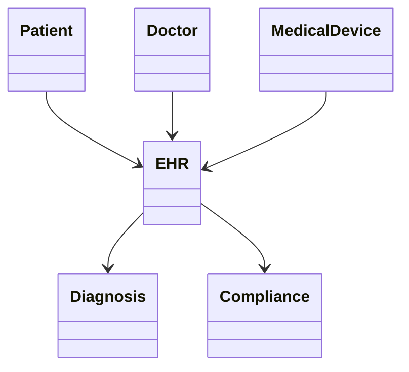
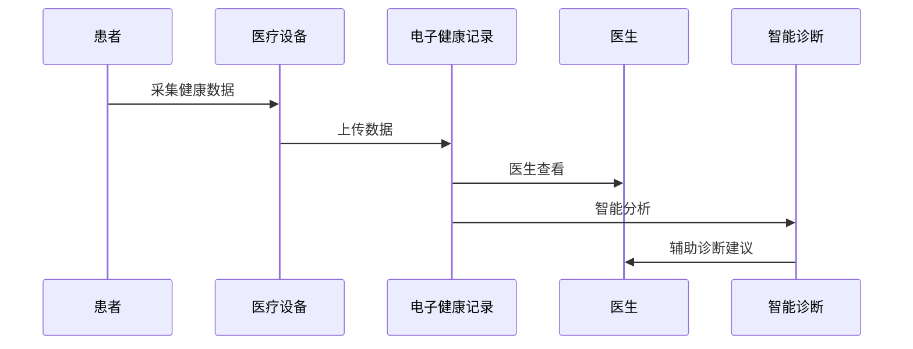
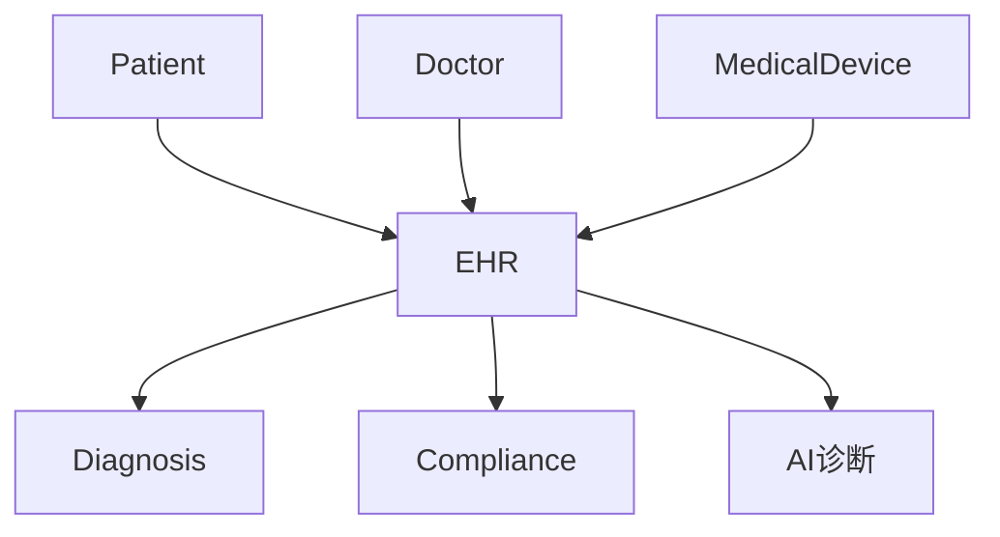

# 医疗健康架构（Healthcare Architecture）

## 1. 目录

- [医疗健康架构（Healthcare Architecture）](#医疗健康架构healthcare-architecture)
  - [1. 目录](#1-目录)
  - [2. 国际标准定义与发展历程](#2-国际标准定义与发展历程)
  - [3. 核心思想与典型应用场景](#3-核心思想与典型应用场景)
  - [4. 与传统方案对比](#4-与传统方案对比)
  - [5. 领域建模（核心实体、关系、UML类图）](#5-领域建模核心实体关系uml类图)
  - [6. 典型数据流与时序图](#6-典型数据流与时序图)
  - [7. Golang领域模型代码示例](#7-golang领域模型代码示例)
  - [8. 分布式系统挑战](#8-分布式系统挑战)
  - [9. 主流解决方案](#9-主流解决方案)
  - [10. 形式化建模与证明](#10-形式化建模与证明)
  - [11. 国际权威参考链接](#11-国际权威参考链接)

---

## 2. 国际标准定义与发展历程

- 定义：医疗健康架构指支持医疗信息化、电子健康记录（EHR）、互操作、数据安全与合规的系统架构，遵循HL7、FHIR、DICOM、HIPAA等国际标准。
- 发展历程：从本地HIS到云端EHR、移动医疗、AI辅助诊断，FHIR推动全球医疗数据互操作。

## 3. 核心思想与典型应用场景

- 核心思想：互操作性、安全合规、数据共享、智能辅助。
- 应用场景：医院信息系统、远程医疗、健康管理、AI诊断、医疗物联网。

## 4. 与传统方案对比

| 维度         | 传统医疗IT     | 现代医疗健康架构     |
|--------------|--------------|---------------------|
| 数据存储     | 本地/分散     | 云端/集中/分布式    |
| 互操作性     | 弱            | 强（HL7/FHIR）      |
| 安全合规     | 基本          | 严格（HIPAA/GDPR）  |
| 智能化       | 低            | 高（AI/大数据）     |

## 5. 领域建模（核心实体、关系、UML类图）

- 核心实体：患者（Patient）、医生（Doctor）、电子健康记录（EHR）、医疗设备、诊断模块、合规模块。
- UML类图：



## 6. 典型数据流与时序图

- 远程医疗数据流时序：



## 7. Golang领域模型代码示例

```go
// 患者、医生、EHR等核心结构体
 type Patient struct {
   ID   string
   Name string
 }
 type Doctor struct {
   ID   string
   Name string
 }
 type EHR struct {
   PatientID string
   Records   []string
 }

```

## 8. 分布式系统挑战

- 数据互操作、隐私保护、合规性、系统高可用、设备接入、AI集成。

## 9. 主流解决方案

- 架构图（EHR为核心，集成设备、AI、合规模块）：



- 关键代码：Golang实现FHIR接口、数据加密、设备数据采集。
- CI/CD：自动化测试、合规校验。
- 监控：数据访问审计、异常检测。

## 10. 形式化建模与证明

- 数学建模：
  - EHR = {r1, r2, ..., rn}，每条记录ri关联患者、医生、设备
  - 互操作性映射：f: EHR → FHIR
- 性质：数据一致性、隐私保护、合规性
- 符号说明：EHR-电子健康记录，f-互操作映射

## 11. 国际权威参考链接

- [HL7 FHIR](https://www.hl7.org/fhir/)
- [DICOM](https://www.dicomstandard.org/)
- [HIPAA](https://www.hhs.gov/hipaa/index.html)
- [OpenEHR](https://www.openehr.org/)
