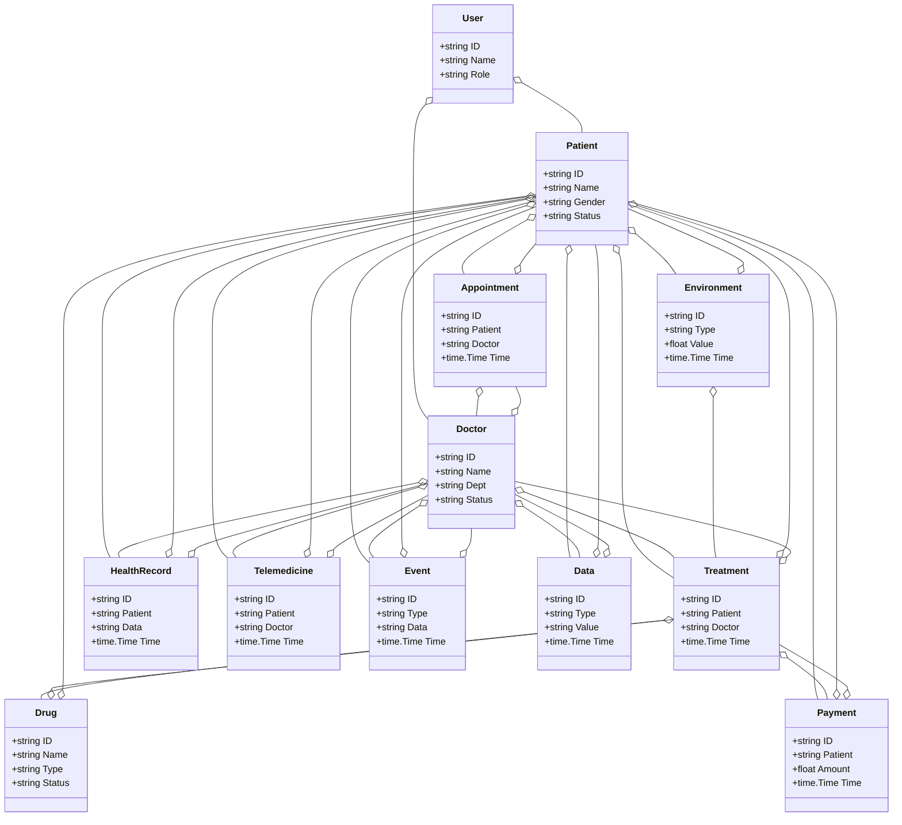
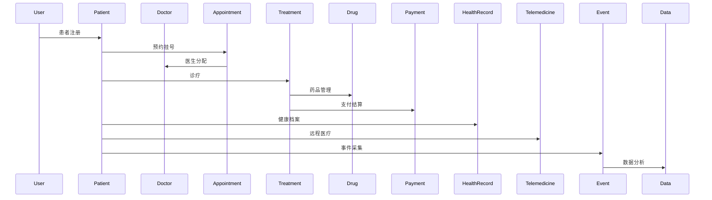
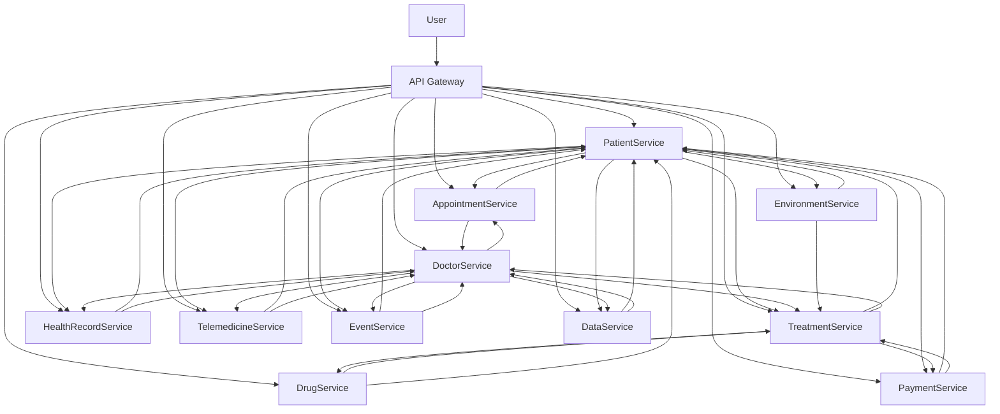

# 医疗健康/智慧医疗架构（Golang国际主流实践）

## 目录

1. 医疗健康/智慧医疗架构概述
    1.1 国际标准定义
    1.2 发展历程与核心思想
    1.3 典型应用场景
    1.4 与传统医疗IT对比
2. 信息概念架构
3. 分布式系统挑战
4. 架构设计解决方案
5. Golang实现范例
6. 形式化建模与证明
7. 参考与外部链接

---

## 1. 医疗健康/智慧医疗架构概述

### 1.1 国际标准定义

医疗健康/智慧医疗架构是指以患者为中心、智能诊疗、弹性协同、数据驱动为核心，支持患者、医生、预约、诊疗、药品、支付、健康档案、远程医疗等场景的分布式系统架构。

- **国际主流参考**：HL7 FHIR、DICOM、ICD-10、LOINC、SNOMED CT、ISO 13606、ISO 27799、IHE、HIPAA、ISO/TS 22220、OpenEHR。

### 1.2 发展历程与核心思想

- 2000s：HIS、PACS、LIS、电子病历、信息化管理。
- 2010s：移动医疗、远程医疗、健康档案、数据集成。
- 2020s：AI诊疗、智慧医院、全球协同、医疗大数据、无接触服务。
- 核心思想：患者为中心、智能驱动、弹性协同、开放标准、数据赋能。

### 1.3 典型应用场景

- 智慧医院、远程医疗、电子健康档案、智能诊疗、药品管理、健康大数据、个性化医疗等。

### 1.4 与传统医疗IT对比

| 维度         | 传统医疗IT         | 智慧医疗架构           |
|--------------|-------------------|----------------------|
| 服务模式     | 人工、线下         | 智能、自动化、远程     |
| 数据采集     | 手工、离线         | 实时、自动化          |
| 协同         | 单点、割裂         | 多方、弹性、协同      |
| 智能化       | 规则、人工         | AI驱动、智能分析      |
| 适用场景     | 医院、单一环节     | 全域、全球协同        |

---

## 2. 信息概念架构

### 2.1 领域建模方法

- 采用分层建模（感知层、服务层、平台层、应用层）、UML、ER图。
- 核心实体：患者、医生、预约、诊疗、药品、支付、健康档案、远程医疗、事件、用户、数据、环境。

### 2.2 核心实体与关系

| 实体    | 属性                        | 关系           |
|---------|-----------------------------|----------------|
| 患者    | ID, Name, Gender, Status    | 关联预约/诊疗   |
| 医生    | ID, Name, Dept, Status      | 关联预约/诊疗   |
| 预约    | ID, Patient, Doctor, Time   | 关联患者/医生   |
| 诊疗    | ID, Patient, Doctor, Time   | 关联患者/医生   |
| 药品    | ID, Name, Type, Status      | 关联诊疗/患者   |
| 支付    | ID, Patient, Amount, Time   | 关联患者/诊疗   |
| 健康档案| ID, Patient, Data, Time     | 关联患者/医生   |
| 远程医疗| ID, Patient, Doctor, Time   | 关联患者/医生   |
| 事件    | ID, Type, Data, Time        | 关联患者/医生   |
| 用户    | ID, Name, Role              | 管理患者/医生   |
| 数据    | ID, Type, Value, Time       | 关联患者/医生   |
| 环境    | ID, Type, Value, Time       | 关联患者/诊疗   |

#### UML 类图（Mermaid）



### 2.3 典型数据流

1. 患者注册→预约挂号→医生诊疗→药品管理→支付结算→健康档案→远程医疗→事件采集→数据分析→智能优化。

#### 数据流时序图（Mermaid）



### 2.4 Golang 领域模型代码示例

```go
// 患者实体
type Patient struct {
    ID     string
    Name   string
    Gender string
    Status string
}
// 医生实体
type Doctor struct {
    ID     string
    Name   string
    Dept   string
    Status string
}
// 预约实体
type Appointment struct {
    ID      string
    Patient string
    Doctor  string
    Time    time.Time
}
// 诊疗实体
type Treatment struct {
    ID      string
    Patient string
    Doctor  string
    Time    time.Time
}
// 药品实体
type Drug struct {
    ID     string
    Name   string
    Type   string
    Status string
}
// 支付实体
type Payment struct {
    ID      string
    Patient string
    Amount  float64
    Time    time.Time
}
// 健康档案实体
type HealthRecord struct {
    ID      string
    Patient string
    Data    string
    Time    time.Time
}
// 远程医疗实体
type Telemedicine struct {
    ID      string
    Patient string
    Doctor  string
    Time    time.Time
}
// 用户实体
type User struct {
    ID   string
    Name string
    Role string
}
// 事件实体
type Event struct {
    ID   string
    Type string
    Data string
    Time time.Time
}
// 数据实体
type Data struct {
    ID    string
    Type  string
    Value string
    Time  time.Time
}
// 环境实体
type Environment struct {
    ID    string
    Type  string
    Value float64
    Time  time.Time
}
```

---

## 3. 分布式系统挑战

### 3.1 弹性与实时性

- 自动扩缩容、毫秒级响应、负载均衡、容灾备份。
- 国际主流：Kubernetes、Prometheus、云服务、CDN。

### 3.2 数据安全与互操作性

- 数据加密、标准协议、互操作、访问控制。
- 国际主流：HL7 FHIR、OAuth2、OpenID、TLS、HIPAA。

### 3.3 可观测性与智能优化

- 全链路追踪、指标采集、AI优化、异常检测。
- 国际主流：OpenTelemetry、Prometheus、AI分析。

---

## 4. 架构设计解决方案

### 4.1 服务解耦与标准接口

- 患者、医生、预约、诊疗、药品、支付、健康档案、远程医疗、数据等服务解耦，API网关统一入口。
- 采用REST、gRPC、消息队列等协议，支持异步事件驱动。

### 4.2 智能诊疗与弹性协同

- AI诊疗、弹性协同、自动扩缩容、智能分析。
- AI推理、Kubernetes、Prometheus。

### 4.3 数据安全与互操作设计

- TLS、OAuth2、数据加密、标准协议、访问审计。

### 4.4 架构图（Mermaid）



### 4.5 Golang代码示例

```go
// 患者数量Prometheus监控
var patientCount = prometheus.NewGauge(prometheus.GaugeOpts{Name: "patient_total"})
patientCount.Set(1000000)
```

---

## 5. Golang实现范例

### 5.1 工程结构示例

```text
healthcare-demo/
├── cmd/
├── internal/
│   ├── patient/
│   ├── doctor/
│   ├── appointment/
│   ├── treatment/
│   ├── drug/
│   ├── payment/
│   ├── healthrecord/
│   ├── telemedicine/
│   ├── event/
│   ├── data/
│   ├── environment/
│   ├── user/
├── api/
├── pkg/
├── configs/
├── scripts/
├── build/
└── README.md
```

### 5.2 关键代码片段

// 见4.5

### 5.3 CI/CD 配置（GitHub Actions 示例）

```yaml
name: Go CI
on:
  push:
    branches: [ main ]
jobs:
  build:
    runs-on: ubuntu-latest
    steps:
      - uses: actions/checkout@v3
      - name: Set up Go
        uses: actions/setup-go@v4
        with:
          go-version: '1.21'
      - name: Build
        run: go build ./...
      - name: Test
        run: go test ./...
```

---

## 6. 形式化建模与证明

### 6.1 患者-医生-诊疗建模

- 患者集合 $P = \{p_1, ..., p_n\}$，医生集合 $D = \{d_1, ..., d_k\}$，诊疗集合 $T = \{t_1, ..., t_l\}$。
- 诊疗函数 $f: (p, d, t) \rightarrow r$，数据采集函数 $g: (p, t) \rightarrow a$。

#### 性质1：智能诊疗性

- 所有患者 $p$ 与医生 $d$，其诊疗 $t$ 能智能诊疗。

#### 性质2：数据安全性

- 所有数据 $a$ 满足安全策略 $q$，即 $\forall a, \exists q, q(a) = true$。

### 6.2 符号说明

- $P$：患者集合
- $D$：医生集合
- $T$：诊疗集合
- $A$：数据集合
- $Q$：安全策略集合
- $f$：诊疗函数
- $g$：数据采集函数

---

## 7. 参考与外部链接

- [HL7 FHIR](https://www.hl7.org/fhir/)
- [DICOM](https://www.dicomstandard.org/)
- [ICD-10](https://www.who.int/classifications/icd/en/)
- [LOINC](https://loinc.org/)
- [SNOMED CT](https://www.snomed.org/)
- [ISO 13606](https://www.iso.org/standard/37622.html)
- [ISO 27799](https://www.iso.org/standard/41238.html)
- [IHE](https://www.ihe.net/)
- [HIPAA](https://www.hhs.gov/hipaa/index.html)
- [ISO/TS 22220](https://www.iso.org/standard/40832.html)
- [OpenEHR](https://www.openehr.org/)
- [Prometheus](https://prometheus.io/)
- [OpenTelemetry](https://opentelemetry.io/)
