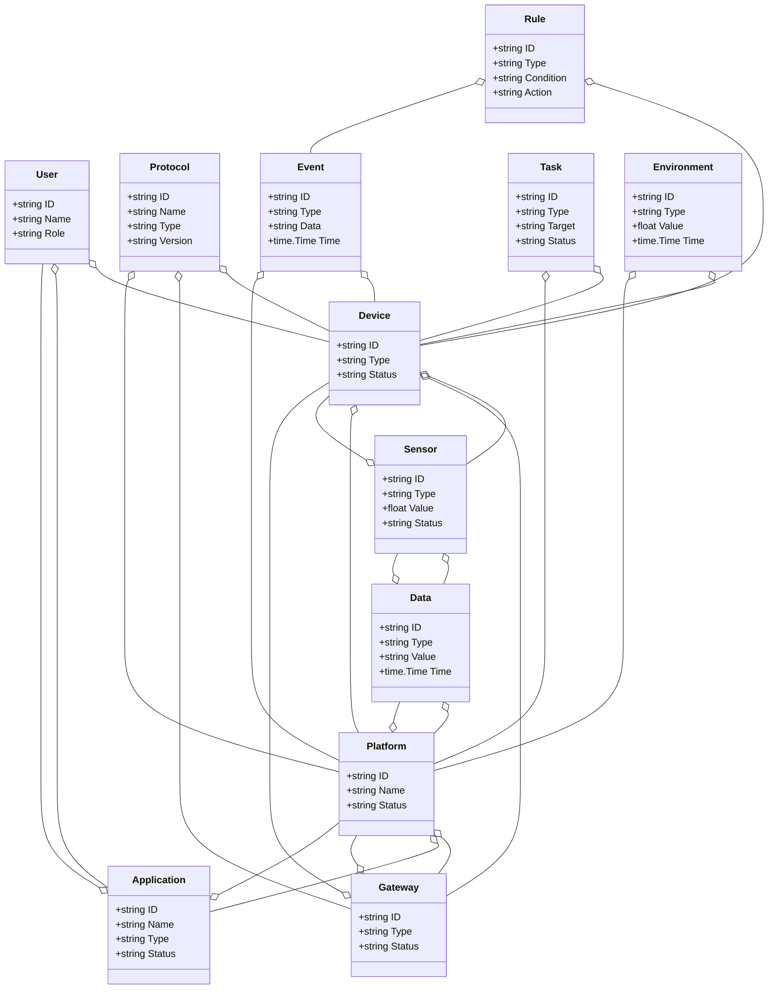
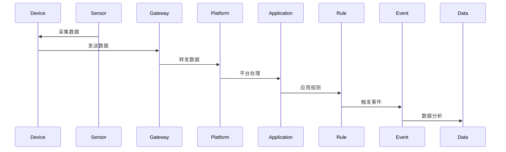
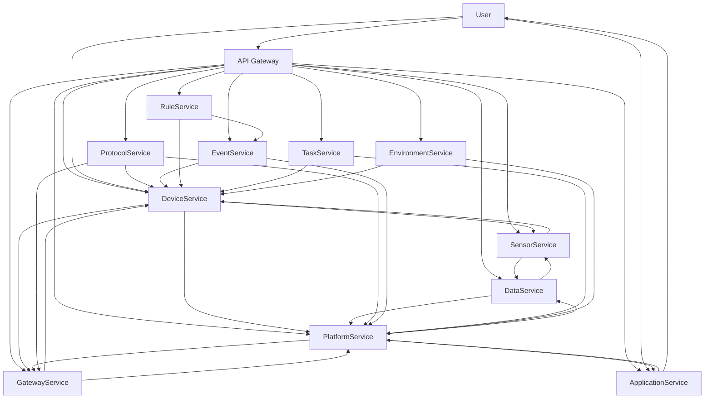

# 物联网/智慧物联架构（Golang国际主流实践）

## 目录

1. 物联网/智慧物联架构概述
    1.1 国际标准定义
    1.2 发展历程与核心思想
    1.3 典型应用场景
    1.4 与传统IT对比
2. 信息概念架构
3. 分布式系统挑战
4. 架构设计解决方案
5. Golang实现范例
6. 形式化建模与证明
7. 参考与外部链接

---

## 1. 物联网/智慧物联架构概述

### 1.1 国际标准定义

物联网/智慧物联架构是指以设备互联、数据驱动、智能感知、弹性协同、安全可信为核心，支持设备、网关、平台、应用、数据、协议、管理、分析等场景的分布式系统架构。

- **国际主流参考**：ISO/IEC 30141、oneM2M、IETF CoAP/MQTT、OASIS MQTT、LwM2M、IEEE P2413、OGC SensorThings、W3C WoT、Open Connectivity Foundation、GSMA IoT、ISO/IEC 20924、ISO/IEC 21823、ISO/IEC 30161、ISO/IEC 27001、NIST IoT。

### 1.2 发展历程与核心思想

- 2000s：M2M、传感器网络、嵌入式系统、早期物联网平台。
- 2010s：云平台、边缘计算、协议标准化、设备管理、数据分析。
- 2020s：AIoT、数字孪生、全球协同、智能边缘、无接触服务、数据主权。
- 核心思想：设备互联、数据驱动、智能感知、弹性协同、安全可信、标准互操作。

### 1.3 典型应用场景

- 智慧城市、智能制造、智能家居、车联网、智慧农业、智慧医疗、能源管理、环境监测等。

### 1.4 与传统IT对比

| 维度         | 传统IT系统         | 智慧物联架构           |
|--------------|-------------------|----------------------|
| 连接对象     | 人、服务器         | 设备、传感器、边缘、云 |
| 协议         | TCP/IP、HTTP      | MQTT、CoAP、LwM2M等   |
| 数据采集     | 手工、离线         | 实时、自动化          |
| 协同         | 单点、割裂         | 多方、弹性、协同      |
| 智能化       | 规则、人工         | AI驱动、智能分析      |
| 适用场景     | 企业、数据中心     | 全域、全球、物理世界  |

---

## 2. 信息概念架构

### 2.1 领域建模方法

- 采用分层建模（感知层、网络层、平台层、应用层）、UML、ER图。
- 核心实体：设备、传感器、网关、平台、应用、数据、协议、用户、事件、规则、任务、环境。

### 2.2 核心实体与关系

| 实体    | 属性                        | 关系           |
|---------|-----------------------------|----------------|
| 设备    | ID, Type, Status            | 关联传感器/网关/平台 |
| 传感器  | ID, Type, Value, Status     | 关联设备/数据   |
| 网关    | ID, Type, Status            | 关联设备/平台   |
| 平台    | ID, Name, Status            | 关联网关/应用   |
| 应用    | ID, Name, Type, Status      | 关联平台/用户   |
| 数据    | ID, Type, Value, Time       | 关联传感器/平台 |
| 协议    | ID, Name, Type, Version     | 关联设备/网关/平台 |
| 用户    | ID, Name, Role              | 管理设备/应用   |
| 事件    | ID, Type, Data, Time        | 关联设备/平台   |
| 规则    | ID, Type, Condition, Action | 关联设备/事件   |
| 任务    | ID, Type, Target, Status    | 关联设备/平台   |
| 环境    | ID, Type, Value, Time       | 关联设备/平台   |

#### UML 类图（Mermaid）



### 2.3 典型数据流

1. 设备数据采集→网关转发→平台处理→应用消费→规则触发→事件记录→数据分析→智能优化。

#### 数据流时序图（Mermaid）



### 2.4 Golang 领域模型代码示例

```go
// 设备实体
type Device struct {
    ID     string
    Type   string
    Status string
}
// 传感器实体
type Sensor struct {
    ID     string
    Type   string
    Value  float64
    Status string
}
// 网关实体
type Gateway struct {
    ID     string
    Type   string
    Status string
}
// 平台实体
type Platform struct {
    ID     string
    Name   string
    Status string
}
// 应用实体
type Application struct {
    ID     string
    Name   string
    Type   string
    Status string
}
// 数据实体
type Data struct {
    ID    string
    Type  string
    Value string
    Time  time.Time
}
// 协议实体
type Protocol struct {
    ID      string
    Name    string
    Type    string
    Version string
}
// 用户实体
type User struct {
    ID   string
    Name string
    Role string
}
// 事件实体
type Event struct {
    ID   string
    Type string
    Data string
    Time time.Time
}
// 规则实体
type Rule struct {
    ID        string
    Type      string
    Condition string
    Action    string
}
// 任务实体
type Task struct {
    ID     string
    Type   string
    Target string
    Status string
}
// 环境实体
type Environment struct {
    ID    string
    Type  string
    Value float64
    Time  time.Time
}
```

---

## 3. 分布式系统挑战

### 3.1 弹性与实时性

- 自动扩缩容、毫秒级响应、负载均衡、容灾备份、边缘协同。
- 国际主流：Kubernetes、Prometheus、云服务、CDN、边缘计算、MQTT、CoAP。

### 3.2 数据安全与互操作性

- 数据加密、标准协议、互操作、访问控制、设备认证。
- 国际主流：OAuth2、OpenID、TLS、ISO/IEC 27001、oneM2M、LwM2M、W3C WoT。

### 3.3 可观测性与智能优化

- 全链路追踪、指标采集、AI优化、异常检测。
- 国际主流：OpenTelemetry、Prometheus、AI分析。

---

## 4. 架构设计解决方案

### 4.1 服务解耦与标准接口

- 设备、传感器、网关、平台、应用、数据、协议、规则、任务等服务解耦，API网关统一入口。
- 采用REST、MQTT、CoAP、gRPC、消息队列等协议，支持异步事件驱动。

### 4.2 智能感知与弹性协同

- AI驱动感知、弹性协同、自动扩缩容、智能优化。
- AI推理、Kubernetes、Prometheus、边缘计算。

### 4.3 数据安全与互操作设计

- TLS、OAuth2、数据加密、标准协议、访问审计、设备认证。

### 4.4 架构图（Mermaid）



### 4.5 Golang代码示例

```go
// 设备数量Prometheus监控
var deviceCount = prometheus.NewGauge(prometheus.GaugeOpts{Name: "device_total"})
deviceCount.Set(1000000)
```

---

## 5. Golang实现范例

### 5.1 工程结构示例

```text
iot-demo/
├── cmd/
├── internal/
│   ├── device/
│   ├── sensor/
│   ├── gateway/
│   ├── platform/
│   ├── application/
│   ├── data/
│   ├── protocol/
│   ├── rule/
│   ├── task/
│   ├── event/
│   ├── environment/
│   ├── user/
├── api/
├── pkg/
├── configs/
├── scripts/
├── build/
└── README.md
```

### 5.2 关键代码片段

// 见4.5

### 5.3 CI/CD 配置（GitHub Actions 示例）

```yaml
name: Go CI
on:
  push:
    branches: [ main ]
jobs:
  build:
    runs-on: ubuntu-latest
    steps:
      - uses: actions/checkout@v3
      - name: Set up Go
        uses: actions/setup-go@v4
        with:
          go-version: '1.21'
      - name: Build
        run: go build ./...
      - name: Test
        run: go test ./...
```

---

## 6. 形式化建模与证明

### 6.1 设备-数据-规则建模

- 设备集合 $D = \{d_1, ..., d_n\}$，数据集合 $A = \{a_1, ..., a_k\}$，规则集合 $R = \{r_1, ..., r_l\}$。
- 感知函数 $f: (d, t) \rightarrow a$，规则触发函数 $g: (a, r) \rightarrow e$。

#### 性质1：智能感知性

- 所有设备 $d$ 与时间 $t$，其数据 $a$ 能智能感知。

#### 性质2：安全可信性

- 所有事件 $e$ 满足安全策略 $q$，即 $\forall e, \exists q, q(e) = true$。

### 6.2 符号说明

- $D$：设备集合
- $A$：数据集合
- $R$：规则集合
- $E$：事件集合
- $Q$：安全策略集合
- $f$：感知函数
- $g$：规则触发函数

---

## 7. 参考与外部链接

- [ISO/IEC 30141](https://www.iso.org/standard/65694.html)
- [oneM2M](https://www.onem2m.org/)
- [IETF CoAP](https://datatracker.ietf.org/wg/core/documents/)
- [OASIS MQTT](https://mqtt.org/)
- [LwM2M](https://www.openmobilealliance.org/release/LWM2M/)
- [IEEE P2413](https://standards.ieee.org/ieee/2413/6210/)
- [OGC SensorThings](https://www.ogc.org/standards/sensorthings/)
- [W3C WoT](https://www.w3.org/WoT/)
- [Open Connectivity Foundation](https://openconnectivity.org/)
- [GSMA IoT](https://www.gsma.com/iot/)
- [ISO/IEC 20924](https://www.iso.org/standard/69470.html)
- [ISO/IEC 21823](https://www.iso.org/standard/74773.html)
- [ISO/IEC 30161](https://www.iso.org/standard/77532.html)
- [ISO/IEC 27001](https://www.iso.org/isoiec-27001-information-security.html)
- [NIST IoT](https://csrc.nist.gov/publications/detail/sp/800-183/final)
- [Prometheus](https://prometheus.io/)
- [OpenTelemetry](https://opentelemetry.io/)
