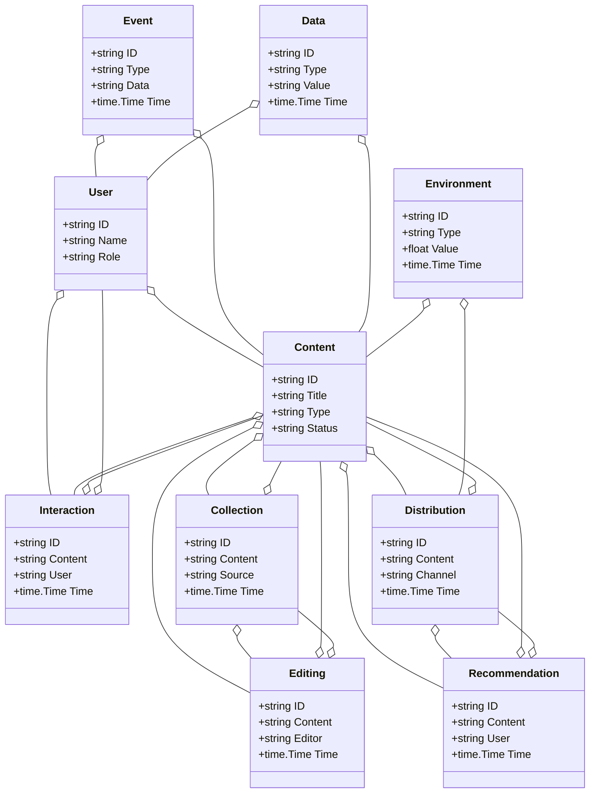
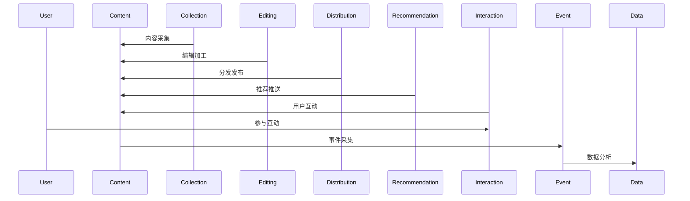
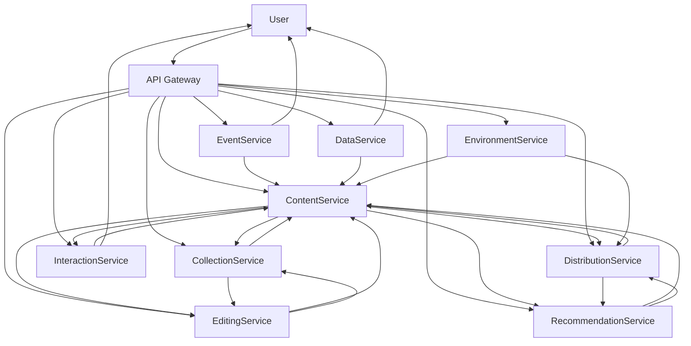

# 媒体/智慧媒体架构（Golang国际主流实践）

<!-- TOC START -->
- [媒体/智慧媒体架构（Golang国际主流实践）](#媒体智慧媒体架构golang国际主流实践)
  - [1.1 目录](#11-目录)
  - [1.2 1. 媒体/智慧媒体架构概述](#12-1-媒体智慧媒体架构概述)
    - [1.2.1 国际标准定义](#121-国际标准定义)
    - [1.2.2 发展历程与核心思想](#122-发展历程与核心思想)
    - [1.2.3 典型应用场景](#123-典型应用场景)
    - [1.2.4 与传统媒体IT对比](#124-与传统媒体it对比)
  - [1.3 2. 信息概念架构](#13-2-信息概念架构)
    - [1.3.1 领域建模方法](#131-领域建模方法)
    - [1.3.2 核心实体与关系](#132-核心实体与关系)
      - [1.3.2.1 UML 类图（Mermaid）](#1321-uml-类图mermaid)
    - [1.3.3 典型数据流](#133-典型数据流)
      - [1.3.3.1 数据流时序图（Mermaid）](#1331-数据流时序图mermaid)
    - [1.3.4 Golang 领域模型代码示例](#134-golang-领域模型代码示例)
  - [1.4 3. 分布式系统挑战](#14-3-分布式系统挑战)
    - [1.4.1 弹性与实时性](#141-弹性与实时性)
    - [1.4.2 数据安全与互操作性](#142-数据安全与互操作性)
    - [1.4.3 可观测性与智能优化](#143-可观测性与智能优化)
  - [1.5 4. 架构设计解决方案](#15-4-架构设计解决方案)
    - [1.5.1 服务解耦与标准接口](#151-服务解耦与标准接口)
    - [1.5.2 智能分发与个性化推荐](#152-智能分发与个性化推荐)
    - [1.5.3 数据安全与互操作设计](#153-数据安全与互操作设计)
    - [1.5.4 架构图（Mermaid）](#154-架构图mermaid)
    - [1.5.5 Golang代码示例](#155-golang代码示例)
  - [1.6 5. Golang实现范例](#16-5-golang实现范例)
    - [1.6.1 工程结构示例](#161-工程结构示例)
    - [1.6.2 关键代码片段](#162-关键代码片段)
    - [1.6.3 CI/CD 配置（GitHub Actions 示例）](#163-cicd-配置github-actions-示例)
  - [1.7 6. 形式化建模与证明](#17-6-形式化建模与证明)
    - [1.7.1 内容-采集-分发建模](#171-内容-采集-分发建模)
      - [1.7.1.1 性质1：个性化推荐性](#1711-性质1个性化推荐性)
      - [1.7.1.2 性质2：数据安全性](#1712-性质2数据安全性)
    - [1.7.2 符号说明](#172-符号说明)
  - [1.8 7. 参考与外部链接](#18-7-参考与外部链接)
<!-- TOC END -->

## 1.1 目录

1. 媒体/智慧媒体架构概述
    1.1 国际标准定义
    1.2 发展历程与核心思想
    1.3 典型应用场景
    1.4 与传统媒体IT对比
2. 信息概念架构
3. 分布式系统挑战
4. 架构设计解决方案
5. Golang实现范例
6. 形式化建模与证明
7. 参考与外部链接

---

## 1.2 1. 媒体/智慧媒体架构概述

### 1.2.1 国际标准定义

媒体/智慧媒体架构是指以内容生产、智能分发、弹性协同、数据驱动为核心，支持内容采集、编辑、分发、推荐、互动、监控等场景的分布式系统架构。

- **国际主流参考**：EBU Tech, SMPTE, ISO/IEC 23000, MPEG, W3C Media, FIMS, DPP, ITU-T H.265, ISO/IEC 14496。

### 1.2.2 发展历程与核心思想

- 2000s：数字化采编、内容管理、门户网站。
- 2010s：社交媒体、移动分发、内容推荐、数据集成。
- 2020s：AI内容生成、智能分发、全球协同、媒体大数据、互动体验。
- 核心思想：内容为中心、智能驱动、弹性协同、开放标准、数据赋能。

### 1.2.3 典型应用场景

- 智能采编、内容分发、个性化推荐、互动体验、媒体大数据、全球协同等。

### 1.2.4 与传统媒体IT对比

| 维度         | 传统媒体IT         | 智慧媒体架构           |
|--------------|-------------------|----------------------|
| 服务模式     | 人工、线下         | 智能、自动化          |
| 数据采集     | 手工、离线         | 实时、自动化          |
| 协同         | 单点、割裂         | 多方、弹性、协同      |
| 智能化       | 规则、人工         | AI驱动、智能分析      |
| 适用场景     | 采编、单一渠道     | 全渠道、全球协同      |

---

## 1.3 2. 信息概念架构

### 1.3.1 领域建模方法

- 采用分层建模（感知层、服务层、平台层、应用层）、UML、ER图。
- 核心实体：内容、采集、编辑、分发、推荐、互动、用户、事件、数据、环境。

### 1.3.2 核心实体与关系

| 实体    | 属性                        | 关系           |
|---------|-----------------------------|----------------|
| 内容    | ID, Title, Type, Status     | 关联采集/编辑   |
| 采集    | ID, Content, Source, Time   | 关联内容/编辑   |
| 编辑    | ID, Content, Editor, Time   | 关联内容/采集   |
| 分发    | ID, Content, Channel, Time  | 关联内容/推荐   |
| 推荐    | ID, Content, User, Time     | 关联内容/分发   |
| 互动    | ID, Content, User, Time     | 关联内容/用户   |
| 用户    | ID, Name, Role              | 管理内容/互动   |
| 事件    | ID, Type, Data, Time        | 关联内容/用户   |
| 数据    | ID, Type, Value, Time       | 关联内容/用户   |
| 环境    | ID, Type, Value, Time       | 关联内容/分发   |

#### 1.3.2.1 UML 类图（Mermaid）



### 1.3.3 典型数据流

1. 内容采集→编辑加工→分发发布→推荐推送→用户互动→事件采集→数据分析→智能优化。

#### 1.3.3.1 数据流时序图（Mermaid）



### 1.3.4 Golang 领域模型代码示例

```go
// 内容实体
type Content struct {
    ID     string
    Title  string
    Type   string
    Status string
}
// 采集实体
type Collection struct {
    ID      string
    Content string
    Source  string
    Time    time.Time
}
// 编辑实体
type Editing struct {
    ID      string
    Content string
    Editor  string
    Time    time.Time
}
// 分发实体
type Distribution struct {
    ID      string
    Content string
    Channel string
    Time    time.Time
}
// 推荐实体
type Recommendation struct {
    ID      string
    Content string
    User    string
    Time    time.Time
}
// 互动实体
type Interaction struct {
    ID      string
    Content string
    User    string
    Time    time.Time
}
// 用户实体
type User struct {
    ID   string
    Name string
    Role string
}
// 事件实体
type Event struct {
    ID   string
    Type string
    Data string
    Time time.Time
}
// 数据实体
type Data struct {
    ID    string
    Type  string
    Value string
    Time  time.Time
}
// 环境实体
type Environment struct {
    ID    string
    Type  string
    Value float64
    Time  time.Time
}
```

---

## 1.4 3. 分布式系统挑战

### 1.4.1 弹性与实时性

- 自动扩缩容、毫秒级响应、负载均衡、容灾备份。
- 国际主流：Kubernetes、Prometheus、云服务、CDN。

### 1.4.2 数据安全与互操作性

- 数据加密、标准协议、互操作、访问控制。
- 国际主流：EBU Tech、OAuth2、OpenID、TLS、FIMS。

### 1.4.3 可观测性与智能优化

- 全链路追踪、指标采集、AI优化、异常检测。
- 国际主流：OpenTelemetry、Prometheus、AI分析。

---

## 1.5 4. 架构设计解决方案

### 1.5.1 服务解耦与标准接口

- 内容、采集、编辑、分发、推荐、互动、数据等服务解耦，API网关统一入口。
- 采用REST、gRPC、消息队列等协议，支持异步事件驱动。

### 1.5.2 智能分发与个性化推荐

- AI分发、个性化推荐、自动扩缩容、智能分析。
- AI推理、Kubernetes、Prometheus。

### 1.5.3 数据安全与互操作设计

- TLS、OAuth2、数据加密、标准协议、访问审计。

### 1.5.4 架构图（Mermaid）



### 1.5.5 Golang代码示例

```go
// 内容数量Prometheus监控
var contentCount = prometheus.NewGauge(prometheus.GaugeOpts{Name: "content_total"})
contentCount.Set(1000000)
```

---

## 1.6 5. Golang实现范例

### 1.6.1 工程结构示例

```text
media-demo/
├── cmd/
├── internal/
│   ├── content/
│   ├── collection/
│   ├── editing/
│   ├── distribution/
│   ├── recommendation/
│   ├── interaction/
│   ├── event/
│   ├── data/
│   ├── environment/
│   ├── user/
├── api/
├── pkg/
├── configs/
├── scripts/
├── build/
└── README.md
```

### 1.6.2 关键代码片段

// 见4.5

### 1.6.3 CI/CD 配置（GitHub Actions 示例）

```yaml
name: Go CI
on:
  push:
    branches: [ main ]
jobs:
  build:
    runs-on: ubuntu-latest
    steps:
      - uses: actions/checkout@v3
      - name: Set up Go
        uses: actions/setup-go@v4
        with:
          go-version: '1.21'
      - name: Build
        run: go build ./...
      - name: Test
        run: go test ./...
```

---

## 1.7 6. 形式化建模与证明

### 1.7.1 内容-采集-分发建模

- 内容集合 $C = \{c_1, ..., c_n\}$，采集集合 $CL = \{cl_1, ..., cl_k\}$，分发集合 $D = \{d_1, ..., d_l\}$。
- 推荐函数 $f: (c, cl, d) \rightarrow r$，数据采集函数 $g: (c, t) \rightarrow a$。

#### 1.7.1.1 性质1：个性化推荐性

- 所有内容 $c$ 与采集 $cl$，其分发 $d$ 能个性化推荐。

#### 1.7.1.2 性质2：数据安全性

- 所有数据 $a$ 满足安全策略 $p$，即 $\forall a, \exists p, p(a) = true$。

### 1.7.2 符号说明

- $C$：内容集合
- $CL$：采集集合
- $D$：分发集合
- $A$：数据集合
- $P$：安全策略集合
- $f$：推荐函数
- $g$：数据采集函数

---

## 1.8 7. 参考与外部链接

- [EBU Tech](https://tech.ebu.ch/)
- [SMPTE](https://www.smpte.org/)
- [ISO/IEC 23000](https://www.iso.org/standard/43079.html)
- [MPEG](https://mpeg.chiariglione.org/)
- [W3C Media](https://www.w3.org/Media/)
- [FIMS](https://www.fims.tv/)
- [DPP](https://www.digitalproductionpartnership.co.uk/)
- [ITU-T H.265](https://www.itu.int/rec/T-REC-H.265)
- [ISO/IEC 14496](https://www.iso.org/standard/34224.html)
- [Prometheus](https://prometheus.io/)
- [OpenTelemetry](https://opentelemetry.io/)
