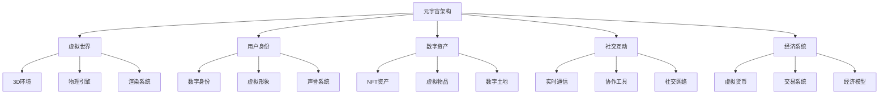

# 元宇宙架构 - Golang实现指南

## 目录
- [1. 概述](#1-概述)
- [2. 元宇宙基础](#2-元宇宙基础)
- [3. 国际标准与主流框架](#3-国际标准与主流框架)
- [4. 领域建模](#4-领域建模)
- [5. 分布式挑战](#5-分布式挑战)
- [6. 设计解决方案](#6-设计解决方案)
- [7. Golang实现](#7-golang实现)
- [8. 形式化建模](#8-形式化建模)
- [9. 最佳实践](#9-最佳实践)
- [10. 参考资源](#10-参考资源)

## 1. 概述

### 1.1 定义与发展历程

元宇宙（Metaverse）是一个由虚拟现实（VR）、增强现实（AR）、混合现实（MR）等技术构建的数字化虚拟世界，用户可以在其中进行社交、工作、娱乐、学习等活动，实现现实世界与虚拟世界的深度融合。

**发展历程：**
- 1992年：Neal Stephenson在《雪崩》中首次提出"Metaverse"概念
- 2003年：Second Life开创虚拟世界先河
- 2014年：Facebook收购Oculus，VR技术快速发展
- 2021年：Facebook更名为Meta，元宇宙概念爆发
- 2022年后：Web3、区块链、AI技术融合，元宇宙生态逐步完善

### 1.2 核心特征

## 2. 元宇宙基础

### 2.1 核心技术栈

**显示技术：**
- VR（虚拟现实）：完全沉浸式体验
- AR（增强现实）：叠加虚拟信息到现实世界
- MR（混合现实）：虚拟与现实深度融合
- XR（扩展现实）：统称所有扩展现实技术

**交互技术：**
- 手势识别、眼动追踪、语音识别
- 触觉反馈、力反馈、脑机接口
- 空间定位、动作捕捉、表情识别

**网络技术：**
- 5G/6G低延迟通信
- 边缘计算、CDN加速
- WebRTC实时音视频

### 2.2 核心组件

**虚拟世界引擎：**
- Unity3D、Unreal Engine
- 物理引擎、渲染引擎、AI引擎

**用户系统：**
- 身份认证、权限管理
- 虚拟形象、个性化定制

**内容系统：**
- 3D模型、纹理、动画
- 音视频、交互脚本

**经济系统：**
- 虚拟货币、NFT、智能合约
- 交易平台、支付系统

### 2.3 典型应用场景

**娱乐游戏：**
- 虚拟游戏世界
- 社交娱乐平台
- 虚拟演唱会、展览

**工作协作：**
- 虚拟办公空间
- 远程会议、培训
- 3D设计协作

**教育学习：**
- 虚拟课堂
- 沉浸式学习体验
- 技能培训模拟

**商业应用：**
- 虚拟购物体验
- 数字营销、广告
- 虚拟房地产

## 3. 国际标准与主流框架

### 3.1 国际标准

**Khronos Group标准：**
- OpenXR：跨平台XR标准
- glTF：3D资产传输格式
- Vulkan：图形API标准

**W3C标准：**
- WebXR Device API：Web端XR标准
- WebAssembly：高性能Web执行环境

**IEEE标准：**
- IEEE 2888：数字孪生标准
- IEEE 1858：元宇宙标准工作组

### 3.2 主流开源框架

**3D引擎：**
- Unity3D：跨平台游戏引擎
- Unreal Engine：高质量3D渲染引擎
- Godot：开源游戏引擎
- Three.js：Web端3D库

**XR框架：**
- OpenXR：跨平台XR API
- WebXR：Web端XR标准
- ARCore：Android AR框架
- ARKit：iOS AR框架

**区块链平台：**
- Ethereum：智能合约平台
- Polygon：Layer2扩展方案
- Solana：高性能区块链
- Flow：NFT专用区块链

### 3.3 商业平台

**VR/AR平台：**
- Meta Quest：VR头显平台
- Microsoft HoloLens：AR头显
- Apple Vision Pro：混合现实设备

**元宇宙平台：**
- Decentraland：去中心化虚拟世界
- The Sandbox：游戏化虚拟世界
- Roblox：用户生成内容平台
- VRChat：社交VR平台

---

*后续将补充领域建模、分布式挑战、设计方案、Golang实现、形式化建模等内容。* 