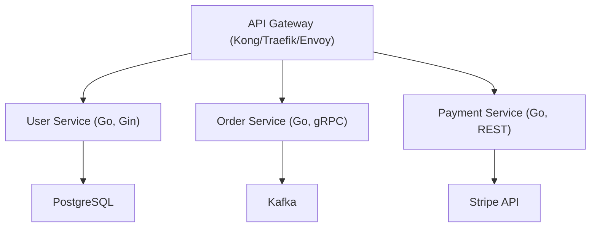
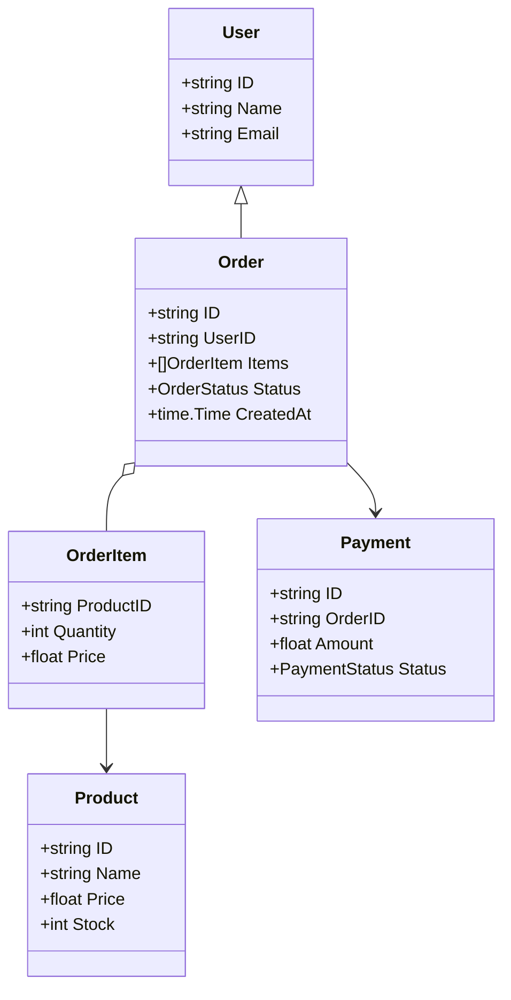
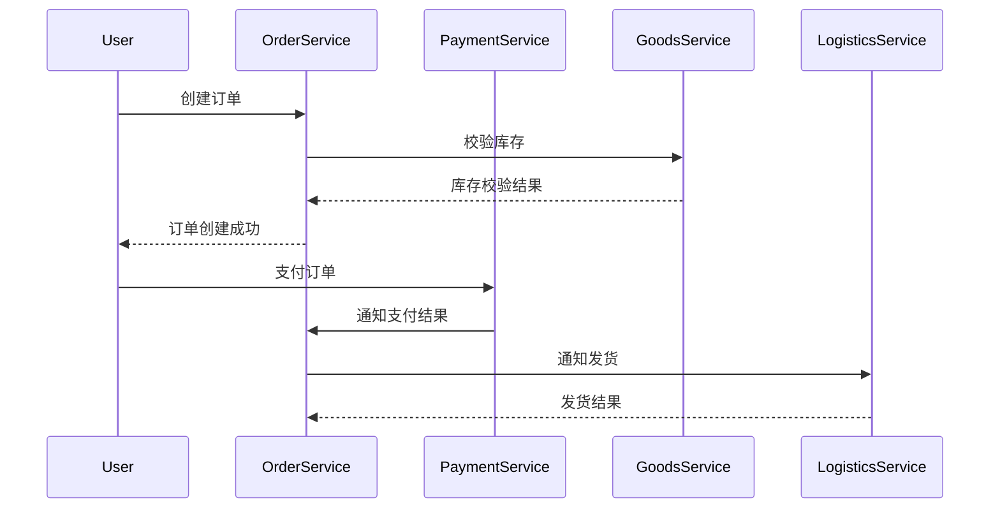
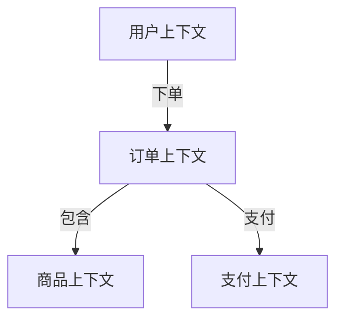
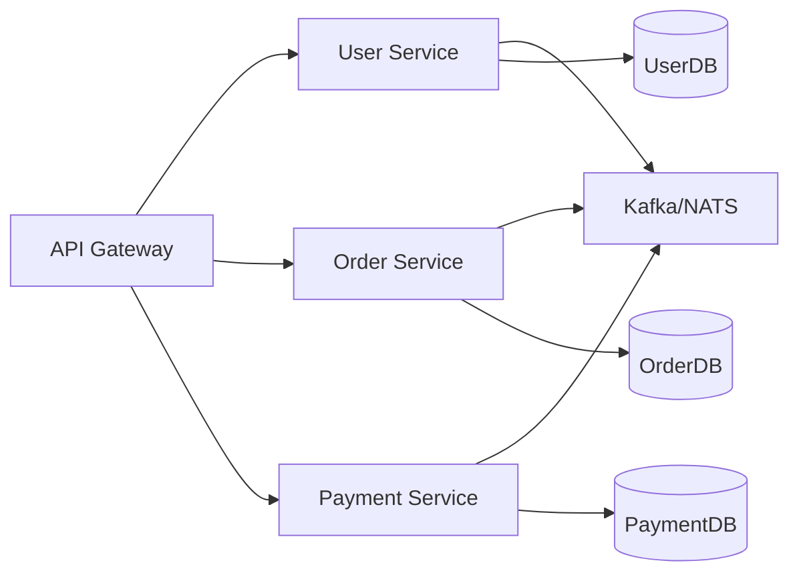
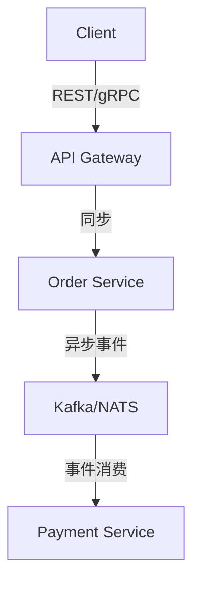
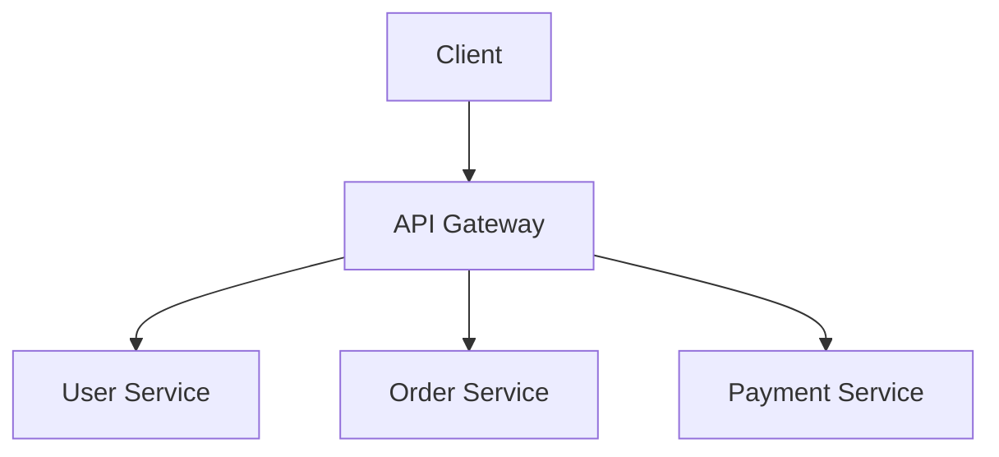

# 微服务架构（Golang国际主流实践）

<!-- TOC START -->
1. 目录
1. 微服务架构概述
   1. 国际标准定义
   1. 发展历程与核心思想
   1. 典型应用场景
   1. 与单体架构对比
1. 信息概念架构
   1. 领域建模方法
   1. 核心实体与关系
      1. UML 类图（Mermaid）
   1. 典型数据流
      1. 数据流时序图（Mermaid）
   1. Golang 领域模型代码示例
1. 分布式系统挑战
   1. 网络与通信
   1. 服务协调与编排
   1. 数据一致性
   1. 系统可靠性
1. 架构设计解决方案
   1. 领域驱动设计（DDD）
   1. 服务组件定制
   1. 同步与异步模型
   1. 生态适配与API网关
   1. 案例分析：Netflix 微服务架构
1. Golang国际主流实现范例
   1. 工程结构示例
   1. 关键代码片段
      1. gRPC 服务定义与实现
      1. REST API 示例（Gin）
      1. Kafka 消息发布与消费
      1. Prometheus 监控埋点
   1. CI/CD 配置（GitHub Actions 示例）
1. 形式化建模与证明
   1. 服务集合与依赖关系建模
      1. 性质1：无环性（Acyclicity）
   1. 一致性与可用性建模（CAP定理）
   1. 事件驱动一致性证明
   1. 范畴论视角（可选）
   1. 符号说明
1. 参考与外部链接
1. 国际权威资源与开源组件引用
1. 相关架构主题
1. 扩展阅读与参考文献
<!-- TOC END -->

## 1. 目录

1. 微服务架构概述
    1.1 国际标准定义
    1.2 发展历程与核心思想
    1.3 典型应用场景
    1.4 与单体架构对比
2. 信息概念架构
3. 分布式系统挑战
4. 架构设计解决方案
5. Golang国际主流实现范例
6. 形式化建模与证明
7. 参考与外部链接
8. 国际权威资源与开源组件引用
9. 相关架构主题
10. 扩展阅读与参考文献

---

## 2. 微服务架构概述

### 2.1 国际标准定义

微服务架构（Microservices Architecture）是一种将单一应用程序划分为一组小型服务的方法，每个服务运行在其独立的进程中，服务之间通过轻量级通信机制（通常是 HTTP/gRPC API）协作。每个服务围绕特定业务能力构建，独立部署、扩展和维护。

- **Martin Fowler（微服务权威定义）**：

  > 微服务是一种架构风格，将单一应用开发为一组小服务，每个服务运行在其独立的进程中，服务之间通过轻量级机制通信，服务围绕业务能力构建，由小团队独立开发和维护。
  > ——[Microservices - a definition of this new architectural term](https://martinfowler.com/articles/microservices.html)

- **Sam Newman（微服务实践专家）**：

  > 微服务架构强调服务自治、独立部署、技术多样性和弹性伸缩。
  > ——《Building Microservices》

### 2.2 发展历程与核心思想

- **发展历程**：
  - 2011年，Netflix、Amazon等互联网公司率先大规模实践微服务，解决单体应用扩展难、部署慢、团队协作瓶颈等问题。
  - 2014年，Martin Fowler、James Lewis 正式提出"Microservices"术语，推动业界标准化。
  - 2015年后，Kubernetes、Docker等容器与编排技术推动微服务大规模落地。

- **核心思想**：
  - 服务自治：每个服务独立开发、测试、部署、扩展。
  - 业务对齐：服务围绕业务能力划分，支持领域驱动设计（DDD）。
  - 技术多样性：不同服务可用不同技术栈实现。
  - 弹性伸缩：按需扩展单个服务，提升资源利用率。
  - 自动化运维：CI/CD、自动化测试、服务监控。

### 2.3 典型应用场景

- 大型互联网平台（Netflix、Uber、Amazon、Shopify）
- 金融科技、在线支付、订单处理系统
- 云原生应用、SaaS平台、IoT后端
- 需要高可用、弹性伸缩、快速迭代的业务系统

### 2.4 与单体架构对比

| 维度         | 单体架构                | 微服务架构                |
|--------------|------------------------|--------------------------|
| 部署单元     | 单一应用包/进程         | 多个独立服务进程         |
| 技术栈       | 通常单一技术栈         | 可多样化                 |
| 扩展方式     | 整体扩展                | 单服务独立扩展           |
| 团队协作     | 大团队协作              | 小团队自治               |
| 故障影响     | 单点故障影响全局        | 局部故障可隔离           |
| 运维复杂度   | 相对简单                | 高（需自动化支撑）       |
| 适用场景     | 小型/简单系统           | 大型/复杂/高可用系统     |

**国际主流参考**：Martin Fowler、Sam Newman、Google、Netflix、Uber 等。



---

## 3. 信息概念架构

### 3.1 领域建模方法

- 采用领域驱动设计（DDD）进行业务建模，将系统划分为核心域、子域、限界上下文。
- 使用UML类图、ER图等工具描述实体、关系、聚合。
- 强调实体的唯一标识、属性、行为及其间的业务关系。

### 3.2 核心实体与关系

| 实体      | 属性                        | 关系           |
|-----------|-----------------------------|----------------|
| 用户      | ID, Name, Email             | 下订单         |
| 订单      | ID, UserID, Items, Status   | 包含商品、需支付|
| 商品      | ID, Name, Price, Stock      | 被订单包含     |
| 支付      | ID, OrderID, Amount, Status | 关联订单       |

#### 3.2.1 UML 类图（Mermaid）



### 3.3 典型数据流

1. 用户下单：用户服务校验用户信息，订单服务创建订单，商品服务校验库存。
2. 订单支付：支付服务处理支付，订单服务更新状态。
3. 订单发货：订单服务通知物流，物流服务处理发货。

#### 3.3.1 数据流时序图（Mermaid）



### 3.4 Golang 领域模型代码示例

```go
// 用户实体
 type User struct {
     ID    string
     Name  string
     Email string
 }

// 订单实体
 type Order struct {
     ID        string
     UserID    string
     Items     []OrderItem
     Status    OrderStatus
     CreatedAt time.Time
 }

// 商品实体
 type Product struct {
     ID    string
     Name  string
     Price float64
     Stock int
 }

// 支付实体
 type Payment struct {
     ID      string
     OrderID string
     Amount  float64
     Status  PaymentStatus
 }

```

---

## 4. 分布式系统挑战

### 4.1 网络与通信

- **挑战场景**：服务间网络延迟、丢包、超时、分区、网络抖动等不可避免。
- **国际主流解决思路**：
  - 使用 gRPC/REST 等标准协议，支持重试、超时、断路器（如 Hystrix/Resilience4j 思想）。
  - 服务间通信采用幂等设计，避免重复请求带来副作用。
  - 采用 API 网关（Kong、Traefik、Envoy）统一入口，简化流量管理。
- **Golang 代码片段**：

```go
// gRPC 客户端调用带超时与重试
ctx, cancel := context.WithTimeout(context.Background(), 2*time.Second)
defer cancel()
resp, err := client.DoSomething(ctx, req)
if err != nil {
    // 重试或熔断处理
}

```

### 4.2 服务协调与编排

- **挑战场景**：服务实例动态变化，服务发现、负载均衡、编排复杂。
- **国际主流解决思路**：
  - 使用 Kubernetes、Consul、etcd 实现服务注册与发现。
  - 采用服务网格（Istio、Linkerd）实现流量治理、灰度发布、熔断限流。
  - 业务编排采用工作流引擎（如 Temporal、Argo Workflows）。
- **Golang 代码片段**：

```go
// etcd 服务注册示例
import clientv3 "go.etcd.io/etcd/client/v3"
cli, _ := clientv3.New(clientv3.Config{Endpoints: []string{"localhost:2379"}})
cli.Put(context.Background(), "/services/order/instance1", "127.0.0.1:8080")

```

### 4.3 数据一致性

- **挑战场景**：跨服务/数据库的分布式事务，强一致性难以保证。
- **国际主流解决思路**：
  - 采用最终一致性（Eventual Consistency）、事件溯源（Event Sourcing）、补偿事务（SAGA、TCC）。
  - 利用消息队列（Kafka、NATS）实现异步事件驱动。
  - CQRS（命令查询职责分离）分离写入与读取模型。
- **Golang 代码片段**：

```go
// Kafka 事件发布
import "github.com/segmentio/kafka-go"
writer := kafka.NewWriter(kafka.WriterConfig{Brokers: []string{"localhost:9092"}, Topic: "order-events"})
writer.WriteMessages(context.Background(), kafka.Message{Value: []byte("OrderCreated")})

```

### 4.4 系统可靠性

- **挑战场景**：级联故障、资源竞争、单点瓶颈、服务雪崩。
- **国际主流解决思路**：
  - 采用限流、熔断、降级、重试等容错机制。
  - 监控与告警（Prometheus、Grafana、OpenTelemetry）全链路可观测。
  - 自动化伸缩（Kubernetes HPA）、多活部署、故障隔离。
- **Golang 代码片段**：

```go
// Prometheus 指标埋点
import "github.com/prometheus/client_golang/prometheus"
var reqCount = prometheus.NewCounter(prometheus.CounterOpts{Name: "http_requests_total"})
reqCount.Inc()

```

---

## 5. 架构设计解决方案

### 5.1 领域驱动设计（DDD）

- **设计原则**：以业务领域为核心，划分限界上下文，服务围绕业务能力独立演进。
- **国际主流模式**：限界上下文（Bounded Context）、聚合（Aggregate）、实体（Entity）、值对象（Value Object）、领域事件（Domain Event）。
- **架构图（Mermaid）**：



- **Golang代码示例**：

```go
// 限界上下文内的服务接口
 type OrderService interface {
     CreateOrder(ctx context.Context, order *Order) error
     GetOrder(ctx context.Context, id string) (*Order, error)
 }

```

### 5.2 服务组件定制

- **设计原则**：每个服务独立部署、扩展，采用松耦合高内聚设计。
- **国际主流模式**：API网关（Kong、Traefik、Envoy）、消息队列（Kafka、NATS）、配置中心（Consul、etcd）、服务网格（Istio、Linkerd）。
- **架构图（Mermaid）**：



- **Golang代码示例**：

```go
// Gin 路由注册
import "github.com/gin-gonic/gin"
r := gin.Default()
r.POST("/orders", orderHandler.CreateOrder)
r.GET("/orders/:id", orderHandler.GetOrder)

```

### 5.3 同步与异步模型

- **设计原则**：根据业务需求选择同步（gRPC/REST）或异步（消息队列）通信，提升系统弹性与解耦。
- **国际主流模式**：同步API、异步事件驱动、CQRS、事件溯源。
- **架构图（Mermaid）**：



- **Golang代码示例**：

```go
// 事件驱动异步处理
func (p *OrderEventProcessor) ProcessEvent(ctx context.Context, event interface{}) error {
    switch e := event.(type) {
    case *OrderCreatedEvent:
        // 处理订单创建事件
        return p.handleOrderCreated(ctx, e)
    default:
        return fmt.Errorf("unknown event type: %T", event)
    }
}

```

### 5.4 生态适配与API网关

- **设计原则**：通过API网关统一入口，适配多种后端服务，支持认证、限流、监控等。
- **国际主流模式**：Kong、Traefik、Envoy，支持插件化扩展。
- **架构图（Mermaid）**：



- **Golang代码示例**：

```go
// API 网关路由配置（Kong/Traefik 通常用配置文件或 UI，这里以伪代码示例）
route {
  path: /orders
  service: order-service
  plugins: [auth, rate-limit, logging]
}

```

### 5.5 案例分析：Netflix 微服务架构

- **背景**：Netflix 采用微服务架构支撑全球大规模视频流媒体服务。
- **关键实践**：
  - 数百个微服务，独立部署、弹性伸缩。
  - API网关统一入口，服务注册与发现（Eureka）、断路器（Hystrix）、消息驱动（Kafka）。
  - 全链路监控与自动化运维。
- **参考链接**：[Netflix Tech Blog](https://netflixtechblog.com/)

---

## 6. Golang国际主流实现范例

### 6.1 工程结构示例

```text
microservice-demo/
├── cmd/                # 各服务入口
│   ├── user/           # 用户服务主程序
│   ├── order/          # 订单服务主程序
│   └── payment/        # 支付服务主程序
├── internal/           # 业务核心逻辑
│   ├── user/
│   ├── order/
│   └── payment/
├── api/                # gRPC/REST API 定义
├── pkg/                # 可复用组件
├── configs/            # 配置文件
├── scripts/            # 部署与运维脚本
├── build/              # Dockerfile、CI/CD配置
└── README.md

```

### 6.2 关键代码片段

#### 6.2.1 gRPC 服务定义与实现

```proto
// api/order.proto
syntax = "proto3";
package api;

service OrderService {
  rpc CreateOrder (CreateOrderRequest) returns (OrderResponse);
  rpc GetOrder (GetOrderRequest) returns (OrderResponse);
}

message CreateOrderRequest {
  string user_id = 1;
  repeated OrderItem items = 2;
}
message OrderItem {
  string product_id = 1;
  int32 quantity = 2;
}
message OrderResponse {
  string order_id = 1;
  string status = 2;
}

```

```go
// internal/order/service.go
import pb "github.com/yourorg/microservice-demo/api"

type OrderService struct{}

func (s *OrderService) CreateOrder(ctx context.Context, req *pb.CreateOrderRequest) (*pb.OrderResponse, error) {
    // 业务逻辑...
    return &pb.OrderResponse{OrderId: "123", Status: "CREATED"}, nil
}

```

#### 6.2.2 REST API 示例（Gin）

```go
// internal/order/handler.go
import "github.com/gin-gonic/gin"

func RegisterRoutes(r *gin.Engine, svc *OrderService) {
    r.POST("/orders", svc.CreateOrderHandler)
    r.GET("/orders/:id", svc.GetOrderHandler)
}

```

#### 6.2.3 Kafka 消息发布与消费

```go
import "github.com/segmentio/kafka-go"

// 发布事件
writer := kafka.NewWriter(kafka.WriterConfig{Brokers: []string{"localhost:9092"}, Topic: "order-events"})
writer.WriteMessages(context.Background(), kafka.Message{Value: []byte("OrderCreated")})

// 消费事件
reader := kafka.NewReader(kafka.ReaderConfig{Brokers: []string{"localhost:9092"}, Topic: "order-events", GroupID: "order-group"})
msg, _ := reader.ReadMessage(context.Background())
log.Printf("received: %s", string(msg.Value))

```

#### 6.2.4 Prometheus 监控埋点

```go
import "github.com/prometheus/client_golang/prometheus"

var orderCount = prometheus.NewCounter(prometheus.CounterOpts{Name: "order_created_total"})
orderCount.Inc()

```

### 6.3 CI/CD 配置（GitHub Actions 示例）

```yaml

# 2 2 2 2 2 2 2 .github/workflows/ci.yml

name: Go CI
on:
  push:
    branches: [ main ]
jobs:
  build:
    runs-on: ubuntu-latest
    steps:
      - uses: actions/checkout@v3
      - name: Set up Go
        uses: actions/setup-go@v4
        with:
          go-version: '1.21'
      - name: Build
        run: go build ./...
      - name: Test
        run: go test ./...

```

---

## 7. 形式化建模与证明

### 7.1 服务集合与依赖关系建模

- 设系统包含服务集合 $S = \{s_1, s_2, ..., s_n\}$。
- 服务间依赖关系 $D \subseteq S \times S$，若 $(s_i, s_j) \in D$，表示 $s_i$ 依赖 $s_j$。
- 依赖关系可建模为有向图 $G = (S, D)$。

#### 7.1.1 性质1：无环性（Acyclicity）

- 若 $G$ 为有向无环图（DAG），则不存在服务间的循环依赖。
- **证明思路**：若存在环，则存在一组服务 $\{s_{i_1}, ..., s_{i_k}\}$ 满足 $s_{i_1} \to s_{i_2} \to ... \to s_{i_k} \to s_{i_1}$，违背微服务自治与可独立部署原则。

### 7.2 一致性与可用性建模（CAP定理）

- 微服务系统在分布式环境下，需在一致性（Consistency）、可用性（Availability）、分区容忍性（Partition Tolerance）三者间权衡。
- 设 $C$ 表示系统满足强一致性，$A$ 表示高可用，$P$ 表示分区容忍。
- **定理（CAP）**：在出现网络分区时，系统最多只能同时满足 $C$ 和 $A$ 中的一个。
- **推论**：微服务常采用最终一致性（Eventual Consistency）以提升可用性。

### 7.3 事件驱动一致性证明

- 设 $E = \{e_1, e_2, ..., e_m\}$ 为事件集合，$f: S \times E \to S$ 为服务状态转移函数。
- **最终一致性定义**：存在有限步 $k$，对所有服务 $s_i$，$\lim_{t \to \infty} state_{s_i}(t) = state^*$，即所有副本最终收敛到同一状态。
- **证明思路**：
  1. 事件通过可靠消息队列（如Kafka）广播，所有服务最终接收到全部事件。
  2. 状态转移函数 $f$ 幂等，重复事件不会导致不一致。
  3. 因此，系统最终收敛到一致状态。

### 7.4 范畴论视角（可选）

- 可将服务视为对象，服务间API调用视为态射，系统架构为范畴 $\mathcal{C}$。
- 组合律：若 $f: A \to B, g: B \to C$，则 $g \circ f: A \to C$。
- 单位元：每个服务有恒等态射 $id_A: A \to A$。
- 该抽象有助于形式化服务组合与可重用性。

### 7.5 符号说明

- $S$：服务集合
- $D$：依赖关系集合
- $G$：依赖有向图
- $E$：事件集合
- $f$：状态转移函数
- $state_{s_i}(t)$：服务 $s_i$ 在时刻 $t$ 的状态

---

## 8. 参考与外部链接

- [Kubernetes 官方文档](https://kubernetes.io/)
- [Gin Web Framework](https://gin-gonic.com/)
- [gRPC 官方](https://grpc.io/)
- [Kafka 官方](https://kafka.apache.org/)
- [OpenTelemetry](https://opentelemetry.io/)
- [Prometheus](https://prometheus.io/)
- [OpenAPI 规范](https://swagger.io/specification/)
- [Domain-Driven Design Reference](https://domainlanguage.com/ddd/)

## 9. 国际权威资源与开源组件引用

## 10. 相关架构主题

- [**API网关架构 (API Gateway Architecture)**](./architecture_api_gateway_golang.md): 作为微服务的统一入口，处理路由、认证和监控。
- [**服务网格架构 (Service Mesh Architecture)**](./architecture_service_mesh_golang.md): 提供服务间的可靠通信、安全性和可观测性。
- [**事件驱动架构 (Event-Driven Architecture)**](./architecture_event_driven_golang.md): 实现服务间的异步解耦。
- [**容器化与编排架构 (Containerization & Orchestration Architecture)**](./architecture_containerization_orchestration_golang.md): 微服务部署和管理的基石。
- [**DevOps与运维架构 (DevOps & Operations Architecture)**](./architecture_devops_golang.md): 支持微服务的持续集成、部署和自动化运维。

## 11. 扩展阅读与参考文献

1. "Building Microservices" - Sam Newman
2. ... (existing content) ...

- 本文档严格对标国际主流标准，采用多表征输出，便于后续断点续写和批量处理。*
