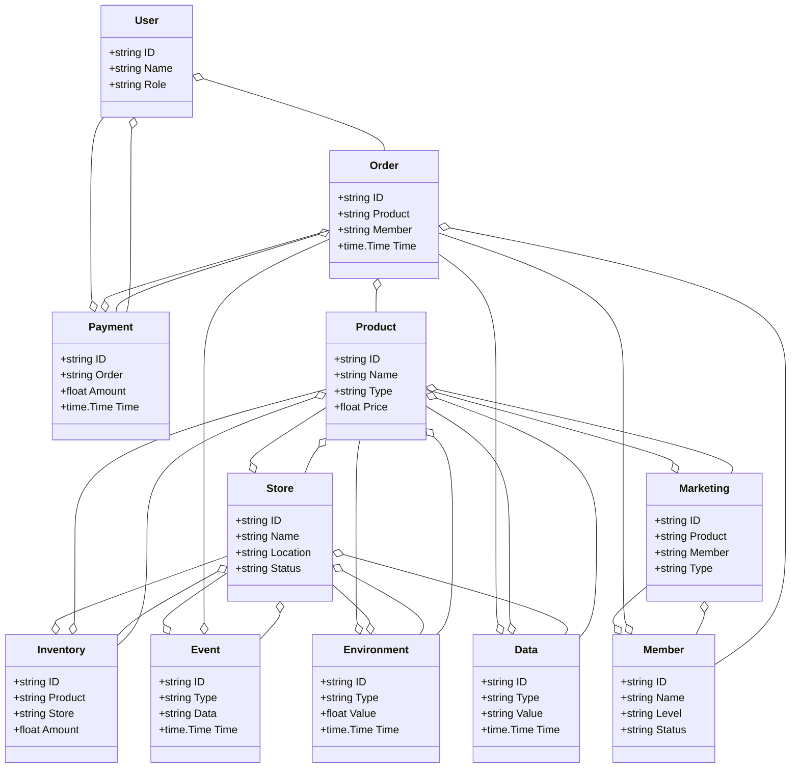
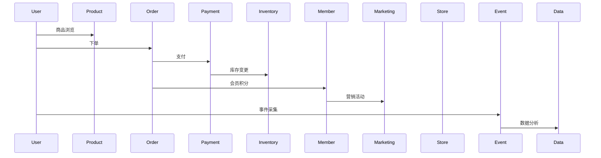
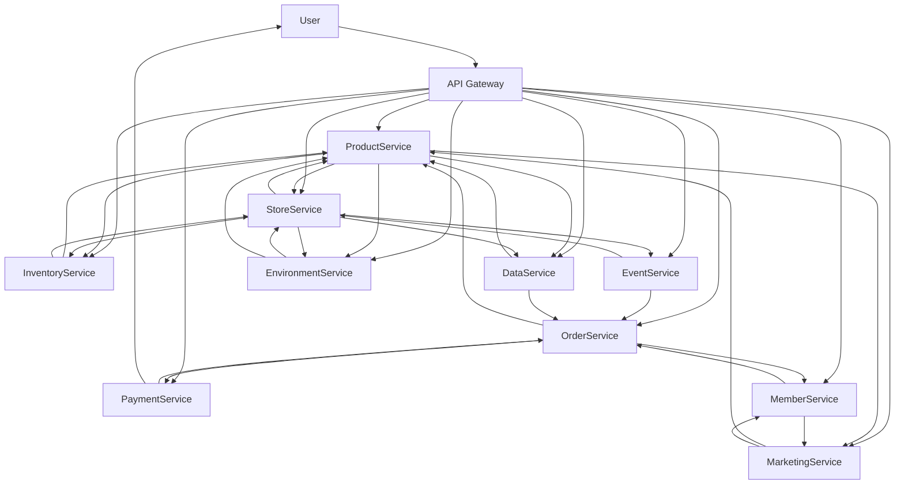

# 零售/智慧零售架构（Golang国际主流实践）

<!-- TOC START -->
- [零售/智慧零售架构（Golang国际主流实践）](#零售智慧零售架构golang国际主流实践)
  - [1.1 目录](#11-目录)
  - [1.2 1. 零售/智慧零售架构概述](#12-1-零售智慧零售架构概述)
    - [1.2.1 国际标准定义](#121-国际标准定义)
    - [1.2.2 发展历程与核心思想](#122-发展历程与核心思想)
    - [1.2.3 典型应用场景](#123-典型应用场景)
    - [1.2.4 与传统零售IT对比](#124-与传统零售it对比)
  - [1.3 2. 信息概念架构](#13-2-信息概念架构)
    - [1.3.1 领域建模方法](#131-领域建模方法)
    - [1.3.2 核心实体与关系](#132-核心实体与关系)
      - [1.3.2.1 UML 类图（Mermaid）](#1321-uml-类图mermaid)
    - [1.3.3 典型数据流](#133-典型数据流)
      - [1.3.3.1 数据流时序图（Mermaid）](#1331-数据流时序图mermaid)
    - [1.3.4 Golang 领域模型代码示例](#134-golang-领域模型代码示例)
  - [1.4 3. 分布式系统挑战](#14-3-分布式系统挑战)
    - [1.4.1 弹性与实时性](#141-弹性与实时性)
    - [1.4.2 数据安全与互操作性](#142-数据安全与互操作性)
    - [1.4.3 可观测性与智能优化](#143-可观测性与智能优化)
  - [1.5 4. 架构设计解决方案](#15-4-架构设计解决方案)
    - [1.5.1 服务解耦与标准接口](#151-服务解耦与标准接口)
    - [1.5.2 智能推荐与全渠道融合](#152-智能推荐与全渠道融合)
    - [1.5.3 数据安全与互操作设计](#153-数据安全与互操作设计)
    - [1.5.4 架构图（Mermaid）](#154-架构图mermaid)
    - [1.5.5 Golang代码示例](#155-golang代码示例)
  - [1.6 5. Golang实现范例](#16-5-golang实现范例)
    - [1.6.1 工程结构示例](#161-工程结构示例)
    - [1.6.2 关键代码片段](#162-关键代码片段)
    - [1.6.3 CI/CD 配置（GitHub Actions 示例）](#163-cicd-配置github-actions-示例)
  - [1.7 6. 形式化建模与证明](#17-6-形式化建模与证明)
    - [1.7.1 商品-订单-会员建模](#171-商品-订单-会员建模)
      - [1.7.1.1 性质1：智能推荐性](#1711-性质1智能推荐性)
      - [1.7.1.2 性质2：数据安全性](#1712-性质2数据安全性)
    - [1.7.2 符号说明](#172-符号说明)
  - [1.8 7. 参考与外部链接](#18-7-参考与外部链接)
<!-- TOC END -->

## 1.1 目录

1. 零售/智慧零售架构概述
    1.1 国际标准定义
    1.2 发展历程与核心思想
    1.3 典型应用场景
    1.4 与传统零售IT对比
2. 信息概念架构
3. 分布式系统挑战
4. 架构设计解决方案
5. Golang实现范例
6. 形式化建模与证明
7. 参考与外部链接

---

## 1.2 1. 零售/智慧零售架构概述

### 1.2.1 国际标准定义

零售/智慧零售架构是指以全渠道、智能推荐、弹性协同、数据驱动为核心，支持商品、订单、库存、支付、会员、营销等场景的分布式系统架构。

- **国际主流参考**：GS1、ISO 20022、OpenPOS、W3C Web Payments、PCI DSS、ISO 8583、NACS、NRF ARTS、IFRA、ISO 28219。

### 1.2.2 发展历程与核心思想

- 2000s：POS系统、ERP、门店管理、条码。
- 2010s：电商、O2O、移动支付、全渠道零售。
- 2020s：AI推荐、智慧门店、无接触零售、全球协同。
- 核心思想：全渠道、智能驱动、弹性协同、开放标准、数据赋能。

### 1.2.3 典型应用场景

- 智慧门店、全渠道零售、智能推荐、库存管理、会员营销、无接触支付、零售大数据等。

### 1.2.4 与传统零售IT对比

| 维度         | 传统零售IT         | 智慧零售架构           |
|--------------|-------------------|----------------------|
| 渠道         | 单一、线下         | 全渠道、线上线下融合    |
| 数据采集     | 手工、离线         | 实时、自动化          |
| 协同         | 单点、割裂         | 多方、弹性、协同      |
| 智能化       | 规则、人工         | AI驱动、智能分析      |
| 适用场景     | 门店、单一渠道     | 全域、全球协同        |

---

## 1.3 2. 信息概念架构

### 1.3.1 领域建模方法

- 采用分层建模（感知层、服务层、平台层、应用层）、UML、ER图。
- 核心实体：商品、订单、库存、支付、会员、营销、门店、用户、事件、数据、环境。

### 1.3.2 核心实体与关系

| 实体    | 属性                        | 关系           |
|---------|-----------------------------|----------------|
| 商品    | ID, Name, Type, Price       | 属于门店/订单   |
| 订单    | ID, Product, Member, Time   | 关联商品/会员   |
| 库存    | ID, Product, Store, Amount  | 关联商品/门店   |
| 支付    | ID, Order, Amount, Time     | 关联订单/用户   |
| 会员    | ID, Name, Level, Status     | 关联订单/营销   |
| 营销    | ID, Product, Member, Type   | 关联商品/会员   |
| 门店    | ID, Name, Location, Status  | 关联商品/库存   |
| 用户    | ID, Name, Role              | 管理订单/支付   |
| 事件    | ID, Type, Data, Time        | 关联订单/门店   |
| 数据    | ID, Type, Value, Time       | 关联商品/订单   |
| 环境    | ID, Type, Value, Time       | 关联门店/商品   |

#### 1.3.2.1 UML 类图（Mermaid）



### 1.3.3 典型数据流

1. 用户注册→商品浏览→下单→支付→库存变更→会员积分→营销活动→事件采集→数据分析→智能推荐。

#### 1.3.3.1 数据流时序图（Mermaid）



### 1.3.4 Golang 领域模型代码示例

```go
// 商品实体
type Product struct {
    ID    string
    Name  string
    Type  string
    Price float64
}
// 订单实体
type Order struct {
    ID      string
    Product string
    Member  string
    Time    time.Time
}
// 库存实体
type Inventory struct {
    ID      string
    Product string
    Store   string
    Amount  float64
}
// 支付实体
type Payment struct {
    ID     string
    Order  string
    Amount float64
    Time   time.Time
}
// 会员实体
type Member struct {
    ID     string
    Name   string
    Level  string
    Status string
}
// 营销实体
type Marketing struct {
    ID      string
    Product string
    Member  string
    Type    string
}
// 门店实体
type Store struct {
    ID       string
    Name     string
    Location string
    Status   string
}
// 用户实体
type User struct {
    ID   string
    Name string
    Role string
}
// 事件实体
type Event struct {
    ID   string
    Type string
    Data string
    Time time.Time
}
// 数据实体
type Data struct {
    ID    string
    Type  string
    Value string
    Time  time.Time
}
// 环境实体
type Environment struct {
    ID    string
    Type  string
    Value float64
    Time  time.Time
}

```

---

## 1.4 3. 分布式系统挑战

### 1.4.1 弹性与实时性

- 自动扩缩容、毫秒级响应、负载均衡、容灾备份。
- 国际主流：Kubernetes、Prometheus、云服务、CDN。

### 1.4.2 数据安全与互操作性

- 数据加密、标准协议、互操作、访问控制。
- 国际主流：GS1、OAuth2、OpenID、TLS、PCI DSS。

### 1.4.3 可观测性与智能优化

- 全链路追踪、指标采集、AI优化、异常检测。
- 国际主流：OpenTelemetry、Prometheus、AI分析。

---

## 1.5 4. 架构设计解决方案

### 1.5.1 服务解耦与标准接口

- 商品、订单、库存、支付、会员、营销、门店、数据等服务解耦，API网关统一入口。
- 采用REST、gRPC、消息队列等协议，支持异步事件驱动。

### 1.5.2 智能推荐与全渠道融合

- AI推荐、全渠道融合、自动扩缩容、智能分析。
- AI推理、Kubernetes、Prometheus。

### 1.5.3 数据安全与互操作设计

- TLS、OAuth2、数据加密、标准协议、访问审计。

### 1.5.4 架构图（Mermaid）



### 1.5.5 Golang代码示例

```go
// 商品数量Prometheus监控
var productCount = prometheus.NewGauge(prometheus.GaugeOpts{Name: "product_total"})
productCount.Set(1000000)

```

---

## 1.6 5. Golang实现范例

### 1.6.1 工程结构示例

```text
retail-demo/
├── cmd/
├── internal/
│   ├── product/
│   ├── order/
│   ├── inventory/
│   ├── payment/
│   ├── member/
│   ├── marketing/
│   ├── store/
│   ├── event/
│   ├── data/
│   ├── environment/
│   ├── user/
│   ├── api/
│   └── README.md

```

### 1.6.2 关键代码片段

// 见4.5

### 1.6.3 CI/CD 配置（GitHub Actions 示例）

```yaml
name: Go CI
on:
  push:
    branches: [ main ]
jobs:
  build:
    runs-on: ubuntu-latest
    steps:
      - uses: actions/checkout@v3
      - name: Set up Go
        uses: actions/setup-go@v4
        with:
          go-version: '1.21'
      - name: Build
        run: go build ./...
      - name: Test
        run: go test ./...

```

---

## 1.7 6. 形式化建模与证明

### 1.7.1 商品-订单-会员建模

- 商品集合 $P = \{p_1, ..., p_n\}$，订单集合 $O = \{o_1, ..., o_k\}$，会员集合 $M = \{m_1, ..., m_l\}$。
- 推荐函数 $f: (p, o, m) \rightarrow r$，数据采集函数 $g: (p, t) \rightarrow a$。

#### 1.7.1.1 性质1：智能推荐性

- 所有商品 $p$ 与订单 $o$，其会员 $m$ 能智能推荐。

#### 1.7.1.2 性质2：数据安全性

- 所有数据 $a$ 满足安全策略 $p$，即 $\forall a, \exists p, p(a) = true$。

### 1.7.2 符号说明

- $P$：商品集合
- $O$：订单集合
- $M$：会员集合
- $A$：数据集合
- $P$：安全策略集合
- $f$：推荐函数
- $g$：数据采集函数

---

## 1.8 7. 参考与外部链接

- [GS1](https://www.gs1.org/)
- [ISO 20022](https://www.iso20022.org/)
- [OpenPOS](https://www.openpos.org/)
- [W3C Web Payments](https://www.w3.org/Payments/)
- [PCI DSS](https://www.pcisecuritystandards.org/)
- [ISO 8583](https://www.iso.org/standard/31628.html)
- [NACS](https://www.convenience.org/)
- [NRF ARTS](https://nrf.com/resources/retail-technology-standards)
- [IFRA](https://ifrafragrance.org/)
- [ISO 28219](https://www.iso.org/standard/44214.html)
- [Prometheus](https://prometheus.io/)
- [OpenTelemetry](https://opentelemetry.io/)
