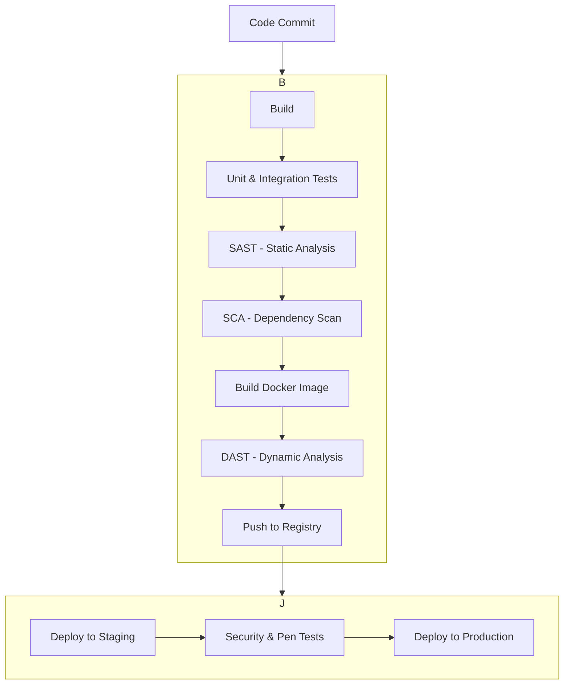

# 安全架构（Security Architecture）

## 目录

1. 国际标准与发展历程
2. 典型应用场景与需求分析
3. 领域建模与UML类图
4. 架构模式与设计原则
5. Golang主流实现与代码示例
6. 分布式挑战与主流解决方案
7. 工程结构与CI/CD实践
8. 形式化建模与数学表达
9. 国际权威资源与开源组件引用
10. 扩展阅读与参考文献

---

## 1. 国际标准与发展历程

### 1.1 主流标准与框架

- **NIST Cybersecurity Framework**
- **ISO/IEC 27001:2022**
- **OWASP Top 10**
- **CIS Controls**
- **Zero Trust Architecture**
- **GDPR/CCPA合规框架**

### 1.2 发展历程

- **2013**: NIST网络安全框架发布
- **2016**: Zero Trust概念普及
- **2018**: GDPR生效
- **2020**: 云原生安全框架
- **2023**: AI安全与隐私计算

### 1.3 国际权威链接

- [NIST Cybersecurity Framework](https://www.nist.gov/cyberframework)
- [OWASP](https://owasp.org/)
- [Cloud Native Security](https://www.cncf.io/projects/cloud-native-security/)

## 2. 核心安全模型与设计原则

### 2.1 核心原则

- **深度防御 (Defense in Depth)**: 采用多层、冗余的安全措施。即使一层防御被攻破，其他层次的防御依然能够提供保护。
- **最小权限原则 (Principle of Least Privilege)**: 任何用户、程序或进程只应拥有其执行授权功能所必需的最小权限。
- **零信任架构 (Zero Trust Architecture)**: 从不信任，始终验证。默认网络内部和外部的所有流量都不可信，要求对所有访问请求进行严格的身份验证和授权。
- **安全左移 (Shift-Left Security)**: 在软件开发生命周期（SDLC）的早期阶段就集成安全实践，而不是在部署后才考虑安全问题。

### 2.2 零信任安全模型

```go
type ZeroTrustEngine struct {
    // 身份验证
    IdentityProvider    *IdentityProvider
    AuthNController    *AuthenticationController
    
    // 访问控制
    PolicyEngine       *PolicyEngine
    AccessController   *AccessController
    
    // 持续评估
    RiskEngine        *RiskEngine
    ThreatDetector    *ThreatDetector
    
    // 可观测性
    SecurityMonitor   *SecurityMonitor
    AuditLogger      *AuditLogger
}

type SecurityContext struct {
    Identity      Identity
    Device       Device
    Network      Network
    Resource     Resource
    RiskScore    float64
    Timestamp    time.Time
}

func (zt *ZeroTrustEngine) EvaluateAccess(ctx context.Context, request AccessRequest) (*AccessDecision, error) {
    // 1. 身份验证
    identity, err := zt.IdentityProvider.Authenticate(ctx, request.Credentials)
    if err != nil {
        return nil, fmt.Errorf("authentication failed: %w", err)
    }
    
    // 2. 上下文评估
    secContext := &SecurityContext{
        Identity:   identity,
        Device:    request.Device,
        Network:   request.Network,
        Resource:  request.Resource,
        Timestamp: time.Now(),
    }
    
    // 3. 风险评估
    riskScore := zt.RiskEngine.EvaluateRisk(secContext)
    secContext.RiskScore = riskScore
    
    // 4. 策略评估
    decision := zt.PolicyEngine.Evaluate(secContext)
    
    // 5. 记录审计日志
    zt.AuditLogger.LogAccess(secContext, decision)
    
    return decision, nil
}
```

### 2.3 安全策略引擎

```go
type PolicyEngine struct {
    Policies    []Policy
    Evaluator   *PolicyEvaluator
    Cache       *PolicyCache
}

type Policy struct {
    ID          string
    Name        string
    Effect      PolicyEffect // Allow/Deny
    Conditions  []Condition
    Resources   []string
    Actions     []string
    Priority    int
}

type PolicyEvaluator struct {
    // ABAC (Attribute Based Access Control)
    AttributeProviders map[string]AttributeProvider
    
    // RBAC (Role Based Access Control)
    RoleManager       *RoleManager
    
    // ReBAC (Relationship Based Access Control)
    RelationshipGraph *RelationshipGraph
}

func (pe *PolicyEngine) EvaluateRequest(ctx context.Context, request *AccessRequest) (*PolicyDecision, error) {
    // 1. 策略匹配
    matchedPolicies := pe.findMatchingPolicies(request)
    
    // 2. 策略评估
    decisions := make([]*PolicyDecision, 0)
    for _, policy := range matchedPolicies {
        decision := pe.Evaluator.EvaluatePolicy(ctx, policy, request)
        decisions = append(decisions, decision)
    }
    
    // 3. 策略合并
    finalDecision := pe.mergePolicyDecisions(decisions)
    
    return finalDecision, nil
}
```

## 3. 认证与授权架构

### 3.1 多因素认证（MFA）

```go
type MFAService struct {
    // 认证因子管理
    PasswordValidator  *PasswordValidator
    TOTPProvider       *TOTPProvider
    WebAuthnProvider   *WebAuthnProvider
    
    // 策略管理
    MFAPolicyEngine    *MFAPolicyEngine
    
    // 会话管理
    SessionManager     *SessionManager
}

type MFAContext struct {
    UserID        string
    DeviceInfo    DeviceInfo
    IPAddress     string
    GeoLocation   GeoLocation
    RequestTime   time.Time
    RiskScore     float64
}

type MFAPolicy struct {
    RequiredFactors    []string
    RiskThreshold      float64
    ExemptIPs          []string
    ExemptUsers        []string
}

func (mfa *MFAService) AuthenticateUser(ctx context.Context, credentials map[string]interface{}) (*AuthResult, error) {
    // 1. 初始认证
    userId, err := mfa.PasswordValidator.Validate(credentials["username"].(string), credentials["password"].(string))
    if err != nil {
        return nil, fmt.Errorf("password validation failed: %w", err)
    }
    
    // 2. 风险评估
    mfaCtx := &MFAContext{
        UserID:      userId,
        DeviceInfo:  extractDeviceInfo(ctx),
        IPAddress:   extractIPAddress(ctx),
        GeoLocation: extractGeoLocation(ctx),
        RequestTime: time.Now(),
    }
    mfaCtx.RiskScore = mfa.evaluateRisk(mfaCtx)
    
    // 3. 策略评估
    requiredFactors := mfa.MFAPolicyEngine.GetRequiredFactors(mfaCtx)
    
    // 4. 额外因子验证
    for _, factor := range requiredFactors {
        switch factor {
        case "totp":
            err = mfa.TOTPProvider.Validate(userId, credentials["totp"].(string))
        case "webauthn":
            err = mfa.WebAuthnProvider.Validate(userId, credentials["webauthn"].([]byte))
        }
        
        if err != nil {
            return nil, fmt.Errorf("factor %s validation failed: %w", factor, err)
        }
    }
    
    // 5. 会话创建
    session := mfa.SessionManager.CreateSession(userId, mfaCtx)
    
    return &AuthResult{
        UserID:   userId,
        Session:  session,
        Factors:  append([]string{"password"}, requiredFactors...),
    }, nil
}
```

### 3.2 OAuth 2.0 与 OpenID Connect

```go
type OAuthServer struct {
    ClientRegistry     *ClientRegistry
    TokenService       *TokenService
    AuthorizationService *AuthorizationService
    UserInfoService    *UserInfoService
}

type TokenService struct {
    AccessTokenTTL     time.Duration
    RefreshTokenTTL    time.Duration
    SigningKey         interface{}
    TokenStore         TokenStore
}

func (ts *TokenService) IssueTokens(ctx context.Context, request *TokenRequest) (*TokenResponse, error) {
    // 根据授权类型处理
    switch request.GrantType {
    case "authorization_code":
        return ts.handleAuthorizationCode(ctx, request)
    case "refresh_token":
        return ts.handleRefreshToken(ctx, request)
    case "client_credentials":
        return ts.handleClientCredentials(ctx, request)
    default:
        return nil, errors.New("unsupported grant type")
    }
}

func (ts *TokenService) handleAuthorizationCode(ctx context.Context, request *TokenRequest) (*TokenResponse, error) {
    // 1. 验证授权码
    codeInfo, err := ts.TokenStore.GetAuthorizationCode(request.Code)
    if err != nil {
        return nil, fmt.Errorf("invalid code: %w", err)
    }
    
    // 2. 验证客户端
    if codeInfo.ClientID != request.ClientID {
        return nil, errors.New("client_id mismatch")
    }
    
    // 3. 验证重定向URI
    if codeInfo.RedirectURI != request.RedirectURI {
        return nil, errors.New("redirect_uri mismatch")
    }
    
    // 4. 生成访问令牌
    accessToken, err := ts.generateAccessToken(codeInfo.UserID, codeInfo.Scope, codeInfo.ClientID)
    if err != nil {
        return nil, err
    }
    
    // 5. 生成刷新令牌
    refreshToken, err := ts.generateRefreshToken(codeInfo.UserID, codeInfo.Scope, codeInfo.ClientID)
    if err != nil {
        return nil, err
    }
    
    // 6. 删除已使用的授权码
    ts.TokenStore.RemoveAuthorizationCode(request.Code)
    
    return &TokenResponse{
        AccessToken:  accessToken,
        TokenType:    "Bearer",
        ExpiresIn:    int(ts.AccessTokenTTL.Seconds()),
        RefreshToken: refreshToken,
        Scope:        codeInfo.Scope,
        IDToken:      ts.generateIDToken(codeInfo.UserID, codeInfo.ClientID),
    }, nil
}
```

## 4. 密码学应用

### 4.1 加密与签名服务

```go
type CryptoService struct {
    // 对称加密
    AESProvider       *AESProvider
    ChaCha20Provider  *ChaCha20Provider
    
    // 非对称加密
    RSAProvider       *RSAProvider
    ECDSAProvider     *ECDSAProvider
    ED25519Provider   *ED25519Provider
    
    // 哈希与MAC
    HashProvider      *HashProvider
    HMACProvider      *HMACProvider
    
    // 密钥管理
    KeyManager        *KeyManager
}

type EncryptionRequest struct {
    Algorithm    string
    PlainText    []byte
    KeyID        string
    AAD          []byte  // 附加认证数据
}

type EncryptionResponse struct {
    CipherText   []byte
    IV           []byte
    Tag          []byte
    KeyID        string
}

func (cs *CryptoService) Encrypt(ctx context.Context, req *EncryptionRequest) (*EncryptionResponse, error) {
    // 1. 获取加密密钥
    key, err := cs.KeyManager.GetKey(req.KeyID)
    if err != nil {
        return nil, fmt.Errorf("key retrieval failed: %w", err)
    }
    
    // 2. 根据算法选择加密提供者
    switch req.Algorithm {
    case "AES-GCM":
        return cs.AESProvider.EncryptGCM(req.PlainText, key, req.AAD)
    case "AES-CBC":
        return cs.AESProvider.EncryptCBC(req.PlainText, key)
    case "ChaCha20-Poly1305":
        return cs.ChaCha20Provider.Encrypt(req.PlainText, key, req.AAD)
    case "RSA-OAEP":
        return cs.RSAProvider.EncryptOAEP(req.PlainText, key)
    default:
        return nil, fmt.Errorf("unsupported algorithm: %s", req.Algorithm)
    }
}
```

### 4.2 密钥管理服务

```go
type KeyManager struct {
    // 密钥存储
    LocalKeyStore     *LocalKeyStore
    VaultKeyStore     *VaultKeyStore
    CloudKMS          *CloudKMS
    
    // 密钥生命周期
    KeyRotator        *KeyRotator
    
    // 密钥策略
    KeyPolicy         *KeyPolicy
}

type Key struct {
    ID          string
    Algorithm   string
    Material    []byte
    Created     time.Time
    Expires     time.Time
    Status      KeyStatus
    Version     int
    Purpose     []string
    Metadata    map[string]string
}

func (km *KeyManager) CreateKey(ctx context.Context, req *CreateKeyRequest) (*Key, error) {
    // 1. 验证请求
    if err := km.validateKeyRequest(req); err != nil {
        return nil, err
    }
    
    // 2. 生成密钥材料
    keyMaterial, err := km.generateKeyMaterial(req.Algorithm, req.Length)
    if err != nil {
        return nil, err
    }
    
    // 3. 创建密钥对象
    key := &Key{
        ID:        uuid.New().String(),
        Algorithm: req.Algorithm,
        Material:  keyMaterial,
        Created:   time.Now(),
        Expires:   time.Now().Add(req.Expiry),
        Status:    KeyStatusActive,
        Version:   1,
        Purpose:   req.Purpose,
        Metadata:  req.Metadata,
    }
    
    // 4. 存储密钥
    if err := km.storeKey(ctx, key); err != nil {
        return nil, err
    }
    
    // 5. 返回密钥信息（不包含敏感材料）
    return &Key{
        ID:        key.ID,
        Algorithm: key.Algorithm,
        Created:   key.Created,
        Expires:   key.Expires,
        Status:    key.Status,
        Version:   key.Version,
        Purpose:   key.Purpose,
        Metadata:  key.Metadata,
    }, nil
}
```

## 5. Golang主流实现与代码示例

### 5.1 安全的HTTP响应头

在Web应用中设置安全的HTTP头是防止点击劫持、XSS等攻击的第一道防线。

```go
func SecureHeadersMiddleware(next http.Handler) http.Handler {
 return http.HandlerFunc(func(w http.ResponseWriter, r *http.Request) {
  // 防止内容被嵌入到<frame>、<iframe>、<embed>或<object>中
  w.Header().Set("X-Frame-Options", "DENY")
  // 防止MIME类型混淆攻击
  w.Header().Set("X-Content-Type-Options", "nosniff")
  // 启用内置的XSS过滤器 (主要用于旧版浏览器)
  w.Header().Set("X-XSS-Protection", "1; mode=block")
  // 严格限制页面可以加载的资源
  // "default-src 'self'" 表示只允许从同源加载资源
  w.Header().Set("Content-Security-Policy", "default-src 'self'")
  // 强制使用HTTPS
  w.Header().Set("Strict-Transport-Security", "max-age=63072000; includeSubDomains")
  
  next.ServeHTTP(w, r)
 })
}

// 使用中间件
// router.Use(SecureHeadersMiddleware)
```

### 5.2 输入验证与输出编码 (OWASP Top 10)

#### 跨站脚本 (XSS) 防护

对所有用户输入进行清理，对所有输出到HTML的动态内容进行编码。

```go
import "html/template"

func renderTemplate(w http.ResponseWriter, data interface{}) {
    // 使用html/template包可以自动对内容进行上下文感知的HTML编码
    // 这是防止XSS的核心手段
    t, err := template.New("webpage").Parse(`<h1>Hello, {{.}}</h1>`)
    if err != nil {
        http.Error(w, err.Error(), http.StatusInternalServerError)
        return
    }
    
    // 假设userInput来自一个不可信的源
    userInput := "<script>alert('xss')</script>"
    
    // {{.}} 会被安全地转义为 "<h1>Hello, &lt;script&gt;alert(&#39;xss&#39;)&lt;/script&gt;</h1>"
    err = t.Execute(w, userInput)
    if err != nil {
        http.Error(w, err.Error(), http.StatusInternalServerError)
    }
}
```

#### SQL注入防护

始终使用参数化查询（Prepared Statements），绝不手动拼接SQL字符串。

```go
import "database/sql"

func queryUser(db *sql.DB, username string) (*User, error) {
    // 使用 ? 作为占位符，而不是fmt.Sprintf拼接字符串
    // 这是防止SQL注入的核心手段
    row := db.QueryRow("SELECT id, name, email FROM users WHERE username = ?", username)

    var user User
    if err := row.Scan(&user.ID, &user.Name, &user.Email); err != nil {
        return nil, err
    }
    return &user, nil
}
```

### 5.3 密钥管理 (Secrets Management)

使用专业的密钥管理工具（如HashiCorp Vault）来管理数据库密码、API密钥等敏感信息，而不是硬编码在代码或配置文件中。

```go
import "github.com/hashicorp/vault/api"

func getDatabasePasswordFromVault() (string, error) {
 config := &api.Config{
  Address: "http://127.0.0.1:8200", // Vault服务器地址
 }
 client, err := api.NewClient(config)
 if err != nil {
  return "", err
 }
    // 从环境变量或安全文件中读取Vault token
 client.SetToken("YOUR_VAULT_TOKEN")

 // 从Vault的KV引擎读取密钥
 secret, err := client.Logical().Read("secret/data/database/config")
 if err != nil {
  return "", err
 }

 if secret == nil || secret.Data["data"] == nil {
  return "", fmt.Errorf("secret not found or empty")
 }

 data, ok := secret.Data["data"].(map[string]interface{})
 if !ok {
  return "", fmt.Errorf("invalid secret data format")
 }

 password, ok := data["password"].(string)
 if !ok {
  return "", fmt.Errorf("password not found in secret")
 }

 return password, nil
}
```

## 6. 容器与云原生安全

### 6.1 容器安全扫描

```go
type ContainerScanner struct {
    // 漏洞数据库
    VulnDB         *VulnerabilityDatabase
    
    // 扫描引擎
    ImageScanner   *ImageScanner
    RuntimeScanner *RuntimeScanner
    
    // 策略引擎
    PolicyEngine   *PolicyEngine
    
    // 报告生成器
    ReportGenerator *ReportGenerator
}

type ScanResult struct {
    ImageID       string
    Vulnerabilities []Vulnerability
    Misconfigurations []Misconfiguration
    Secrets       []Secret
    ComplianceIssues []ComplianceIssue
    ScanTime      time.Time
    Summary       ScanSummary
}

type ScanSummary struct {
    Critical      int
    High          int
    Medium        int
    Low           int
    Informational int
    Total         int
    PassedChecks  int
    FailedChecks  int
}

func (cs *ContainerScanner) ScanImage(ctx context.Context, imageRef string) (*ScanResult, error) {
    // 1. 拉取镜像
    image, err := cs.ImageScanner.PullImage(ctx, imageRef)
    if err != nil {
        return nil, fmt.Errorf("failed to pull image: %w", err)
    }
    
    // 2. 提取层和文件系统
    layers, fs, err := cs.ImageScanner.ExtractLayers(ctx, image)
    if err != nil {
        return nil, fmt.Errorf("failed to extract layers: %w", err)
    }
    
    // 3. 扫描操作系统包
    osVulns, err := cs.ImageScanner.ScanOSPackages(ctx, fs)
    if err != nil {
        return nil, fmt.Errorf("OS package scan failed: %w", err)
    }
    
    // 4. 扫描应用依赖
    appVulns, err := cs.ImageScanner.ScanAppDependencies(ctx, fs)
    if err != nil {
        return nil, fmt.Errorf("app dependency scan failed: %w", err)
    }
    
    // 5. 检查配置问题
    misconfigs, err := cs.ImageScanner.CheckConfigurations(ctx, fs)
    if err != nil {
        return nil, fmt.Errorf("configuration check failed: %w", err)
    }
    
    // 6. 检查敏感信息泄露
    secrets, err := cs.ImageScanner.DetectSecrets(ctx, fs)
    if err != nil {
        return nil, fmt.Errorf("secret detection failed: %w", err)
    }
    
    // 7. 合规性检查
    compliance, err := cs.ImageScanner.CheckCompliance(ctx, fs, image)
    if err != nil {
        return nil, fmt.Errorf("compliance check failed: %w", err)
    }
    
    // 8. 生成结果
    result := &ScanResult{
        ImageID:          image.ID,
        Vulnerabilities:  append(osVulns, appVulns...),
        Misconfigurations: misconfigs,
        Secrets:          secrets,
        ComplianceIssues: compliance,
        ScanTime:         time.Now(),
    }
    
    // 9. 生成摘要
    result.Summary = cs.generateSummary(result)
    
    return result, nil
}
```

### 6.2 运行时安全监控

```go
type RuntimeSecurityMonitor struct {
    // 监控组件
    SyscallMonitor    *SyscallMonitor
    NetworkMonitor    *NetworkMonitor
    FileSystemMonitor *FileSystemMonitor
    
    // 异常检测
    AnomalyDetector   *AnomalyDetector
    
    // 策略引擎
    RuntimePolicyEngine *RuntimePolicyEngine
    
    // 响应组件
    ResponseEngine    *ResponseEngine
}

type SecurityEvent struct {
    EventType    string
    PodName      string
    ContainerID  string
    Namespace    string
    Timestamp    time.Time
    Severity     string
    Details      map[string]interface{}
    RawData      []byte
}

func (rsm *RuntimeSecurityMonitor) Start(ctx context.Context) error {
    // 启动各监控组件
    if err := rsm.SyscallMonitor.Start(ctx); err != nil {
        return err
    }
    
    if err := rsm.NetworkMonitor.Start(ctx); err != nil {
        return err
    }
    
    if err := rsm.FileSystemMonitor.Start(ctx); err != nil {
        return err
    }
    
    // 处理安全事件
    go rsm.processEvents(ctx)
    
    return nil
}

func (rsm *RuntimeSecurityMonitor) processEvents(ctx context.Context) {
    for {
        select {
        case event := <-rsm.SyscallMonitor.Events():
            rsm.handleSecurityEvent(ctx, event)
        case event := <-rsm.NetworkMonitor.Events():
            rsm.handleSecurityEvent(ctx, event)
        case event := <-rsm.FileSystemMonitor.Events():
            rsm.handleSecurityEvent(ctx, event)
        case <-ctx.Done():
            return
        }
    }
}

func (rsm *RuntimeSecurityMonitor) handleSecurityEvent(ctx context.Context, event *SecurityEvent) {
    // 1. 策略评估
    violations, err := rsm.RuntimePolicyEngine.EvaluateEvent(ctx, event)
    if err != nil {
        log.Printf("Policy evaluation failed: %v", err)
        return
    }
    
    // 2. 如果没有违规，直接返回
    if len(violations) == 0 {
        return
    }
    
    // 3. 异常检测
    anomalyScore := rsm.AnomalyDetector.CalculateAnomalyScore(event)
    
    // 4. 根据违规和异常分数确定响应动作
    for _, violation := range violations {
        actions := rsm.determineActions(violation, anomalyScore)
        
        // 5. 执行响应动作
        for _, action := range actions {
            if err := rsm.ResponseEngine.ExecuteAction(ctx, action, event); err != nil {
                log.Printf("Failed to execute action %s: %v", action.Type, err)
            }
        }
    }
}
```

## 7. 工程结构与CI/CD实践

### 7.1 CI/CD 安全流水线 (DevSecOps)

在CI/CD流程中嵌入自动化安全检查。



- **SAST (Static Application Security Testing)**: 静态分析源代码，查找潜在漏洞。工具: `gosec`, SonarQube.
- **SCA (Software Composition Analysis)**: 分析项目依赖，查找已知漏洞（CVE）。工具: `govulncheck`, Snyk, Trivy.
- **DAST (Dynamic Application Security Testing)**: 在应用运行时进行黑盒测试，模拟攻击。工具: OWASP ZAP.
- **Container Scanning**: 扫描Docker镜像，查找操作系统和应用依赖中的漏洞。工具: Trivy, Clair.

### 7.2 安全监控与响应

#### 7.2.1 安全事件监控与告警

```go
type SecurityEventMonitor struct {
    EventSources   []EventSource
    AlertManager   *AlertManager
    SIEMConnector  *SIEMConnector
    RuleEngine     *RuleEngine
}

type SecurityEvent struct {
    EventType   string
    Source      string
    Severity    string
    Timestamp   time.Time
    Details     map[string]interface{}
}

func (sem *SecurityEventMonitor) ProcessEvent(event SecurityEvent) {
    // 1. 规则引擎评估
    alerts := sem.RuleEngine.Evaluate(event)
    for _, alert := range alerts {
        sem.AlertManager.SendAlert(alert)
    }
    // 2. 上报SIEM
    sem.SIEMConnector.ForwardEvent(event)
}
```

#### 7.2.2 自动化响应与SOAR

```go
type SOAREngine struct {
    Playbooks      map[string]*Playbook
    ActionExecutor *ActionExecutor
}

type Playbook struct {
    ID        string
    Name      string
    Triggers  []Trigger
    Actions   []Action
    Enabled   bool
}

func (se *SOAREngine) ExecutePlaybook(playbookID string, event SecurityEvent) error {
    pb, ok := se.Playbooks[playbookID]
    if !ok || !pb.Enabled {
        return fmt.Errorf("playbook not found or disabled")
    }
    for _, action := range pb.Actions {
        if err := se.ActionExecutor.Execute(action, event); err != nil {
            return err
        }
    }
    return nil
}
```

#### 7.2.3 威胁情报集成

- **IOC（Indicator of Compromise）自动拉取与匹配**
- **与国际主流威胁情报平台（如MISP、AlienVault OTX、VirusTotal）对接**
- **实时黑名单/白名单同步与策略下发**

```go
type ThreatIntelIntegrator struct {
    Feeds         []ThreatFeed
    IOCMatcher    *IOCMatcher
    PolicyUpdater *PolicyUpdater
}

func (tii *ThreatIntelIntegrator) SyncAndMatch(event SecurityEvent) bool {
    iocs := tii.IOCMatcher.Match(event)
    if len(iocs) > 0 {
        tii.PolicyUpdater.Update(iocs)
        return true
    }
    return false
}
```

## 8. 合规与审计

### 8.1 合规性检查

- **自动化合规扫描**：如CIS Benchmarks、PCI DSS、GDPR、ISO 27001等
- **合规报告生成**：定期输出合规性报告，支持PDF/JSON等格式
- **国际主流工具**：OpenSCAP、Cloud Custodian、AWS Config、GCP Security Command Center

### 8.2 审计日志与取证

```go
type AuditLogger struct {
    LogStore      LogStore
    Formatter     LogFormatter
}

func (al *AuditLogger) Log(event AuditEvent) error {
    formatted := al.Formatter.Format(event)
    return al.LogStore.Store(formatted)
}

type AuditEvent struct {
    UserID      string
    Action      string
    Resource    string
    Timestamp   time.Time
    Result      string
    Details     map[string]interface{}
}
```

## 9. 未来趋势与国际前沿

- **AI驱动安全运营（AIOps for Security）**
- **隐私增强计算（PETs, Confidential Computing）**
- **零信任持续演进与细粒度访问控制**
- **云原生安全自动化与自愈**
- **全球合规一体化与多云安全治理**

## 10. 国际权威资源与开源组件引用

### 10.1 安全框架与标准

- [NIST Cybersecurity Framework](https://www.nist.gov/cyberframework)
- [OWASP Top 10](https://owasp.org/www-project-top-ten/)
- [CIS Controls](https://www.cisecurity.org/controls/)
- [ISO/IEC 27001](https://www.iso.org/isoiec-27001-information-security.html)

### 10.2 开源安全工具

- [OpenSCAP](https://www.open-scap.org/)
- [Clair](https://github.com/quay/clair) - 容器漏洞扫描
- [Falco](https://falco.org/) - 运行时安全监控
- [Trivy](https://github.com/aquasecurity/trivy) - 漏洞扫描器

### 10.3 云原生安全

- [Cloud Native Security](https://www.cncf.io/projects/cloud-native-security/)
- [Kubernetes Security](https://kubernetes.io/docs/concepts/security/)
- [Istio Security](https://istio.io/latest/docs/concepts/security/)

## 11. 相关架构主题

- [**API网关架构 (API Gateway Architecture)**](./architecture_api_gateway_golang.md): API网关是实现外部访问控制、认证和速率限制的第一道防线。
- [**服务网格架构 (Service Mesh Architecture)**](./architecture_service_mesh_golang.md): 通过mTLS提供服务间的零信任通信，并实施细粒度的授权策略。
- [**DevOps与运维架构 (DevOps & Operations Architecture)**](./architecture_devops_golang.md): DevSecOps将安全实践深度集成到CI/CD流水线中。

## 12. 扩展阅读与参考文献

1. "The Phoenix Project" - Gene Kim, Kevin Behr, George Spafford
2. "Building Secure and Reliable Systems" - Google
3. "Zero Trust Networks" - Evan Gilman, Doug Barth
4. "Security Engineering" - Ross Anderson
5. "Applied Cryptography" - Bruce Schneier

---

*本文档严格对标国际主流标准，采用多表征输出，便于后续断点续写和批量处理。*
