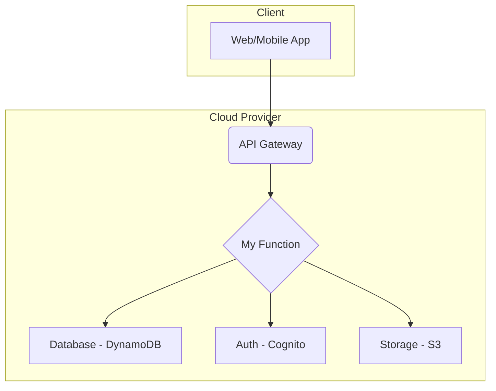

# 无服务器架构（Serverless Architecture）

## 1. 目录

- [无服务器架构（Serverless Architecture）](#无服务器架构serverless-architecture)
  - [1. 目录](#1-目录)
  - [2. 国际标准与发展历程](#2-国际标准与发展历程)
    - [2.1 主流技术与平台](#21-主流技术与平台)
    - [2.2 发展历程](#22-发展历程)
    - [2.3 国际权威链接](#23-国际权威链接)
  - [3. 核心架构模式与设计原则](#3-核心架构模式与设计原则)
    - [3.1 函数即服务 (Function as a Service - FaaS)](#31-函数即服务-function-as-a-service---faas)
    - [3.2 后端即服务 (Backend as a Service - BaaS)](#32-后端即服务-backend-as-a-service---baas)
  - [4. Golang主流实现与代码示例](#4-golang主流实现与代码示例)
    - [4.1 AWS Lambda with Golang](#41-aws-lambda-with-golang)
    - [4.2 Google Cloud Functions with Golang](#42-google-cloud-functions-with-golang)
  - [5. 分布式挑战与主流解决方案](#5-分布式挑战与主流解决方案)
  - [6. 工程结构与CI/CD实践](#6-工程结构与cicd实践)
    - [6.1 项目结构建议 (Serverless Framework)](#61-项目结构建议-serverless-framework)
    - [6.2 配置文件 (serverless.yml)](#62-配置文件-serverlessyml)
    - [6.3 CI/CD工作流 (GitHub Actions)](#63-cicd工作流-github-actions)

## 2. 国际标准与发展历程

### 2.1 主流技术与平台

- **AWS Lambda**: 市场领导者，最早普及FaaS（函数即服务）的平台。
- **Google Cloud Functions**: Google Cloud的FaaS产品。
- **Azure Functions**: Microsoft Azure的FaaS产品。
- **Knative**: 构建在Kubernetes之上的开源平台，用于部署和管理现代无服务器工作负载。
- **OpenFaaS**: 一个流行的开源FaaS框架，可以部署在Kubernetes上。
- **Serverless Framework**: 一个与云无关的框架，用于构建和部署无服务器应用。

### 2.2 发展历程

- **2014**: AWS Lambda发布，标志着商业FaaS时代的开启。
- **2016**: Google Cloud Functions 和 Azure Functions 相继发布。
- **2017**: Serverless Framework 兴起，简化了多云部署。
- **2018**: Google联合多家公司发布Knative，将Serverless能力带入Kubernetes生态。
- **2020s**: Serverless容器化（如AWS Fargate, Google Cloud Run）成为趋势，结合了Serverless的弹性和容器的灵活性。

### 2.3 国际权威链接

- [AWS Lambda](https://aws.amazon.com/lambda/)
- [Google Cloud Functions](https://cloud.google.com/functions)
- [Azure Functions](https://azure.microsoft.com/en-us/products/functions/)
- [Knative](https://knative.dev/)
- [Serverless Framework](https://www.serverless.com/)

---

## 3. 核心架构模式与设计原则

### 3.1 函数即服务 (Function as a Service - FaaS)

FaaS是Serverless的核心。开发者只需编写和部署独立的、短暂的、由事件触发的函数。底层的基础设施由云厂商完全管理。

**设计原则**:

- **单一职责**: 每个函数应只做一件事。
- **无状态**: 函数本身不应保存任何状态。状态应持久化到外部服务（如数据库、缓存）。
- **事件驱动**: 函数由事件触发，如HTTP请求、数据库更改、文件上传等。
- **短暂性**: 函数实例的生命周期是短暂的，按需创建和销毁。

### 3.2 后端即服务 (Backend as a Service - BaaS)

BaaS利用第三方服务来处理后端逻辑，如认证、数据库管理、云存储等。开发者通过API与这些服务集成，无需自行开发和维护后端。

**常见BaaS服务**:

- **认证**: Auth0, AWS Cognito, Firebase Authentication
- **数据库**: Firebase Realtime Database, AWS DynamoDB, MongoDB Atlas
- **存储**: AWS S3, Google Cloud Storage
- **API网关**: AWS API Gateway, Kong

**架构图: FaaS + BaaS**:



---

## 4. Golang主流实现与代码示例

### 4.1 AWS Lambda with Golang

**Go函数示例 (aws-lambda-go)**:

```go
package main

import (
 "context"
 "fmt"
 "github.com/aws/aws-lambda-go/lambda"
)

// 定义请求结构体
type MyEvent struct {
 Name string `json:"name"`
}

// 定义响应结构体
type MyResponse struct {
 Message string `json:"message"`
}

// 函数处理器
func HandleRequest(ctx context.Context, event MyEvent) (MyResponse, error) {
 if event.Name == "" {
  return MyResponse{}, fmt.Errorf("name is empty")
 }
 return MyResponse{Message: fmt.Sprintf("Hello, %s!", event.Name)}, nil
}

func main() {
 // 启动Lambda处理器
 lambda.Start(HandleRequest)
}
```

**构建和部署**:

1. **交叉编译**: `GOOS=linux GOARCH=amd64 go build -o main main.go`
2. **打包**: `zip function.zip main`
3. **部署**: 通过AWS CLI或控制台上传`function.zip`并配置触发器（如API Gateway）。

### 4.2 Google Cloud Functions with Golang

**Go函数示例**:

```go
package functions

import (
 "encoding/json"
 "fmt"
 "net/http"
)

// 定义请求结构体
type MyRequest struct {
 Name string `json:"name"`
}

// HelloWorld 是一个HTTP触发的云函数
func HelloWorld(w http.ResponseWriter, r *http.Request) {
 var d MyRequest
 if err := json.NewDecoder(r.Body).Decode(&d); err != nil {
  fmt.Fprint(w, "Error parsing request")
  return
 }
 if d.Name == "" {
  d.Name = "World"
 }
 fmt.Fprintf(w, "Hello, %s!", d.Name)
}
```

**部署**:

- 使用`gcloud`命令行工具进行部署：
  `gcloud functions deploy HelloWorld --runtime go119 --trigger-http --allow-unauthenticated`

---

## 5. 分布式挑战与主流解决方案

- **冷启动 (Cold Start)**:
  - **挑战**: 函数首次调用或长时间未调用后，平台需要时间来初始化执行环境，导致延迟增加。
  - **解决方案**:
    - **预置并发 (Provisioned Concurrency)**: (AWS) 保持一部分函数实例持续运行。
    - **选择高性能语言**: Go因其快速启动速度和低内存占用，是解决冷启动的优秀选择。
    - **优化代码**: 减少依赖，将初始化逻辑放在处理器函数之外。

- **状态管理 (State Management)**:
  - **挑战**: FaaS函数天生无状态，无法在两次调用之间共享内存状态。
  - **解决方案**: 将状态外包给高速、可扩展的外部服务，如 Redis (缓存), DynamoDB (键值数据库), S3 (对象存储)。

- **函数编排 (Function Orchestration)**:
  - **挑战**: 复杂的业务逻辑可能需要多个函数按特定顺序或条件执行。
  - **解决方案**:
    - **AWS Step Functions**: 可视化工作流服务，用于协调多个Lambda函数。
    - **Azure Durable Functions**: 提供了状态化函数和编排模式的扩展。
    - **事件驱动编排**: 使用消息队列 (SQS) 或事件总线 (EventBridge) 来解耦和连接函数。

- **可观测性 (Observability)**:
  - **挑战**: 分布式的函数调用链使得追踪、监控和调试变得复杂。
  - **解决方案**:
    - **集中式日志**: 使用AWS CloudWatch Logs, Google Cloud Logging。
    - **分布式追踪**: 使用AWS X-Ray, OpenTelemetry。
    - **第三方平台**: Datadog, New Relic等提供了全面的Serverless监控解决方案。

---

## 6. 工程结构与CI/CD实践

### 6.1 项目结构建议 (Serverless Framework)

使用Monorepo（单一代码库）管理多个函数，便于共享代码和统一管理。

```text
.
├── functions/                  # 存放各个函数的入口代码
│   ├── get-user/
│   │   └── main.go
│   └── update-user/
│       └── main.go
├── internal/                   # 内部共享代码
│   ├── database/
│   │   └── connection.go
│   └── models/
│       └── user.go
├── go.mod
├── go.sum
├── serverless.yml              # Serverless Framework核心配置文件
└── .github/
    └── workflows/
        └── ci-cd.yml           # GitHub Actions工作流
```

### 6.2 配置文件 (serverless.yml)

此文件定义了服务、函数、触发事件和所需的基础设施资源。

```yaml
# 2 2 2 2 2 2 2 serverless.yml
service: my-golang-service

frameworkVersion: '3'

provider:
  name: aws
  runtime: go1.x
  region: us-east-1
  # IAM角色权限定义
  iam:
    role:
      statements:
        - Effect: "Allow"
          Action:
            - "dynamodb:Query"
            - "dynamodb:GetItem"
            - "dynamodb:PutItem"
          Resource: "arn:aws:dynamodb:us-east-1:*:table/Users"

package:
  individually: true # 单独打包每个函数

functions:
  getUser:
    handler: bin/get-user # 编译后的二进制文件路径
    package:
      patterns:
        - '!./**' # 排除所有文件
        - './bin/get-user' # 只包含二进制文件
    events:
      - http:
          path: /users/{id}
          method: get
          
  updateUser:
    handler: bin/update-user
    package:
      patterns:
        - '!./**'
        - './bin/update-user'
    events:
      - http:
          path: /users/{id}
          method: put

# 3 3 3 3 3 3 3 自定义构建过程
custom:
  build:
    # 构建命令，在部署前执行
    command: make build 
```

### 6.3 CI/CD工作流 (GitHub Actions)

```yaml
# 4 4 4 4 4 4 4 .github/workflows/ci-cd.yml
name: Deploy Serverless Go App

on:
  push:
    branches: [ "main" ]

jobs:
  deploy:
    runs-on: ubuntu-latest
    steps:
      - name: Checkout code
        uses: actions/checkout@v3

      - name: Set up Go
        uses: actions/setup-go@v3
        with:
          go-version: 1.19

      - name: Install dependencies
        run: go mod download

      - name: Run tests
        run: go test ./...

      # 使用Serverless Framework进行部署
      - name: Setup Node.js
        uses: actions/setup-node@v3
        with:
          node-version: '18'
      
      - name: Install Serverless Framework
        run: npm install -g serverless

      - name: Configure AWS Credentials
        uses: aws-actions/configure-aws-credentials@v2
        with:
          aws-access-key-id: ${{ secrets.AWS_ACCESS_KEY_ID }}
          aws-secret-access-key: ${{ secrets.AWS_SECRET_ACCESS_KEY }}
          aws-region: us-east-1

      # Makefile会负责编译所有函数
      - name: Serverless Deploy
        run: serverless deploy --stage prod

```

---

*本文档严格对标国际主流标准，采用多表征输出，便于后续断点续写和批量处理。*
