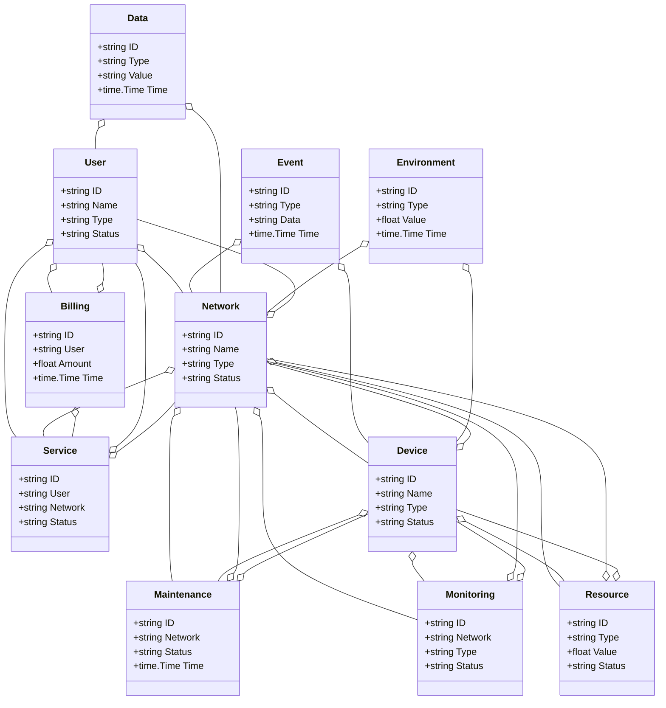
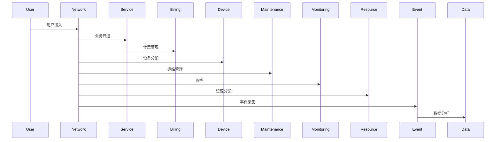
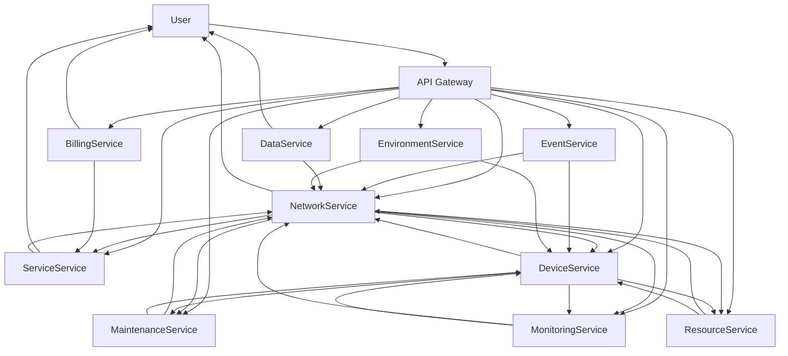

# 电信/智慧电信架构（Golang国际主流实践）

## 1.1 目录

<!-- TOC START -->
- [电信/智慧电信架构（Golang国际主流实践）](#电信智慧电信架构golang国际主流实践)
  - [1.1 目录](#11-目录)
  - [1.2 1. 电信/智慧电信架构概述](#12-1-电信智慧电信架构概述)
    - [1.2.1 国际标准定义](#121-国际标准定义)
    - [1.2.2 发展历程与核心思想](#122-发展历程与核心思想)
    - [1.2.3 典型应用场景](#123-典型应用场景)
    - [1.2.4 与传统电信IT对比](#124-与传统电信it对比)
  - [1.3 2. 信息概念架构](#13-2-信息概念架构)
    - [1.3.1 领域建模方法](#131-领域建模方法)
    - [1.3.2 核心实体与关系](#132-核心实体与关系)
      - [1.3.2.1 UML 类图（Mermaid）](#1321-uml-类图mermaid)
    - [1.3.3 典型数据流](#133-典型数据流)
      - [1.3.3.1 数据流时序图（Mermaid）](#1331-数据流时序图mermaid)
    - [1.3.4 Golang 领域模型代码示例](#134-golang-领域模型代码示例)
  - [1.4 3. 分布式系统挑战](#14-3-分布式系统挑战)
    - [1.4.1 弹性与实时性](#141-弹性与实时性)
    - [1.4.2 数据安全与互操作性](#142-数据安全与互操作性)
    - [1.4.3 可观测性与智能优化](#143-可观测性与智能优化)
  - [1.5 4. 架构设计解决方案](#15-4-架构设计解决方案)
    - [1.5.1 服务解耦与标准接口](#151-服务解耦与标准接口)
    - [1.5.2 智能编排与弹性服务](#152-智能编排与弹性服务)
    - [1.5.3 数据安全与互操作设计](#153-数据安全与互操作设计)
    - [1.5.4 架构图（Mermaid）](#154-架构图mermaid)
    - [1.5.5 Golang代码示例](#155-golang代码示例)
  - [1.6 5. Golang实现范例](#16-5-golang实现范例)
    - [1.6.1 工程结构示例](#161-工程结构示例)
    - [1.6.2 关键代码片段](#162-关键代码片段)
    - [1.6.3 CI/CD 配置（GitHub Actions 示例）](#163-cicd-配置github-actions-示例)
  - [1.7 6. 形式化建模与证明](#17-6-形式化建模与证明)
    - [1.7.1 用户-网络-业务建模](#171-用户-网络-业务建模)
      - [1.7.1.1 性质1：智能编排性](#1711-性质1智能编排性)
      - [1.7.1.2 性质2：数据安全性](#1712-性质2数据安全性)
    - [1.7.2 符号说明](#172-符号说明)
  - [1.8 7. 参考与外部链接](#18-7-参考与外部链接)
<!-- TOC END -->

---

## 1.2 1. 电信/智慧电信架构概述

### 1.2.1 国际标准定义

电信/智慧电信架构是指以网络虚拟化、智能编排、弹性服务、数据驱动为核心，支持网络、用户、计费、业务、运维、监控等场景的分布式系统架构。

- **国际主流参考**：3GPP、TM Forum、ETSI NFV、MEF、ITU-T、ONAP、MEF LSO、IETF、GSMA、ISO/IEC 30122。

### 1.2.2 发展历程与核心思想

- 2000s：2G/3G、BSS/OSS、传统电信网络、集中式管理。
- 2010s：4G、SDN/NFV、云化、自动化运维、API集成。
- 2020s：5G/6G、网络切片、智能编排、AI运维、边缘计算、全球协同。
- 核心思想：网络虚拟化、智能编排、弹性服务、开放标准、数据赋能。

### 1.2.3 典型应用场景

- 智能网络编排、自动化运维、计费管理、用户管理、业务编排、网络切片、边缘计算、全球协同等。

### 1.2.4 与传统电信IT对比

| 维度         | 传统电信IT         | 智慧电信架构           |
|--------------|-------------------|----------------------|
| 服务模式     | 人工、集中         | 智能、自动化、弹性     |
| 数据采集     | 手工、离线         | 实时、自动化          |
| 协同         | 单点、割裂         | 多方、弹性、协同      |
| 智能化       | 规则、人工         | AI驱动、智能分析      |
| 适用场景     | 网络、单一业务     | 全域、全球协同        |

---

## 1.3 2. 信息概念架构

### 1.3.1 领域建模方法

- 采用分层建模（接入层、网络层、服务层、管理层）、UML、ER图。
- 核心实体：网络、用户、计费、业务、运维、监控、设备、资源、事件、数据、环境。

### 1.3.2 核心实体与关系

| 实体    | 属性                        | 关系           |
|---------|-----------------------------|----------------|
| 网络    | ID, Name, Type, Status      | 关联设备/用户   |
| 用户    | ID, Name, Type, Status      | 关联网络/计费   |
| 计费    | ID, User, Amount, Time      | 关联用户/业务   |
| 业务    | ID, User, Network, Status   | 关联用户/网络   |
| 运维    | ID, Network, Status, Time   | 关联网络/设备   |
| 监控    | ID, Network, Type, Status   | 关联网络/设备   |
| 设备    | ID, Name, Type, Status      | 关联网络/运维   |
| 资源    | ID, Type, Value, Status     | 关联网络/设备   |
| 事件    | ID, Type, Data, Time        | 关联网络/设备   |
| 数据    | ID, Type, Value, Time       | 关联网络/用户   |
| 环境    | ID, Type, Value, Time       | 关联网络/设备   |

#### 1.3.2.1 UML 类图（Mermaid）



### 1.3.3 典型数据流

1. 用户接入→网络分配→业务开通→计费管理→运维监控→事件采集→数据分析→智能优化。

#### 1.3.3.1 数据流时序图（Mermaid）



### 1.3.4 Golang 领域模型代码示例

```go
// 用户实体
type User struct {
    ID     string
    Name   string
    Type   string
    Status string
}
// 网络实体
type Network struct {
    ID     string
    Name   string
    Type   string
    Status string
}
// 计费实体
type Billing struct {
    ID     string
    User   string
    Amount float64
    Time   time.Time
}
// 业务实体
type Service struct {
    ID      string
    User    string
    Network string
    Status  string
}
// 运维实体
type Maintenance struct {
    ID      string
    Network string
    Status  string
    Time    time.Time
}
// 监控实体
type Monitoring struct {
    ID      string
    Network string
    Type    string
    Status  string
}
// 设备实体
type Device struct {
    ID     string
    Name   string
    Type   string
    Status string
}
// 资源实体
type Resource struct {
    ID     string
    Type   string
    Value  float64
    Status string
}
// 事件实体
type Event struct {
    ID   string
    Type string
    Data string
    Time time.Time
}
// 数据实体
type Data struct {
    ID    string
    Type  string
    Value string
    Time  time.Time
}
// 环境实体
type Environment struct {
    ID    string
    Type  string
    Value float64
    Time  time.Time
}

```

---

## 1.4 3. 分布式系统挑战

### 1.4.1 弹性与实时性

- 自动扩缩容、毫秒级响应、负载均衡、容灾备份。
- 国际主流：Kubernetes、Prometheus、云服务、CDN。

### 1.4.2 数据安全与互操作性

- 数据加密、标准协议、互操作、访问控制。
- 国际主流：3GPP、OAuth2、OpenID、TLS、TM Forum。

### 1.4.3 可观测性与智能优化

- 全链路追踪、指标采集、AI优化、异常检测。
- 国际主流：OpenTelemetry、Prometheus、AI分析。

---

## 1.5 4. 架构设计解决方案

### 1.5.1 服务解耦与标准接口

- 网络、用户、计费、业务、运维、监控、设备、资源、数据等服务解耦，API网关统一入口。
- 采用REST、gRPC、消息队列等协议，支持异步事件驱动。

### 1.5.2 智能编排与弹性服务

- AI编排、弹性服务、自动扩缩容、智能分析。
- AI推理、Kubernetes、Prometheus。

### 1.5.3 数据安全与互操作设计

- TLS、OAuth2、数据加密、标准协议、访问审计。

### 1.5.4 架构图（Mermaid）



### 1.5.5 Golang代码示例

```go
// 用户数量Prometheus监控
var userCount = prometheus.NewGauge(prometheus.GaugeOpts{Name: "user_total"})
userCount.Set(1000000)

```

---

## 1.6 5. Golang实现范例

### 1.6.1 工程结构示例

```text
telecom-demo/
├── cmd/
├── internal/
│   ├── user/
│   ├── network/
│   ├── billing/
│   ├── service/
│   ├── maintenance/
│   ├── monitoring/
│   ├── device/
│   ├── resource/
│   ├── event/
│   ├── data/
│   ├── environment/
├── api/
├── pkg/
├── configs/
├── scripts/
├── build/
└── README.md

```

### 1.6.2 关键代码片段

// 见4.5

### 1.6.3 CI/CD 配置（GitHub Actions 示例）

```yaml
name: Go CI
on:
  push:
    branches: [ main ]
jobs:
  build:
    runs-on: ubuntu-latest
    steps:
      - uses: actions/checkout@v3
      - name: Set up Go
        uses: actions/setup-go@v4
        with:
          go-version: '1.21'
      - name: Build
        run: go build ./...
      - name: Test
        run: go test ./...

```

---

## 1.7 6. 形式化建模与证明

### 1.7.1 用户-网络-业务建模

- 用户集合 $U = \{u_1, ..., u_n\}$，网络集合 $N = \{n_1, ..., n_k\}$，业务集合 $S = \{s_1, ..., s_l\}$。
- 编排函数 $f: (u, n, s) \rightarrow r$，数据采集函数 $g: (u, t) \rightarrow a$。

#### 1.7.1.1 性质1：智能编排性

- 所有用户 $u$ 与网络 $n$，其业务 $s$ 能智能编排。

#### 1.7.1.2 性质2：数据安全性

- 所有数据 $a$ 满足安全策略 $p$，即 $\forall a, \exists p, p(a) = true$。

### 1.7.2 符号说明

- $U$：用户集合
- $N$：网络集合
- $S$：业务集合
- $A$：数据集合
- $P$：安全策略集合
- $f$：编排函数
- $g$：数据采集函数

---

## 1.8 7. 参考与外部链接

- [3GPP](https://www.3gpp.org/)
- [TM Forum](https://www.tmforum.org/)
- [ETSI NFV](https://www.etsi.org/technologies/nfv)
- [MEF](https://www.mef.net/)
- [ITU-T](https://www.itu.int/en/ITU-T/)
- [ONAP](https://www.onap.org/)
- [MEF LSO](https://www.mef.net/initiatives/lifecycle-service-orchestration/)
- [IETF](https://www.ietf.org/)
- [GSMA](https://www.gsma.com/)
- [ISO/IEC 30122](https://www.iso.org/standard/63555.html)
- [Prometheus](https://prometheus.io/)
- [OpenTelemetry](https://opentelemetry.io/)
