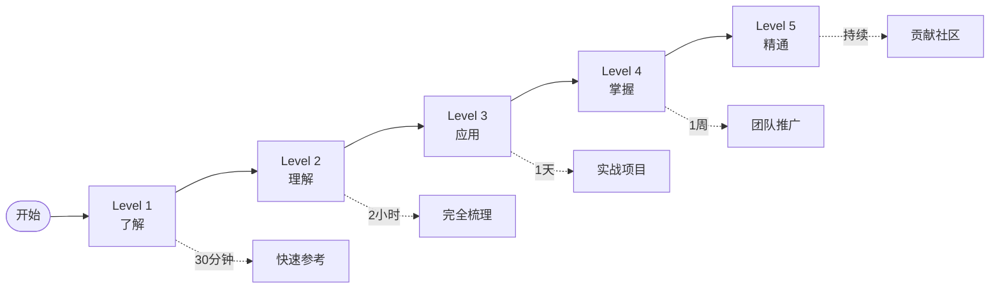

# Go 1.26 学习路径指南

> 从入门到精通的完整学习规划

---

## 学习路径总览



---

## Level 1: 了解（30分钟）

**目标**: 知道 Go 1.26 有什么新特性

### 学习材料

| 顺序 | 文档 | 时间 | 产出 |
|------|------|------|------|
| 1 | [快速参考卡片](./快速参考卡片.md) | 5分钟 | 知道6大特性 |
| 2 | [思维导图](./思维表征图表.md#1-整体知识结构) | 10分钟 | 建立知识框架 |
| 3 | [100-检查清单](./100-检查清单.md#8-检查清单) | 5分钟 | 了解覆盖度 |
| 4 | [FAQ前5题](./常见问题解答.md#-通用问题) | 10分钟 | 解决常见疑惑 |

### 验证标准

- [ ] 能说出至少3个新特性
- [ ] 知道 new(expr) 的用途
- [ ] 了解 GreenTeaGC 自动启用

---

## Level 2: 理解（2小时）

**目标**: 深入理解新特性的原理和使用方法

### 阶段 2.1: 语言特性（40分钟）

**学习**: [完全梳理 6.1节](./Go-1.26-完全梳理.md#61-语言变化2项)

| 内容 | 时间 | 重点 |
|------|------|------|
| new(expr) 概念定义 | 10分钟 | 语义等价性 |
| new(expr) 示例 | 10分钟 | 可选字段处理 |
| 递归泛型概念 | 10分钟 | 自引用约束 |
| 递归泛型示例 | 10分钟 | 树遍历实现 |

**练习**:

```go
// 练习1: 使用 new(expr) 改写代码
// 练习2: 理解递归泛型的约束条件
```

### 阶段 2.2: 运行时（30分钟）

**学习**: [完全梳理 6.2节](./Go-1.26-完全梳理.md#62-运行时改进3项)

| 内容 | 时间 | 重点 |
|------|------|------|
| GreenTeaGC 原理 | 10分钟 | 并发标记 |
| GC 监控代码 | 10分钟 | MemStats使用 |
| cgo优化说明 | 5分钟 | 性能提升 |
| 栈分配优化 | 5分钟 | 逃逸分析 |

**练习**:

```go
// 练习: 运行 GC 监控代码，观察指标
```

### 阶段 2.3: 标准库（30分钟）

**学习**: [完全梳理 6.3节](./Go-1.26-完全梳理.md#63-标准库新增9项)

| 内容 | 时间 | 重点 |
|------|------|------|
| HPKE 概念 | 10分钟 | 混合加密 |
| errors.AsType | 5分钟 | 泛型断言 |
| 其他改进 | 15分钟 | 快速浏览 |

### 阶段 2.4: 工具链（20分钟）

**学习**: [完全梳理 6.4节](./Go-1.26-完全梳理.md#64-工具链改进2项)

| 内容 | 时间 | 重点 |
|------|------|------|
| go fix Modernizers | 10分钟 | 11个modernizer |
| //go:fix inline | 10分钟 | API迁移 |

### 验证标准

- [ ] 能解释 new(expr) 的语义等价性
- [ ] 能写简单的递归泛型约束
- [ ] 能监控 GC 性能
- [ ] 能使用 go fix

---

## Level 3: 应用（1天）

**目标**: 在项目中实际应用 Go 1.26 新特性

### 阶段 3.1: 环境准备（1小时）

```bash
# 1. 升级到 Go 1.26
go mod edit -go=1.26
go mod tidy

# 2. 运行 go fix
go fix ./...

# 3. 运行测试
go test ./...
```

### 阶段 3.2: 实战项目（6小时）

根据你的项目类型选择：

#### 场景A: Web API 项目

**目标**: 使用 new(expr) 优化可选字段

```
学习: [实战示例 1.1](./实战示例集.md#示例-11-web-api-可选字段)
实践: 改写现有 API 的请求/响应结构
验证: 测试可选字段是否正确序列化
```

#### 场景B: 数据结构库

**目标**: 使用递归泛型实现通用树结构

```
学习: [实战示例 2.1](./实战示例集.md#示例-21-通用树遍历库)
实践: 实现项目中的树/图结构
验证: 通用遍历算法是否正常工作
```

#### 场景C: 安全通信

**目标**: 使用 HPKE 加密敏感数据

```
学习: [实战示例 4.1](./实战示例集.md#示例-41-安全消息传递)
实践: 为项目添加加密通信
验证: 加密/解密流程正确
```

#### 场景D: 代码现代化

**目标**: 使用 go fix 更新代码库

```
学习: [实战示例 5.1](./实战示例集.md#示例-51-项目现代化)
实践: 对整个项目运行 go fix
验证: 测试通过，行为不变
```

### 阶段 3.3: 文档记录（1小时）

- 记录应用的新特性
- 记录遇到的问题和解决方案
- 整理团队分享材料

### 验证标准

- [ ] 项目成功升级到 Go 1.26
- [ ] 至少应用一个新特性
- [ ] 所有测试通过
- [ ] 文档已记录

---

## Level 4: 掌握（1周）

**目标**: 在团队中推广 Go 1.26，解决复杂问题

### 第1天: 深入学习

- [完全梳理全文](./Go-1.26-完全梳理.md) - 复习所有细节
- [公理-定理树](./Go-1.26-完全梳理.md#三公理-定理树) - 理解理论基础
- [决策树](./思维表征图表.md#3-决策树) - 掌握选型方法

### 第2-3天: 复杂场景

- [综合项目示例](./实战示例集.md#6-综合项目示例) - 多特性结合
- 设计适合自己项目的架构
- 编写技术方案文档

### 第4-5天: 团队分享

- 准备分享 PPT/文档
- 组织团队学习会议
- 解答团队成员问题

### 第6-7天: 推广落地

- 制定团队升级计划
- 协助同事解决迁移问题
- 收集反馈，持续优化

### 验证标准

- [ ] 能独立解决复杂问题
- [ ] 能向他人清晰讲解
- [ ] 能制定团队推广方案
- [ ] 能处理迁移中的边界情况

---

## Level 5: 精通（持续）

**目标**: 成为 Go 1.26 专家，为社区做贡献

### 方向1: 深入研究

- 阅读 Go 1.26 源码实现
- 理解编译器对 new(expr) 的优化
- 研究 GreenTeaGC 的算法细节

### 方向2: 工具开发

- 开发自定义 Modernizer
- 创建团队代码规范工具
- 编写自动化迁移脚本

### 方向3: 知识分享

- 撰写技术博客
- 在社区回答问题
- 参与 Go 语言讨论

### 方向4: 贡献社区

- 提交文档改进 PR
- 报告和修复 Bug
- 参与新特性设计讨论

---

## 个性化学习路径

### 后端开发者路径

```
重点: new(expr), go fix, GreenTeaGC, errors.AsType
路径: Level 1 → Level 2 (6.1, 6.2, 6.4) → Level 3 场景A
时间: 1天
```

### 基础架构开发者路径

```
重点: 递归泛型, HPKE, SIMD
路径: Level 1 → Level 2 全文 → Level 3 场景B/C
时间: 2天
```

### 团队负责人路径

```
重点: 全部特性 + 团队推广
路径: Level 1-2 快速 → Level 4
时间: 1周
```

### 安全工程师路径

```
重点: HPKE, runtime/secret, crypto变更
路径: Level 1 → Level 2 (6.3.1, 6.3.3, 6.3.8)
时间: 2天
```

---

## 学习检查点

### 每日检查

- [ ] 今天学习的内容能复述出来
- [ ] 今天的代码练习能独立运行
- [ ] 今天的疑问已解决或记录

### 阶段检查

| 阶段 | 检查项 | 通过标准 |
|------|--------|----------|
| Level 1 | 知识点复述 | 能说出6个特性 |
| Level 2 | 代码理解 | 能解释示例代码 |
| Level 3 | 项目应用 | 特性成功应用 |
| Level 4 | 团队分享 | 同事理解并认可 |
| Level 5 | 社区贡献 | 有实际贡献记录 |

---

## 资源推荐

### 必读文档

1. [Go-1.26-完全梳理.md](./Go-1.26-完全梳理.md) - 系统学习
2. [实战示例集.md](./实战示例集.md) - 动手实践
3. [常见问题解答.md](./常见问题解答.md) - 问题排查

### 参考文档

- [快速参考卡片](./快速参考卡片.md) - 日常查阅
- [思维表征图表](./思维表征图表.md) - 可视化理解
- [官方 Release Notes](https://go.dev/doc/go1.26)

### 社区资源

- Go 官方论坛
- Go 语言中文网
- GitHub Go 仓库 Issues

---

## 学习建议

### DO ✅

- 动手实践每一个特性
- 记录学习笔记
- 与他人讨论交流
- 应用到实际项目

### DON'T ❌

- 只看不练
- 跳过基础直接深入
- 不与项目结合
- 不更新知识

---

## 完成认证

完成学习路径后，你将：

🎓 **理解** Go 1.26 所有新特性
💼 **应用** 新特性到实际项目
🚀 **推广** 到团队和组织
⭐ **成为** Go 1.26 专家

---

*选择适合你的学习路径，开始 Go 1.26 之旅！*
