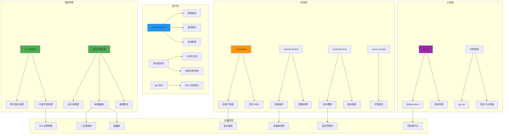

# Go 1.26 知识图谱



## 学习路径

```
初学者路径:
├── 1. 了解 new(expr) 语法
├── 2. 运行 go fix 现代化代码
└── 3. 使用 errors.AsType

进阶路径:
├── 1. 掌握递归泛型约束
├── 2. 应用 Green Tea GC 调优
├── 3. 使用 crypto/hpke
└── 4. 开发自定义 Modernizer

专家路径:
├── 1. 深入 SIMD 优化
├── 2. 使用 runtime/secret
├── 3. 理解 GC 内部机制
└── 4. 贡献 Go 语言
```

## 特性依赖关系

```
Go 1.26 特性依赖:

new(expr)
  └── 无依赖 (独立特性)

递归泛型约束
  └── 泛型基础 (Go 1.18+)

Green Tea GC
  └── 无依赖 (自动启用)

crypto/hpke
  └── crypto 包基础

simd/archsimd
  └── GOEXPERIMENT=simd
  └── amd64 架构

runtime/secret
  └── GOEXPERIMENT=runtimesecret
  └── Linux amd64/arm64

go fix Modernizers
  └── Go 分析框架
```
