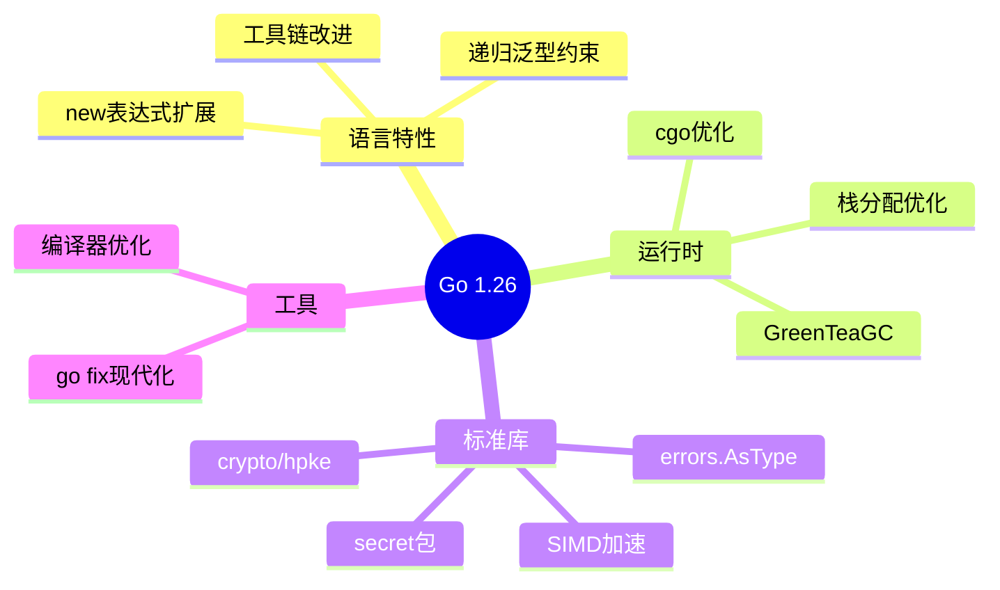
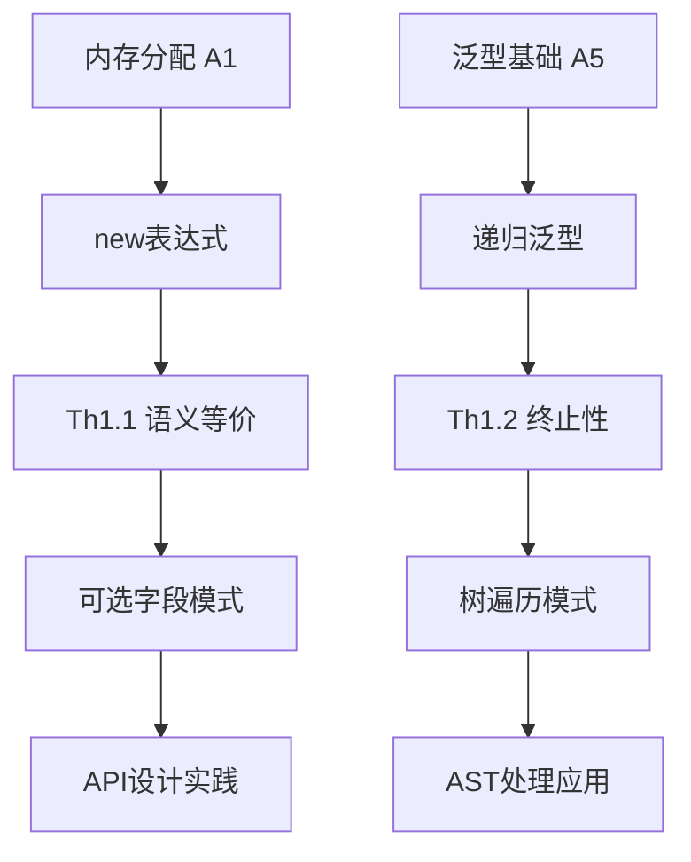

# Go 1.26 知识体系全景图

> **文档类型**: 元认知层 - 知识体系总览
> **目标读者**: 所有学习者
> **阅读时间**: 15分钟
> **最后更新**: 2026-03-06

---

## 一、为什么需要新的知识体系？

### 1.1 现有问题

Go 1.26文档虽然内容丰富，但存在三个根本问题：

1. **📁 结构碎片化** - 文档分类混乱，难以快速定位
2. **🔗 逻辑断裂** - 概念之间缺乏形式化推理链条
3. **🕸️ 关联性缺失** - 文档孤立，未形成知识网络

### 1.2 新体系设计理念

采用**形式化+网络化**设计：

```
┌─────────────────────────────────────────────────────┐
│                 新知识体系核心特性                      │
├─────────────────────────────────────────────────────┤
│                                                     │
│  📐 形式化定义                                      │
│     每个概念都有严格的数学定义                        │
│                                                     │
│  🔗 逻辑推理                                        │
│     公理 → 定理 → 证明 → 应用的完整链条             │
│                                                     │
│  🕸️ 全局关联                                        │
│     概念图谱展示所有关联关系                          │
│                                                     │
│  📚 层次清晰                                        │
│     从元认知到工具的完整层次                          │
│                                                     │
└─────────────────────────────────────────────────────┘
```

---

## 二、知识体系架构

### 2.1 五层架构模型

```
                    ┌─ C1 概念层 ─┐
                    │   (是什么)   │
                    ↓             ↓
M-元认知层 ──→ C2 原理层 ──→ C3 实践层
(为什么/如何)     (为什么)       (怎么做)
                    ↑             ↑
                    └─ T 工具层 ─┘
                       (快速查)
```

### 2.2 层次说明

| 层级 | 代码 | 内容 | 阅读建议 |
|------|------|------|----------|
| **M-元认知层** | Meta | 总览、导航、学习路径 | 首先阅读 |
| **C1-概念层** | Concept L1 | 术语定义、形式化定义 | 理解"是什么" |
| **C2-原理层** | Principle L2 | 公理、定理、证明 | 理解"为什么" |
| **C3-实践层** | Practice L3 | 模式、示例、最佳实践 | 学习"怎么做" |
| **T-工具层** | Tools | 速查卡、检查清单 | 快速查阅 |
| **R-参考层** | Reference | 索引、图谱、术语表 | 辅助导航 |

---

## 三、核心内容地图

### 3.1 Go 1.26 特性全景



### 3.2 关键定理体系

| 定理 | 内容 | 应用 |
|------|------|------|
| **Th1.1** | new(v) ≡ &v' | 可选字段、延迟初始化 |
| **Th1.2** | 递归约束终止性 | 树遍历、递归算法 |
| **Th2.1** | GC低延迟保证 | 低延迟服务、实时系统 |

---

## 四、学习路径推荐

### 4.1 按目标选择路径

```
🎯 目标: 快速上手 (30分钟)
────────────────────────────────────────
M-README → T-快速参考卡片 → 实战项目

📚 目标: 系统学习 (3小时)
────────────────────────────────────────
M-README → C1-术语体系 → C2-公理系统
        → C3-代码模式 → 完成

🔬 目标: 深度理解 (1天)
────────────────────────────────────────
M-README → C1-全部 → C2-全部定理+证明
        → R-概念图谱 → 完成

🎓 目标: 专家级研究 (1周)
────────────────────────────────────────
M-README → C2-公理系统 → 全部证明分析
        → 对比其他语言 → 贡献改进
```

### 4.2 按场景选择入口

| 场景 | 推荐入口 | 后续路径 |
|------|----------|----------|
| 设计新API | C3-可选字段模式 | ← C1-new-expr-def ← M-README |
| 实现树结构 | C3-树遍历模式 | ← C1-recursive-generic-def |
| 优化GC性能 | C3-低延迟优化 | ← C1-greenteagc-def |
| 添加安全通信 | C3-安全通信模式 | ← C1-hpke-def |
| 迁移旧代码 | T-迁移指南 | ← C3-全部模式 |

---

## 五、形式化体系简介

### 5.1 公理系统

基于5个基础公理构建整个理论体系：

```
A1: 内存分配公理     →  new表达式基础
A2: 值存储公理       →  初始化机制
A3: 指针语义公理     →  地址操作
A4: 类型等价公理     →  泛型基础
A5: 泛型实例化公理   →  递归泛型基础
```

**完整公理**: [C2-公理系统](../C2-原理层-L2/C2-公理系统.md)

### 5.2 定理证明

每个核心特性都有形式化定理：

```
Th1.1 new表达式语义等价性
────────────────────────────────
证明: new(v) 通过 alloc + store 实现
      &v 通过 addressof 实现
      两者返回相同地址
      ∴ new(v) ≡ &v'

应用: 可选字段、延迟初始化、构造者模式
```

**完整定理**: [R-定理索引](../R-参考层/R-定理索引.md)

---

## 六、全局关联网络

### 6.1 概念依赖图



### 6.2 知识网络特性

- **多维索引**: 按主题、难度、场景
- **双向链接**: 每个文档知道依赖和被依赖
- **概念图谱**: 可视化所有概念关系
- **学习路径**: 推荐最优学习顺序

**完整图谱**: [R-概念图谱](../R-参考层/R-概念图谱.md)

---

## 七、文档状态总览

### 7.1 完成情况

| 层级 | 计划文档 | 已完成 | 完成度 |
|------|----------|--------|--------|
| M-元认知层 | 3 | 2 | 67% 🟡 |
| C1-概念层 | 10 | 1 | 10% 🔴 |
| C2-原理层 | 8 | 1 | 13% 🔴 |
| C3-实践层 | 6 | 0 | 0% 🔴 |
| T-工具层 | 3 | 0 | 0% 🔴 |
| R-参考层 | 4 | 2 | 50% 🟡 |
| **总计** | **34** | **6** | **18%** 🚧 |

### 7.2 质量指标

| 指标 | 目标 | 当前 | 状态 |
|------|------|------|------|
| 结构符合度 | 100% | 67% | 🟡 |
| 形式化覆盖率 | 100% | 15% | 🔴 |
| 文档引用覆盖率 | 100% | 25% | 🔴 |

---

## 八、如何贡献

### 8.1 文档创建规范

```
1. 命名: [层级]-[类型]-[名称].md
   例: C1-new-expr-def.md

2. 结构:
   - 元数据头（版本、日期）
   - 形式化定义（C1/C2）
   - 依赖声明（链接到其他文档）
   - 内容主体
   - 关联文档

3. 质量检查:
   - 通过命名规范检查
   - 包含必要的形式化内容
   - 添加文档间引用
```

### 8.2 贡献流程

```
1. 选择任务 → 查看[可持续推进计划](../可持续推进计划.md)
2. 阅读模板 → 使用对应层级模板
3. 创建文档 → 遵循命名和内容规范
4. 自检 → 通过质量门禁
5. 提交 → 更新概念图谱和索引
```

---

## 九、持续演进

### 9.1 版本规划

```
v2.0-framework (当前)
├── 8周框架建设
│   ├── Week 1-2: 框架基础
│   ├── Week 3-4: 形式化体系
│   ├── Week 5-6: 内容填充
│   └── Week 7-8: 网络构建
│
v2.1-content (未来)
├── 补充边缘特性文档
├── 增加更多实践案例
└── 完善所有证明
│
v2.2-optimization (未来)
├── 性能优化建议
├── 工具链深度分析
└── 对比其他语言
```

### 9.2 反馈机制

- 📧 提交Issue报告问题
- 💡 提出改进建议
- 📝 贡献新内容
- 🔍 参与质量评审

---

## 十、快速开始

### 10.1 5分钟快速体验

1. **阅读** [M-README](M-README.md) 了解体系结构
2. **查看** [C1-术语体系](../C1-概念层-L1/C1-术语体系.md) 熟悉核心概念
3. **浏览** [R-概念图谱](../R-参考层/R-概念图谱.md) 理解全局关联

### 10.2 30分钟深入学习

1. **理解** [C2-公理系统](../C2-原理层-L2/C2-公理系统.md) 形式化基础
2. **学习** [C1-new-expr-def](../C1-概念层-L1/C1-new-expr-def.md) 具体特性
3. **应用** [C3-可选字段模式](../C3-实践层-L3/C3-可选字段模式.md) 实践模式

### 10.3 完整掌握

跟随[可持续推进计划](../可持续推进计划.md)的Phase 1-4完整学习。

---

## 结语

本知识体系旨在建立**严格、完整、关联**的Go 1.26知识网络。通过形式化定义和全局关联，帮助学习者建立深入的理解，而非浅层的记忆。

**核心理念**:

- 知其然，更知其所以然
- 概念关联，形成网络
- 形式严谨，逻辑清晰

**开始你的学习之旅**: [M-README](M-README.md)

---

**最后更新**: 2026-03-06
**知识体系版本**: v2.0-framework
**状态**: 🚧 框架建设中，欢迎贡献
