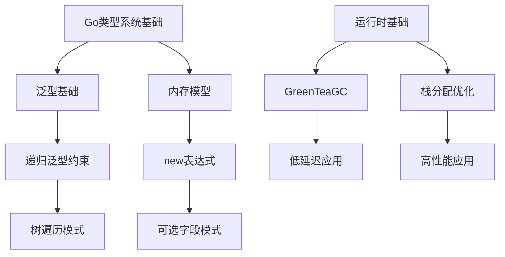

# Go 1.26 知识体系总览

> **文档类型**: 元认知层 (Meta)
> **版本**: Go 1.26 (2026年2月发布)
> **知识体系版本**: v2.0-framework
> **最后更新**: 2026-03-06

---

## 一、如何学习本知识体系

### 1.1 学习路径推荐

```
路径A: 快速了解 (30分钟)
────────────────────────────────────────
M-README → T-快速参考卡片 → 完成

路径B: 系统学习 (3小时)
────────────────────────────────────────
M-README → C1-术语体系 → C2-公理系统 → C3-代码模式 → 完成

路径C: 深度掌握 (1天)
────────────────────────────────────────
M-README → C1-术语体系 → C2-公理系统 → C2-形式语义
         → C3-代码模式 → R-概念图谱 → 完成

路径D: 专家级研究 (1周)
────────────────────────────────────────
M-README → C1-全部定义 → C2-全部定理+证明
         → C3-全部模式 → R-全部参考 → 完成
```

### 1.2 文档阅读指南

**文档命名含义**:

| 前缀 | 层级 | 内容类型 | 阅读建议 |
|------|------|----------|----------|
| M- | 元认知层 | 导航、总览 | 首先阅读 |
| C1- | 概念层L1 | 定义、术语 | 理解"是什么" |
| C2- | 原理层L2 | 公理、定理 | 理解"为什么" |
| C3- | 实践层L3 | 示例、模式 | 学习"怎么做" |
| T- | 工具层 | 参考、清单 | 快速查阅 |
| R- | 参考层 | 索引、图谱 | 辅助导航 |

**文档内标识**:

```markdown
🎯 关键概念 - 必须掌握的核心内容
📐 形式化定义 - 严格的数学定义
🔗 依赖 - 需要先理解的前置内容
💡 直观理解 - 帮助理解的解释
⚠️ 注意事项 - 常见的误区
```

---

## 二、知识体系架构

### 2.1 层次结构

```
                    ┌─ C1-概念层 ─┐
                    ↓             ↓
M-元认知层 ──→ C2-原理层 ──→ C3-实践层
                    ↑             ↑
                    └─ T-工具层 ─┘
```

### 2.2 知识模块

| 模块 | 核心概念 | 关键定理 | 应用场景 |
|------|----------|----------|----------|
| new表达式 | new(T{v}) | Th1.1 语义等价 | 可选字段、延迟初始化 |
| 递归泛型 | T C[T] | Th1.2 终止性 | 树结构、递归算法 |
| GreenTeaGC | 并发标记 | Th2.1 低延迟 | 低延迟应用 |
| HPKE | 混合加密 | Th3.1 安全性 | 安全通信 |
| SIMD加速 | 向量化指令 | Th4.1 性能 | 高性能计算 |

---

## 三、全局关联概览

### 3.1 概念依赖图



### 3.2 文档关联图

```
M-README
    ├── C1-术语体系 ◄───┐
    │       │          │
    │       ▼          │
    ├── C2-公理系统 ◄──┼── 概念定义到原理的依赖
    │       │          │
    │       ▼          │
    ├── C3-代码模式 ◄──┘
    │
    ├── T-快速参考
    │
    └── R-概念图谱
```

---

## 四、形式化体系简介

### 4.1 公理系统

**基础公理** (A1-A5):

- A1: 内存分配公理
- A2: 值存储公理
- A3: 指针语义公理
- A4: 类型等价公理
- A5: 泛型实例化公理

[→ 查看完整公理系统](../C2-原理层-L2/C2-公理系统.md)

### 4.2 定理体系

**核心定理**:

- **Th1.1** new表达式语义等价: `new(T(v)) ≡ &T(v)`
- **Th1.2** 递归泛型终止性: `terminates(unfold(C[T]))`
- **Th2.1** GC低延迟保证: `GC-Pause < 1ms (p99)`
- **Th3.1** HPKE安全性: 满足标准RFC 9180

[→ 查看完整定理索引](../R-参考层/R-定理索引.md)

### 4.3 推理规则

```
[new-expr]
────────────────────────────────
Γ ⊢ v : T    T is value type
────────────────────────────────
Γ ⊢ new(v) : *T

[recursive-constraint]
────────────────────────────────
Γ ⊢ T satisfies C[T]    T implements C
────────────────────────────────
Γ ⊢ Adder[T] valid
```

---

## 五、快速导航

### 5.1 按主题导航

| 主题 | 入口文档 |
|------|----------|
| new表达式 | [C1-new-expr-def](../C1-概念层-L1/C1-new-expr-def.md) |
| 递归泛型 | [C1-recursive-generic-def](../C1-概念层-L1/C1-recursive-generic-def.md) |
| 垃圾回收 | [C1-greenteagc-def](../C1-概念层-L1/C1-greenteagc-def.md) |
| 加密安全 | [C1-hpke-def](../C1-概念层-L1/C1-hpke-def.md) |
| 性能优化 | [C3-性能优化模式](../C3-实践层-L3/C3-性能优化模式.md) |

### 5.2 按场景导航

| 场景 | 推荐路径 |
|------|----------|
| 设计API兼容层 | C1-new-expr-def → C3-可选字段模式 |
| 实现树遍历 | C1-recursive-generic-def → C3-树遍历模式 |
| 构建低延迟服务 | C1-greenteagc-def → C3-低延迟优化 |
| 添加安全通信 | C1-hpke-def → C3-加密通信模式 |
| 优化数值计算 | C1-simd-def → C3-向量化模式 |

### 5.3 按难度导航

| 难度 | 目标读者 | 推荐文档 |
|------|----------|----------|
| ⭐ 入门 | Go初学者 | M-README, C1-术语体系, T-快速参考 |
| ⭐⭐ 中级 | Go开发者 | C1-全部, C3-全部 |
| ⭐⭐⭐ 高级 | 资深开发者 | C2-公理系统, C2-形式语义 |
| ⭐⭐⭐⭐ 专家 | 语言设计者 | C2-全部定理+证明, R-概念图谱 |

---

## 六、文档状态

### 6.1 完成情况

| 层级 | 文档数 | 完成度 | 状态 |
|------|--------|--------|------|
| M-元认知层 | 1/3 | 33% | 🚧 进行中 |
| C1-概念层 | 0/10 | 0% | 📋 计划中 |
| C2-原理层 | 0/8 | 0% | 📋 计划中 |
| C3-实践层 | 0/6 | 0% | 📋 计划中 |
| T-工具层 | 0/3 | 0% | 📋 计划中 |
| R-参考层 | 0/4 | 0% | 📋 计划中 |
| **总计** | **1/34** | **3%** | 🚧 **进行中** |

### 6.2 质量指标

| 指标 | 目标 | 当前 | 状态 |
|------|------|------|------|
| 结构符合度 | 100% | 33% | 🟡 |
| 形式化覆盖率 | 100% | 0% | 🔴 |
| 文档引用覆盖率 | 100% | 50% | 🟡 |

---

## 七、参与贡献

### 7.1 文档创建规范

创建新文档时必须遵守:

1. **命名规范**: `[层级]-[类型]-[名称].md`
2. **模板使用**: 使用对应层级的文档模板
3. **关联声明**: 必须声明依赖和扩展的文档
4. **质量检查**: 通过框架符合性检查清单

[→ 查看完整贡献指南](../A-附录/A-贡献指南.md)

### 7.2 框架演进

本框架将持续演进:

- 跟随 Go 版本更新
- 根据反馈优化结构
- 补充缺失的形式化证明

---

## 八、结语

本知识体系采用**形式化+网络化**的设计思想，旨在建立严格的逻辑体系和完整的关联网络。

**核心设计原则**:

1. **层次清晰** - 从元认知到实践的完整层次
2. **形式严格** - 基于公理的形式化定义和证明
3. **全局关联** - 概念、定理、文档之间的完整网络

**建议**: 根据你的学习目标和当前水平，选择合适的学习路径开始探索。

---

**最后更新**: 2026-03-06
**框架版本**: v2.0-framework
**维护状态**: 🚧 框架重构中
