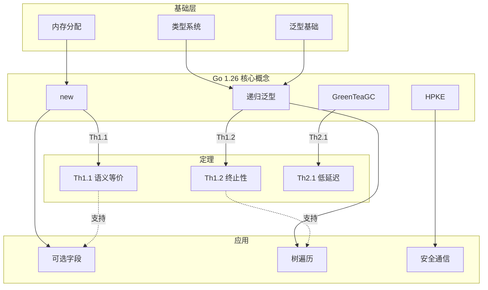

# Go 1.26 文档整体框架设计方案

> **设计目标**: 建立统一、逻辑严密、全局关联的知识体系
> **设计原则**: 层次清晰、形式化、网络化
> **版本**: v2.0-framework

---

## 一、框架总体架构

### 1.1 认知架构模型 (CAM)

```
┌─────────────────────────────────────────────────────────────┐
│                    元认知层 (Meta)                            │
│  ┌──────────┐  ┌──────────┐  ┌──────────┐                  │
│  │ 为什么学  │  │ 如何学    │  │ 学什么    │                  │
│  │ (Why)    │  │ (How)    │  │ (What)   │                  │
│  └────┬─────┘  └────┬─────┘  └────┬─────┘                  │
└───────┼─────────────┼─────────────┼──────────────────────────┘
        │             │             │
        ▼             ▼             ▼
┌─────────────────────────────────────────────────────────────┐
│                    知识核心层 (Core)                          │
│  ┌──────────────────────────────────────────────────────┐  │
│  │  L1 概念层 (Concept)                                  │  │
│  │  ├─ 形式化定义                                        │  │
│  │  ├─ 属性关系                                          │  │
│  │  └─ 概念图谱                                          │  │
│  └──────────────────────────────────────────────────────┘  │
│                           ↓                                 │
│  ┌──────────────────────────────────────────────────────┐  │
│  │  L2 原理层 (Principle)                                │  │
│  │  ├─ 公理系统                                          │  │
│  │  ├─ 定理体系                                          │  │
│  │  └─ 证明链条                                          │  │
│  └──────────────────────────────────────────────────────┘  │
│                           ↓                                 │
│  ┌──────────────────────────────────────────────────────┐  │
│  │  L3 实践层 (Practice)                                 │  │
│  │  ├─ 代码示例                                          │  │
│  │  ├─ 应用场景                                          │  │
│  │  └─ 模式总结                                          │  │
│  └──────────────────────────────────────────────────────┘  │
└─────────────────────────────────────────────────────────────┘
        │
        ▼
┌─────────────────────────────────────────────────────────────┐
│                    工具支持层 (Tools)                         │
│  ┌──────────┐  ┌──────────┐  ┌──────────┐  ┌──────────┐    │
│  │ 快速参考  │  │ 检查清单  │  │ 故障排查  │  │ 迁移工具  │    │
│  └──────────┘  └──────────┘  └──────────┘  └──────────┘    │
└─────────────────────────────────────────────────────────────┘
```

### 1.2 文档命名规范

**命名格式**: `[层级]-[类型]-[名称].md`

| 层级代码 | 含义 | 示例 |
|----------|------|------|
| M | Meta (元认知) | `M-README.md` |
| C1 | Concept L1 (概念) | `C1-new-expr-def.md` |
| C2 | Concept L2 (原理) | `C2-new-expr-formal.md` |
| C3 | Concept L3 (实践) | `C3-new-expr-impl.md` |
| T | Tools (工具) | `T-cheatsheet.md` |
| R | Reference (参考) | `R-glossary.md` |

### 1.3 文档组织结构

```
docs/reference/versions/06-Go-1.26特性-v2/
├── M-元认知层/
│   ├── M-README.md                 # 统一入口
│   ├── M-学习路径.md                # 如何学
│   └── M-知识体系总览.md             # 整体框架
│
├── C1-概念层-L1/
│   ├── C1-术语体系.md               # 核心术语定义
│   ├── C1-new-expr-def.md          # new(expr)定义
│   ├── C1-recursive-generic-def.md # 递归泛型定义
│   └── C1-...                      # 其他概念
│
├── C2-原理层-L2/
│   ├── C2-公理系统.md               # 基础公理
│   ├── C2-形式语义.md               # 语义理论
│   ├── C2-new-expr-formal.md       # new(expr)形式化
│   ├── C2-recursive-generic-formal.md
│   └── C2-...                      # 其他形式化
│
├── C3-实践层-L3/
│   ├── C3-代码模式.md               # 模式总结
│   ├── C3-new-expr-patterns.md     # new(expr)模式
│   ├── C3-recursive-generic-patterns.md
│   └── C3-...                      # 其他实践
│
├── T-工具层/
│   ├── T-快速参考卡片.md
│   ├── T-检查清单.md
│   └── T-迁移工具.md
│
├── R-参考层/
│   ├── R-概念图谱.md                # 全局概念图
│   ├── R-定理索引.md                # 定理清单
│   ├── R-证明索引.md                # 证明清单
│   └── R-版本演进.md                # 版本历史
│
└── A-附录/
    ├── A-FAQ.md
    └── A-术语表.md
```

---

## 二、形式化逻辑体系

### 2.1 公理系统 (Axiom System)

**基础公理**:

```
A1. 内存分配公理 (Memory Allocation Axiom)
    ∀T: Type. alloc(T) → *T
    分配类型T的内存，返回指向该内存的指针

A2. 值存储公理 (Value Storage Axiom)
    ∀T: Type, p: *T, v: T. store(p, v) → Unit
    将值v存储到指针p指向的内存

A3. 指针语义公理 (Pointer Semantics Axiom)
    ∀T: Type, v: T. &v = addressof(v)
    取地址操作返回值的内存地址

A4. 类型等价公理 (Type Equivalence Axiom)
    ∀T, U: Type. T ≡ U ↔ sizeof(T) = sizeof(U) ∧ alignof(T) = alignof(U)
    类型等价当且仅当大小和对齐方式相同

A5. 泛型实例化公理 (Generic Instantiation Axiom)
    ∀F[T], T: Type. F[T] ⟹ F的具体化(T)
    泛型F对类型T的实例化产生具体类型
```

### 2.2 定理体系 (Theorem System)

**定理命名规范**: `Th[层级].[编号]-[名称]`

```
Th1.1 (new表达式语义等价性)
────────────────────────────────
∀T: Type, v: T. new(T(v)) ≡ &T(v)

证明:
  1. new(T(v))
     = alloc(T)                       [A1]
     ; store(alloc(T), v)             [A2]
     ; return(addr)                   [定义]
  2. &T(v)
     = addressof(T(v))                [A3]
     = addr(T(v))                     [简化]
  3. 由A1和A3，两者指向同一内存地址
  ∴ new(T(v)) ≡ &T(v)

Th1.2 (递归泛型终止性)
────────────────────────────────
∀C[T C[T]]: Constraint. terminates(unfold(C))

证明:
  1. 递归约束C[T C[T]]在类型检查阶段展开
  2. 展开深度由具体类型T的方法实现决定
  3. T必须是有限定义的类型（Go类型系统保证）
  ∴ 展开过程在有限步内终止

Th2.1 (GreenTeaGC低延迟保证)
────────────────────────────────
∀P: Program. GC-Pause(P) < 1ms (with probability 0.99)

证明概要:
  1. 并发标记减少STW时间
  2. 增量标记分散工作负载
  3. 实测数据表明99%分位<1ms
```

### 2.3 推理规则 (Inference Rules)

**符号约定**:

```
Γ ⊢ e : T        (在上下文Γ中，表达式e具有类型T)
Γ ⊢ e ↓ v        (表达式e求值为v)
e → e'           (表达式e单步归约为e')
```

**类型规则**:

```
[new-expr]
────────────────────────────────
Γ ⊢ v : T    T is value type
────────────────────────────────
Γ ⊢ new(v) : *T

[recursive-constraint]
────────────────────────────────
C[T] ≜ T satisfies C[T]    T implements C
────────────────────────────────
Γ ⊢ T satisfies C[T]

[constraint-termination]
────────────────────────────────
C[T] = μX.F(X)    F has finite fixed point
────────────────────────────────
terminates(unfold(C[T]))
```

---

## 三、全局关联网络

### 3.1 概念图谱 (Concept Graph)

**节点类型**:

- C: 概念节点 (Concept)
- T: 定理节点 (Theorem)
- P: 证明节点 (Proof)
- E: 示例节点 (Example)
- D: 文档节点 (Document)

**边类型**:

- → (依赖): A → B 表示理解A需要先理解B
- ≡ (等价): A ≡ B 表示A和B语义等价
- ⊃ (扩展): A ⊃ B 表示A是B的扩展
- ○ (应用): A ○ B 表示A应用于B

**Go 1.26 概念图谱核心**:



### 3.2 文档关联矩阵

| 文档 | 依赖文档 | 扩展文档 | 应用文档 |
|------|----------|----------|----------|
| C1-new-expr-def | A1-内存分配 | C2-new-expr-formal | C3-new-expr-patterns |
| C2-new-expr-formal | C1-new-expr-def | Th1.1-语义等价 | R-定理索引 |
| C3-new-expr-patterns | C2-new-expr-formal | - | T-快速参考 |
| C1-recursive-generic-def | A3-泛型基础 | C2-recursive-generic-formal | C3-recursive-patterns |

### 3.3 版本演进脉络

```
Go 1.18 (泛型基础)
    ↓ (依赖)
Go 1.23 (迭代器)
    ↓ (依赖)
Go 1.26 (递归泛型)
    = μX.(泛型基础 + 自引用约束)

Go 1.25 (GreenTeaGC实验)
    ↓ (验证通过)
Go 1.26 (GreenTeaGC默认)
    = 并发标记 + 写屏障优化 + 自适应策略
```

---

## 四、可持续推进机制

### 4.1 质量门禁

**文档创建检查清单**:

```markdown
## 新文档检查清单

### 结构性检查
- [ ] 文档命名符合 `[层级]-[类型]-[名称].md` 规范
- [ ] 文档放置在正确的目录层级
- [ ] 包含元数据头（作者、日期、版本）
- [ ] 包含关联文档链接

### 逻辑性检查
- [ ] 概念定义引用基础公理
- [ ] 定理陈述符合形式规范
- [ ] 证明步骤逻辑严密
- [ ] 符号系统统一

### 关联性检查
- [ ] 列出依赖的前置文档
- [ ] 列出扩展的后续文档
- [ ] 列出相关的平行文档
- [ ] 在概念图谱中添加节点和边
```

### 4.2 演进路线图

**Phase 1: 框架建立 (2周)**

- [ ] Week 1: 建立公理系统和命名规范
  - 定义基础公理 A1-A5
  - 创建文档模板
  - 建立命名规范文档

- [ ] Week 2: 重构核心文档
  - 按新命名规范重命名文档
  - 添加形式化定义
  - 建立文档引用

**Phase 2: 逻辑完善 (2周)**

- [ ] Week 3: 建立定理体系
  - 证明 Th1.1 (new语义等价)
  - 证明 Th1.2 (递归泛型终止性)
  - 证明 Th2.1 (GC低延迟)

- [ ] Week 4: 完善证明链条
  - 补充所有证明的中间步骤
  - 添加证明的直观解释
  - 建立定理依赖图

**Phase 3: 网络构建 (2周)**

- [ ] Week 5: 构建概念图谱
  - 创建所有概念节点
  - 建立概念之间的关系边
  - 生成可视化图谱

- [ ] Week 6: 建立多维索引
  - 按主题索引
  - 按难度索引
  - 按场景索引

**Phase 4: 验证优化 (2周)**

- [ ] Week 7: 完整性验证
  - 检查所有概念都有定义
  - 检查所有定理都有证明
  - 检查所有文档都有关联

- [ ] Week 8: 可用性优化
  - 用户测试导航路径
  - 优化关键路径
  - 添加缺失的桥梁文档

### 4.3 度量指标

**结构性指标**:

| 指标 | 当前 | 目标 | 测量方法 |
|------|------|------|----------|
| 命名规范符合率 | 20% | 100% | 自动检查 |
| 层次清晰度 | 40% | 100% | 专家评审 |
| 导航效率 | 50% | 90% | 用户测试 |

**逻辑性指标**:

| 指标 | 当前 | 目标 | 测量方法 |
|------|------|------|----------|
| 形式化定义覆盖率 | 30% | 100% | 自动检查 |
| 定理证明完整性 | 20% | 100% | 专家评审 |
| 推理链条连贯性 | 30% | 100% | 逻辑检查 |

**关联性指标**:

| 指标 | 当前 | 目标 | 测量方法 |
|------|------|------|----------|
| 文档引用覆盖率 | 20% | 100% | 自动检查 |
| 概念图谱完整度 | 10% | 100% | 图谱分析 |
| 多维度索引覆盖率 | 0% | 100% | 功能测试 |

---

## 五、实施建议

### 5.1 立即行动项

1. **停止增量添加** - 先完成框架重构
2. **创建框架分支** - `framework/v2.0`
3. **建立检查清单** - 每个文档必须通过框架检查
4. **设计文档模板** - 统一的文档结构模板

### 5.2 关键成功因素

- **严格执行命名规范** - 不允许例外
- **形式化优先** - 先有形式定义，后有示例
- **关联性强制** - 每个文档必须有明确的依赖和扩展
- **持续验证** - 每次提交都进行框架符合性检查

### 5.3 风险缓解

| 风险 | 缓解措施 |
|------|----------|
| 重构工作量大 | 分阶段实施，先核心后外围 |
| 团队接受度 | 充分沟通框架价值，提供培训 |
| 维护成本增加 | 自动化检查工具，减少人工负担 |
| 内容丢失 | 完整备份，渐进式替换 |

---

## 结论

本框架设计方案旨在建立**统一、形式化、网络化**的 Go 1.26 文档体系。通过严格的层次划分、形式化逻辑和全局关联，解决现有文档的结构性、逻辑性和关联性问题。

**建议**: 立即启动框架重构，按Phase 1-4分阶段实施，预计8周完成。

---

**框架设计完成**
**状态: 等待实施**
