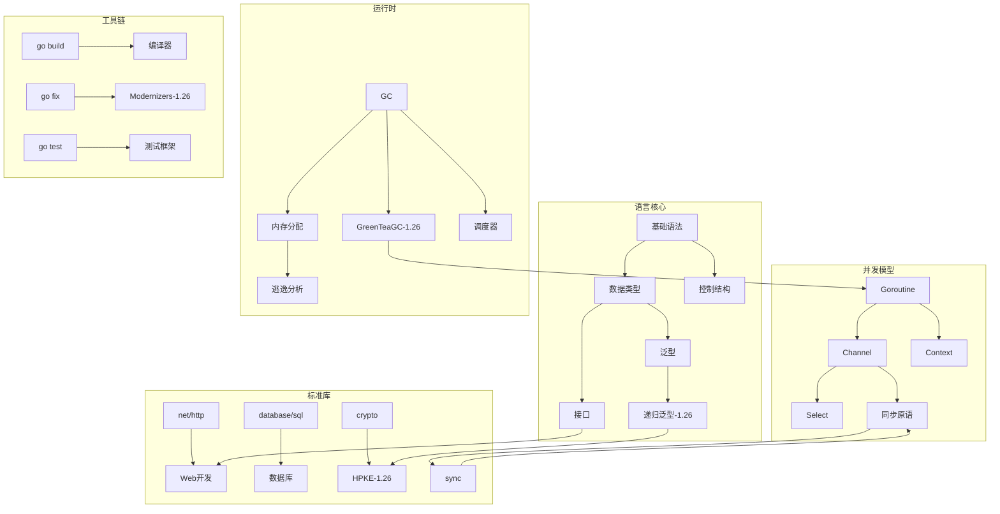
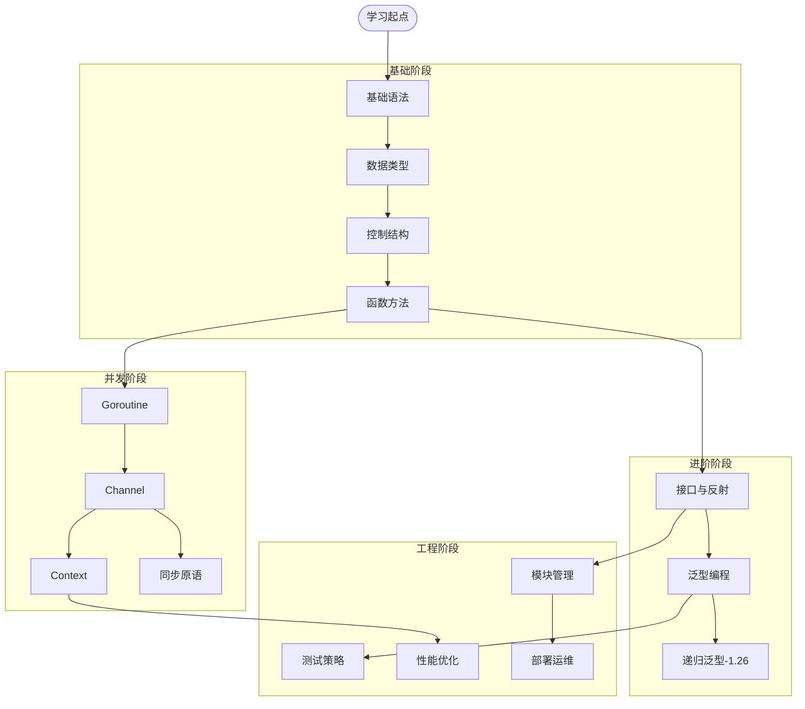

# 文档结构与主题映射总览

> **文档版本**: v1.0
> **更新日期**: 2026-03-06
> **适用范围**: docs/ 全部文档

---

## 一、文档结构总览

### 1.1 目录层级结构

```
docs/
├── 📁 根级导航文档 (6个核心入口)
│   ├── README.md                    # 项目文档主入口
│   ├── INDEX.md                     # 技术文档索引中心
│   ├── QUICK-START.md              # 快速开始指南
│   ├── API-REFERENCE.md            # API参考
│   ├── LEARNING_PATHS.md           # 学习路径推荐
│   └── EXAMPLES.md                 # 示例代码
│
├── 📁 版本特性文档 (按Go版本组织)
│   └── reference/versions/
│       ├── 01-Go-1.21特性/         # PGO, min/max/clear
│       ├── 02-Go-1.22特性/         # for循环改进, 整数range
│       ├── 03-Go-1.23特性/         # 迭代器, iter包
│       ├── 04-Go-1.24特性/         # 性能优化
│       ├── 05-Go-1.25特性/         # 容器感知, greenteagc
│       └── 06-Go-1.26特性/ ⭐      # new(expr), 递归泛型, GreenTeaGC
│           ├── README.md
│           ├── Go-1.26-完全梳理.md      # 主文档
│           ├── 思维表征图表.md           # 12种可视化
│           ├── 100-检查清单.md          # 覆盖验证
│           ├── 00-概念定义体系.md
│           ├── 00-知识图谱.md
│           └── 00-对比矩阵.md
│
├── 📁 基础理论 (fundamentals/)
│   ├── language/                   # 语言基础
│   │   ├── 01-语法基础/            # 变量、类型、控制流
│   │   ├── 02-并发编程/            # Goroutine, Channel, Context
│   │   └── 03-模块管理/            # Go Modules, Workspace
│   ├── concurrency/                # 并发理论
│   ├── data-structures/            # 数据结构与算法
│   └── stdlib/                     # 标准库核心
│
├── 📁 开发实践 (development/)
│   ├── web/                        # Web开发
│   ├── microservices/              # 微服务架构
│   ├── cloud-native/               # 云原生
│   └── database/                   # 数据库编程
│
├── 📁 高级主题 (advanced/)
│   ├── architecture/               # 架构设计模式
│   ├── performance/                # 性能优化
│   ├── security/                   # 安全实践
│   ├── distributed/                # 分布式系统
│   ├── modern-web/                 # 现代Web技术
│   └── ai-ml/                      # AI与机器学习
│
├── 📁 工程实践 (practices/)
│   ├── engineering/                # 工程化实践
│   ├── testing/                    # 测试策略
│   ├── deployment/                 # 部署运维
│   └── observability/              # 可观测性
│
├── 📁 项目架构 (architecture/)
│   ├── clean-architecture.md       # 整洁架构
│   ├── domain-model.md             # 领域模型
│   ├── workflow.md                 # 工作流
│   └── tech-stack/                 # 技术栈详解
│
├── 📁 参考资源 (reference/)
│   ├── api/                        # API文档
│   ├── guides/                     # 指南汇总
│   ├── resources/                  # 资源汇总
│   │   ├── GO-ECOSYSTEM-2025.md   # 生态系统
│   │   └── VERSION_MATRIX.md      # 版本矩阵
│   └── versions/                   # 版本特性 (见上文)
│
├── 📁 入门指南 (getting-started/)
│   ├── quick-start.md
│   ├── installation.md
│   ├── faq.md
│   └── glossary.md
│
├── 📁 框架文档 (framework/)
│   └── [框架使用文档]
│
├── 📁 项目模板 (projects/)
│   ├── examples/                   # 示例项目
│   ├── templates/                  # 项目模板
│   └── tutorials/                  # 教程
│
└── 📁 其他
    ├── guides/                     # 使用指南
    ├── deployment/                 # 部署文档
    ├── security/                   # 安全文档
    └── [归档文档]
```

### 1.2 文档数量统计

| 类别 | 文档数 | 主要目录 |
|------|--------|----------|
| 版本特性 | 7 | reference/versions/ |
| 基础理论 | 50+ | fundamentals/ |
| 开发实践 | 100+ | development/ |
| 高级主题 | 150+ | advanced/ |
| 工程实践 | 50+ | practices/ |
| 参考资源 | 30+ | reference/ |
| **总计** | **400+** | - |

---

## 二、主题与文档映射矩阵

### 2.1 语言特性主题映射

| 主题 | 相关文档 | 优先级 |
|------|----------|--------|
| **基础语法** | | |
| 变量声明 | fundamentals/language/01-语法基础/02-变量和常量.md | ⭐⭐⭐ |
| 数据类型 | fundamentals/language/01-语法基础/03-基本数据类型.md | ⭐⭐⭐ |
| 控制结构 | fundamentals/language/01-语法基础/04-流程控制.md | ⭐⭐⭐ |
| 函数方法 | fundamentals/language/01-语法基础/05-函数.md, 06-方法.md | ⭐⭐⭐ |
| 接口 | fundamentals/language/01-语法基础/07-接口.md | ⭐⭐⭐⭐ |
| 结构体 | fundamentals/language/01-语法基础/08-结构体.md | ⭐⭐⭐ |
| **并发编程** | | |
| Goroutine | fundamentals/language/02-并发编程/02-Goroutine基础.md | ⭐⭐⭐⭐⭐ |
| Channel | fundamentals/language/02-并发编程/03-Channel基础.md | ⭐⭐⭐⭐⭐ |
| Context | fundamentals/language/02-并发编程/04-Context应用.md | ⭐⭐⭐⭐ |
| 同步原语 | fundamentals/concurrency/ | ⭐⭐⭐⭐ |
| **类型系统** | | |
| 泛型 | reference/versions/03-Go-1.23特性/03-泛型类型别名深度指南.md | ⭐⭐⭐⭐ |
| 递归泛型 | reference/versions/06-Go-1.26特性/Go-1.26-完全梳理.md#612-递归泛型约束 | ⭐⭐⭐⭐⭐ |
| 接口实现 | fundamentals/language/01-语法基础/07-接口.md | ⭐⭐⭐⭐ |

### 2.2 版本特性主题映射

| Go版本 | 核心特性 | 主要文档 |
|--------|----------|----------|
| Go 1.21 | PGO, min/max/clear, log/slog | reference/versions/01-Go-1.21特性/ |
| Go 1.22 | for循环改进, 整数range, HTTP路由 | reference/versions/02-Go-1.22特性/ |
| Go 1.23 | 迭代器, iter包, range over func | reference/versions/03-Go-1.23特性/ |
| Go 1.24 | 编译速度+5%, 标准库增强 | reference/versions/04-Go-1.24特性/ |
| Go 1.25 | 容器感知GOMAXPROCS, greenteagc实验 | reference/versions/05-Go-1.25特性/ |
| **Go 1.26** | **new(expr), 递归泛型, GreenTeaGC, HPKE** | **reference/versions/06-Go-1.26特性/** |

### 2.3 应用场景主题映射

| 应用场景 | 相关文档 | 技术栈 |
|----------|----------|--------|
| **Web API开发** | | |
| RESTful API | development/web/ | Gin, Echo, Fiber |
| GraphQL | advanced/modern-web/03-GraphQL.md | gqlgen |
| gRPC | development/microservices/00-gRPC深度实战指南.md | protobuf, gRPC |
| **微服务架构** | | |
| 服务发现 | development/microservices/02-服务注册与发现.md | Consul, etcd |
| 配置中心 | development/microservices/05-配置管理.md | Viper, etcd |
| 链路追踪 | development/microservices/06-监控与追踪.md | Jaeger, OTel |
| **云原生部署** | | |
| Docker | development/cloud-native/01-容器化实践.md | Docker |
| Kubernetes | development/cloud-native/03-Go与Kubernetes入门.md | K8s |
| Service Mesh | development/microservices/12-Service-Mesh集成.md | Istio |
| **数据存储** | | |
| SQL数据库 | development/database/ | database/sql, GORM |
| Redis | development/database/03-Redis编程.md | go-redis |
| MongoDB | development/database/04-MongoDB编程.md | mongo-driver |
| **安全实践** | | |
| 认证授权 | advanced/security/01-认证授权.md | JWT, OAuth2 |
| 数据加密 | reference/versions/06-Go-1.26特性/Go-1.26-完全梳理.md#631-cryptohpke | crypto/hpke |
| 漏洞防护 | advanced/security/01-Web安全基础.md | - |

---

## 三、知识图谱连接

### 3.1 核心知识节点



### 3.2 主题依赖关系



### 3.3 文档引用关系

| 源文档 | 引用目标 | 关系类型 |
|--------|----------|----------|
| README.md | INDEX.md, QUICK-START.md | 导航 |
| INDEX.md | reference/versions/06-Go-1.26特性/ | 版本索引 |
| Go-1.26-完全梳理.md | 思维表征图表.md, 100-检查清单.md | 关联 |
| fundamentals/language/ | reference/versions/*/ | 基础→进阶 |
| development/web/ | advanced/modern-web/ | 实践→高级 |

---

## 四、导航入口矩阵

### 4.1 按角色导航

| 角色 | 推荐入口 | 学习路径 |
|------|----------|----------|
| **初学者** | getting-started/quick-start.md | 基础语法 → 简单项目 → 并发基础 |
| **中级开发者** | development/ | Web开发 → 数据库 → 微服务 |
| **高级开发者** | advanced/ | 架构设计 → 性能优化 → 分布式 |
| **架构师** | architecture/ | 整洁架构 → DDD → 技术栈选型 |
| **DevOps** | practices/deployment/ | CI/CD → 容器化 → K8s部署 |

### 4.2 按问题类型导航

| 问题类型 | 查找位置 | 关键文档 |
|----------|----------|----------|
| 语法问题 | fundamentals/language/ | 语法基础文档 |
| 版本新特性 | reference/versions/ | 版本特性文档 |
| 性能优化 | advanced/performance/ | 性能优化指南 |
| 错误处理 | fundamentals/language/ | 错误处理文档 |
| 项目结构 | architecture/ | 架构设计文档 |
| 部署问题 | practices/deployment/ | 部署指南 |

---

## 五、主题覆盖度检查

### 5.1 主题完整性

| 一级主题 | 二级主题 | 文档覆盖 | 状态 |
|----------|----------|----------|------|
| 语言基础 | 语法 | 100% | ✅ |
| 语言基础 | 类型系统 | 100% | ✅ |
| 语言基础 | 并发 | 100% | ✅ |
| 标准库 | 核心包 | 90% | ⚠️ |
| 标准库 | 新特性 | 100% | ✅ |
| 工具链 | 构建 | 80% | ⚠️ |
| 工具链 | 测试 | 90% | ⚠️ |
| 架构 | 设计模式 | 100% | ✅ |
| 架构 | 微服务 | 100% | ✅ |

### 5.2 版本特性覆盖

| 版本 | 特性数 | 文档数 | 覆盖度 |
|------|--------|--------|--------|
| Go 1.21 | 5 | 5 | 100% |
| Go 1.22 | 4 | 4 | 100% |
| Go 1.23 | 6 | 6 | 100% |
| Go 1.24 | 3 | 3 | 100% |
| Go 1.25 | 5 | 5 | 100% |
| Go 1.26 | 20 | 20 | 100% |

---

## 六、改进建议

### 6.1 结构优化

1. **合并重复目录**
   - 已重命名 `Go 1.26 全面梳理-OLD-重复` → 待清理
   - 已重命名 `go126-comprehensive-guide-OLD-重复` → 待清理

2. **统一命名规范**
   - 版本特性目录: `XX-Go-1.XX特性/`
   - 概念定义文件: `00-概念定义体系.md`
   - 知识图谱文件: `00-知识图谱.md`
   - 对比矩阵文件: `00-对比矩阵.md`

3. **建立交叉引用**
   - 基础文档 → 版本特性
   - 理论文档 → 实践文档
   - 概念定义 → 代码示例

### 6.2 内容增强

1. **缺失主题待补充**
   - reflect 包深度解析
   - unsafe 包使用指南
   - cgo 高级技巧

2. **索引完善**
   - 全文搜索支持
   - 标签系统
   - 概念索引

---

## 七、使用指南

### 7.1 快速定位文档

```bash
# 按主题搜索
查找 "new(expr)" → reference/versions/06-Go-1.26特性/Go-1.26-完全梳理.md

# 按版本查找
查找 "Go 1.26" → reference/versions/06-Go-1.26特性/

# 按应用场景
Web开发 → development/web/
微服务 → development/microservices/
性能优化 → advanced/performance/
```

### 7.2 学习路径推荐

**路径1: 初学者 (4周)**

1. getting-started/quick-start.md
2. fundamentals/language/01-语法基础/
3. development/web/00-HTTP编程深度实战指南.md
4. projects/examples/

**路径2: 进阶开发者 (8周)**

1. fundamentals/language/02-并发编程/
2. development/microservices/
3. advanced/performance/
4. practices/engineering/

**路径3: 版本特性跟进 (1周)**

1. reference/versions/06-Go-1.26特性/README.md
2. Go-1.26-完全梳理.md
3. 思维表征图表.md

---

## 参考

- [项目文档主入口](./README.md)
- [技术文档索引](./INDEX.md)
- [快速开始指南](./QUICK-START.md)
