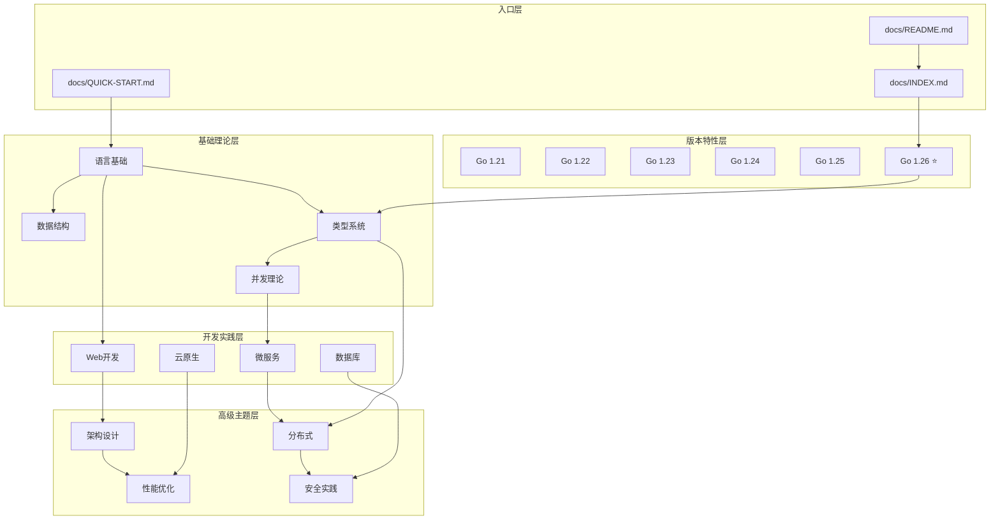
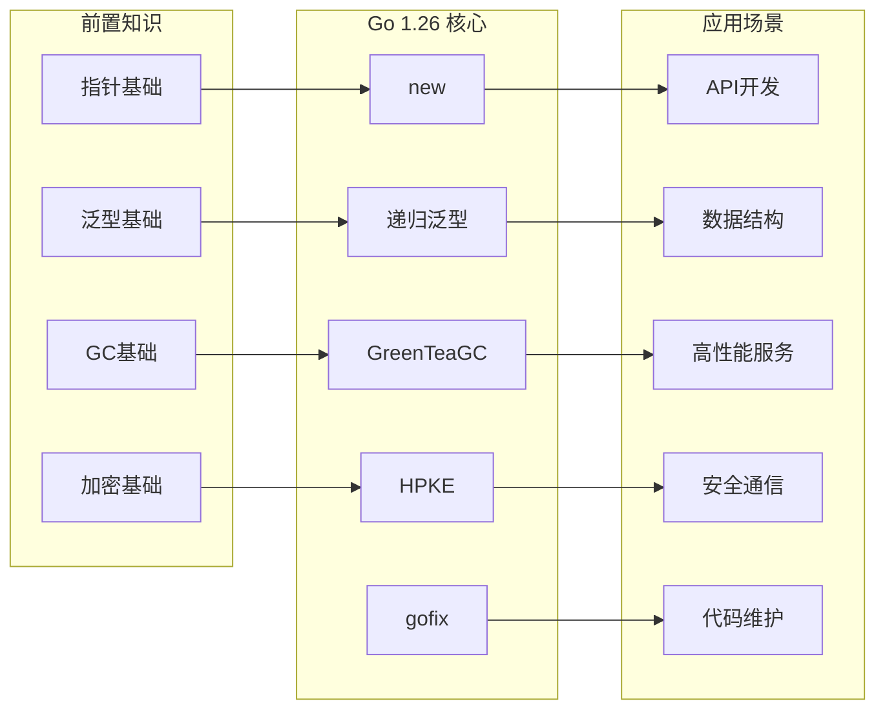
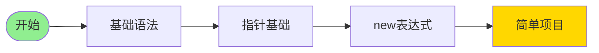
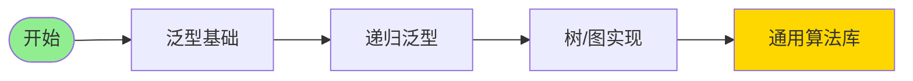
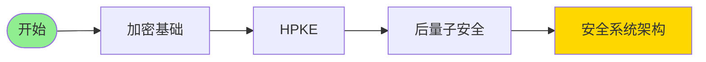
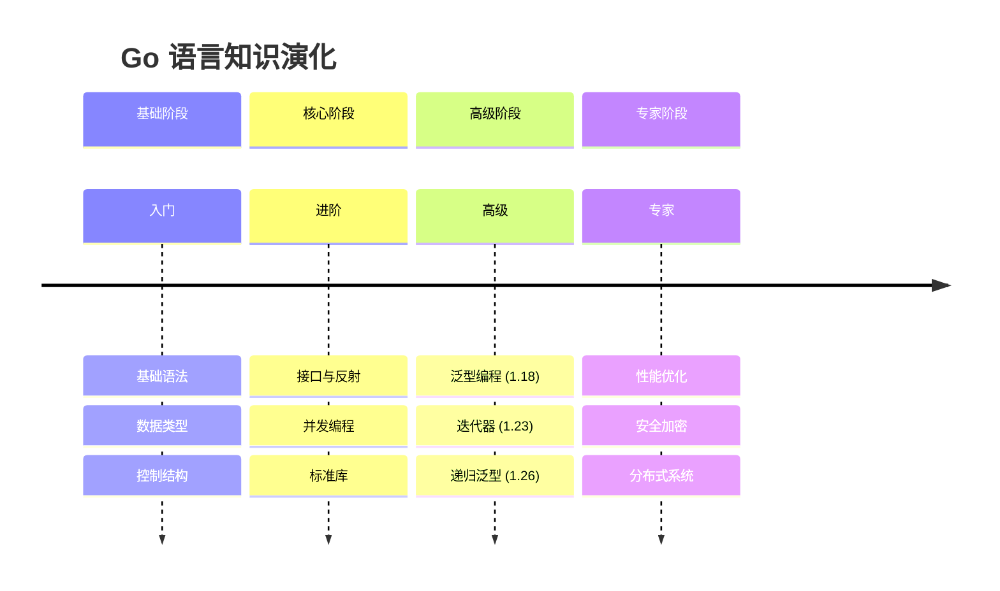

# 知识图谱统一视图

> 全局展示 docs/ 目录下所有文档的知识关联

---

## 一、知识图谱总览



---

## 二、Go 1.26 在知识图谱中的位置



---

## 三、文档间关系矩阵

### 3.1 Go 1.26 内部文档关系

| 源文档 | 目标文档 | 关系类型 | 说明 |
|--------|----------|----------|------|
| README.md | Go-1.26-完全梳理.md | 主从 | 入口→详细 |
| Go-1.26-完全梳理.md | 思维表征图表.md | 关联 | 文字→图表 |
| Go-1.26-完全梳理.md | 100-检查清单.md | 验证 | 内容→检查 |
| 00-概念定义体系.md | Go-1.26-完全梳理.md | 引用 | 定义→使用 |
| 00-知识图谱.md | 思维表征图表.md | 补充 | 概念→可视化 |

### 3.2 版本间关系

```
Go 1.21 (PGO)
    ↓ 性能优化延续
Go 1.22 (for循环改进)
    ↓ 语言特性演进
Go 1.23 (迭代器)
    ↓ 泛型增强
Go 1.24 (性能优化)
    ↓ GC改进
Go 1.25 (greenteagc实验)
    ↓ 默认启用
Go 1.26 (GreenTeaGC正式)
    + new(expr) 语法糖
    + 递归泛型 类型系统增强
```

### 3.3 跨主题关系

| 主题A | 主题B | 关系 | 连接文档 |
|-------|-------|------|----------|
| new(expr) | 可选字段 | 应用场景 | Web开发文档 |
| 递归泛型 | 树遍历 | 实现方式 | 算法文档 |
| HPKE | TLS | 使用场景 | 安全文档 |
| GreenTeaGC | 性能优化 | 依赖关系 | 性能文档 |
| go fix | 代码规范 | 工具支持 | 工程实践文档 |

---

## 四、学习路径图谱

### 4.1 初学者路径



**文档序列**:

1. getting-started/quick-start.md
2. fundamentals/language/01-语法基础/
3. reference/versions/06-Go-1.26特性/Go-1.26-完全梳理.md 6.1.1
4. projects/examples/

### 4.2 进阶开发者路径



**文档序列**:

1. reference/versions/03-Go-1.23特性/03-泛型类型别名深度指南.md
2. reference/versions/06-Go-1.26特性/Go-1.26-完全梳理.md 6.1.2
3. advanced/algorithm/
4. projects/templates/

### 4.3 专家路径



**文档序列**:

1. advanced/security/04-数据保护.md
2. reference/versions/06-Go-1.26特性/Go-1.26-完全梳理.md 6.3.1
3. advanced/security/
4. architecture/security.md

---

## 五、知识节点重要性

### 5.1 核心节点 (必须掌握)

| 节点 | 重要性 | 理由 | 入度 | 出度 |
|------|--------|------|------|------|
| 基础语法 | ⭐⭐⭐⭐⭐ | 所有基础 | 0 | 10+ |
| 类型系统 | ⭐⭐⭐⭐⭐ | 语言核心 | 2 | 8 |
| 并发模型 | ⭐⭐⭐⭐⭐ | Go特色 | 2 | 6 |
| new(expr) | ⭐⭐⭐⭐ | 常用语法糖 | 1 | 3 |
| GreenTeaGC | ⭐⭐⭐⭐ | 自动生效 | 1 | 2 |

### 5.2 重要节点 (建议掌握)

| 节点 | 重要性 | 应用场景 |
|------|--------|----------|
| 递归泛型 | ⭐⭐⭐⭐ | 数据结构库 |
| HPKE | ⭐⭐⭐ | 安全通信 |
| go fix | ⭐⭐⭐ | 代码维护 |
| simd | ⭐⭐ | 高性能计算 |

### 5.3 专门节点 (按需学习)

| 节点 | 适用人群 | 应用场景 |
|------|----------|----------|
| runtime/secret | 安全工程师 | 密钥管理 |
| errors.AsType | 一般开发者 | 错误处理 |
| slog.MultiHandler | 后端开发 | 日志系统 |

---

## 六、知识演化图



---

## 七、文档依赖关系

### 7.1 强依赖 (必须先读)

| 文档 | 依赖前置 | 理由 |
|------|----------|------|
| Go 1.26 递归泛型 | 泛型基础 | 需要理解类型参数 |
| HPKE 使用指南 | 加密基础 | 需要理解 KEM/KDF/AEAD |
| 性能调优 | 并发基础 | 需要理解调度模型 |

### 7.2 弱依赖 (推荐阅读)

| 文档 | 推荐前置 | 帮助 |
|------|----------|------|
| new(expr) | 指针基础 | 理解语义 |
| go fix | 代码规范 | 理解现代化目标 |
| GreenTeaGC | GC基础 | 理解改进点 |

### 7.3 无依赖 (可直接阅读)

| 文档 | 说明 |
|------|------|
| 版本特性总览 | 高层次的介绍 |
| 思维导图 | 可视化理解 |
| 检查清单 | 快速验证 |

---

## 八、知识 gaps 分析

### 8.1 已覆盖知识

- [x] Go 1.26 全部语言特性
- [x] 标准库新增包
- [x] 工具链改进
- [x] 运行时优化
- [x] 形式化定义
- [x] 多种思维表征

### 8.2 待补充知识

- [ ] 与旧版本对比实战案例
- [ ] 性能基准测试数据
- [ ] 生产环境迁移经验
- [ ] 与其他语言对比

---

## 九、使用知识图谱

### 场景1: 了解新特性概览

```
入口: README.md
  ↓
版本索引: reference/versions/06-Go-1.26特性/README.md
  ↓
特性总览: Go-1.26-完全梳理.md 第6节
  ↓
思维导图: 思维表征图表.md
```

### 场景2: 深入学习特定特性

```
入口: INDEX.md
  ↓
按主题查找: 主题文档精确映射.md
  ↓
概念定义: Go-1.26-完全梳理.md 第1节
  ↓
形式论证: Go-1.26-完全梳理.md 第3节
  ↓
代码示例: Go-1.26-完全梳理.md 第6节
```

### 场景3: 项目应用指导

```
入口: 文档结构与主题映射总览.md
  ↓
应用场景: 第2.3节 应用场景主题映射
  ↓
相关技术栈: 技术栈文档
  ↓
实践指南: development/ 或 advanced/
```

---

*本文档提供了 docs/ 目录的全局知识视图，支持多维度导航和学习路径规划。*
