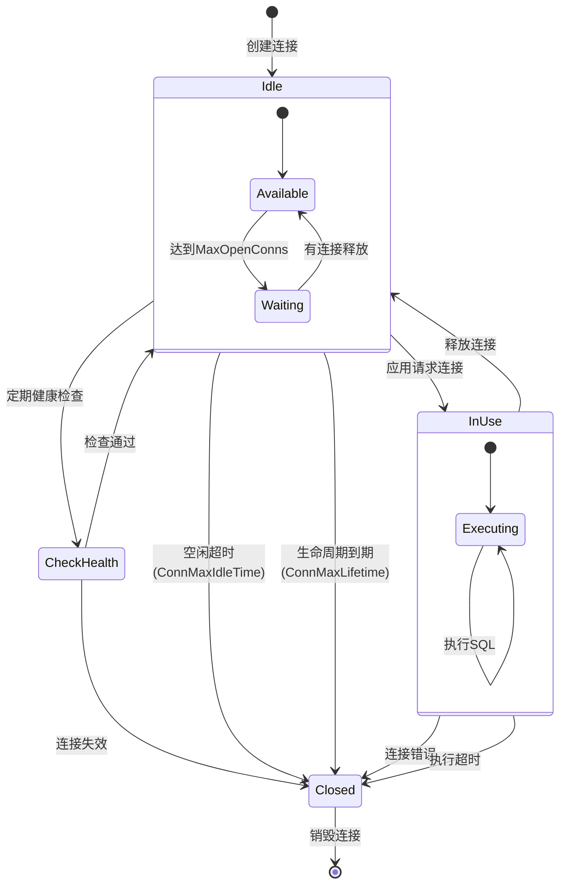
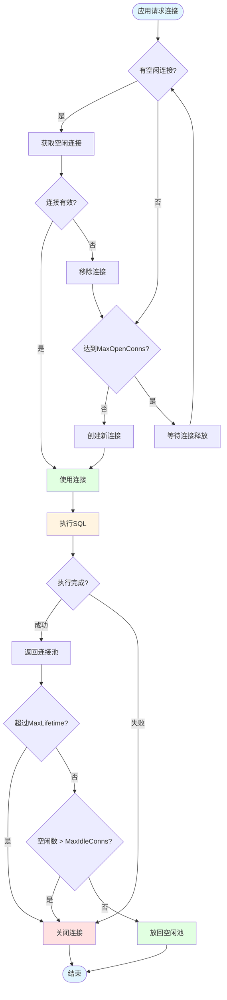

# 01-MySQL编程

**版本**: v1.0
**更新日期**: 2025-11-11
**适用于**: Go 1.25.3

---
## 📋 目录

- [01-MySQL编程](#01-mysql编程)
  - [📚 章节概览](#章节概览)
  - [1. 环境准备](#1-环境准备)
  - [2. 连接池配置](#2-连接池配置)
  - [3. CRUD操作](#3-crud操作)
  - [4. 事务处理](#4-事务处理)
  - [5. 预处理语句](#5-预处理语句)
  - [6. 错误处理](#6-错误处理)
  - [7. 性能优化](#7-性能优化)
  - [8. 完整示例](#8-完整示例)
  - [💡 最佳实践](#最佳实践)
  - [🔗 相关章节](#相关章节)

---

## 📚 章节概览

本章介绍如何在Go语言中使用MySQL数据库，包括连接配置、CRUD操作、事务处理、连接池管理和性能优化。

---

## 1. 环境准备

### 1.1 安装MySQL驱动

```bash
go get -u github.com/go-sql-driver/mysql
```

### 1.2 基本连接

```go
package main

import (
    "database/sql"
    "fmt"
    "log"

    _ "github.com/go-sql-driver/mysql"
)

func main() {
    // DSN格式: username:password@protocol(address)/dbname?param=value
    dsn := "root:password@tcp(127.0.0.1:3306)/testdb?charset=utf8mb4&parseTime=True"

    db, err := sql.Open("mysql", dsn)
    if err != nil {
        log.Fatal(err)
    }
    defer db.Close()

    // 验证连接
    err = db.Ping()
    if err != nil {
        log.Fatal(err)
    }

    fmt.Println("MySQL连接成功!")
}
```

---

## 2. 连接池配置

### 2.1 连接池参数

```go
package main

import (
    "database/sql"
    "time"

    _ "github.com/go-sql-driver/mysql"
)

func initDB() *sql.DB {
    dsn := "root:password@tcp(localhost:3306)/testdb"
    db, err := sql.Open("mysql", dsn)
    if err != nil {
        panic(err)
    }

    // 设置最大打开连接数
    db.SetMaxOpenConns(100)

    // 设置最大空闲连接数
    db.SetMaxIdleConns(10)

    // 设置连接最大生命周期
    db.SetConnMaxLifetime(time.Hour)

    // 设置连接最大空闲时间
    db.SetConnMaxIdleTime(time.Minute * 10)

    return db
}
```

**连接池状态机可视化**:



**连接池管理流程**:



---

## 3. CRUD操作

### 3.1 创建表

```go
func createTable(db *sql.DB) error {
    query := `
    CREATE TABLE IF NOT EXISTS users (
        id INT AUTO_INCREMENT PRIMARY KEY,
        username VARCHAR(50) NOT NULL UNIQUE,
        email VARCHAR(100) NOT NULL,
        age INT,
        created_at TIMESTAMP DEFAULT CURRENT_TIMESTAMP
    ) ENGINE=InnoDB DEFAULT CHARSET=utf8mb4;
    `

    _, err := db.Exec(query)
    return err
}
```

### 3.2 插入数据

```go
package main

import (
    "database/sql"
    "fmt"
)

type User struct {
    ID       int
    Username string
    Email    string
    Age      int
}

// 插入单条记录
func insertUser(db *sql.DB, user User) (int64, error) {
    query := "INSERT INTO users(username, email, age) VALUES(?, ?, ?)"

    result, err := db.Exec(query, user.Username, user.Email, user.Age)
    if err != nil {
        return 0, err
    }

    // 获取插入的ID
    id, err := result.LastInsertId()
    return id, err
}

// 批量插入
func batchInsert(db *sql.DB, users []User) error {
    tx, err := db.Begin()
    if err != nil {
        return err
    }

    stmt, err := tx.Prepare("INSERT INTO users(username, email, age) VALUES(?, ?, ?)")
    if err != nil {
        tx.Rollback()
        return err
    }
    defer stmt.Close()

    for _, user := range users {
        _, err := stmt.Exec(user.Username, user.Email, user.Age)
        if err != nil {
            tx.Rollback()
            return err
        }
    }

    return tx.Commit()
}
```

### 3.3 查询数据

```go
// 查询单条记录
func getUserByID(db *sql.DB, id int) (*User, error) {
    query := "SELECT id, username, email, age FROM users WHERE id = ?"

    user := &User{}
    err := db.QueryRow(query, id).Scan(
        &user.ID,
        &user.Username,
        &user.Email,
        &user.Age,
    )

    if err != nil {
        return nil, err
    }

    return user, nil
}

// 查询多条记录
func getAllUsers(db *sql.DB) ([]User, error) {
    query := "SELECT id, username, email, age FROM users"

    rows, err := db.Query(query)
    if err != nil {
        return nil, err
    }
    defer rows.Close()

    var users []User
    for rows.Next() {
        var user User
        err := rows.Scan(&user.ID, &user.Username, &user.Email, &user.Age)
        if err != nil {
            return nil, err
        }
        users = append(users, user)
    }

    return users, rows.Err()
}

// 条件查询
func getUsersByAge(db *sql.DB, minAge, maxAge int) ([]User, error) {
    query := "SELECT id, username, email, age FROM users WHERE age BETWEEN ? AND ?"

    rows, err := db.Query(query, minAge, maxAge)
    if err != nil {
        return nil, err
    }
    defer rows.Close()

    var users []User
    for rows.Next() {
        var user User
        err := rows.Scan(&user.ID, &user.Username, &user.Email, &user.Age)
        if err != nil {
            return nil, err
        }
        users = append(users, user)
    }

    return users, nil
}
```

### 3.4 更新数据

```go
// 更新用户信息
func updateUser(db *sql.DB, user User) error {
    query := "UPDATE users SET username=?, email=?, age=? WHERE id=?"

    result, err := db.Exec(query, user.Username, user.Email, user.Age, user.ID)
    if err != nil {
        return err
    }

    // 检查影响的行数
    rowsAffected, err := result.RowsAffected()
    if err != nil {
        return err
    }

    if rowsAffected == 0 {
        return fmt.Errorf("no rows affected")
    }

    return nil
}
```

### 3.5 删除数据

```go
// 删除用户
func deleteUser(db *sql.DB, id int) error {
    query := "DELETE FROM users WHERE id=?"

    result, err := db.Exec(query, id)
    if err != nil {
        return err
    }

    rowsAffected, err := result.RowsAffected()
    if err != nil {
        return err
    }

    if rowsAffected == 0 {
        return fmt.Errorf("user not found")
    }

    return nil
}
```

---

## 4. 事务处理

### 4.1 基本事务

```go
package main

import (
    "database/sql"
    "fmt"
)

// 转账示例
func transfer(db *sql.DB, fromID, toID int, amount float64) error {
    // 开始事务
    tx, err := db.Begin()
    if err != nil {
        return err
    }

    // 使用defer确保事务回滚或提交
    defer func() {
        if err != nil {
            tx.Rollback()
        }
    }()

    // 扣款
    _, err = tx.Exec("UPDATE accounts SET balance = balance - ? WHERE id = ?", amount, fromID)
    if err != nil {
        return err
    }

    // 加款
    _, err = tx.Exec("UPDATE accounts SET balance = balance + ? WHERE id = ?", amount, toID)
    if err != nil {
        return err
    }

    // 提交事务
    return tx.Commit()
}
```

### 4.2 事务隔离级别

```go
// 设置事务隔离级别
func executeWithIsolation(db *sql.DB) error {
    // 设置隔离级别为READ COMMITTED
    _, err := db.Exec("SET SESSION TRANSACTION ISOLATION LEVEL READ COMMITTED")
    if err != nil {
        return err
    }

    tx, err := db.Begin()
    if err != nil {
        return err
    }
    defer tx.Rollback()

    // 执行事务操作...

    return tx.Commit()
}
```

---

## 5. 预处理语句

### 5.1 使用Prepared Statement

```go
package main

import "database/sql"

// 预处理语句提高性能
func batchInsertWithPrepare(db *sql.DB, users []User) error {
    // 准备语句
    stmt, err := db.Prepare("INSERT INTO users(username, email, age) VALUES(?, ?, ?)")
    if err != nil {
        return err
    }
    defer stmt.Close()

    // 批量执行
    for _, user := range users {
        _, err := stmt.Exec(user.Username, user.Email, user.Age)
        if err != nil {
            return err
        }
    }

    return nil
}
```

---

## 6. 错误处理

### 6.1 常见错误处理

```go
package main

import (
    "database/sql"
    "errors"
    "fmt"

    "github.com/go-sql-driver/mysql"
)

func handleMySQLError(err error) {
    if err == nil {
        return
    }

    // 处理sql.ErrNoRows
    if errors.Is(err, sql.ErrNoRows) {
        fmt.Println("记录不存在")
        return
    }

    // 处理MySQL特定错误
    var mysqlErr *mysql.MySQLError
    if errors.As(err, &mysqlErr) {
        switch mysqlErr.Number {
        case 1062: // 重复键
            fmt.Println("记录已存在")
        case 1452: // 外键约束失败
            fmt.Println("外键约束失败")
        default:
            fmt.Printf("MySQL错误: %d - %s\n", mysqlErr.Number, mysqlErr.Message)
        }
        return
    }

    fmt.Println("其他错误:", err)
}
```

---

## 7. 性能优化

### 7.1 批量操作

```go
// 使用批量INSERT
func batchInsertOptimized(db *sql.DB, users []User) error {
    if len(users) == 0 {
        return nil
    }

    valueStrings := make([]string, 0, len(users))
    valueArgs := make([]interface{}, 0, len(users)*3)

    for _, user := range users {
        valueStrings = append(valueStrings, "(?, ?, ?)")
        valueArgs = append(valueArgs, user.Username, user.Email, user.Age)
    }

    query := fmt.Sprintf("INSERT INTO users(username, email, age) VALUES %s",
        strings.Join(valueStrings, ","))

    _, err := db.Exec(query, valueArgs...)
    return err
}
```

### 7.2 使用索引

```go
// 创建索引
func createIndexes(db *sql.DB) error {
    indexes := []string{
        "CREATE INDEX idx_username ON users(username)",
        "CREATE INDEX idx_email ON users(email)",
        "CREATE INDEX idx_age ON users(age)",
    }

    for _, query := range indexes {
        _, err := db.Exec(query)
        if err != nil {
            return err
        }
    }

    return nil
}
```

---

## 8. 完整示例

```go
package main

import (
    "database/sql"
    "fmt"
    "log"
    "time"

    _ "github.com/go-sql-driver/mysql"
)

type User struct {
    ID        int
    Username  string
    Email     string
    Age       int
    CreatedAt time.Time
}

func main() {
    // 初始化数据库连接
    dsn := "root:password@tcp(localhost:3306)/testdb?parseTime=true"
    db, err := sql.Open("mysql", dsn)
    if err != nil {
        log.Fatal(err)
    }
    defer db.Close()

    // 配置连接池
    db.SetMaxOpenConns(100)
    db.SetMaxIdleConns(10)
    db.SetConnMaxLifetime(time.Hour)

    // 创建表
    if err := createTable(db); err != nil {
        log.Fatal(err)
    }

    // 插入数据
    user := User{
        Username: "john_doe",
        Email:    "john@example.com",
        Age:      25,
    }

    id, err := insertUser(db, user)
    if err != nil {
        log.Fatal(err)
    }
    fmt.Printf("插入成功, ID: %d\n", id)

    // 查询数据
    foundUser, err := getUserByID(db, int(id))
    if err != nil {
        log.Fatal(err)
    }
    fmt.Printf("查询结果: %+v\n", foundUser)

    // 更新数据
    foundUser.Age = 26
    if err := updateUser(db, *foundUser); err != nil {
        log.Fatal(err)
    }

    // 删除数据
    if err := deleteUser(db, foundUser.ID); err != nil {
        log.Fatal(err)
    }

    fmt.Println("所有操作完成!")
}
```

---

## 💡 最佳实践

### 1. 连接管理

- ✅ 使用连接池，合理配置参数
- ✅ 及时关闭数据库连接
- ✅ 使用context控制超时

### 2. SQL安全

- ✅ 始终使用参数化查询，防止SQL注入
- ✅ 最小权限原则
- ✅ 加密敏感数据

### 3. 性能优化

- ✅ 使用索引
- ✅ 批量操作代替循环单条
- ✅ 避免SELECT *
- ✅ 使用预处理语句

### 4. 错误处理

- ✅ 正确处理sql.ErrNoRows
- ✅ 区分不同类型的MySQL错误
- ✅ 记录详细的错误日志

---

## 🔗 相关章节
