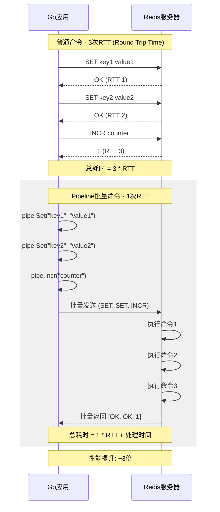
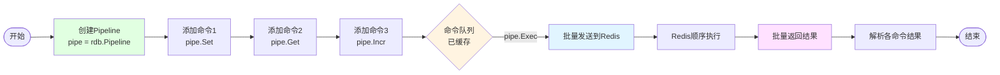
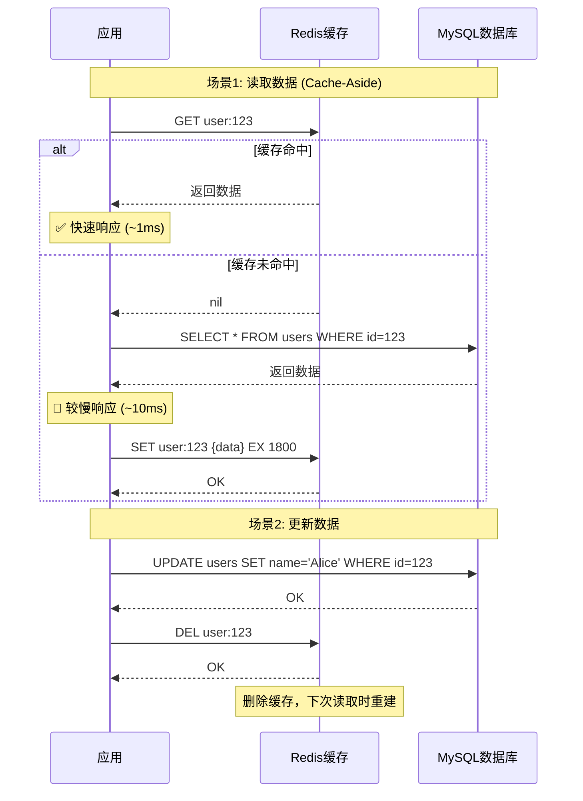

# 03-Redis编程

> Go语言Redis编程完全指南

---

## 📋 目录


- [📚 章节概览](#-章节概览)
- [1. 环境准备](#1-环境准备)
  - [1.1 安装驱动](#11-安装驱动)
  - [1.2 基本连接](#12-基本连接)
- [2. 基本操作](#2-基本操作)
  - [2.1 字符串操作](#21-字符串操作)
  - [2.2 哈希操作](#22-哈希操作)
  - [2.3 列表操作](#23-列表操作)
  - [2.4 集合操作](#24-集合操作)
  - [2.5 有序集合](#25-有序集合)
- [3. 高级特性](#3-高级特性)
  - [3.1 Pipeline](#31-pipeline)
    - [Pipeline vs 普通命令对比](#pipeline-vs-普通命令对比)
    - [Pipeline执行流程](#pipeline执行流程)
  - [3.2 事务](#32-事务)
  - [3.3 发布订阅](#33-发布订阅)
  - [3.4 Lua脚本](#34-lua脚本)
- [4. 实战应用](#4-实战应用)
  - [4.1 缓存实现](#41-缓存实现)
    - [Cache-Aside模式可视化](#cache-aside模式可视化)
    - [缓存更新策略](#缓存更新策略)
  - [4.2 分布式锁](#42-分布式锁)
  - [4.3 限流器](#43-限流器)
  - [4.4 排行榜](#44-排行榜)
- [5. 性能优化](#5-性能优化)
  - [5.1 连接池配置](#51-连接池配置)
  - [5.2 批量操作](#52-批量操作)
- [💡 最佳实践](#-最佳实践)
  - [1. 键命名规范](#1-键命名规范)
  - [2. 过期时间](#2-过期时间)
  - [3. 性能优化](#3-性能优化)
  - [4. 高可用](#4-高可用)
- [🔗 相关章节](#-相关章节)

## 📚 章节概览

本章介绍如何在Go语言中使用Redis，包括基本数据类型操作、Pipeline、事务、发布订阅以及分布式锁、限流器等实战应用。

---

## 1. 环境准备

### 1.1 安装驱动

```bash
# go-redis v9 (推荐)
go get github.com/redis/go-redis/v9

# redigo (另一个流行驱动)
go get github.com/gomodule/redigo/redis
```

### 1.2 基本连接

```go
package main

import (
    "context"
    "fmt"
    "log"
    
    "github.com/redis/go-redis/v9"
)

var ctx = context.Background()

func main() {
    // 创建Redis客户端
    rdb := redis.NewClient(&redis.Options{
        Addr:     "localhost:6379",
        Password: "", // 密码
        DB:       0,  // 数据库
    })
    
    // 测试连接
    pong, err := rdb.Ping(ctx).Result()
    if err != nil {
        log.Fatal(err)
    }
    
    fmt.Println("Redis连接成功:", pong)
}
```

---

## 2. 基本操作

### 2.1 字符串操作

```go
package main

import (
    "context"
    "fmt"
    "time"
    
    "github.com/redis/go-redis/v9"
)

var ctx = context.Background()

// SET和GET
func stringOperations(rdb *redis.Client) {
    // 设置值
    err := rdb.Set(ctx, "key", "value", 0).Err()
    if err != nil {
        panic(err)
    }
    
    // 获取值
    val, err := rdb.Get(ctx, "key").Result()
    if err != nil {
        panic(err)
    }
    fmt.Println("key:", val)
    
    // 设置过期时间
    err = rdb.Set(ctx, "session:user:123", "data", 30*time.Minute).Err()
    
    // 检查键是否存在
    exists, err := rdb.Exists(ctx, "key").Result()
    fmt.Println("exists:", exists)
    
    // 删除键
    rdb.Del(ctx, "key")
}

// 计数器
func counterOperations(rdb *redis.Client) {
    // 自增
    count, err := rdb.Incr(ctx, "counter").Result()
    fmt.Println("counter:", count)
    
    // 增加指定值
    rdb.IncrBy(ctx, "counter", 10)
    
    // 自减
    rdb.Decr(ctx, "counter")
}

// SETNX（分布式锁基础）
func setNX(rdb *redis.Client) {
    // 只在键不存在时设置
    success, err := rdb.SetNX(ctx, "lock:resource", "locked", 10*time.Second).Result()
    if err != nil {
        panic(err)
    }
    
    if success {
        fmt.Println("获取锁成功")
        // 执行业务逻辑
        // ...
        
        // 释放锁
        rdb.Del(ctx, "lock:resource")
    } else {
        fmt.Println("获取锁失败")
    }
}
```

### 2.2 哈希操作

```go
// Hash操作
func hashOperations(rdb *redis.Client) {
    // 设置单个字段
    err := rdb.HSet(ctx, "user:1000", "name", "Alice").Err()
    if err != nil {
        panic(err)
    }
    
    // 设置多个字段
    rdb.HMSet(ctx, "user:1000", map[string]interface{}{
        "name":  "Alice",
        "age":   25,
        "email": "alice@example.com",
    })
    
    // 获取单个字段
    name, err := rdb.HGet(ctx, "user:1000", "name").Result()
    fmt.Println("name:", name)
    
    // 获取所有字段
    user, err := rdb.HGetAll(ctx, "user:1000").Result()
    fmt.Println("user:", user)
    
    // 字段是否存在
    exists, err := rdb.HExists(ctx, "user:1000", "name").Result()
    fmt.Println("exists:", exists)
    
    // 删除字段
    rdb.HDel(ctx, "user:1000", "email")
    
    // Hash计数器
    rdb.HIncrBy(ctx, "user:1000", "visits", 1)
}
```

### 2.3 列表操作

```go
// List操作
func listOperations(rdb *redis.Client) {
    // 左侧推入
    rdb.LPush(ctx, "queue", "task1", "task2", "task3")
    
    // 右侧推入
    rdb.RPush(ctx, "queue", "task4")
    
    // 左侧弹出
    val, err := rdb.LPop(ctx, "queue").Result()
    fmt.Println("lpop:", val)
    
    // 右侧弹出
    val, err = rdb.RPop(ctx, "queue").Result()
    fmt.Println("rpop:", val)
    
    // 获取列表长度
    length, err := rdb.LLen(ctx, "queue").Result()
    fmt.Println("length:", length)
    
    // 获取范围元素
    items, err := rdb.LRange(ctx, "queue", 0, -1).Result()
    fmt.Println("items:", items)
    
    // 阻塞弹出（用于消息队列）
    result, err := rdb.BLPop(ctx, 5*time.Second, "queue").Result()
    if err == nil {
        fmt.Println("blpop:", result)
    }
}
```

### 2.4 集合操作

```go
// Set操作
func setOperations(rdb *redis.Client) {
    // 添加成员
    rdb.SAdd(ctx, "tags", "go", "redis", "database")
    
    // 获取所有成员
    members, err := rdb.SMembers(ctx, "tags").Result()
    fmt.Println("members:", members)
    
    // 检查成员是否存在
    exists, err := rdb.SIsMember(ctx, "tags", "go").Result()
    fmt.Println("exists:", exists)
    
    // 移除成员
    rdb.SRem(ctx, "tags", "database")
    
    // 集合运算
    rdb.SAdd(ctx, "set1", "a", "b", "c")
    rdb.SAdd(ctx, "set2", "b", "c", "d")
    
    // 交集
    inter, err := rdb.SInter(ctx, "set1", "set2").Result()
    fmt.Println("inter:", inter)
    
    // 并集
    union, err := rdb.SUnion(ctx, "set1", "set2").Result()
    fmt.Println("union:", union)
    
    // 差集
    diff, err := rdb.SDiff(ctx, "set1", "set2").Result()
    fmt.Println("diff:", diff)
}
```

### 2.5 有序集合

```go
// Sorted Set操作
func sortedSetOperations(rdb *redis.Client) {
    // 添加成员
    rdb.ZAdd(ctx, "scores", redis.Z{Score: 90, Member: "Alice"})
    rdb.ZAdd(ctx, "scores", redis.Z{Score: 85, Member: "Bob"})
    rdb.ZAdd(ctx, "scores", redis.Z{Score: 95, Member: "Charlie"})
    
    // 获取范围（按分数从小到大）
    users, err := rdb.ZRange(ctx, "scores", 0, -1).Result()
    fmt.Println("users:", users)
    
    // 获取范围（按分数从大到小）
    users, err = rdb.ZRevRange(ctx, "scores", 0, -1).Result()
    fmt.Println("top users:", users)
    
    // 带分数获取
    usersWithScores, err := rdb.ZRevRangeWithScores(ctx, "scores", 0, -1).Result()
    for _, z := range usersWithScores {
        fmt.Printf("%s: %.0f\n", z.Member, z.Score)
    }
    
    // 获取分数
    score, err := rdb.ZScore(ctx, "scores", "Alice").Result()
    fmt.Println("Alice's score:", score)
    
    // 增加分数
    rdb.ZIncrBy(ctx, "scores", 5, "Bob")
    
    // 获取排名（从0开始）
    rank, err := rdb.ZRevRank(ctx, "scores", "Alice").Result()
    fmt.Println("Alice's rank:", rank)
    
    // 按分数范围获取
    users, err = rdb.ZRangeByScore(ctx, "scores", &redis.ZRangeBy{
        Min: "85",
        Max: "95",
    }).Result()
    fmt.Println("users 85-95:", users)
}
```

---

## 3. 高级特性

### 3.1 Pipeline

#### Pipeline vs 普通命令对比



#### Pipeline执行流程



```go
// Pipeline批量操作
func pipelineExample(rdb *redis.Client) {
    // 创建Pipeline
    pipe := rdb.Pipeline()
    
    // 添加多个命令（仅缓存，不发送）
    incr := pipe.Incr(ctx, "pipeline_counter")
    pipe.Expire(ctx, "pipeline_counter", time.Hour)
    pipe.Set(ctx, "key1", "value1", 0)
    pipe.Get(ctx, "key1")
    
    // 一次性执行所有命令
    _, err := pipe.Exec(ctx)
    if err != nil {
        panic(err)
    }
    
    // 获取结果
    fmt.Println("counter:", incr.Val())
}

// Pipeline性能对比
func pipelinePerformance(rdb *redis.Client) {
    // 普通方式：1000次SET - 1000次RTT
    start := time.Now()
    for i := 0; i < 1000; i++ {
        rdb.Set(ctx, fmt.Sprintf("key%d", i), i, 0)
    }
    fmt.Println("普通方式耗时:", time.Since(start)) // ~100ms (假设RTT=0.1ms)
    
    // Pipeline方式：1000次SET - 1次RTT
    start = time.Now()
    pipe := rdb.Pipeline()
    for i := 0; i < 1000; i++ {
        pipe.Set(ctx, fmt.Sprintf("key%d", i), i, 0)
    }
    pipe.Exec(ctx)
    fmt.Println("Pipeline耗时:", time.Since(start)) // ~1ms (1次RTT)
}
```

### 3.2 事务

```go
// 事务（MULTI/EXEC）
func transactionExample(rdb *redis.Client) {
    // 使用TxPipeline
    pipe := rdb.TxPipeline()
    
    pipe.Set(ctx, "key1", "value1", 0)
    pipe.Set(ctx, "key2", "value2", 0)
    pipe.Incr(ctx, "counter")
    
    // 执行事务
    _, err := pipe.Exec(ctx)
    if err != nil {
        panic(err)
    }
}

// WATCH实现乐观锁
func optimisticLock(rdb *redis.Client, key string) error {
    return rdb.Watch(ctx, func(tx *redis.Tx) error {
        // 获取当前值
        val, err := tx.Get(ctx, key).Int()
        if err != nil && err != redis.Nil {
            return err
        }
        
        // 业务逻辑
        val += 1
        
        // 执行事务
        _, err = tx.TxPipelined(ctx, func(pipe redis.Pipeliner) error {
            pipe.Set(ctx, key, val, 0)
            return nil
        })
        
        return err
    }, key)
}
```

### 3.3 发布订阅

```go
package main

import (
    "context"
    "fmt"
    
    "github.com/redis/go-redis/v9"
)

// 发布消息
func publish(rdb *redis.Client, channel, message string) {
    err := rdb.Publish(ctx, channel, message).Err()
    if err != nil {
        panic(err)
    }
}

// 订阅频道
func subscribe(rdb *redis.Client, channel string) {
    pubsub := rdb.Subscribe(ctx, channel)
    defer pubsub.Close()
    
    // 接收消息
    ch := pubsub.Channel()
    for msg := range ch {
        fmt.Printf("Received: %s from %s\n", msg.Payload, msg.Channel)
    }
}
```

### 3.4 Lua脚本

```go
// Lua脚本示例
func luaScriptExample(rdb *redis.Client) {
    // 原子性增加并获取
    script := redis.NewScript(`
        local current = redis.call('GET', KEYS[1])
        if not current then
            current = 0
        end
        local next = tonumber(current) + tonumber(ARGV[1])
        redis.call('SET', KEYS[1], next)
        return next
    `)
    
    result, err := script.Run(ctx, rdb, []string{"counter"}, 5).Result()
    if err != nil {
        panic(err)
    }
    
    fmt.Println("result:", result)
}
```

---

## 4. 实战应用

### 4.1 缓存实现

#### Cache-Aside模式可视化

```mermaid
flowchart TB
    Start([用户请求]) --> Query[查询GetUser id=123]
    Query --> CheckCache{检查Redis缓存<br/>key: user:123}
    
    CheckCache -->|缓存命中| ReturnCache[返回缓存数据<br/>⚡ 快速响应]
    ReturnCache --> End1([结束])
    
    CheckCache -->|缓存未命中| QueryDB[查询MySQL数据库<br/>SELECT * FROM users<br/>WHERE id = 123]
    QueryDB --> DBResult{数据库返回}
    
    DBResult -->|查询成功| WriteCache[写入Redis缓存<br/>SET user:123 {data}<br/>EX 1800]
    WriteCache --> ReturnDB[返回数据库数据<br/>🐢 较慢响应]
    ReturnDB --> End2([结束])
    
    DBResult -->|未找到| ReturnNull[返回空/错误]
    ReturnNull --> End3([结束])
    
    style CheckCache fill:#fff4e1
    style ReturnCache fill:#e1ffe1
    style QueryDB fill:#e1f5ff
    style WriteCache fill:#ffe1ff
```

#### 缓存更新策略



```go
package main

import (
    "context"
    "encoding/json"
    "fmt"
    "time"
    
    "github.com/redis/go-redis/v9"
)

type User struct {
    ID       int    `json:"id"`
    Username string `json:"username"`
    Email    string `json:"email"`
}

// Cache接口
type Cache struct {
    rdb *redis.Client
}

// 设置缓存
func (c *Cache) Set(key string, value interface{}, expiration time.Duration) error {
    data, err := json.Marshal(value)
    if err != nil {
        return err
    }
    
    return c.rdb.Set(ctx, key, data, expiration).Err()
}

// 获取缓存
func (c *Cache) Get(key string, dest interface{}) error {
    data, err := c.rdb.Get(ctx, key).Bytes()
    if err != nil {
        return err
    }
    
    return json.Unmarshal(data, dest)
}

// Cache-Aside模式（旁路缓存）
func (c *Cache) GetUser(id int) (*User, error) {
    // 1. 尝试从缓存获取
    cacheKey := fmt.Sprintf("user:%d", id)
    var user User
    
    err := c.Get(cacheKey, &user)
    if err == nil {
        return &user, nil // 缓存命中
    }
    
    // 2. 缓存未命中，从数据库查询
    user, err = queryUserFromDB(id)
    if err != nil {
        return nil, err
    }
    
    // 3. 写入缓存（异步写入可进一步优化）
    c.Set(cacheKey, user, 30*time.Minute)
    
    return &user, nil
}

// 模拟数据库查询
func queryUserFromDB(id int) (User, error) {
    // SELECT * FROM users WHERE id = ?
    return User{ID: id, Username: "Alice", Email: "alice@example.com"}, nil
}
```

### 4.2 分布式锁

```go
package main

import (
    "context"
    "time"
    
    "github.com/redis/go-redis/v9"
)

type DistributedLock struct {
    rdb   *redis.Client
    key   string
    value string
    ttl   time.Duration
}

// 获取锁
func (l *DistributedLock) Lock() bool {
    success, err := l.rdb.SetNX(ctx, l.key, l.value, l.ttl).Result()
    if err != nil {
        return false
    }
    return success
}

// 释放锁（使用Lua脚本保证原子性）
func (l *DistributedLock) Unlock() error {
    script := redis.NewScript(`
        if redis.call("GET", KEYS[1]) == ARGV[1] then
            return redis.call("DEL", KEYS[1])
        else
            return 0
        end
    `)
    
    _, err := script.Run(ctx, l.rdb, []string{l.key}, l.value).Result()
    return err
}

// 使用示例
func useLock(rdb *redis.Client) {
    lock := &DistributedLock{
        rdb:   rdb,
        key:   "lock:resource:123",
        value: "unique-id-" + time.Now().String(),
        ttl:   10 * time.Second,
    }
    
    if lock.Lock() {
        defer lock.Unlock()
        
        // 执行业务逻辑
        fmt.Println("Got lock, processing...")
        time.Sleep(2 * time.Second)
    } else {
        fmt.Println("Failed to get lock")
    }
}
```

### 4.3 限流器

```go
// 令牌桶限流器
type RateLimiter struct {
    rdb   *redis.Client
    key   string
    rate  int           // 每秒生成令牌数
    burst int           // 桶容量
}

// 尝试获取令牌
func (rl *RateLimiter) Allow() bool {
    script := redis.NewScript(`
        local key = KEYS[1]
        local rate = tonumber(ARGV[1])
        local burst = tonumber(ARGV[2])
        local now = tonumber(ARGV[3])
        
        local last_time = redis.call('HGET', key, 'last_time')
        local tokens = redis.call('HGET', key, 'tokens')
        
        if not last_time then
            last_time = now
            tokens = burst
        else
            local delta = now - tonumber(last_time)
            tokens = math.min(burst, tonumber(tokens) + delta * rate)
        end
        
        if tokens >= 1 then
            tokens = tokens - 1
            redis.call('HMSET', key, 'last_time', now, 'tokens', tokens)
            redis.call('EXPIRE', key, 60)
            return 1
        else
            return 0
        end
    `)
    
    now := time.Now().Unix()
    result, err := script.Run(
        ctx,
        rl.rdb,
        []string{rl.key},
        rl.rate,
        rl.burst,
        now,
    ).Int()
    
    return err == nil && result == 1
}
```

### 4.4 排行榜

```go
// 排行榜实现
type Leaderboard struct {
    rdb *redis.Client
    key string
}

// 添加/更新分数
func (lb *Leaderboard) SetScore(userID string, score float64) error {
    return lb.rdb.ZAdd(ctx, lb.key, redis.Z{
        Score:  score,
        Member: userID,
    }).Err()
}

// 增加分数
func (lb *Leaderboard) IncrScore(userID string, incr float64) error {
    return lb.rdb.ZIncrBy(ctx, lb.key, incr, userID).Err()
}

// 获取Top N
func (lb *Leaderboard) GetTopN(n int64) ([]redis.Z, error) {
    return lb.rdb.ZRevRangeWithScores(ctx, lb.key, 0, n-1).Result()
}

// 获取用户排名
func (lb *Leaderboard) GetRank(userID string) (int64, error) {
    return lb.rdb.ZRevRank(ctx, lb.key, userID).Result()
}

// 获取用户分数
func (lb *Leaderboard) GetScore(userID string) (float64, error) {
    return lb.rdb.ZScore(ctx, lb.key, userID).Result()
}
```

---

## 5. 性能优化

### 5.1 连接池配置

```go
func initRedis() *redis.Client {
    return redis.NewClient(&redis.Options{
        Addr:     "localhost:6379",
        Password: "",
        DB:       0,
        
        // 连接池配置
        PoolSize:     100,              // 连接池大小
        MinIdleConns: 10,               // 最小空闲连接
        MaxIdleConns: 50,               // 最大空闲连接
        PoolTimeout:  4 * time.Second,  // 获取连接超时
        
        // 超时配置
        DialTimeout:  5 * time.Second,
        ReadTimeout:  3 * time.Second,
        WriteTimeout: 3 * time.Second,
        
        // 重试配置
        MaxRetries: 3,
    })
}
```

### 5.2 批量操作

```go
// 使用Pipeline批量获取
func batchGet(rdb *redis.Client, keys []string) (map[string]string, error) {
    pipe := rdb.Pipeline()
    
    cmds := make([]*redis.StringCmd, len(keys))
    for i, key := range keys {
        cmds[i] = pipe.Get(ctx, key)
    }
    
    _, err := pipe.Exec(ctx)
    if err != nil && err != redis.Nil {
        return nil, err
    }
    
    result := make(map[string]string)
    for i, cmd := range cmds {
        val, err := cmd.Result()
        if err == nil {
            result[keys[i]] = val
        }
    }
    
    return result, nil
}
```

---

## 💡 最佳实践

### 1. 键命名规范

- ✅ 使用冒号分隔：`user:1000:profile`
- ✅ 使用有意义的前缀
- ✅ 避免过长的键名
- ✅ 统一命名风格

### 2. 过期时间

- ✅ 始终设置过期时间
- ✅ 避免大量键同时过期
- ✅ 使用随机过期时间

### 3. 性能优化

- ✅ 使用Pipeline批量操作
- ✅ 避免大key（超过10KB）
- ✅ 使用合适的数据结构
- ✅ 利用Redis单线程特性

### 4. 高可用

- ✅ 使用Redis Sentinel或Cluster
- ✅ 实现重试机制
- ✅ 监控Redis性能指标
- ✅ 准备降级方案

---

## 🔗 相关章节

- [01-MySQL编程](01-MySQL编程.md)
- [02-PostgreSQL编程](02-PostgreSQL编程.md)
- [缓存策略](../07-性能优化/README.md)

---

**维护者**: Documentation Team  
**创建日期**: 2025-10-22  
**最后更新**: 2025-10-22  
**文档状态**: ✅ 完成
