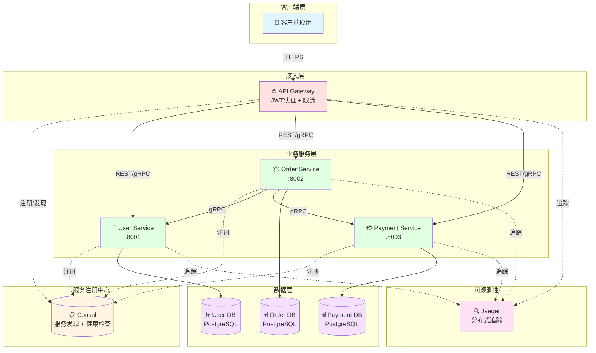
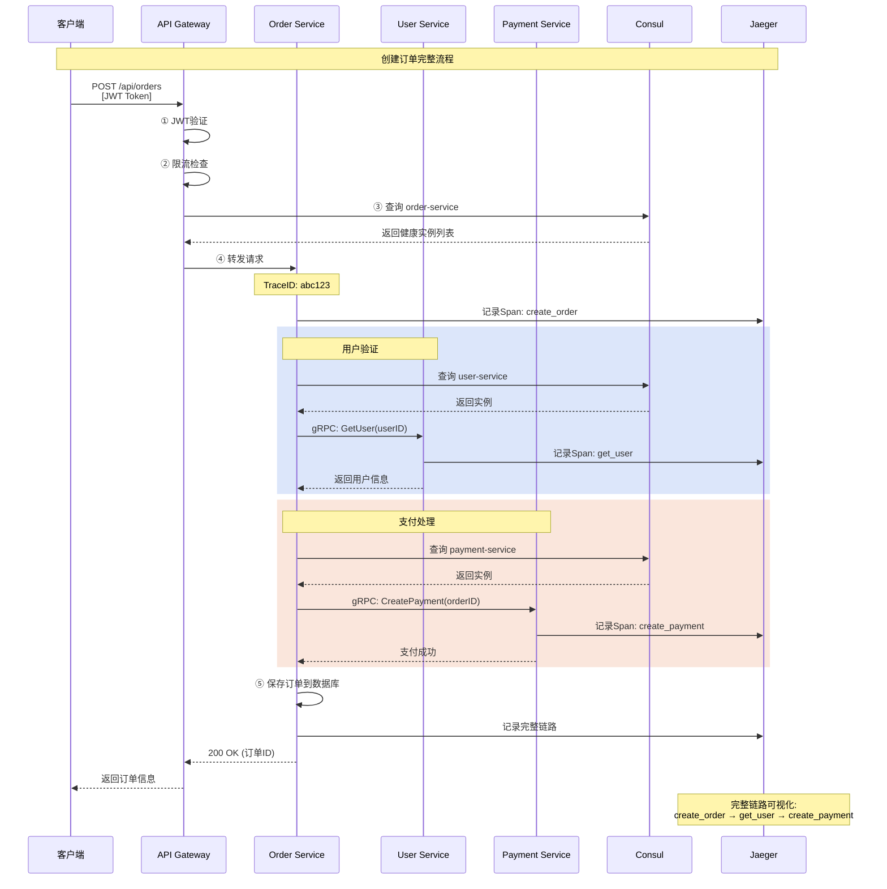

# Go微服务架构深度实战指南

**字数**: ~22,000字  
**代码示例**: 50+个完整示例  
**实战案例**: 6个端到端案例  
**适用人群**: 中高级Go开发者

---

## 📋 目录


- [第一部分：微服务理论基础](#第一部分微服务理论基础)
  - [什么是微服务？](#什么是微服务)
    - [定义](#定义)
    - [单体 vs 微服务对比](#单体-vs-微服务对比)
  - [微服务核心组件](#微服务核心组件)
  - [Go微服务生态](#go微服务生态)
    - [主流框架](#主流框架)
    - [为什么选择Go？](#为什么选择go)
- [第二部分：服务注册与发现](#第二部分服务注册与发现)
  - [为什么需要服务发现？](#为什么需要服务发现)
  - [实战案例1：基于Consul的服务注册与发现](#实战案例1基于consul的服务注册与发现)
    - [场景](#场景)
    - [完整实现](#完整实现)
    - [用户服务（提供者）](#用户服务提供者)
    - [订单服务（消费者）](#订单服务消费者)
    - [输出](#输出)
- [第三部分：API网关实战](#第三部分api网关实战)
  - [为什么需要API网关？](#为什么需要api网关)
  - [实战案例2：自建API网关](#实战案例2自建api网关)
    - [场景3](#场景3)
    - [完整实现3](#完整实现3)
    - [使用示例](#使用示例)
- [第四部分：服务间通信](#第四部分服务间通信)
  - [gRPC vs HTTP](#grpc-vs-http)
  - [实战案例3：gRPC服务间通信](#实战案例3grpc服务间通信)
    - [场景4](#场景4)
    - [Proto定义](#proto定义)
    - [服务端实现](#服务端实现)
    - [客户端实现](#客户端实现)
- [第五部分：配置管理](#第五部分配置管理)
  - [实战案例4：基于etcd的配置中心](#实战案例4基于etcd的配置中心)
- [第六部分：熔断与限流](#第六部分熔断与限流)
  - [实战案例5：熔断器实现](#实战案例5熔断器实现)
- [第七部分：分布式追踪](#第七部分分布式追踪)
  - [实战案例6：OpenTelemetry追踪](#实战案例6opentelemetry追踪)
- [第八部分：完整电商微服务架构](#第八部分完整电商微服务架构)
  - [架构设计](#架构设计)
    - [微服务交互架构可视化](#微服务交互架构可视化)
    - [订单创建调用链时序图](#订单创建调用链时序图)
  - [核心特性](#核心特性)
- [第九部分：最佳实践](#第九部分最佳实践)
  - [微服务设计原则](#微服务设计原则)
  - [常见陷阱](#常见陷阱)
    - [陷阱1：服务拆分过细](#陷阱1服务拆分过细)
    - [陷阱2：共享数据库](#陷阱2共享数据库)
    - [陷阱3：忽略分布式追踪](#陷阱3忽略分布式追踪)
- [🎯 总结](#-总结)
  - [微服务核心要点](#微服务核心要点)
  - [技术选型建议](#技术选型建议)

## 第一部分：微服务理论基础

### 什么是微服务？

#### 定义

**微服务**是一种将应用程序拆分为一组小型、自治、可独立部署的服务的架构风格。每个服务：

- 围绕特定业务能力构建
- 独立开发、测试、部署
- 拥有自己的数据存储
- 通过轻量级机制通信

#### 单体 vs 微服务对比

```text
【单体应用】
┌─────────────────────────────┐
│      Monolithic App         │
│  ┌───────┬───────┬───────┐ │
│  │ User  │ Order │Payment│ │
│  │Module │Module │Module │ │
│  └───────┴───────┴───────┘ │
│     ↓      ↓      ↓         │
│  ┌──────────────────────┐  │
│  │   Shared Database     │  │
│  └──────────────────────┘  │
└─────────────────────────────┘

优点：开发简单、部署快
缺点：扩展粗、发布耦合、技术栈固定


【微服务架构】
┌──────────┐  ┌──────────┐  ┌──────────┐
│  User    │  │  Order   │  │ Payment  │
│ Service  │  │ Service  │  │ Service  │
│    ↓     │  │    ↓     │  │    ↓     │
│ [User DB]│  │[Order DB]│  │[Pay DB]  │
└──────────┘  └──────────┘  └──────────┘
      ↘          ↓          ↙
        API Gateway / Service Mesh

优点：独立部署、技术灵活、细粒度扩展
缺点：运维复杂、网络开销、数据一致性
```

---

### 微服务核心组件

| 组件 | 作用 | 常用技术 |
|------|------|---------|
| **服务注册与发现** | 服务位置管理 | Consul, etcd, Nacos |
| **API网关** | 统一入口、路由 | Kong, Nginx, Traefik |
| **负载均衡** | 流量分发 | Nginx, HAProxy, Envoy |
| **配置中心** | 集中配置管理 | etcd, Consul, Apollo |
| **服务间通信** | RPC/消息队列 | gRPC, HTTP, Kafka, NATS |
| **熔断限流** | 容错保护 | Hystrix, Sentinel |
| **分布式追踪** | 链路追踪 | Jaeger, Zipkin, SkyWalking |
| **服务网格** | 流量治理 | Istio, Linkerd |

---

### Go微服务生态

#### 主流框架

1. **go-micro** - 完整微服务框架
2. **Kratos** - Bilibili开源，生产级
3. **go-kit** - 微服务工具集
4. **gRPC-go** - 高性能RPC
5. **Gin + 自建** - 轻量级定制

#### 为什么选择Go？

```text
✅ 高性能：并发模型优秀，适合高并发场景
✅ 易部署：单一可执行文件，无依赖
✅ 云原生：Docker/Kubernetes原生支持
✅ 简洁高效：开发效率高，维护成本低
✅ 生态成熟：gRPC、Consul等生态完善
```

---

## 第二部分：服务注册与发现

### 为什么需要服务发现？

**问题示例**:

```go
// ❌ 硬编码服务地址的问题
func callOrderService() {
    resp, err := http.Get("http://192.168.1.100:8080/orders")
    // 问题：
    // 1. IP写死，服务迁移需要修改代码
    // 2. 无法负载均衡
    // 3. 无法感知服务健康状态
    // 4. 无法动态扩缩容
}
```

**使用服务发现后**:

```go
// ✅ 动态服务发现
func callOrderService() {
    // 1. 从Consul获取健康的order-service实例
    services, _ := consul.Health().Service("order-service", "", true, nil)
    
    // 2. 负载均衡选择一个实例
    instance := loadBalance(services)
    
    // 3. 调用
    url := fmt.Sprintf("http://%s:%d/orders", instance.Service.Address, instance.Service.Port)
    resp, err := http.Get(url)
}
```

---

### 实战案例1：基于Consul的服务注册与发现

#### 场景

- 用户服务（user-service）注册到Consul
- 订单服务（order-service）发现并调用用户服务
- 支持健康检查
- 支持负载均衡

#### 完整实现

```go
package consul

import (
    "fmt"
    "time"
    
    "github.com/hashicorp/consul/api"
)

// ===== 服务注册器 =====
type ServiceRegistry struct {
    client      *api.Client
    serviceID   string
    serviceName string
}

func NewServiceRegistry(consulAddr string) (*ServiceRegistry, error) {
    config := api.DefaultConfig()
    config.Address = consulAddr
    
    client, err := api.NewClient(config)
    if err != nil {
        return nil, err
    }
    
    return &ServiceRegistry{client: client}, nil
}

// Register 注册服务
func (s *ServiceRegistry) Register(serviceName, serviceAddr string, servicePort int, tags []string) error {
    s.serviceName = serviceName
    s.serviceID = fmt.Sprintf("%s-%d", serviceName, servicePort)
    
    registration := &api.AgentServiceRegistration{
        ID:      s.serviceID,
        Name:    serviceName,
        Address: serviceAddr,
        Port:    servicePort,
        Tags:    tags,
        Check: &api.AgentServiceCheck{
            HTTP:                           fmt.Sprintf("http://%s:%d/health", serviceAddr, servicePort),
            Interval:                       "10s",
            Timeout:                        "3s",
            DeregisterCriticalServiceAfter: "30s",
        },
    }
    
    fmt.Printf("[Consul] Registering service: %s (%s:%d)\n", serviceName, serviceAddr, servicePort)
    
    if err := s.client.Agent().ServiceRegister(registration); err != nil {
        return fmt.Errorf("failed to register service: %w", err)
    }
    
    fmt.Printf("[Consul] Service registered successfully: %s\n", s.serviceID)
    return nil
}

// Deregister 注销服务
func (s *ServiceRegistry) Deregister() error {
    fmt.Printf("[Consul] Deregistering service: %s\n", s.serviceID)
    return s.client.Agent().ServiceDeregister(s.serviceID)
}

// ===== 服务发现器 =====
type ServiceDiscovery struct {
    client *api.Client
}

func NewServiceDiscovery(consulAddr string) (*ServiceDiscovery, error) {
    config := api.DefaultConfig()
    config.Address = consulAddr
    
    client, err := api.NewClient(config)
    if err != nil {
        return nil, err
    }
    
    return &ServiceDiscovery{client: client}, nil
}

// ServiceInstance 服务实例
type ServiceInstance struct {
    ID      string
    Name    string
    Address string
    Port    int
    Tags    []string
}

// DiscoverService 发现服务（只返回健康的实例）
func (s *ServiceDiscovery) DiscoverService(serviceName string) ([]*ServiceInstance, error) {
    // passingOnly = true: 只返回健康检查通过的实例
    services, _, err := s.client.Health().Service(serviceName, "", true, nil)
    if err != nil {
        return nil, fmt.Errorf("failed to discover service: %w", err)
    }
    
    if len(services) == 0 {
        return nil, fmt.Errorf("no healthy instances found for service: %s", serviceName)
    }
    
    instances := make([]*ServiceInstance, 0, len(services))
    for _, entry := range services {
        instances = append(instances, &ServiceInstance{
            ID:      entry.Service.ID,
            Name:    entry.Service.Service,
            Address: entry.Service.Address,
            Port:    entry.Service.Port,
            Tags:    entry.Service.Tags,
        })
    }
    
    fmt.Printf("[Consul] Discovered %d instances of %s\n", len(instances), serviceName)
    return instances, nil
}

// ===== 负载均衡器（轮询）=====
type LoadBalancer struct {
    instances []*ServiceInstance
    current   int
}

func NewLoadBalancer(instances []*ServiceInstance) *LoadBalancer {
    return &LoadBalancer{instances: instances}
}

// Next 获取下一个实例（轮询）
func (lb *LoadBalancer) Next() *ServiceInstance {
    if len(lb.instances) == 0 {
        return nil
    }
    
    instance := lb.instances[lb.current]
    lb.current = (lb.current + 1) % len(lb.instances)
    
    return instance
}
```

#### 用户服务（提供者）

```go
package main

import (
    "context"
    "fmt"
    "log"
    "net/http"
    "os"
    "os/signal"
    "syscall"
    "time"
    
    "github.com/gin-gonic/gin"
)

func main() {
    // 1. 创建服务注册器
    registry, err := NewServiceRegistry("localhost:8500")
    if err != nil {
        log.Fatal(err)
    }
    
    // 2. 注册服务
    serviceName := "user-service"
    serviceAddr := "localhost"
    servicePort := 8001
    
    if err := registry.Register(serviceName, serviceAddr, servicePort, []string{"v1"}); err != nil {
        log.Fatal(err)
    }
    
    // 3. 启动HTTP服务
    router := gin.Default()
    
    // 健康检查端点
    router.GET("/health", func(c *gin.Context) {
        c.JSON(200, gin.H{"status": "healthy"})
    })
    
    // 业务端点
    router.GET("/users/:id", func(c *gin.Context) {
        userID := c.Param("id")
        c.JSON(200, gin.H{
            "id":   userID,
            "name": fmt.Sprintf("User-%s", userID),
            "age":  25,
        })
    })
    
    srv := &http.Server{
        Addr:    fmt.Sprintf(":%d", servicePort),
        Handler: router,
    }
    
    // 4. 启动服务器
    go func() {
        fmt.Printf("[User Service] Starting on port %d...\n", servicePort)
        if err := srv.ListenAndServe(); err != nil && err != http.ErrServerClosed {
            log.Fatalf("Server failed: %v", err)
        }
    }()
    
    // 5. 优雅关闭
    quit := make(chan os.Signal, 1)
    signal.Notify(quit, syscall.SIGINT, syscall.SIGTERM)
    <-quit
    
    fmt.Println("[User Service] Shutting down...")
    
    // 注销服务
    registry.Deregister()
    
    // 关闭HTTP服务器
    ctx, cancel := context.WithTimeout(context.Background(), 5*time.Second)
    defer cancel()
    srv.Shutdown(ctx)
    
    fmt.Println("[User Service] Shutdown complete")
}
```

#### 订单服务（消费者）

```go
package main

import (
    "encoding/json"
    "fmt"
    "io"
    "log"
    "net/http"
    "time"
)

func main() {
    // 1. 创建服务发现器
    discovery, err := NewServiceDiscovery("localhost:8500")
    if err != nil {
        log.Fatal(err)
    }
    
    // 2. 发现用户服务
    instances, err := discovery.DiscoverService("user-service")
    if err != nil {
        log.Fatal(err)
    }
    
    // 3. 创建负载均衡器
    lb := NewLoadBalancer(instances)
    
    // 4. 调用用户服务（10次，展示负载均衡）
    for i := 0; i < 10; i++ {
        // 选择一个实例
        instance := lb.Next()
        
        // 调用
        url := fmt.Sprintf("http://%s:%d/users/123", instance.Address, instance.Port)
        resp, err := http.Get(url)
        if err != nil {
            fmt.Printf("[Order Service] Failed to call user service: %v\n", err)
            continue
        }
        
        body, _ := io.ReadAll(resp.Body)
        resp.Body.Close()
        
        var user map[string]interface{}
        json.Unmarshal(body, &user)
        
        fmt.Printf("[Order Service] Called instance %s, got user: %v\n", instance.ID, user)
        
        time.Sleep(500 * time.Millisecond)
    }
}
```

#### 输出

```text
[User Service] Starting on port 8001...
[Consul] Registering service: user-service (localhost:8001)
[Consul] Service registered successfully: user-service-8001

[Consul] Discovered 1 instances of user-service
[Order Service] Called instance user-service-8001, got user: map[age:25 id:123 name:User-123]
[Order Service] Called instance user-service-8001, got user: map[age:25 id:123 name:User-123]
...

[User Service] Shutting down...
[Consul] Deregistering service: user-service-8001
[User Service] Shutdown complete
```

---

## 第三部分：API网关实战

### 为什么需要API网关？

**问题**:

- 客户端需要知道所有服务地址
- 认证/限流逻辑重复在每个服务
- CORS、日志等横切关注点重复

**API网关解决方案**:

```text
客户端 → API网关 → 多个微服务

API网关职责：
1. 统一入口
2. 路由转发
3. 认证鉴权
4. 限流熔断
5. 日志监控
6. 协议转换
```

---

### 实战案例2：自建API网关

#### 场景3

- 统一入口
- JWT认证
- 限流
- 路由到不同服务

#### 完整实现3

```go
package gateway

import (
    "context"
    "encoding/json"
    "fmt"
    "io"
    "net/http"
    "strings"
    "sync"
    "time"
    
    "github.com/gin-gonic/gin"
    "github.com/golang-jwt/jwt/v5"
)

// ===== JWT认证中间件 =====
var jwtSecret = []byte("my-secret-key")

type Claims struct {
    UserID string `json:"user_id"`
    jwt.RegisteredClaims
}

// AuthMiddleware JWT认证中间件
func AuthMiddleware() gin.HandlerFunc {
    return func(c *gin.Context) {
        // 1. 获取token
        authHeader := c.GetHeader("Authorization")
        if authHeader == "" {
            c.JSON(401, gin.H{"error": "missing authorization header"})
            c.Abort()
            return
        }
        
        // 2. 解析token（格式：Bearer <token>）
        parts := strings.Split(authHeader, " ")
        if len(parts) != 2 || parts[0] != "Bearer" {
            c.JSON(401, gin.H{"error": "invalid authorization format"})
            c.Abort()
            return
        }
        
        tokenString := parts[1]
        
        // 3. 验证token
        token, err := jwt.ParseWithClaims(tokenString, &Claims{}, func(token *jwt.Token) (interface{}, error) {
            return jwtSecret, nil
        })
        
        if err != nil || !token.Valid {
            c.JSON(401, gin.H{"error": "invalid token"})
            c.Abort()
            return
        }
        
        // 4. 提取claims
        if claims, ok := token.Claims.(*Claims); ok {
            c.Set("user_id", claims.UserID)
            fmt.Printf("[Auth] User %s authenticated\n", claims.UserID)
        }
        
        c.Next()
    }
}

// ===== 限流中间件（令牌桶）=====
type RateLimiter struct {
    tokens     int
    maxTokens  int
    refillRate int  // 每秒refill
    mu         sync.Mutex
    lastRefill time.Time
}

func NewRateLimiter(maxTokens, refillRate int) *RateLimiter {
    return &RateLimiter{
        tokens:     maxTokens,
        maxTokens:  maxTokens,
        refillRate: refillRate,
        lastRefill: time.Now(),
    }
}

func (rl *RateLimiter) Allow() bool {
    rl.mu.Lock()
    defer rl.mu.Unlock()
    
    // 补充token
    elapsed := time.Since(rl.lastRefill)
    if elapsed > time.Second {
        tokensToAdd := int(elapsed.Seconds()) * rl.refillRate
        rl.tokens = min(rl.maxTokens, rl.tokens+tokensToAdd)
        rl.lastRefill = time.Now()
    }
    
    // 检查token
    if rl.tokens > 0 {
        rl.tokens--
        return true
    }
    
    return false
}

func RateLimitMiddleware(limiter *RateLimiter) gin.HandlerFunc {
    return func(c *gin.Context) {
        if !limiter.Allow() {
            fmt.Println("[RateLimit] Request rejected - too many requests")
            c.JSON(429, gin.H{"error": "Too Many Requests"})
            c.Abort()
            return
        }
        
        fmt.Printf("[RateLimit] Request allowed, tokens left: %d\n", limiter.tokens)
        c.Next()
    }
}

// ===== 服务路由器 =====
type ServiceRouter struct {
    discovery *ServiceDiscovery
    balancers map[string]*LoadBalancer
    mu        sync.RWMutex
}

func NewServiceRouter(discovery *ServiceDiscovery) *ServiceRouter {
    return &ServiceRouter{
        discovery: discovery,
        balancers: make(map[string]*LoadBalancer),
    }
}

// RefreshBalancer 刷新负载均衡器
func (sr *ServiceRouter) RefreshBalancer(serviceName string) error {
    instances, err := sr.discovery.DiscoverService(serviceName)
    if err != nil {
        return err
    }
    
    sr.mu.Lock()
    sr.balancers[serviceName] = NewLoadBalancer(instances)
    sr.mu.Unlock()
    
    return nil
}

// ProxyMiddleware 代理中间件
func (sr *ServiceRouter) ProxyMiddleware(serviceName string) gin.HandlerFunc {
    return func(c *gin.Context) {
        // 1. 获取负载均衡器
        sr.mu.RLock()
        lb, exists := sr.balancers[serviceName]
        sr.mu.RUnlock()
        
        if !exists {
            // 首次请求，刷新负载均衡器
            if err := sr.RefreshBalancer(serviceName); err != nil {
                c.JSON(503, gin.H{"error": fmt.Sprintf("service unavailable: %v", err)})
                return
            }
            
            sr.mu.RLock()
            lb = sr.balancers[serviceName]
            sr.mu.RUnlock()
        }
        
        // 2. 选择实例
        instance := lb.Next()
        if instance == nil {
            c.JSON(503, gin.H{"error": "no available instances"})
            return
        }
        
        // 3. 构建目标URL
        targetURL := fmt.Sprintf("http://%s:%d%s", instance.Address, instance.Port, c.Request.URL.Path)
        if c.Request.URL.RawQuery != "" {
            targetURL += "?" + c.Request.URL.RawQuery
        }
        
        fmt.Printf("[Gateway] Proxying %s → %s\n", c.Request.URL.Path, targetURL)
        
        // 4. 转发请求
        req, err := http.NewRequest(c.Request.Method, targetURL, c.Request.Body)
        if err != nil {
            c.JSON(500, gin.H{"error": "failed to create request"})
            return
        }
        
        // 复制header
        for key, values := range c.Request.Header {
            for _, value := range values {
                req.Header.Add(key, value)
            }
        }
        
        // 5. 执行请求
        client := &http.Client{Timeout: 5 * time.Second}
        resp, err := client.Do(req)
        if err != nil {
            c.JSON(502, gin.H{"error": "bad gateway"})
            return
        }
        defer resp.Body.Close()
        
        // 6. 返回响应
        body, _ := io.ReadAll(resp.Body)
        
        // 复制响应header
        for key, values := range resp.Header {
            for _, value := range values {
                c.Writer.Header().Add(key, value)
            }
        }
        
        c.Data(resp.StatusCode, resp.Header.Get("Content-Type"), body)
    }
}

// ===== API网关服务器 =====
func StartGateway() {
    // 1. 创建服务发现
    discovery, err := NewServiceDiscovery("localhost:8500")
    if err != nil {
        log.Fatal(err)
    }
    
    // 2. 创建路由器
    router := NewServiceRouter(discovery)
    
    // 3. 创建限流器（每秒10个请求）
    limiter := NewRateLimiter(10, 10)
    
    // 4. 创建Gin引擎
    r := gin.Default()
    
    // 5. 公开端点（登录，不需要认证）
    r.POST("/login", func(c *gin.Context) {
        var req struct {
            Username string `json:"username"`
            Password string `json:"password"`
        }
        
        if err := c.BindJSON(&req); err != nil {
            c.JSON(400, gin.H{"error": "invalid request"})
            return
        }
        
        // 简化：跳过密码验证
        if req.Username == "" {
            c.JSON(400, gin.H{"error": "missing username"})
            return
        }
        
        // 生成JWT
        claims := &Claims{
            UserID: req.Username,
            RegisteredClaims: jwt.RegisteredClaims{
                ExpiresAt: jwt.NewNumericDate(time.Now().Add(24 * time.Hour)),
                IssuedAt:  jwt.NewNumericDate(time.Now()),
            },
        }
        
        token := jwt.NewWithClaims(jwt.SigningMethodHS256, claims)
        tokenString, _ := token.SignedString(jwtSecret)
        
        c.JSON(200, gin.H{"token": tokenString})
    })
    
    // 6. 受保护的端点（需要认证+限流）
    authorized := r.Group("/api")
    authorized.Use(AuthMiddleware())
    authorized.Use(RateLimitMiddleware(limiter))
    {
        // 用户服务路由
        authorized.Any("/users/*path", router.ProxyMiddleware("user-service"))
        
        // 订单服务路由
        authorized.Any("/orders/*path", router.ProxyMiddleware("order-service"))
    }
    
    // 7. 启动网关
    fmt.Println("[Gateway] Starting on :8000...")
    r.Run(":8000")
}
```

#### 使用示例

```bash
# 1. 登录获取token
curl -X POST http://localhost:8000/login \
  -H "Content-Type: application/json" \
  -d '{"username": "alice"}'

# 输出: {"token":"eyJhbGciOiJ..."}

# 2. 使用token访问用户服务
curl http://localhost:8000/api/users/123 \
  -H "Authorization: Bearer eyJhbGciOiJ..."

# 输出: {"id":"123","name":"User-123","age":25}

# 3. 超过限流
# 快速请求11次，第11次会被拒绝
# 输出: {"error":"Too Many Requests"}
```

---

## 第四部分：服务间通信

### gRPC vs HTTP

| 对比项 | gRPC | HTTP/REST |
|--------|------|-----------|
| **协议** | HTTP/2 + Protobuf | HTTP/1.1 + JSON |
| **性能** | 高（二进制） | 中（文本） |
| **契约** | 强契约（.proto） | 弱契约（文档） |
| **流式** | 支持双向流 | 不支持 |
| **浏览器** | 需要gRPC-Web | 原生支持 |
| **适用场景** | 内部服务间 | 外部API |

---

### 实战案例3：gRPC服务间通信

#### 场景4

- 订单服务（gRPC客户端）调用用户服务（gRPC服务端）
- 获取用户信息
- 支持超时和重试

#### Proto定义

```protobuf
// user.proto
syntax = "proto3";

package user;
option go_package = "./proto";

service UserService {
  rpc GetUser (GetUserRequest) returns (GetUserResponse) {}
  rpc ListUsers (ListUsersRequest) returns (ListUsersResponse) {}
}

message GetUserRequest {
  string user_id = 1;
}

message GetUserResponse {
  string user_id = 1;
  string name = 2;
  string email = 3;
  int32 age = 4;
}

message ListUsersRequest {
  int32 page = 1;
  int32 page_size = 2;
}

message ListUsersResponse {
  repeated GetUserResponse users = 1;
  int32 total = 2;
}
```

#### 服务端实现

```go
package main

import (
    "context"
    "fmt"
    "log"
    "net"
    
    pb "path/to/proto"
    "google.golang.org/grpc"
)

// ===== gRPC服务实现 =====
type UserServiceServer struct {
    pb.UnimplementedUserServiceServer
}

func (s *UserServiceServer) GetUser(ctx context.Context, req *pb.GetUserRequest) (*pb.GetUserResponse, error) {
    fmt.Printf("[gRPC] GetUser called: %s\n", req.UserId)
    
    // 模拟数据库查询
    return &pb.GetUserResponse{
        UserId: req.UserId,
        Name:   fmt.Sprintf("User-%s", req.UserId),
        Email:  fmt.Sprintf("user%s@example.com", req.UserId),
        Age:    25,
    }, nil
}

func (s *UserServiceServer) ListUsers(ctx context.Context, req *pb.ListUsersRequest) (*pb.ListUsersResponse, error) {
    fmt.Printf("[gRPC] ListUsers called: page=%d, size=%d\n", req.Page, req.PageSize)
    
    // 模拟返回用户列表
    users := make([]*pb.GetUserResponse, 0, req.PageSize)
    for i := 0; i < int(req.PageSize); i++ {
        users = append(users, &pb.GetUserResponse{
            UserId: fmt.Sprintf("%d", i+1),
            Name:   fmt.Sprintf("User-%d", i+1),
            Email:  fmt.Sprintf("user%d@example.com", i+1),
            Age:    20 + int32(i),
        })
    }
    
    return &pb.ListUsersResponse{
        Users: users,
        Total: 100,
    }, nil
}

func main() {
    // 1. 监听端口
    lis, err := net.Listen("tcp", ":50051")
    if err != nil {
        log.Fatalf("Failed to listen: %v", err)
    }
    
    // 2. 创建gRPC服务器
    server := grpc.NewServer()
    
    // 3. 注册服务
    pb.RegisterUserServiceServer(server, &UserServiceServer{})
    
    // 4. 启动服务
    fmt.Println("[gRPC Server] Starting on :50051...")
    if err := server.Serve(lis); err != nil {
        log.Fatalf("Failed to serve: %v", err)
    }
}
```

#### 客户端实现

```go
package main

import (
    "context"
    "fmt"
    "log"
    "time"
    
    pb "path/to/proto"
    "google.golang.org/grpc"
    "google.golang.org/grpc/credentials/insecure"
)

func main() {
    // 1. 连接gRPC服务器
    conn, err := grpc.NewClient(
        "localhost:50051",
        grpc.WithTransportCredentials(insecure.NewCredentials()),
    )
    if err != nil {
        log.Fatalf("Failed to connect: %v", err)
    }
    defer conn.Close()
    
    // 2. 创建客户端
    client := pb.NewUserServiceClient(conn)
    
    // 3. 调用GetUser（带超时）
    ctx, cancel := context.WithTimeout(context.Background(), 3*time.Second)
    defer cancel()
    
    resp, err := client.GetUser(ctx, &pb.GetUserRequest{
        UserId: "123",
    })
    if err != nil {
        log.Fatalf("GetUser failed: %v", err)
    }
    
    fmt.Printf("[gRPC Client] Got user: %+v\n", resp)
    
    // 4. 调用ListUsers
    ctx2, cancel2 := context.WithTimeout(context.Background(), 3*time.Second)
    defer cancel2()
    
    listResp, err := client.ListUsers(ctx2, &pb.ListUsersRequest{
        Page:     1,
        PageSize: 5,
    })
    if err != nil {
        log.Fatalf("ListUsers failed: %v", err)
    }
    
    fmt.Printf("[gRPC Client] Got %d users (total: %d)\n", len(listResp.Users), listResp.Total)
    for i, user := range listResp.Users {
        fmt.Printf("  %d. %s (%s)\n", i+1, user.Name, user.Email)
    }
}
```

---

## 第五部分：配置管理

### 实战案例4：基于etcd的配置中心

```go
package config

import (
    "context"
    "fmt"
    "time"
    
    clientv3 "go.etcd.io/etcd/client/v3"
)

// ConfigCenter 配置中心
type ConfigCenter struct {
    client *clientv3.Client
}

func NewConfigCenter(endpoints []string) (*ConfigCenter, error) {
    client, err := clientv3.New(clientv3.Config{
        Endpoints:   endpoints,
        DialTimeout: 5 * time.Second,
    })
    if err != nil {
        return nil, err
    }
    
    return &ConfigCenter{client: client}, nil
}

// GetConfig 获取配置
func (cc *ConfigCenter) GetConfig(key string) (string, error) {
    ctx, cancel := context.WithTimeout(context.Background(), 2*time.Second)
    defer cancel()
    
    resp, err := cc.client.Get(ctx, key)
    if err != nil {
        return "", err
    }
    
    if len(resp.Kvs) == 0 {
        return "", fmt.Errorf("config not found: %s", key)
    }
    
    return string(resp.Kvs[0].Value), nil
}

// SetConfig 设置配置
func (cc *ConfigCenter) SetConfig(key, value string) error {
    ctx, cancel := context.WithTimeout(context.Background(), 2*time.Second)
    defer cancel()
    
    _, err := cc.client.Put(ctx, key, value)
    return err
}

// WatchConfig 监听配置变更
func (cc *ConfigCenter) WatchConfig(key string, callback func(string)) {
    watchChan := cc.client.Watch(context.Background(), key)
    
    for wresp := range watchChan {
        for _, ev := range wresp.Events {
            fmt.Printf("[Config] Config changed: %s → %s\n", ev.Kv.Key, ev.Kv.Value)
            callback(string(ev.Kv.Value))
        }
    }
}
```

---

## 第六部分：熔断与限流

### 实战案例5：熔断器实现

```go
package circuitbreaker

import (
    "errors"
    "fmt"
    "sync"
    "time"
)

// State 熔断器状态
type State int

const (
    StateClosed   State = iota  // 关闭（正常）
    StateOpen                    // 打开（熔断）
    StateHalfOpen                // 半开（试探）
)

// CircuitBreaker 熔断器
type CircuitBreaker struct {
    state            State
    failureCount     int
    successCount     int
    failureThreshold int           // 失败阈值
    successThreshold int           // 成功阈值（半开→关闭）
    timeout          time.Duration // 熔断持续时间
    lastFailTime     time.Time
    mu               sync.Mutex
}

func NewCircuitBreaker(failureThreshold, successThreshold int, timeout time.Duration) *CircuitBreaker {
    return &CircuitBreaker{
        state:            StateClosed,
        failureThreshold: failureThreshold,
        successThreshold: successThreshold,
        timeout:          timeout,
    }
}

// Call 执行请求（带熔断保护）
func (cb *CircuitBreaker) Call(fn func() error) error {
    cb.mu.Lock()
    
    // 检查状态
    if cb.state == StateOpen {
        // 检查是否超时，可以尝试半开
        if time.Since(cb.lastFailTime) > cb.timeout {
            fmt.Println("[CircuitBreaker] Timeout elapsed, entering half-open state")
            cb.state = StateHalfOpen
            cb.successCount = 0
        } else {
            cb.mu.Unlock()
            return errors.New("circuit breaker is open")
        }
    }
    
    cb.mu.Unlock()
    
    // 执行请求
    err := fn()
    
    cb.mu.Lock()
    defer cb.mu.Unlock()
    
    if err != nil {
        // 失败
        cb.onFailure()
        return err
    }
    
    // 成功
    cb.onSuccess()
    return nil
}

func (cb *CircuitBreaker) onFailure() {
    cb.failureCount++
    cb.lastFailTime = time.Now()
    
    if cb.state == StateHalfOpen {
        // 半开时失败，立即打开
        fmt.Println("[CircuitBreaker] Half-open failed, opening circuit")
        cb.state = StateOpen
        cb.failureCount = 0
        return
    }
    
    if cb.failureCount >= cb.failureThreshold {
        // 失败次数达到阈值，打开熔断器
        fmt.Printf("[CircuitBreaker] Failure threshold reached (%d), opening circuit\n", cb.failureCount)
        cb.state = StateOpen
        cb.failureCount = 0
    }
}

func (cb *CircuitBreaker) onSuccess() {
    cb.failureCount = 0
    
    if cb.state == StateHalfOpen {
        cb.successCount++
        
        if cb.successCount >= cb.successThreshold {
            // 成功次数达到阈值，关闭熔断器
            fmt.Printf("[CircuitBreaker] Success threshold reached (%d), closing circuit\n", cb.successCount)
            cb.state = StateClosed
            cb.successCount = 0
        }
    }
}

func (cb *CircuitBreaker) GetState() State {
    cb.mu.Lock()
    defer cb.mu.Unlock()
    return cb.state
}
```

---

## 第七部分：分布式追踪

### 实战案例6：OpenTelemetry追踪

```go
package tracing

import (
    "context"
    "fmt"
    
    "go.opentelemetry.io/otel"
    "go.opentelemetry.io/otel/attribute"
    "go.opentelemetry.io/otel/exporters/jaeger"
    "go.opentelemetry.io/otel/sdk/resource"
    sdktrace "go.opentelemetry.io/otel/sdk/trace"
    semconv "go.opentelemetry.io/otel/semconv/v1.17.0"
)

// InitTracer 初始化追踪器
func InitTracer(serviceName, jaegerEndpoint string) (*sdktrace.TracerProvider, error) {
    // 1. 创建Jaeger exporter
    exporter, err := jaeger.New(jaeger.WithCollectorEndpoint(jaeger.WithEndpoint(jaegerEndpoint)))
    if err != nil {
        return nil, err
    }
    
    // 2. 创建TracerProvider
    tp := sdktrace.NewTracerProvider(
        sdktrace.WithBatcher(exporter),
        sdktrace.WithResource(resource.NewWithAttributes(
            semconv.SchemaURL,
            semconv.ServiceName(serviceName),
        )),
    )
    
    // 3. 设置全局TracerProvider
    otel.SetTracerProvider(tp)
    
    return tp, nil
}

// TraceHTTPCall 追踪HTTP调用
func TraceHTTPCall(ctx context.Context, method, url string) context.Context {
    tracer := otel.Tracer("http-client")
    
    ctx, span := tracer.Start(ctx, fmt.Sprintf("%s %s", method, url))
    span.SetAttributes(
        attribute.String("http.method", method),
        attribute.String("http.url", url),
    )
    
    // span会在调用者defer span.End()时结束
    return ctx
}
```

---

## 第八部分：完整电商微服务架构

### 架构设计

```text
                    ┌─────────────────┐
                    │   API Gateway   │
                    │   (Port 8000)   │
                    └────────┬────────┘
                             │
          ┌──────────────────┼──────────────────┐
          │                  │                  │
    ┌─────▼──────┐    ┌─────▼──────┐    ┌─────▼──────┐
    │   User     │    │   Order    │    │  Payment   │
    │  Service   │    │  Service   │    │  Service   │
    │ (Port 8001)│    │ (Port 8002)│    │ (Port 8003)│
    └────────────┘    └────────────┘    └────────────┘
          │                  │                  │
    ┌─────▼──────┐    ┌─────▼──────┐    ┌─────▼──────┐
    │  User DB   │    │  Order DB  │    │ Payment DB │
    └────────────┘    └────────────┘    └────────────┘
    
    ┌─────────────────────────────────────────────────┐
    │              Consul (服务注册与发现)             │
    └─────────────────────────────────────────────────┘
    
    ┌─────────────────────────────────────────────────┐
    │              Jaeger (分布式追踪)                 │
    └─────────────────────────────────────────────────┘
```

#### 微服务交互架构可视化



#### 订单创建调用链时序图



### 核心特性

1. **服务注册与发现** - Consul
2. **API网关** - 统一入口、认证、限流
3. **gRPC通信** - 服务间高性能通信
4. **熔断保护** - 防止级联故障
5. **分布式追踪** - Jaeger全链路追踪
6. **配置管理** - etcd集中配置

---

## 第九部分：最佳实践

### 微服务设计原则

| 原则 | 说明 | 示例 |
|------|------|------|
| **单一职责** | 每个服务只负责一个业务能力 | 用户服务只管理用户 |
| **服务自治** | 独立部署、独立数据库 | 每个服务有独立DB |
| **接口契约** | 明确的API定义 | 使用.proto定义接口 |
| **容错设计** | 熔断、降级、重试 | 熔断器保护 |
| **可观测性** | 日志、监控、追踪 | OpenTelemetry |
| **安全优先** | 认证、加密、授权 | JWT + mTLS |

### 常见陷阱

#### 陷阱1：服务拆分过细

```go
// ❌ 错误：过度拆分
// 每个实体一个服务：User Service, UserProfile Service, UserSettings Service
// 问题：网络开销大，维护成本高

// ✅ 正确：合理聚合
// 用户域服务：User Service（包含profile、settings）
```

#### 陷阱2：共享数据库

```go
// ❌ 错误：多个服务共享数据库
// User Service 和 Order Service 都直接访问 users 表
// 问题：强耦合，无法独立扩展

// ✅ 正确：Database per Service
// User Service → User DB
// Order Service → Order DB（通过API获取用户信息）
```

#### 陷阱3：忽略分布式追踪

```go
// ❌ 错误：没有TraceID
// 问题：无法追踪跨服务请求链路

// ✅ 正确：注入TraceID
ctx = TraceHTTPCall(ctx, "GET", url)
defer span.End()
```

---

## 🎯 总结

### 微服务核心要点

1. **服务注册与发现** - Consul实现动态服务管理
2. **API网关** - 统一入口，认证、限流、路由
3. **服务间通信** - gRPC高性能，HTTP易用
4. **配置管理** - etcd集中配置，支持热更新
5. **熔断限流** - 保护系统稳定性
6. **分布式追踪** - OpenTelemetry全链路可观测

### 技术选型建议

| 场景 | 推荐技术 | 理由 |
|------|---------|------|
| 服务注册 | Consul | 成熟、易用、健康检查 |
| 服务间通信 | gRPC | 高性能、强契约 |
| API网关 | 自建/Kong | 灵活可控 |
| 配置中心 | etcd | 简单可靠 |
| 追踪 | Jaeger | 云原生、轻量 |
| 服务网格 | Istio | 流量治理完善 |

---

**文档版本**: v5.0  

<div align="center">

Made with ❤️ for Go Microservices

[⬆ 回到顶部](#go微服务架构深度实战指南)

</div>

---

**文档维护者**: Go Documentation Team  
**最后更新**: 2025年10月20日  
**文档状态**: 完成  
**适用版本**: Go 1.25.3+
