# 中间件模式

**版本**: v1.0
**更新日期**: 2025-10-29
**适用于**: Go 1.23+

---

## 📋 目录

- [📚 **理论分析**](#理论分析)
  - [**中间件设计原理**](#中间件设计原理)
  - [**链式调用模型**](#链式调用模型)
    - [**伪代码**](#伪代码)
  - [**Go实现方式**](#go实现方式)
- [💻 **代码示例**](#代码示例)
  - [**标准库中间件实现**](#标准库中间件实现)
  - [**Gin中间件用法**](#gin中间件用法)
  - [**Echo中间件用法**](#echo中间件用法)
  - [**Fiber中间件用法**](#fiber中间件用法)
- [🧪 **测试代码**](#测试代码)
- [🎯 **最佳实践**](#最佳实践)
- [🔍 **常见问题**](#常见问题)
- [📚 **扩展阅读**](#扩展阅读)
- [🚀 **完整实战示例：生产级中间件链**](#完整实战示例生产级中间件链)
  - [场景：电商API服务](#场景电商api服务)
  - [使用示例](#使用示例)
  - [示例日志输出](#示例日志输出)
  - [中间件执行顺序](#中间件执行顺序)
  - [生产环境优化建议](#生产环境优化建议)

## 📚 **理论分析**

### **中间件设计原理**

- 中间件（Middleware）是Web开发中用于处理请求/响应流程的可插拔组件。
- 采用链式调用（洋葱模型），每个中间件可在请求前后执行逻辑。
- 典型用途：日志、认证、限流、CORS、错误恢复、请求修改等。

### **链式调用模型**

- 每个中间件接收下一个处理器作为参数，决定是否继续传递
- 洋葱模型：外层中间件包裹内层，先进后出

#### **伪代码**

```text
func Middleware(next Handler) Handler {
    return func(w, r) {
        // 前置逻辑
        next(w, r)
        // 后置逻辑
    }
}
```

**中间件洋葱模型可视化**:

```mermaid
graph
    subgraph "请求流"
        Request[HTTP Request]
    end

    subgraph "中间件1: Logging"
        L1[→ 记录请求开始]
        L2[← 记录响应时间]
    end

    subgraph "中间件2: Recovery"
        R1[→ defer recover]
        R2[← 捕获panic]
    end

    subgraph "中间件3: Auth"
        A1[→ 验证Token]
        A2[← 清理资源]
    end

    subgraph "中间件4: RateLimit"
        RL1[→ 检查限流]
        RL2[← 更新计数]
    end

    subgraph "业务处理"
        Handler[Handler 业务逻辑]
    end

    subgraph "响应流"
        Response[HTTP Response]
    end

    Request --> L1
    L1 --> R1
    R1 --> A1
    A1 --> RL1
    RL1 --> Handler
    Handler --> RL2
    RL2 --> A2
    A2 --> R2
    R2 --> L2
    L2 --> Response

    style Request fill:#e1f5ff
    style L1 fill:#fff4e1
    style R1 fill:#ffe1f5
    style A1 fill:#e1ffe1
    style RL1 fill:#f5e1ff
    style Handler fill:#ffe1e1
    style Response fill:#e1f5ff
```



**执行时序图**:

```mermaid
sequenceDiagram
    participant Client
    participant Logging
    participant Recovery
    participant Auth
    participant RateLimit
    participant Handler

    Client->>Logging: Request ①
    Note over Logging: 记录请求开始时间

    Logging->>Recovery: next() ②
    Note over Recovery: 设置 defer recover()

    Recovery->>Auth: next() ③
    Note over Auth: 验证 JWT Token

    Auth->>RateLimit: next() ④
    Note over RateLimit: 检查限流规则

    RateLimit->>Handler: next() ⑤
    Note over Handler: 执行业务逻辑

    Handler-->>RateLimit: return ⑥
    Note over RateLimit: 更新请求计数

    RateLimit-->>Auth: return ⑦
    Note over Auth: 清理认证资源

    Auth-->>Recovery: return ⑧
    Note over Recovery: 检查panic

    Recovery-->>Logging: return ⑨
    Note over Logging: 计算响应时间

    Logging-->>Client: Response ⑩
```



### **Go实现方式**

- 标准库：通过`http.Handler`包装实现
- Gin/Echo/Fiber等框架：通过`Use()`注册链式中间件

## 💻 **代码示例**

### **标准库中间件实现**

```go
package main
import (
    "log"
    "net/http"
    "time"
)
func Logging(next http.Handler) http.Handler {
    return http.HandlerFunc(func(w http.ResponseWriter, r *http.Request) {
        start := time.Now()
        next.ServeHTTP(w, r)
        log.Printf("%s %s %v", r.Method, r.URL.Path, time.Since(start))
    })
}
func main() {
    mux := http.NewServeMux()
    mux.HandleFunc("/", func(w http.ResponseWriter, r *http.Request) {
        w.Write([]byte("Hello"))
    })
    http.ListenAndServe(":8080", Logging(mux))
}
```

### **Gin中间件用法**

```go
package main
import (
    "github.com/gin-gonic/gin"
    "log"
    "time"
)
func Logger() gin.HandlerFunc {
    return func(c *gin.Context) {
        t := time.Now()
        c.Next()
        log.Printf("%s %s %v", c.Request.Method, c.Request.URL.Path, time.Since(t))
    }
}
func main() {
    r := gin.New()
    r.Use(Logger())
    r.GET("/", func(c *gin.Context) {
        c.String(200, "Hello with middleware")
    })
    r.Run(":8080")
}
```

### **Echo中间件用法**

```go
package main
import (
    "github.com/labstack/echo/v4"
    "github.com/labstack/echo/v4/middleware"
)
func main() {
    e := echo.New()
    e.Use(middleware.Logger())
    e.Use(middleware.Recover())
    e.GET("/", func(c echo.Context) error {
        return c.String(200, "Hello with middleware")
    })
    e.Logger.Fatal(e.Start(":8080"))
}
```

### **Fiber中间件用法**

```go
package main
import (
    "github.com/gofiber/fiber/v2"
    "github.com/gofiber/fiber/v2/middleware/logger"
)
func main() {
    app := fiber.New()
    app.Use(logger.New())
    app.Get("/", func(c *fiber.Ctx) error {
        return c.SendString("Hello with middleware")
    })
    app.Listen(":8080")
}
```

## 🧪 **测试代码**

```go
package main
import (
    "net/http"
    "net/http/httptest"
    "testing"
)
func TestLoggingMiddleware(t *testing.T) {
    mux := http.NewServeMux()
    mux.HandleFunc("/", func(w http.ResponseWriter, r *http.Request) {
        w.Write([]byte("OK"))
    })
    handler := Logging(mux)
    req := httptest.NewRequest("GET", "/", nil)
    w := httptest.NewRecorder()
    handler.ServeHTTP(w, req)
    if w.Body.String() != "OK" {
        t.Errorf("unexpected response: %s", w.Body.String())
    }
}
```

## 🎯 **最佳实践**

- 日志、恢复、认证等通用功能建议用中间件实现
- 中间件顺序影响执行逻辑，需合理安排
- 错误处理和响应建议在中间件统一处理
- 生产环境关闭debug中间件，合理配置日志

## 🔍 **常见问题**

- Q: 中间件和Handler有何区别？
  A: 中间件可包裹Handler，处理请求前后逻辑
- Q: 如何实现全局与路由级中间件？
  A: 全局用`Use()`注册，路由级直接包裹Handler
- Q: 中间件如何终止请求链？
  A: Gin/Echo/Fiber中可直接返回响应或调用`Abort()`

## 📚 **扩展阅读**

- [Go官方文档-http.Handler](https://golang.org/pkg/net/http/#Handler)
- [Gin中间件文档](https://gin-gonic.com/docs/examples/middleware/)
- [Echo中间件文档](https://echo.labstack.com/middleware/)
- [Fiber中间件文档](https://docs.gofiber.io/api/middleware/)

---

## 🚀 **完整实战示例：生产级中间件链**

### 场景：电商API服务

这是一个完整的生产级中间件链示例，展示多个中间件如何协同工作。

```go
package main

import (
    "context"
    "encoding/json"
    "fmt"
    "log"
    "net/http"
    "runtime/debug"
    "strings"
    "sync"
    "time"

    "github.com/golang-jwt/jwt/v5"
    "golang.org/x/time/rate"
)

// ==================== 全局配置 ====================

const (
    jwtSecret = "your-secret-key-change-in-production"
)

type contextKey string

const (
    requestIDKey contextKey = "requestID"
    userIDKey    contextKey = "userID"
    usernameKey  contextKey = "username"
)

// ==================== 中间件1: 日志中间件 ====================

type responseWriter struct {
    http.ResponseWriter
    statusCode int
    size       int
}

func (rw *responseWriter) WriteHeader(statusCode int) {
    rw.statusCode = statusCode
    rw.ResponseWriter.WriteHeader(statusCode)
}

func (rw *responseWriter) Write(b []byte) (int, error) {
    size, err := rw.ResponseWriter.Write(b)
    rw.size += size
    return size, err
}

func LoggingMiddleware(next http.Handler) http.Handler {
    return http.HandlerFunc(func(w http.ResponseWriter, r *http.Request) {
        start := time.Now()

        // 生成请求ID
        requestID := fmt.Sprintf("req-%d", time.Now().UnixNano())
        ctx := context.WithValue(r.Context(), requestIDKey, requestID)

        // 包装ResponseWriter以捕获状态码
        rw := &responseWriter{
            ResponseWriter: w,
            statusCode:     http.StatusOK,
        }

        // 添加请求ID到响应头
        rw.Header().Set("X-Request-ID", requestID)

        log.Printf("[%s] --> %s %s from %s", requestID, r.Method, r.URL.Path, r.RemoteAddr)

        next.ServeHTTP(rw, r.WithContext(ctx))

        duration := time.Since(start)
        log.Printf("[%s] <-- %d %s %s %v (%d bytes)",
            requestID, rw.statusCode, r.Method, r.URL.Path, duration, rw.size)
    })
}

// ==================== 中间件2: 恢复中间件 ====================

func RecoveryMiddleware(next http.Handler) http.Handler {
    return http.HandlerFunc(func(w http.ResponseWriter, r *http.Request) {
        defer func() {
            if err := recover(); err != nil {
                requestID, _ := r.Context().Value(requestIDKey).(string)

                log.Printf("[%s] PANIC: %v\n%s", requestID, err, debug.Stack())

                w.Header().Set("Content-Type", "application/json")
                w.WriteHeader(http.StatusInternalServerError)
                json.NewEncoder(w).Encode(map[string]string{
                    "error":      "Internal server error",
                    "request_id": requestID,
                })
            }
        }()

        next.ServeHTTP(w, r)
    })
}

// ==================== 中间件3: CORS中间件 ====================

func CORSMiddleware(next http.Handler) http.Handler {
    return http.HandlerFunc(func(w http.ResponseWriter, r *http.Request) {
        w.Header().Set("Access-Control-Allow-Origin", "*")
        w.Header().Set("Access-Control-Allow-Methods", "GET, POST, PUT, DELETE, OPTIONS")
        w.Header().Set("Access-Control-Allow-Headers", "Content-Type, Authorization")
        w.Header().Set("Access-Control-Max-Age", "3600")

        if r.Method == "OPTIONS" {
            w.WriteHeader(http.StatusNoContent)
            return
        }

        next.ServeHTTP(w, r)
    })
}

// ==================== 中间件4: 限流中间件 ====================

type RateLimiter struct {
    limiters map[string]*rate.Limiter
    mu       sync.RWMutex
    rate     rate.Limit
    burst    int
}

func NewRateLimiter(r rate.Limit, b int) *RateLimiter {
    return &RateLimiter{
        limiters: make(map[string]*rate.Limiter),
        rate:     r,
        burst:    b,
    }
}

func (rl *RateLimiter) getLimiter(key string) *rate.Limiter {
    rl.mu.RLock()
    limiter, exists := rl.limiters[key]
    rl.mu.RUnlock()

    if !exists {
        rl.mu.Lock()
        limiter = rate.NewLimiter(rl.rate, rl.burst)
        rl.limiters[key] = limiter
        rl.mu.Unlock()
    }

    return limiter
}

func (rl *RateLimiter) Middleware(next http.Handler) http.Handler {
    return http.HandlerFunc(func(w http.ResponseWriter, r *http.Request) {
        // 使用IP作为限流key
        ip := r.RemoteAddr
        if idx := strings.LastIndex(ip, ":"); idx != -1 {
            ip = ip[:idx]
        }

        limiter := rl.getLimiter(ip)

        if !limiter.Allow() {
            requestID, _ := r.Context().Value(requestIDKey).(string)
            log.Printf("[%s] Rate limit exceeded for %s", requestID, ip)

            w.Header().Set("Content-Type", "application/json")
            w.WriteHeader(http.StatusTooManyRequests)
            json.NewEncoder(w).Encode(map[string]string{
                "error": "Rate limit exceeded. Please try again later.",
            })
            return
        }

        next.ServeHTTP(w, r)
    })
}

// ==================== 中间件5: JWT认证中间件 ====================

type Claims struct {
    UserID   int64  `json:"user_id"`
    Username string `json:"username"`
    jwt.RegisteredClaims
}

func AuthMiddleware(next http.Handler) http.Handler {
    return http.HandlerFunc(func(w http.ResponseWriter, r *http.Request) {
        authHeader := r.Header.Get("Authorization")

        if authHeader == "" {
            http.Error(w, "Missing authorization header", http.StatusUnauthorized)
            return
        }

        tokenString := strings.TrimPrefix(authHeader, "Bearer ")
        if tokenString == authHeader {
            http.Error(w, "Invalid authorization header format", http.StatusUnauthorized)
            return
        }

        token, err := jwt.ParseWithClaims(tokenString, &Claims{}, func(token *jwt.Token) (interface{}, error) {
            if _, ok := token.Method.(*jwt.SigningMethodHMAC); !ok {
                return nil, fmt.Errorf("unexpected signing method: %v", token.Header["alg"])
            }
            return []byte(jwtSecret), nil
        })

        if err != nil || !token.Valid {
            http.Error(w, "Invalid or expired token", http.StatusUnauthorized)
            return
        }

        claims, ok := token.Claims.(*Claims)
        if !ok {
            http.Error(w, "Invalid token claims", http.StatusUnauthorized)
            return
        }

        // 将用户信息添加到context
        ctx := r.Context()
        ctx = context.WithValue(ctx, userIDKey, claims.UserID)
        ctx = context.WithValue(ctx, usernameKey, claims.Username)

        next.ServeHTTP(w, r.WithContext(ctx))
    })
}

// ==================== 中间件6: 超时中间件 ====================

func TimeoutMiddleware(timeout time.Duration) func(http.Handler) http.Handler {
    return func(next http.Handler) http.Handler {
        return http.HandlerFunc(func(w http.ResponseWriter, r *http.Request) {
            ctx, cancel := context.WithTimeout(r.Context(), timeout)
            defer cancel()

            done := make(chan struct{})

            go func() {
                next.ServeHTTP(w, r.WithContext(ctx))
                close(done)
            }()

            select {
            case <-done:
                // 请求完成
            case <-ctx.Done():
                requestID, _ := r.Context().Value(requestIDKey).(string)
                log.Printf("[%s] Request timeout", requestID)

                w.Header().Set("Content-Type", "application/json")
                w.WriteHeader(http.StatusGatewayTimeout)
                json.NewEncoder(w).Encode(map[string]string{
                    "error":      "Request timeout",
                    "request_id": requestID,
                })
            }
        })
    }
}

// ==================== HTTP处理器 ====================

// 生成JWT Token
func LoginHandler(w http.ResponseWriter, r *http.Request) {
    var loginReq struct {
        Username string `json:"username"`
        Password string `json:"password"`
    }

    if err := json.NewDecoder(r.Body).Decode(&loginReq); err != nil {
        http.Error(w, "Invalid request body", http.StatusBadRequest)
        return
    }

    // 简单验证（生产环境需要数据库验证）
    if loginReq.Username != "admin" || loginReq.Password != "password" {
        http.Error(w, "Invalid credentials", http.StatusUnauthorized)
        return
    }

    // 生成JWT
    claims := Claims{
        UserID:   1,
        Username: loginReq.Username,
        RegisteredClaims: jwt.RegisteredClaims{
            ExpiresAt: jwt.NewNumericDate(time.Now().Add(24 * time.Hour)),
            IssuedAt:  jwt.NewNumericDate(time.Now()),
        },
    }

    token := jwt.NewWithClaims(jwt.SigningMethodHS256, claims)
    tokenString, err := token.SignedString([]byte(jwtSecret))
    if err != nil {
        http.Error(w, "Failed to generate token", http.StatusInternalServerError)
        return
    }

    w.Header().Set("Content-Type", "application/json")
    json.NewEncoder(w).Encode(map[string]string{
        "token": tokenString,
        "type":  "Bearer",
    })
}

// 产品列表（需要认证）
func ProductsHandler(w http.ResponseWriter, r *http.Request) {
    userID := r.Context().Value(userIDKey).(int64)
    username := r.Context().Value(usernameKey).(string)
    requestID, _ := r.Context().Value(requestIDKey).(string)

    // 模拟业务逻辑
    time.Sleep(100 * time.Millisecond)

    products := []map[string]interface{}{
        {"id": 1, "name": "MacBook Pro", "price": 2999.99},
        {"id": 2, "name": "iPhone 15", "price": 999.99},
        {"id": 3, "name": "iPad Air", "price": 599.99},
    }

    response := map[string]interface{}{
        "products":   products,
        "user_id":    userID,
        "username":   username,
        "request_id": requestID,
        "timestamp":  time.Now().Unix(),
    }

    w.Header().Set("Content-Type", "application/json")
    json.NewEncoder(w).Encode(response)
}

// 健康检查
func HealthHandler(w http.ResponseWriter, r *http.Request) {
    w.Header().Set("Content-Type", "application/json")
    json.NewEncoder(w).Encode(map[string]string{
        "status": "healthy",
        "time":   time.Now().Format(time.RFC3339),
    })
}

// 测试Panic恢复
func PanicHandler(w http.ResponseWriter, r *http.Request) {
    panic("intentional panic for testing recovery middleware")
}

// ==================== 主函数 ====================

func main() {
    // 创建限流器 (每秒10个请求，突发20个)
    rateLimiter := NewRateLimiter(10, 20)

    // 创建路由
    mux := http.NewServeMux()

    // 公开路由
    mux.HandleFunc("/health", HealthHandler)
    mux.HandleFunc("/login", LoginHandler)
    mux.HandleFunc("/panic", PanicHandler) // 测试panic恢复

    // 受保护路由
    protectedMux := http.NewServeMux()
    protectedMux.HandleFunc("/api/products", ProductsHandler)

    // 应用认证中间件到受保护路由
    mux.Handle("/api/", AuthMiddleware(protectedMux))

    // 构建完整的中间件链
    handler := RecoveryMiddleware(        // 最外层：捕获panic
        LoggingMiddleware(                 // 日志记录
            CORSMiddleware(                // CORS处理
                rateLimiter.Middleware(    // 限流
                    TimeoutMiddleware(5 * time.Second)(mux), // 超时控制
                ),
            ),
        ),
    )

    // 启动服务器
    server := &http.Server{
        Addr:         ":8080",
        Handler:      handler,
        ReadTimeout:  10 * time.Second,
        WriteTimeout: 10 * time.Second,
        IdleTimeout:  120 * time.Second,
    }

    log.Println("🚀 Server starting on :8080")
    log.Println("📝 Middleware chain:")
    log.Println("   1. Recovery (Panic捕获)")
    log.Println("   2. Logging (请求日志)")
    log.Println("   3. CORS (跨域)")
    log.Println("   4. RateLimit (限流: 10 req/s)")
    log.Println("   5. Timeout (超时: 5s)")
    log.Println("   6. Auth (JWT认证, 仅/api/*)")

    if err := server.ListenAndServe(); err != nil {
        log.Fatal(err)
    }
}
```

### 使用示例

**1. 启动服务器**:

```bash
go mod init middleware-demo
go get github.com/golang-jwt/jwt/v5 golang.org/x/time/rate
go run main.go
```

**2. 测试登录获取Token**:

```bash
curl -X POST http://localhost:8080/login \
  -H "Content-Type: application/json" \
  -d '{"username":"admin","password":"password"}'

# 响应：
# {
#   "token": "eyJhbGciOiJIUzI1NiIsInR5cCI6IkpXVCJ9...",
#   "type": "Bearer"
# }
```

**3. 使用Token访问受保护API**:

```bash
TOKEN="eyJhbGciOiJIUzI1NiIsInR5cCI6IkpXVCJ9..."

curl http://localhost:8080/api/products \
  -H "Authorization: Bearer $TOKEN"

# 响应：
# {
#   "products": [
#     {"id": 1, "name": "MacBook Pro", "price": 2999.99},
#     {"id": 2, "name": "iPhone 15", "price": 999.99},
#     {"id": 3, "name": "iPad Air", "price": 599.99}
#   ],
#   "user_id": 1,
#   "username": "admin",
#   "request_id": "req-1729584123456789",
#   "timestamp": 1729584123
# }
```

**4. 测试未授权访问**:

```bash
curl http://localhost:8080/api/products

# 响应：
# Missing authorization header
```

**5. 测试限流**:

```bash
# 快速发送20个请求
for i in {1..20}; do
  curl -s -H "Authorization: Bearer $TOKEN" \
    http://localhost:8080/api/products > /dev/null &
done

# 第11个请求后会收到：
# {"error":"Rate limit exceeded. Please try again later."}
```

**6. 测试Panic恢复**:

```bash
curl http://localhost:8080/panic

# 响应：
# {"error":"Internal server error","request_id":"req-..."}
# 服务器不会崩溃，日志中会记录panic信息和堆栈
```

**7. 测试健康检查**:

```bash
curl http://localhost:8080/health

# 响应：
# {"status":"healthy","time":"2025-10-22T10:30:45Z"}
```

### 示例日志输出

```text
🚀 Server starting on :8080
📝 Middleware chain:
   1. Recovery (Panic捕获)
   2. Logging (请求日志)
   3. CORS (跨域)
   4. RateLimit (限流: 10 req/s)
   5. Timeout (超时: 5s)
   6. Auth (JWT认证, 仅/api/*)

[req-1729584650123456] --> POST /login from 127.0.0.1:54321
[req-1729584650123456] <-- 200 POST /login 2.5ms (125 bytes)

[req-1729584650234567] --> GET /api/products from 127.0.0.1:54322
[req-1729584650234567] <-- 200 GET /api/products 105ms (342 bytes)

[req-1729584650345678] --> GET /api/products from 127.0.0.1:54323
[req-1729584650345678] Rate limit exceeded for 127.0.0.1
[req-1729584650345678] <-- 429 GET /api/products 0.5ms (67 bytes)

[req-1729584650456789] --> GET /panic from 127.0.0.1:54324
[req-1729584650456789] PANIC: intentional panic for testing recovery middleware
goroutine 42 [running]:
runtime/debug.Stack()
        /usr/local/go/src/runtime/debug/stack.go:24 +0x65
... (堆栈信息)
[req-1729584650456789] <-- 500 GET /panic 1.2ms (78 bytes)
```

### 中间件执行顺序

```text
请求流程 (洋葱模型):
┌─────────────────────────────────────────────────┐
│ 1. Recovery (最外层)                             │
│   ┌───────────────────────────────────────────┐ │
│   │ 2. Logging                                │ │
│   │   ┌─────────────────────────────────────┐ │ │
│   │   │ 3. CORS                             │ │ │
│   │   │   ┌───────────────────────────────┐ │ │ │
│   │   │   │ 4. RateLimit                  │ │ │ │
│   │   │   │   ┌─────────────────────────┐ │ │ │ │
│   │   │   │   │ 5. Timeout              │ │ │ │ │
│   │   │   │   │   ┌───────────────────┐ │ │ │ │ │
│   │   │   │   │   │ 6. Auth (可选)    │ │ │ │ │ │
│   │   │   │   │   │   ┌─────────────┐ │ │ │ │ │ │
│   │   │   │   │   │   │   Handler   │ │ │ │ │ │ │
│   │   │   │   │   │   └─────────────┘ │ │ │ │ │ │
│   │   │   │   │   └───────────────────┘ │ │ │ │ │
│   │   │   │   └─────────────────────────┘ │ │ │ │
│   │   │   └───────────────────────────────┘ │ │ │
│   │   └─────────────────────────────────────┘ │ │
│   └───────────────────────────────────────────┘ │
└─────────────────────────────────────────────────┘

请求 ──> 1 ──> 2 ──> 3 ──> 4 ──> 5 ──> 6 ──> Handler
响应 <── 1 <── 2 <── 3 <── 4 <── 5 <── 6 <── Handler
```

### 生产环境优化建议

1. **日志优化**：
   - 使用结构化日志库 (zap, zerolog)
   - 日志级别可配置
   - 敏感信息脱敏

2. **限流优化**：
   - 使用Redis实现分布式限流
   - 支持不同API的不同速率
   - 添加限流提示响应头

3. **认证优化**：
   - 使用Redis缓存已验证的token
   - 实现token刷新机制
   - 支持多种认证方式 (OAuth, API Key)

4. **监控集成**：
   - 添加Prometheus指标中间件
   - 记录请求耗时、状态码分布
   - 集成分布式追踪 (Jaeger, OpenTelemetry)

5. **性能优化**：
   - ResponseWriter池化
   - 避免中间件中的阻塞操作
   - 合理设置超时时间

---

**文档维护者**: Go Documentation Team
**最后更新**: 2025-10-29
**文档状态**: 完成
**适用版本**: Go 1.25.3+
