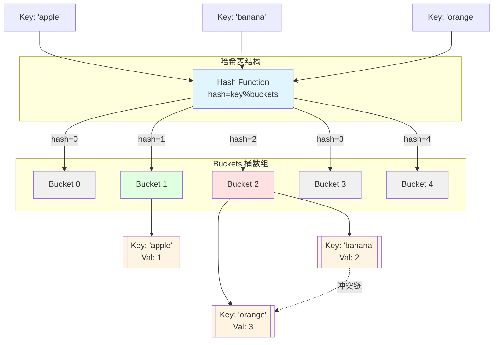
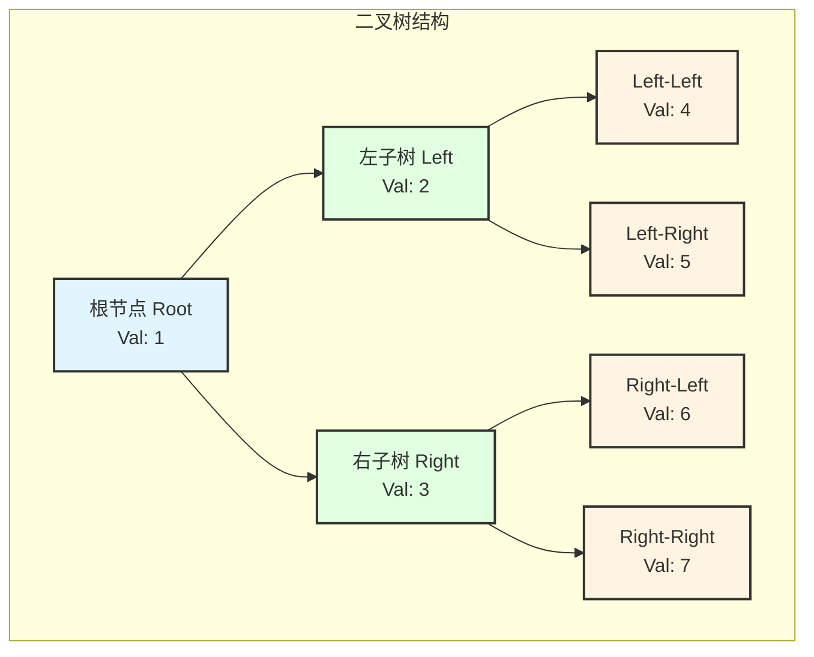
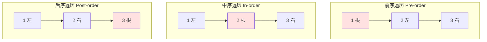
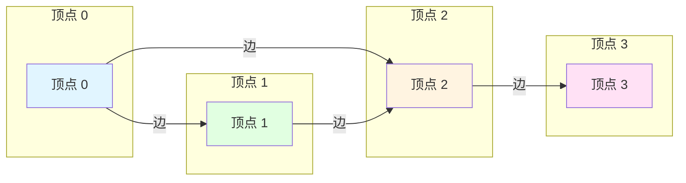
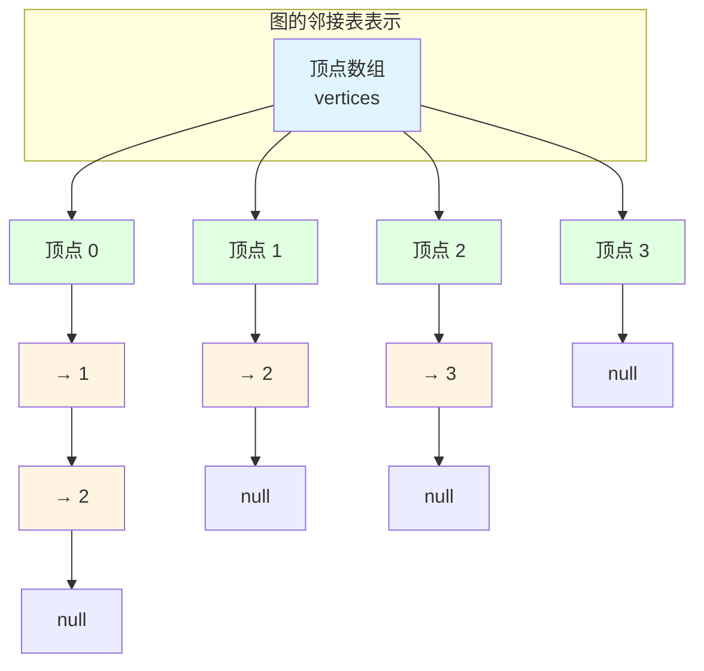

# 01-基础数据结构

**版本**: v1.0
**更新日期**: 2025-11-11
**适用于**: Go 1.25.3

---
## 📋 目录

- [01-基础数据结构](#01-基础数据结构)
  - [📚 章节概览](#章节概览)
  - [1. 数组 (Array)](#1-数组-array)
  - [2. 切片 (Slice)](#2-切片-slice)
  - [3. 链表 (Linked List)](#3-链表-linked-list)
  - [4. 栈 (Stack)](#4-栈-stack)
  - [5. 队列 (Queue)](#5-队列-queue)
  - [6. 哈希表 (Hash Map)](#6-哈希表-hash-map)
  - [7. 树 (Tree)](#7-树-tree)
  - [8. 图 (Graph)](#8-图-graph)
  - [💡 总结](#总结)
  - [🔗 相关章节](#相关章节)

---

## 📚 章节概览

本章介绍Go语言中常用的基础数据结构,包括数组、切片、链表、栈、队列、哈希表、树和图等。

---

## 1. 数组 (Array)

### 1.1 数组基础

```go
package main

import "fmt"

func main() {
    // 声明和初始化
    var arr1 [5]int
    arr2 := [5]int{1, 2, 3, 4, 5}
    arr3 := [...]int{1, 2, 3} // 自动推导长度

    fmt.Println(arr1) // [0 0 0 0 0]
    fmt.Println(arr2) // [1 2 3 4 5]
    fmt.Println(arr3) // [1 2 3]
}
```

### 1.2 数组操作

```go
// 遍历数组
arr := [5]int{1, 2, 3, 4, 5}

// 方式1: for循环
for i := 0; i < len(arr); i++ {
    fmt.Printf("arr[%d] = %d\n", i, arr[i])
}

// 方式2: range
for index, value := range arr {
    fmt.Printf("arr[%d] = %d\n", index, value)
}
```

---

## 2. 切片 (Slice)

### 2.1 切片基础

```go
package main

import "fmt"

func main() {
    // 创建切片
    slice1 := []int{1, 2, 3}
    slice2 := make([]int, 5)      // 长度5
    slice3 := make([]int, 5, 10)  // 长度5,容量10

    fmt.Printf("slice1: %v, len: %d, cap: %d\n",
               slice1, len(slice1), cap(slice1))
}
```

### 2.2 切片操作

```go
// 追加元素
slice := []int{1, 2, 3}
slice = append(slice, 4, 5)

// 切片截取
subSlice := slice[1:4]  // [2 3 4]

// 复制切片
dst := make([]int, len(slice))
copy(dst, slice)
```

---

## 3. 链表 (Linked List)

### 3.1 单链表实现

```go
package main

import "fmt"

// 定义节点
type Node struct {
    Data int
    Next *Node
}

// 定义链表
type LinkedList struct {
    Head *Node
    Size int
}

// 在头部插入
func (list *LinkedList) InsertAtHead(data int) {
    newNode := &Node{Data: data}
    newNode.Next = list.Head
    list.Head = newNode
    list.Size++
}

// 在尾部插入
func (list *LinkedList) InsertAtTail(data int) {
    newNode := &Node{Data: data}

    if list.Head == nil {
        list.Head = newNode
        list.Size++
        return
    }

    current := list.Head
    for current.Next != nil {
        current = current.Next
    }
    current.Next = newNode
    list.Size++
}

// 打印链表
func (list *LinkedList) Print() {
    current := list.Head
    for current != nil {
        fmt.Printf("%d -> ", current.Data)
        current = current.Next
    }
    fmt.Println("nil")
}

func main() {
    list := &LinkedList{}
    list.InsertAtHead(3)
    list.InsertAtHead(2)
    list.InsertAtHead(1)
    list.InsertAtTail(4)

    list.Print() // 1 -> 2 -> 3 -> 4 -> nil
}
```

---

## 4. 栈 (Stack)

### 4.1 栈实现

```go
package main

import (
    "errors"
    "fmt"
)

// 使用切片实现栈
type Stack struct {
    items []interface{}
}

// 入栈
func (s *Stack) Push(item interface{}) {
    s.items = append(s.items, item)
}

// 出栈
func (s *Stack) Pop() (interface{}, error) {
    if len(s.items) == 0 {
        return nil, errors.New("stack is empty")
    }

    item := s.items[len(s.items)-1]
    s.items = s.items[:len(s.items)-1]
    return item, nil
}

// 查看栈顶
func (s *Stack) Peek() (interface{}, error) {
    if len(s.items) == 0 {
        return nil, errors.New("stack is empty")
    }
    return s.items[len(s.items)-1], nil
}

// 判断是否为空
func (s *Stack) IsEmpty() bool {
    return len(s.items) == 0
}

func main() {
    stack := &Stack{}
    stack.Push(1)
    stack.Push(2)
    stack.Push(3)

    fmt.Println(stack.Pop())  // 3
    fmt.Println(stack.Peek()) // 2
}
```

---

## 5. 队列 (Queue)

### 5.1 队列实现

```go
package main

import (
    "errors"
    "fmt"
)

// 使用切片实现队列
type Queue struct {
    items []interface{}
}

// 入队
func (q *Queue) Enqueue(item interface{}) {
    q.items = append(q.items, item)
}

// 出队
func (q *Queue) Dequeue() (interface{}, error) {
    if len(q.items) == 0 {
        return nil, errors.New("queue is empty")
    }

    item := q.items[0]
    q.items = q.items[1:]
    return item, nil
}

// 查看队首
func (q *Queue) Peek() (interface{}, error) {
    if len(q.items) == 0 {
        return nil, errors.New("queue is empty")
    }
    return q.items[0], nil
}

func main() {
    queue := &Queue{}
    queue.Enqueue(1)
    queue.Enqueue(2)
    queue.Enqueue(3)

    fmt.Println(queue.Dequeue()) // 1
    fmt.Println(queue.Peek())    // 2
}
```

---

## 6. 哈希表 (Hash Map)

### 6.1 哈希表内部结构可视化



### 6.2 Map基础

```go
package main

import "fmt"

func main() {
    // 创建map
    m1 := make(map[string]int)
    m2 := map[string]int{
        "apple":  1,
        "banana": 2,
    }

    // 添加/修改
    m1["orange"] = 3

    // 查询
    value, exists := m1["orange"]
    if exists {
        fmt.Println(value)
    }

    // 删除
    delete(m1, "orange")

    // 遍历
    for key, value := range m2 {
        fmt.Printf("%s: %d\n", key, value)
    }
}
```

---

## 7. 树 (Tree)

### 7.1 二叉树结构可视化



#### 二叉树遍历顺序可视化



### 7.2 二叉树实现

```go
package main

import "fmt"

// 树节点
type TreeNode struct {
    Val   int
    Left  *TreeNode
    Right *TreeNode
}

// 前序遍历
func preorderTraversal(root *TreeNode) []int {
    if root == nil {
        return []int{}
    }

    result := []int{root.Val}
    result = append(result, preorderTraversal(root.Left)...)
    result = append(result, preorderTraversal(root.Right)...)
    return result
}

// 中序遍历
func inorderTraversal(root *TreeNode) []int {
    if root == nil {
        return []int{}
    }

    result := inorderTraversal(root.Left)
    result = append(result, root.Val)
    result = append(result, inorderTraversal(root.Right)...)
    return result
}

// 后序遍历
func postorderTraversal(root *TreeNode) []int {
    if root == nil {
        return []int{}
    }

    result := postorderTraversal(root.Left)
    result = append(result, postorderTraversal(root.Right)...)
    result = append(result, root.Val)
    return result
}

func main() {
    root := &TreeNode{Val: 1}
    root.Left = &TreeNode{Val: 2}
    root.Right = &TreeNode{Val: 3}

    fmt.Println("前序:", preorderTraversal(root))
    fmt.Println("中序:", inorderTraversal(root))
    fmt.Println("后序:", postorderTraversal(root))
}
```

---

## 8. 图 (Graph)

### 8.1 图的邻接表可视化



#### 邻接表存储结构



### 8.2 邻接表实现

```go
package main

import "fmt"

// 图结构
type Graph struct {
    vertices map[int][]int
}

// 创建图
func NewGraph() *Graph {
    return &Graph{
        vertices: make(map[int][]int),
    }
}

// 添加边
func (g *Graph) AddEdge(v1, v2 int) {
    g.vertices[v1] = append(g.vertices[v1], v2)
    // 如果是无向图,添加反向边
    // g.vertices[v2] = append(g.vertices[v2], v1)
}

// 打印图
func (g *Graph) Print() {
    for vertex, edges := range g.vertices {
        fmt.Printf("%d -> %v\n", vertex, edges)
    }
}

func main() {
    graph := NewGraph()
    graph.AddEdge(0, 1)
    graph.AddEdge(0, 2)
    graph.AddEdge(1, 2)
    graph.AddEdge(2, 3)

    graph.Print()
}
```

---

## 💡 总结

本章介绍了Go语言中的基础数据结构:

| 数据结构 | 特点 | 适用场景 |
|---------|------|---------|
| 数组 | 固定大小,连续内存 | 固定长度数据 |
| 切片 | 动态大小,引用类型 | 动态数据集合 |
| 链表 | 动态插入删除 | 频繁插入删除 |
| 栈 | 后进先出 (LIFO) | 函数调用,表达式求值 |
| 队列 | 先进先出 (FIFO) | 任务调度,BFS |
| 哈希表 | O(1)查找 | 快速查找,去重 |
| 树 | 层次结构 | 文件系统,搜索 |
| 图 | 节点关系 | 社交网络,路径查找 |

---

## 🔗 相关章节
