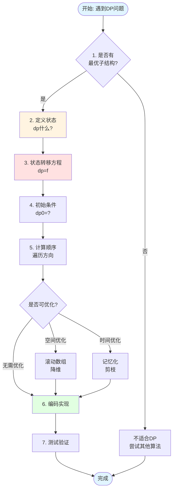
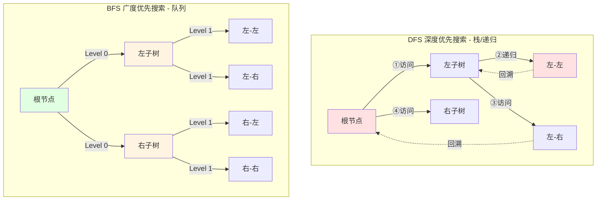
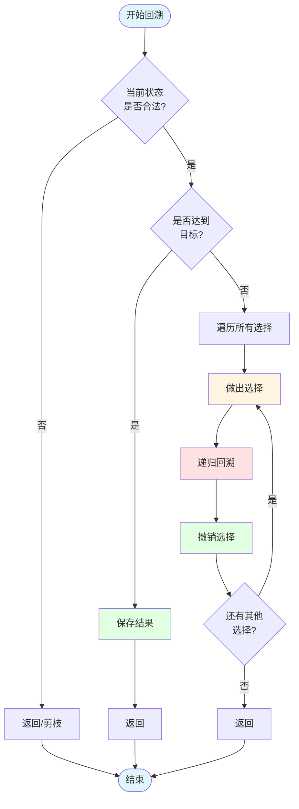

# 03-算法模式

> Go语言常见算法解题模式与技巧

---

## 📋 目录

- [03-算法模式](#03-算法模式)
  - [📚 目录](#-目录)
  - [📚 章节概览](#-章节概览)
  - [1. 双指针模式](#1-双指针模式)
    - [1.1 对撞指针](#11-对撞指针)
    - [1.2 快慢指针](#12-快慢指针)
    - [1.3 滑动窗口](#13-滑动窗口)
  - [2. 递归与分治](#2-递归与分治)
    - [2.1 经典递归](#21-经典递归)
    - [2.2 分治算法](#22-分治算法)
  - [3. 动态规划模式](#3-动态规划模式)
    - [3.1 动态规划解题流程](#31-动态规划解题流程)
    - [3.2 线性DP示例](#32-线性dp示例)
    - [3.2 区间DP](#32-区间dp)
  - [4. 搜索算法](#4-搜索算法)
    - [4.1 DFS vs BFS 可视化对比](#41-dfs-vs-bfs-可视化对比)
      - [回溯算法流程图](#回溯算法流程图)
    - [4.2 DFS深度优先实现](#42-dfs深度优先实现)
    - [4.3 BFS广度优先实现](#43-bfs广度优先实现)
  - [5. 贪心策略](#5-贪心策略)
    - [5.1 区间调度](#51-区间调度)
    - [5.2 数字贪心](#52-数字贪心)
  - [6. 位运算技巧](#6-位运算技巧)
    - [6.1 基本技巧](#61-基本技巧)
    - [6.2 实战应用](#62-实战应用)
  - [💡 算法选择指南](#-算法选择指南)
    - [问题类型识别](#问题类型识别)
    - [时间复杂度参考](#时间复杂度参考)
  - [🔗 相关章节](#-相关章节)

## 📚 章节概览

本章总结Go语言中常见的算法解题模式，帮助快速识别问题类型并选择合适的解决方案。

---

## 1. 双指针模式

### 1.1 对撞指针

**适用场景**: 有序数组、字符串回文、两数之和

```go
package main

import "fmt"

// 两数之和（有序数组）
func twoSum(numbers []int, target int) []int {
    left, right := 0, len(numbers)-1
    
    for left < right {
        sum := numbers[left] + numbers[right]
        if sum == target {
            return []int{left, right}
        } else if sum < target {
            left++
        } else {
            right--
        }
    }
    
    return nil
}

// 判断回文串
func isPalindrome(s string) bool {
    left, right := 0, len(s)-1
    
    for left < right {
        if s[left] != s[right] {
            return false
        }
        left++
        right--
    }
    
    return true
}

// 反转数组
func reverseArray(arr []int) {
    left, right := 0, len(arr)-1
    
    for left < right {
        arr[left], arr[right] = arr[right], arr[left]
        left++
        right--
    }
}

func main() {
    nums := []int{2, 7, 11, 15}
    result := twoSum(nums, 9)
    fmt.Println("Two Sum:", result)
    
    fmt.Println("Is Palindrome:", isPalindrome("racecar"))
}
```

### 1.2 快慢指针

**适用场景**: 链表环检测、链表中点、删除倒数第N个节点

```go
package main

type ListNode struct {
    Val  int
    Next *ListNode
}

// 检测链表环
func hasCycle(head *ListNode) bool {
    if head == nil || head.Next == nil {
        return false
    }
    
    slow, fast := head, head.Next
    
    for fast != nil && fast.Next != nil {
        if slow == fast {
            return true
        }
        slow = slow.Next
        fast = fast.Next.Next
    }
    
    return false
}

// 找到链表中点
func findMiddle(head *ListNode) *ListNode {
    if head == nil {
        return nil
    }
    
    slow, fast := head, head
    
    for fast != nil && fast.Next != nil {
        slow = slow.Next
        fast = fast.Next.Next
    }
    
    return slow
}

// 删除倒数第N个节点
func removeNthFromEnd(head *ListNode, n int) *ListNode {
    dummy := &ListNode{Next: head}
    slow, fast := dummy, dummy
    
    // fast先走n+1步
    for i := 0; i <= n; i++ {
        fast = fast.Next
    }
    
    // 同时移动
    for fast != nil {
        slow = slow.Next
        fast = fast.Next
    }
    
    // 删除节点
    slow.Next = slow.Next.Next
    
    return dummy.Next
}
```

### 1.3 滑动窗口

**适用场景**: 子数组/子串问题、最大/最小长度

```go
package main

import "fmt"

// 最长无重复子串
func lengthOfLongestSubstring(s string) int {
    window := make(map[byte]int)
    left, maxLen := 0, 0
    
    for right := 0; right < len(s); right++ {
        char := s[right]
        window[char]++
        
        // 收缩窗口
        for window[char] > 1 {
            window[s[left]]--
            left++
        }
        
        maxLen = max(maxLen, right-left+1)
    }
    
    return maxLen
}

// 最小覆盖子串
func minWindow(s string, t string) string {
    need := make(map[byte]int)
    window := make(map[byte]int)
    
    for i := 0; i < len(t); i++ {
        need[t[i]]++
    }
    
    left, right := 0, 0
    valid := 0
    start, length := 0, len(s)+1
    
    for right < len(s) {
        c := s[right]
        right++
        
        if _, ok := need[c]; ok {
            window[c]++
            if window[c] == need[c] {
                valid++
            }
        }
        
        // 收缩窗口
        for valid == len(need) {
            if right-left < length {
                start = left
                length = right - left
            }
            
            d := s[left]
            left++
            
            if _, ok := need[d]; ok {
                if window[d] == need[d] {
                    valid--
                }
                window[d]--
            }
        }
    }
    
    if length == len(s)+1 {
        return ""
    }
    return s[start : start+length]
}

func max(a, b int) int {
    if a > b {
        return a
    }
    return b
}
```

---

## 2. 递归与分治

### 2.1 经典递归

```go
// 树的最大深度
func maxDepth(root *TreeNode) int {
    if root == nil {
        return 0
    }
    
    left := maxDepth(root.Left)
    right := maxDepth(root.Right)
    
    return max(left, right) + 1
}

// 二叉树的所有路径
func binaryTreePaths(root *TreeNode) []string {
    if root == nil {
        return nil
    }
    
    var result []string
    var dfs func(node *TreeNode, path string)
    
    dfs = func(node *TreeNode, path string) {
        if node.Left == nil && node.Right == nil {
            result = append(result, path+fmt.Sprint(node.Val))
            return
        }
        
        path += fmt.Sprint(node.Val) + "->"
        if node.Left != nil {
            dfs(node.Left, path)
        }
        if node.Right != nil {
            dfs(node.Right, path)
        }
    }
    
    dfs(root, "")
    return result
}
```

### 2.2 分治算法

```go
// 归并排序（分治）
func mergeSort(nums []int) []int {
    if len(nums) <= 1 {
        return nums
    }
    
    mid := len(nums) / 2
    left := mergeSort(nums[:mid])
    right := mergeSort(nums[mid:])
    
    return merge(left, right)
}

func merge(left, right []int) []int {
    result := make([]int, 0, len(left)+len(right))
    i, j := 0, 0
    
    for i < len(left) && j < len(right) {
        if left[i] <= right[j] {
            result = append(result, left[i])
            i++
        } else {
            result = append(result, right[j])
            j++
        }
    }
    
    result = append(result, left[i:]...)
    result = append(result, right[j:]...)
    
    return result
}
```

---

## 3. 动态规划模式

### 3.1 动态规划解题流程



### 3.2 线性DP示例

```go
// 最长递增子序列
func lengthOfLIS(nums []int) int {
    if len(nums) == 0 {
        return 0
    }
    
    dp := make([]int, len(nums))
    for i := range dp {
        dp[i] = 1
    }
    
    maxLen := 1
    for i := 1; i < len(nums); i++ {
        for j := 0; j < i; j++ {
            if nums[i] > nums[j] {
                dp[i] = max(dp[i], dp[j]+1)
            }
        }
        maxLen = max(maxLen, dp[i])
    }
    
    return maxLen
}

// 爬楼梯
func climbStairs(n int) int {
    if n <= 2 {
        return n
    }
    
    dp := make([]int, n+1)
    dp[1], dp[2] = 1, 2
    
    for i := 3; i <= n; i++ {
        dp[i] = dp[i-1] + dp[i-2]
    }
    
    return dp[n]
}
```

### 3.2 区间DP

```go
// 最长回文子串
func longestPalindrome(s string) string {
    n := len(s)
    if n < 2 {
        return s
    }
    
    dp := make([][]bool, n)
    for i := range dp {
        dp[i] = make([]bool, n)
        dp[i][i] = true
    }
    
    start, maxLen := 0, 1
    
    // 按长度遍历
    for length := 2; length <= n; length++ {
        for i := 0; i < n-length+1; i++ {
            j := i + length - 1
            
            if s[i] == s[j] {
                if length == 2 {
                    dp[i][j] = true
                } else {
                    dp[i][j] = dp[i+1][j-1]
                }
                
                if dp[i][j] && length > maxLen {
                    start = i
                    maxLen = length
                }
            }
        }
    }
    
    return s[start : start+maxLen]
}
```

---

## 4. 搜索算法

### 4.1 DFS vs BFS 可视化对比



#### 回溯算法流程图



### 4.2 DFS深度优先实现

```go
// 岛屿数量
func numIslands(grid [][]byte) int {
    if len(grid) == 0 {
        return 0
    }
    
    count := 0
    for i := 0; i < len(grid); i++ {
        for j := 0; j < len(grid[0]); j++ {
            if grid[i][j] == '1' {
                dfs(grid, i, j)
                count++
            }
        }
    }
    
    return count
}

func dfs(grid [][]byte, i, j int) {
    if i < 0 || i >= len(grid) || j < 0 || j >= len(grid[0]) || grid[i][j] == '0' {
        return
    }
    
    grid[i][j] = '0'
    dfs(grid, i+1, j)
    dfs(grid, i-1, j)
    dfs(grid, i, j+1)
    dfs(grid, i, j-1)
}
```

### 4.3 BFS广度优先实现

```go
// 二叉树的层序遍历
func levelOrder(root *TreeNode) [][]int {
    if root == nil {
        return nil
    }
    
    var result [][]int
    queue := []*TreeNode{root}
    
    for len(queue) > 0 {
        size := len(queue)
        level := make([]int, 0, size)
        
        for i := 0; i < size; i++ {
            node := queue[0]
            queue = queue[1:]
            
            level = append(level, node.Val)
            
            if node.Left != nil {
                queue = append(queue, node.Left)
            }
            if node.Right != nil {
                queue = append(queue, node.Right)
            }
        }
        
        result = append(result, level)
    }
    
    return result
}

// 最短路径
func shortestPath(grid [][]int) int {
    if len(grid) == 0 || grid[0][0] == 1 {
        return -1
    }
    
    m, n := len(grid), len(grid[0])
    queue := [][2]int{{0, 0}}
    visited := make(map[[2]int]bool)
    visited[[2]int{0, 0}] = true
    steps := 0
    
    dirs := [][2]int{{0, 1}, {1, 0}, {0, -1}, {-1, 0}}
    
    for len(queue) > 0 {
        size := len(queue)
        for i := 0; i < size; i++ {
            pos := queue[0]
            queue = queue[1:]
            
            if pos[0] == m-1 && pos[1] == n-1 {
                return steps
            }
            
            for _, dir := range dirs {
                x, y := pos[0]+dir[0], pos[1]+dir[1]
                if x >= 0 && x < m && y >= 0 && y < n && grid[x][y] == 0 && !visited[[2]int{x, y}] {
                    queue = append(queue, [2]int{x, y})
                    visited[[2]int{x, y}] = true
                }
            }
        }
        steps++
    }
    
    return -1
}
```

---

## 5. 贪心策略

### 5.1 区间调度

```go
import "sort"

type Interval struct {
    start, end int
}

// 最多不重叠区间
func eraseOverlapIntervals(intervals [][]int) int {
    if len(intervals) == 0 {
        return 0
    }
    
    // 按结束时间排序
    sort.Slice(intervals, func(i, j int) bool {
        return intervals[i][1] < intervals[j][1]
    })
    
    count := 1
    end := intervals[0][1]
    
    for i := 1; i < len(intervals); i++ {
        if intervals[i][0] >= end {
            count++
            end = intervals[i][1]
        }
    }
    
    return len(intervals) - count
}
```

### 5.2 数字贪心

```go
// 跳跃游戏
func canJump(nums []int) bool {
    maxReach := 0
    
    for i := 0; i < len(nums); i++ {
        if i > maxReach {
            return false
        }
        maxReach = max(maxReach, i+nums[i])
    }
    
    return true
}

// 买卖股票最佳时机
func maxProfit(prices []int) int {
    profit := 0
    
    for i := 1; i < len(prices); i++ {
        if prices[i] > prices[i-1] {
            profit += prices[i] - prices[i-1]
        }
    }
    
    return profit
}
```

---

## 6. 位运算技巧

### 6.1 基本技巧

```go
package main

import "fmt"

// 基本位运算技巧
func bitOperations() {
    // 判断奇偶
    isOdd := func(n int) bool {
        return n&1 == 1
    }
    
    // 交换两个数
    swap := func(a, b int) (int, int) {
        a ^= b
        b ^= a
        a ^= b
        return a, b
    }
    
    // 获取最低位的1
    lowbit := func(n int) int {
        return n & (-n)
    }
    
    // 统计1的个数
    countBits := func(n int) int {
        count := 0
        for n > 0 {
            n &= n - 1 // 清除最低位的1
            count++
        }
        return count
    }
    
    fmt.Println("Is 5 odd:", isOdd(5))
    fmt.Println("Swap 3, 5:", swap(3, 5))
    fmt.Println("Lowbit of 12:", lowbit(12))
    fmt.Println("Count bits of 15:", countBits(15))
}
```

### 6.2 实战应用

```go
// 只出现一次的数字
func singleNumber(nums []int) int {
    result := 0
    for _, num := range nums {
        result ^= num
    }
    return result
}

// 2的幂
func isPowerOfTwo(n int) bool {
    return n > 0 && (n&(n-1)) == 0
}

// 汉明距离
func hammingDistance(x, y int) int {
    xor := x ^ y
    count := 0
    for xor > 0 {
        count += xor & 1
        xor >>= 1
    }
    return count
}
```

---

## 💡 算法选择指南

### 问题类型识别

| 问题特征 | 推荐算法 | 典型题目 |
|---------|---------|---------|
| 有序数组、两数之和 | 双指针 | 两数之和、三数之和 |
| 子数组/子串 | 滑动窗口 | 最长无重复子串 |
| 链表环、中点 | 快慢指针 | 环形链表、链表中点 |
| 树、图遍历 | DFS/BFS | 岛屿数量、路径和 |
| 最优解、路径 | 动态规划 | 背包问题、最长子序列 |
| 局部最优 | 贪心 | 区间调度、跳跃游戏 |
| 二进制操作 | 位运算 | 单一数字、2的幂 |

### 时间复杂度参考

| 算法 | 时间复杂度 | 适用数据规模 |
|------|-----------|-------------|
| 双指针 | O(n) | n ≤ 10^6 |
| 滑动窗口 | O(n) | n ≤ 10^6 |
| 二分查找 | O(log n) | n ≤ 10^9 |
| DFS/BFS | O(n) | n ≤ 10^5 |
| 动态规划 | O(n²) | n ≤ 10^3 |
| 回溯 | O(2^n) | n ≤ 20 |

---

## 🔗 相关章节

- [01-基础数据结构](01-基础数据结构.md)
- [02-常用算法](02-常用算法.md)
- [04-实战案例](04-实战案例.md)

---

**维护者**: Documentation Team  
**创建日期**: 2025-10-22  
**最后更新**: 2025-10-22  
**文档状态**: ✅ 完成
