# 04-实战案例

> Go语言算法实战：LeetCode经典题目解析

---

## 📚 目录

- [04-实战案例](#04-实战案例)
  - [📚 目录](#-目录)
  - [📚 章节概览](#-章节概览)
  - [1. 数组问题 (Array)](#1-数组问题-array)
    - [1.1 两数之和](#11-两数之和)
      - [解题流程可视化](#解题流程可视化)
    - [1.2 三数之和](#12-三数之和)
    - [1.3 盛最多水的容器](#13-盛最多水的容器)
  - [2. 链表问题 (Linked List)](#2-链表问题-linked-list)
    - [2.1 反转链表](#21-反转链表)
    - [2.2 合并两个有序链表](#22-合并两个有序链表)
    - [2.3 环形链表II](#23-环形链表ii)
  - [3. 字符串问题 (String)](#3-字符串问题-string)
    - [3.1 最长回文子串](#31-最长回文子串)
    - [3.2 字符串相乘](#32-字符串相乘)
    - [3.3 有效的括号](#33-有效的括号)
  - [4. 树问题 (Tree)](#4-树问题-tree)
    - [4.1 二叉树的最大深度](#41-二叉树的最大深度)
    - [4.2 验证二叉搜索树](#42-验证二叉搜索树)
    - [4.3 二叉树的右视图](#43-二叉树的右视图)
  - [5. 动态规划 (DP)](#5-动态规划-dp)
    - [5.1 最大子数组和](#51-最大子数组和)
    - [5.2 爬楼梯](#52-爬楼梯)
    - [5.3 零钱兑换](#53-零钱兑换)
  - [6. 回溯问题 (Backtracking)](#6-回溯问题-backtracking)
    - [6.1 全排列](#61-全排列)
    - [6.2 子集](#62-子集)
    - [6.3 组合总和](#63-组合总和)
  - [7. 图问题 (Graph)](#7-图问题-graph)
    - [7.1 岛屿数量](#71-岛屿数量)
    - [7.2 课程表](#72-课程表)
    - [7.3 克隆图](#73-克隆图)
  - [8. 滑动窗口 (Sliding Window)](#8-滑动窗口-sliding-window)
    - [8.1 无重复字符的最长子串](#81-无重复字符的最长子串)
      - [滑动窗口可视化](#滑动窗口可视化)
    - [8.2 最小覆盖子串](#82-最小覆盖子串)
    - [8.3 滑动窗口最大值](#83-滑动窗口最大值)
  - [9. 二分查找 (Binary Search)](#9-二分查找-binary-search)
    - [9.1 搜索旋转排序数组](#91-搜索旋转排序数组)
    - [9.2 寻找峰值](#92-寻找峰值)
    - [9.3 在排序数组中查找元素的第一个和最后一个位置](#93-在排序数组中查找元素的第一个和最后一个位置)
  - [10. 堆/优先队列 (Heap)](#10-堆优先队列-heap)
    - [10.1 数据流的中位数](#101-数据流的中位数)
    - [10.2 前K个高频元素](#102-前k个高频元素)
    - [10.3 合并K个升序链表](#103-合并k个升序链表)
  - [💡 解题技巧总结](#-解题技巧总结)
    - [1. 时间复杂度速查](#1-时间复杂度速查)
    - [2. 空间优化技巧](#2-空间优化技巧)
    - [3. 常见陷阱](#3-常见陷阱)
    - [4. 调试技巧](#4-调试技巧)
  - [🔗 相关章节](#-相关章节)

## 📚 章节概览

本章精选**30个**LeetCode经典题目，覆盖10大类算法：

- 数组 (Array) - 3题
- 链表 (Linked List) - 3题  
- 字符串 (String) - 3题
- 树 (Tree) - 3题
- 动态规划 (DP) - 3题
- 回溯 (Backtracking) - 3题
- 图 (Graph) - 3题
- 滑动窗口 (Sliding Window) - 3题
- 二分查找 (Binary Search) - 3题
- 堆/优先队列 (Heap) - 3题

每题提供详细的Go语言解法、复杂度分析和解题思路，帮助你快速掌握算法面试技巧。

---

## 1. 数组问题 (Array)

### 1.1 两数之和

**LeetCode 1. Two Sum** | 难度：简单

**问题描述**:
给定一个整数数组 `nums` 和一个整数目标值 `target`，找出数组中和为目标值的两个整数，并返回它们的数组下标。

```go
package main

import "fmt"

// 方法1: 哈希表 - O(n) 时间，O(n) 空间
func twoSum(nums []int, target int) []int {
    hashMap := make(map[int]int)
    
    for i, num := range nums {
        complement := target - num
        if index, found := hashMap[complement]; found {
            return []int{index, i}
        }
        hashMap[num] = i
    }
    
    return nil
}

func main() {
    nums := []int{2, 7, 11, 15}
    target := 9
    result := twoSum(nums, target)
    fmt.Printf("索引: %v\n", result) // [0, 1]
}
```

**思路**:

1. 使用哈希表存储已遍历的数字和索引
2. 对每个数字，查找 `target - num` 是否在哈希表中
3. 找到则返回两个索引

#### 解题流程可视化

```mermaid
flowchart TD
    Start([开始]) --> Init[创建哈希表 hashMap]
    Init --> Loop{遍历数组 nums}
    
    Loop -->|遍历每个 num| Calc[计算 complement<br/>= target - num]
    
    Calc --> Check{complement<br/>在 hashMap 中?}
    
    Check -->|是| Found[返回<br/>hashMap和当前索引]
    Check -->|否| Store[存储<br/>hashMap = i]
    
    Store --> Loop
    Found --> End([找到答案])
    Loop -->|遍历结束| NotFound[返回 nil]
    NotFound --> End
    
    style Start fill:#e1f5ff
    style Found fill:#e1ffe1
    style Check fill:#fff4e1
    style End fill:#e1f5ff
```



**示例执行过程**:

```mermaid
graph LR
    subgraph "数组: 2, 7, 11, 15 | target = 9"
        N1[num=2, i=0]
        N2[num=7, i=1]
        N3[num=11, i=2]
        N4[num=15, i=3]
    end
    
    subgraph "哈希表变化"
        H0["{} 空"]
        H1["{2:0}"]
        H2["{2:0, 7:1} ✓ 找到!"]
    end
    
    N1 -->|complement=7<br/>不在表中| H1
    N2 -->|complement=2<br/>在表中!| H2
    
    style H2 fill:#e1ffe1
```



---

### 1.2 三数之和

**LeetCode 15. 3Sum** | 难度：中等

**问题描述**:
给定一个数组 `nums`，找出所有和为 0 的三元组。

```go
package main

import (
    "fmt"
    "sort"
)

// 排序 + 双指针 - O(n²) 时间，O(1) 空间
func threeSum(nums []int) [][]int {
    var result [][]int
    n := len(nums)
    
    if n < 3 {
        return result
    }
    
    // 排序
    sort.Ints(nums)
    
    for i := 0; i < n-2; i++ {
        // 跳过重复元素
        if i > 0 && nums[i] == nums[i-1] {
            continue
        }
        
        // 剪枝：如果最小的三个数之和大于0，后面不可能有解
        if nums[i] > 0 {
            break
        }
        
        // 双指针
        left, right := i+1, n-1
        target := -nums[i]
        
        for left < right {
            sum := nums[left] + nums[right]
            
            if sum == target {
                result = append(result, []int{nums[i], nums[left], nums[right]})
                
                // 跳过重复元素
                for left < right && nums[left] == nums[left+1] {
                    left++
                }
                for left < right && nums[right] == nums[right-1] {
                    right--
                }
                
                left++
                right--
            } else if sum < target {
                left++
            } else {
                right--
            }
        }
    }
    
    return result
}

func main() {
    nums := []int{-1, 0, 1, 2, -1, -4}
    result := threeSum(nums)
    fmt.Println("三数之和:", result)
}
```

**思路**:

1. 排序数组
2. 固定第一个数，用双指针找另外两个数
3. 注意去重

---

### 1.3 盛最多水的容器

**LeetCode 11. Container With Most Water** | 难度：中等

```go
package main

import "fmt"

// 双指针 - O(n) 时间，O(1) 空间
func maxArea(height []int) int {
    left, right := 0, len(height)-1
    maxArea := 0
    
    for left < right {
        // 计算当前面积
        h := min(height[left], height[right])
        width := right - left
        area := h * width
        maxArea = max(maxArea, area)
        
        // 移动较短的那边
        if height[left] < height[right] {
            left++
        } else {
            right--
        }
    }
    
    return maxArea
}

func min(a, b int) int {
    if a < b {
        return a
    }
    return b
}

func max(a, b int) int {
    if a > b {
        return a
    }
    return b
}

func main() {
    height := []int{1, 8, 6, 2, 5, 4, 8, 3, 7}
    result := maxArea(height)
    fmt.Println("最大面积:", result) // 49
}
```

---

## 2. 链表问题 (Linked List)

### 2.1 反转链表

**LeetCode 206. Reverse Linked List** | 难度：简单

```go
package main

type ListNode struct {
    Val  int
    Next *ListNode
}

// 迭代法 - O(n) 时间，O(1) 空间
func reverseList(head *ListNode) *ListNode {
    var prev *ListNode
    curr := head
    
    for curr != nil {
        next := curr.Next
        curr.Next = prev
        prev = curr
        curr = next
    }
    
    return prev
}

// 递归法 - O(n) 时间，O(n) 空间
func reverseListRecursive(head *ListNode) *ListNode {
    if head == nil || head.Next == nil {
        return head
    }
    
    newHead := reverseListRecursive(head.Next)
    head.Next.Next = head
    head.Next = nil
    
    return newHead
}
```

---

### 2.2 合并两个有序链表

**LeetCode 21. Merge Two Sorted Lists** | 难度：简单

```go
// 迭代法
func mergeTwoLists(l1 *ListNode, l2 *ListNode) *ListNode {
    dummy := &ListNode{}
    current := dummy
    
    for l1 != nil && l2 != nil {
        if l1.Val < l2.Val {
            current.Next = l1
            l1 = l1.Next
        } else {
            current.Next = l2
            l2 = l2.Next
        }
        current = current.Next
    }
    
    if l1 != nil {
        current.Next = l1
    }
    if l2 != nil {
        current.Next = l2
    }
    
    return dummy.Next
}

// 递归法
func mergeTwoListsRecursive(l1 *ListNode, l2 *ListNode) *ListNode {
    if l1 == nil {
        return l2
    }
    if l2 == nil {
        return l1
    }
    
    if l1.Val < l2.Val {
        l1.Next = mergeTwoListsRecursive(l1.Next, l2)
        return l1
    } else {
        l2.Next = mergeTwoListsRecursive(l1, l2.Next)
        return l2
    }
}
```

---

### 2.3 环形链表II

**LeetCode 142. Linked List Cycle II** | 难度：中等

```go
// 快慢指针 - O(n) 时间，O(1) 空间
func detectCycle(head *ListNode) *ListNode {
    if head == nil || head.Next == nil {
        return nil
    }
    
    // 第一步：判断是否有环
    slow, fast := head, head
    hasCycle := false
    
    for fast != nil && fast.Next != nil {
        slow = slow.Next
        fast = fast.Next.Next
        
        if slow == fast {
            hasCycle = true
            break
        }
    }
    
    if !hasCycle {
        return nil
    }
    
    // 第二步：找到环的入口
    slow = head
    for slow != fast {
        slow = slow.Next
        fast = fast.Next
    }
    
    return slow
}
```

---

## 3. 字符串问题 (String)

### 3.1 最长回文子串

**LeetCode 5. Longest Palindromic Substring** | 难度：中等

```go
package main

import "fmt"

// 中心扩展法 - O(n²) 时间，O(1) 空间
func longestPalindrome(s string) string {
    if len(s) < 2 {
        return s
    }
    
    start, maxLen := 0, 1
    
    // 辅助函数：从中心向两边扩展
    expandAroundCenter := func(left, right int) int {
        for left >= 0 && right < len(s) && s[left] == s[right] {
            left--
            right++
        }
        return right - left - 1
    }
    
    for i := 0; i < len(s); i++ {
        // 奇数长度回文
        len1 := expandAroundCenter(i, i)
        // 偶数长度回文
        len2 := expandAroundCenter(i, i+1)
        
        length := max(len1, len2)
        
        if length > maxLen {
            start = i - (length-1)/2
            maxLen = length
        }
    }
    
    return s[start : start+maxLen]
}

func main() {
    s := "babad"
    fmt.Println("最长回文子串:", longestPalindrome(s)) // "bab" or "aba"
}
```

---

### 3.2 字符串相乘

**LeetCode 43. Multiply Strings** | 难度：中等

```go
package main

import (
    "fmt"
    "strings"
)

func multiply(num1 string, num2 string) string {
    if num1 == "0" || num2 == "0" {
        return "0"
    }
    
    m, n := len(num1), len(num2)
    result := make([]int, m+n)
    
    // 从后往前遍历
    for i := m - 1; i >= 0; i-- {
        for j := n - 1; j >= 0; j-- {
            mul := int(num1[i]-'0') * int(num2[j]-'0')
            p1, p2 := i+j, i+j+1
            sum := mul + result[p2]
            
            result[p2] = sum % 10
            result[p1] += sum / 10
        }
    }
    
    // 转换为字符串
    var sb strings.Builder
    for i, digit := range result {
        if i == 0 && digit == 0 {
            continue
        }
        sb.WriteByte(byte(digit + '0'))
    }
    
    return sb.String()
}

func main() {
    fmt.Println(multiply("123", "456")) // "56088"
}
```

---

### 3.3 有效的括号

**LeetCode 20. Valid Parentheses** | 难度：简单

```go
package main

import "fmt"

func isValid(s string) bool {
    stack := []rune{}
    pairs := map[rune]rune{
        ')': '(',
        ']': '[',
        '}': '{',
    }
    
    for _, char := range s {
        if char == '(' || char == '[' || char == '{' {
            // 左括号入栈
            stack = append(stack, char)
        } else {
            // 右括号
            if len(stack) == 0 {
                return false
            }
            
            top := stack[len(stack)-1]
            stack = stack[:len(stack)-1]
            
            if pairs[char] != top {
                return false
            }
        }
    }
    
    return len(stack) == 0
}

func main() {
    fmt.Println(isValid("()[]{}"))   // true
    fmt.Println(isValid("([)]"))     // false
    fmt.Println(isValid("{[]}"))     // true
}
```

---

## 4. 树问题 (Tree)

### 4.1 二叉树的最大深度

**LeetCode 104. Maximum Depth of Binary Tree** | 难度：简单

```go
package main

type TreeNode struct {
    Val   int
    Left  *TreeNode
    Right *TreeNode
}

// 递归法 - O(n) 时间，O(h) 空间
func maxDepth(root *TreeNode) int {
    if root == nil {
        return 0
    }
    
    leftDepth := maxDepth(root.Left)
    rightDepth := maxDepth(root.Right)
    
    return max(leftDepth, rightDepth) + 1
}

// BFS法
func maxDepthBFS(root *TreeNode) int {
    if root == nil {
        return 0
    }
    
    queue := []*TreeNode{root}
    depth := 0
    
    for len(queue) > 0 {
        size := len(queue)
        for i := 0; i < size; i++ {
            node := queue[0]
            queue = queue[1:]
            
            if node.Left != nil {
                queue = append(queue, node.Left)
            }
            if node.Right != nil {
                queue = append(queue, node.Right)
            }
        }
        depth++
    }
    
    return depth
}
```

---

### 4.2 验证二叉搜索树

**LeetCode 98. Validate Binary Search Tree** | 难度：中等

```go
package main

import "math"

// 递归法 - O(n) 时间，O(h) 空间
func isValidBST(root *TreeNode) bool {
    return validate(root, math.MinInt64, math.MaxInt64)
}

func validate(node *TreeNode, min, max int) bool {
    if node == nil {
        return true
    }
    
    if node.Val <= min || node.Val >= max {
        return false
    }
    
    return validate(node.Left, min, node.Val) && 
           validate(node.Right, node.Val, max)
}

// 中序遍历法
func isValidBSTInorder(root *TreeNode) bool {
    var inorder func(*TreeNode) []int
    inorder = func(node *TreeNode) []int {
        if node == nil {
            return []int{}
        }
        
        result := inorder(node.Left)
        result = append(result, node.Val)
        result = append(result, inorder(node.Right)...)
        
        return result
    }
    
    values := inorder(root)
    for i := 1; i < len(values); i++ {
        if values[i] <= values[i-1] {
            return false
        }
    }
    
    return true
}
```

---

### 4.3 二叉树的右视图

**LeetCode 199. Binary Tree Right Side View** | 难度：中等

```go
// BFS层序遍历 - O(n) 时间，O(w) 空间（w为树的宽度）
func rightSideView(root *TreeNode) []int {
    if root == nil {
        return []int{}
    }
    
    var result []int
    queue := []*TreeNode{root}
    
    for len(queue) > 0 {
        size := len(queue)
        
        for i := 0; i < size; i++ {
            node := queue[0]
            queue = queue[1:]
            
            // 每层的最后一个节点
            if i == size-1 {
                result = append(result, node.Val)
            }
            
            if node.Left != nil {
                queue = append(queue, node.Left)
            }
            if node.Right != nil {
                queue = append(queue, node.Right)
            }
        }
    }
    
    return result
}
```

---

## 5. 动态规划 (DP)

### 5.1 最大子数组和

**LeetCode 53. Maximum Subarray** | 难度：中等

```go
package main

import "fmt"

// 动态规划 - O(n) 时间，O(1) 空间
func maxSubArray(nums []int) int {
    if len(nums) == 0 {
        return 0
    }
    
    maxSum := nums[0]
    currentSum := nums[0]
    
    for i := 1; i < len(nums); i++ {
        // 当前和小于0就重新开始
        currentSum = max(nums[i], currentSum+nums[i])
        maxSum = max(maxSum, currentSum)
    }
    
    return maxSum
}

func main() {
    nums := []int{-2, 1, -3, 4, -1, 2, 1, -5, 4}
    fmt.Println("最大子数组和:", maxSubArray(nums)) // 6
}
```

---

### 5.2 爬楼梯

**LeetCode 70. Climbing Stairs** | 难度：简单

```go
// 动态规划 - O(n) 时间，O(1) 空间
func climbStairs(n int) int {
    if n <= 2 {
        return n
    }
    
    prev2, prev1 := 1, 2
    
    for i := 3; i <= n; i++ {
        current := prev1 + prev2
        prev2 = prev1
        prev1 = current
    }
    
    return prev1
}
```

---

### 5.3 零钱兑换

**LeetCode 322. Coin Change** | 难度：中等

```go
package main

import (
    "fmt"
    "math"
)

// 动态规划 - O(amount * n) 时间，O(amount) 空间
func coinChange(coins []int, amount int) int {
    dp := make([]int, amount+1)
    
    // 初始化
    for i := 1; i <= amount; i++ {
        dp[i] = math.MaxInt32
    }
    dp[0] = 0
    
    // 状态转移
    for i := 1; i <= amount; i++ {
        for _, coin := range coins {
            if i >= coin && dp[i-coin] != math.MaxInt32 {
                dp[i] = min(dp[i], dp[i-coin]+1)
            }
        }
    }
    
    if dp[amount] == math.MaxInt32 {
        return -1
    }
    return dp[amount]
}

func min(a, b int) int {
    if a < b {
        return a
    }
    return b
}

func main() {
    coins := []int{1, 2, 5}
    amount := 11
    fmt.Println("最少硬币数:", coinChange(coins, amount)) // 3 (11 = 5 + 5 + 1)
}
```

---

## 6. 回溯问题 (Backtracking)

### 6.1 全排列

**LeetCode 46. Permutations** | 难度：中等

```go
package main

import "fmt"

func permute(nums []int) [][]int {
    var result [][]int
    var backtrack func([]int)
    
    backtrack = func(path []int) {
        if len(path) == len(nums) {
            temp := make([]int, len(path))
            copy(temp, path)
            result = append(result, temp)
            return
        }
        
        for _, num := range nums {
            if contains(path, num) {
                continue
            }
            
            path = append(path, num)
            backtrack(path)
            path = path[:len(path)-1]
        }
    }
    
    backtrack([]int{})
    return result
}

func contains(arr []int, target int) bool {
    for _, v := range arr {
        if v == target {
            return true
        }
    }
    return false
}

func main() {
    nums := []int{1, 2, 3}
    result := permute(nums)
    fmt.Println("全排列:", result)
}
```

---

### 6.2 子集

**LeetCode 78. Subsets** | 难度：中等

```go
func subsets(nums []int) [][]int {
    var result [][]int
    var backtrack func(int, []int)
    
    backtrack = func(start int, path []int) {
        // 每次都是一个有效子集
        temp := make([]int, len(path))
        copy(temp, path)
        result = append(result, temp)
        
        for i := start; i < len(nums); i++ {
            path = append(path, nums[i])
            backtrack(i+1, path)
            path = path[:len(path)-1]
        }
    }
    
    backtrack(0, []int{})
    return result
}
```

---

### 6.3 组合总和

**LeetCode 39. Combination Sum** | 难度：中等

```go
func combinationSum(candidates []int, target int) [][]int {
    var result [][]int
    var backtrack func(int, int, []int)
    
    backtrack = func(start, remain int, path []int) {
        if remain < 0 {
            return
        }
        
        if remain == 0 {
            temp := make([]int, len(path))
            copy(temp, path)
            result = append(result, temp)
            return
        }
        
        for i := start; i < len(candidates); i++ {
            path = append(path, candidates[i])
            // 因为可以重复使用，所以还是从i开始
            backtrack(i, remain-candidates[i], path)
            path = path[:len(path)-1]
        }
    }
    
    backtrack(0, target, []int{})
    return result
}
```

---

## 7. 图问题 (Graph)

### 7.1 岛屿数量

**LeetCode 200. Number of Islands** | 难度：中等

**题目描述**: 给定一个由 `'1'`（陆地）和 `'0'`（水）组成的二维网格，计算岛屿的数量。

```go
package main

import "fmt"

func numIslands(grid [][]byte) int {
    if len(grid) == 0 {
        return 0
    }
    
    count := 0
    rows, cols := len(grid), len(grid[0])
    
    var dfs func(int, int)
    dfs = func(r, c int) {
        // 边界检查
        if r < 0 || r >= rows || c < 0 || c >= cols || grid[r][c] == '0' {
            return
        }
        
        // 标记已访问
        grid[r][c] = '0'
        
        // 递归访问四个方向
        dfs(r+1, c)
        dfs(r-1, c)
        dfs(r, c+1)
        dfs(r, c-1)
    }
    
    for r := 0; r < rows; r++ {
        for c := 0; c < cols; c++ {
            if grid[r][c] == '1' {
                count++
                dfs(r, c) // 沉没整个岛屿
            }
        }
    }
    
    return count
}

func main() {
    grid := [][]byte{
        {'1', '1', '0', '0', '0'},
        {'1', '1', '0', '0', '0'},
        {'0', '0', '1', '0', '0'},
        {'0', '0', '0', '1', '1'},
    }
    fmt.Println("岛屿数量:", numIslands(grid)) // 输出: 3
}
```

**复杂度分析**:

- 时间复杂度: O(m×n)，m和n分别是网格的行数和列数
- 空间复杂度: O(m×n)，递归栈空间

**解题思路**:

1. 遍历网格，遇到 `'1'` 就进行DFS
2. DFS过程中将访问过的陆地标记为 `'0'`
3. 每次DFS完成计数加1

---

### 7.2 课程表

**LeetCode 207. Course Schedule** | 难度：中等

**题目描述**: 判断是否能完成所有课程（检测有向图是否有环）。

```go
func canFinish(numCourses int, prerequisites [][]int) bool {
    // 构建邻接表和入度数组
    graph := make([][]int, numCourses)
    inDegree := make([]int, numCourses)
    
    for _, prereq := range prerequisites {
        course, pre := prereq[0], prereq[1]
        graph[pre] = append(graph[pre], course)
        inDegree[course]++
    }
    
    // BFS拓扑排序
    queue := []int{}
    for i := 0; i < numCourses; i++ {
        if inDegree[i] == 0 {
            queue = append(queue, i)
        }
    }
    
    count := 0
    for len(queue) > 0 {
        course := queue[0]
        queue = queue[1:]
        count++
        
        for _, next := range graph[course] {
            inDegree[next]--
            if inDegree[next] == 0 {
                queue = append(queue, next)
            }
        }
    }
    
    return count == numCourses
}
```

**复杂度分析**:

- 时间复杂度: O(V+E)，V是课程数，E是先修课程关系数
- 空间复杂度: O(V+E)

**解题思路**:

1. 构建有向图（邻接表）
2. 使用BFS拓扑排序
3. 如果能访问所有节点，说明无环

---

### 7.3 克隆图

**LeetCode 133. Clone Graph** | 难度：中等

**题目描述**: 深度复制一个无向连通图。

```go
type Node struct {
    Val       int
    Neighbors []*Node
}

func cloneGraph(node *Node) *Node {
    if node == nil {
        return nil
    }
    
    visited := make(map[*Node]*Node)
    
    var dfs func(*Node) *Node
    dfs = func(n *Node) *Node {
        if clone, exists := visited[n]; exists {
            return clone
        }
        
        // 创建克隆节点
        clone := &Node{Val: n.Val}
        visited[n] = clone
        
        // 递归克隆邻居
        for _, neighbor := range n.Neighbors {
            clone.Neighbors = append(clone.Neighbors, dfs(neighbor))
        }
        
        return clone
    }
    
    return dfs(node)
}
```

**复杂度分析**:

- 时间复杂度: O(V+E)
- 空间复杂度: O(V)

---

## 8. 滑动窗口 (Sliding Window)

### 8.1 无重复字符的最长子串

**LeetCode 3. Longest Substring Without Repeating Characters** | 难度：中等

```go
func lengthOfLongestSubstring(s string) int {
    charSet := make(map[byte]bool)
    left, maxLen := 0, 0
    
    for right := 0; right < len(s); right++ {
        // 如果字符重复，移动左指针
        for charSet[s[right]] {
            delete(charSet, s[left])
            left++
        }
        
        charSet[s[right]] = true
        maxLen = max(maxLen, right-left+1)
    }
    
    return maxLen
}

func max(a, b int) int {
    if a > b {
        return a
    }
    return b
}
```

**复杂度分析**:

- 时间复杂度: O(n)
- 空间复杂度: O(min(n, m))，m是字符集大小

**解题思路**:

1. 使用滑动窗口 + 哈希集合
2. 右指针扩展窗口，左指针收缩窗口
3. 记录最大窗口大小

#### 滑动窗口可视化

```mermaid
flowchart TD
    Start([开始]) --> Init[left=0, right=0<br/>charSet={}]
    Init --> RightMove{right < len}
    
    RightMove -->|是| CheckDup{s重复?}
    
    CheckDup -->|是| LeftMove[left++<br/>删除 sleft]
    LeftMove --> CheckDup
    
    CheckDup -->|否| AddChar[加入 sright]
    AddChar --> UpdateMax[更新 maxLen]
    UpdateMax --> RightInc[right++]
    RightInc --> RightMove
    
    RightMove -->|否| Return[返回 maxLen]
    Return --> End([结束])
    
    style Start fill:#e1f5ff
    style AddChar fill:#e1ffe1
    style UpdateMax fill:#fff4e1
    style End fill:#e1f5ff
```

**示例执行过程 (s = "abcabcbb")**:

```mermaid
graph TB
    subgraph "初始状态"
        S1["a b c a b c b b<br/>L R<br/>窗口: a, maxLen=1"]
    end
    
    subgraph "扩展窗口"
        S2["a b c a b c b b<br/>L   R<br/>窗口: abc, maxLen=3"]
    end
    
    subgraph "遇到重复 'a'"
        S3["a b c a b c b b<br/>L     R<br/>移动 left → 删除 a"]
        S4["a b c a b c b b<br/>  L   R<br/>窗口: bca, maxLen=3"]
    end
    
    subgraph "继续扩展"
        S5["a b c a b c b b<br/>  L     R<br/>窗口: bcab, maxLen=3"]
    end
    
    S1 --> S2
    S2 --> S3
    S3 --> S4
    S4 --> S5
    
    style S2 fill:#e1ffe1
    style S4 fill:#fff4e1
```



---

### 8.2 最小覆盖子串

**LeetCode 76. Minimum Window Substring** | 难度：困难

```go
func minWindow(s string, t string) string {
    if len(s) < len(t) {
        return ""
    }
    
    // 统计t中字符频率
    need := make(map[byte]int)
    for i := range t {
        need[t[i]]++
    }
    
    window := make(map[byte]int)
    left, right := 0, 0
    valid := 0
    start, minLen := 0, len(s)+1
    
    for right < len(s) {
        c := s[right]
        right++
        
        if _, ok := need[c]; ok {
            window[c]++
            if window[c] == need[c] {
                valid++
            }
        }
        
        // 收缩窗口
        for valid == len(need) {
            // 更新最小窗口
            if right-left < minLen {
                start = left
                minLen = right - left
            }
            
            d := s[left]
            left++
            
            if _, ok := need[d]; ok {
                if window[d] == need[d] {
                    valid--
                }
                window[d]--
            }
        }
    }
    
    if minLen == len(s)+1 {
        return ""
    }
    return s[start : start+minLen]
}
```

**复杂度分析**:

- 时间复杂度: O(m+n)，m和n分别是s和t的长度
- 空间复杂度: O(k)，k是字符集大小

---

### 8.3 滑动窗口最大值

**LeetCode 239. Sliding Window Maximum** | 难度：困难

```go
func maxSlidingWindow(nums []int, k int) []int {
    if len(nums) == 0 || k == 0 {
        return []int{}
    }
    
    result := make([]int, 0, len(nums)-k+1)
    deque := []int{} // 存储索引，保持递减顺序
    
    for i := 0; i < len(nums); i++ {
        // 移除窗口外的元素
        if len(deque) > 0 && deque[0] <= i-k {
            deque = deque[1:]
        }
        
        // 移除所有小于当前元素的元素
        for len(deque) > 0 && nums[deque[len(deque)-1]] < nums[i] {
            deque = deque[:len(deque)-1]
        }
        
        deque = append(deque, i)
        
        // 窗口形成后，添加最大值
        if i >= k-1 {
            result = append(result, nums[deque[0]])
        }
    }
    
    return result
}
```

**复杂度分析**:

- 时间复杂度: O(n)
- 空间复杂度: O(k)

**解题思路**:

1. 使用单调递减双端队列
2. 队首始终是当前窗口的最大值
3. 每个元素最多入队出队一次

---

## 9. 二分查找 (Binary Search)

### 9.1 搜索旋转排序数组

**LeetCode 33. Search in Rotated Sorted Array** | 难度：中等

```go
func search(nums []int, target int) int {
    left, right := 0, len(nums)-1
    
    for left <= right {
        mid := left + (right-left)/2
        
        if nums[mid] == target {
            return mid
        }
        
        // 判断哪一半是有序的
        if nums[left] <= nums[mid] {
            // 左半部分有序
            if nums[left] <= target && target < nums[mid] {
                right = mid - 1
            } else {
                left = mid + 1
            }
        } else {
            // 右半部分有序
            if nums[mid] < target && target <= nums[right] {
                left = mid + 1
            } else {
                right = mid - 1
            }
        }
    }
    
    return -1
}
```

**复杂度分析**:

- 时间复杂度: O(log n)
- 空间复杂度: O(1)

**解题思路**:

1. 旋转数组必有一半是有序的
2. 判断target在哪一半
3. 对有序部分使用二分查找

---

### 9.2 寻找峰值

**LeetCode 162. Find Peak Element** | 难度：中等

```go
func findPeakElement(nums []int) int {
    left, right := 0, len(nums)-1
    
    for left < right {
        mid := left + (right-left)/2
        
        if nums[mid] > nums[mid+1] {
            // 峰值在左侧（包括mid）
            right = mid
        } else {
            // 峰值在右侧
            left = mid + 1
        }
    }
    
    return left
}
```

**复杂度分析**:

- 时间复杂度: O(log n)
- 空间复杂度: O(1)

---

### 9.3 在排序数组中查找元素的第一个和最后一个位置

**LeetCode 34. Find First and Last Position of Element in Sorted Array** | 难度：中等

```go
func searchRange(nums []int, target int) []int {
    // 查找左边界
    left := findLeft(nums, target)
    if left == -1 {
        return []int{-1, -1}
    }
    
    // 查找右边界
    right := findRight(nums, target)
    
    return []int{left, right}
}

func findLeft(nums []int, target int) int {
    left, right := 0, len(nums)-1
    result := -1
    
    for left <= right {
        mid := left + (right-left)/2
        
        if nums[mid] == target {
            result = mid
            right = mid - 1 // 继续向左找
        } else if nums[mid] < target {
            left = mid + 1
        } else {
            right = mid - 1
        }
    }
    
    return result
}

func findRight(nums []int, target int) int {
    left, right := 0, len(nums)-1
    result := -1
    
    for left <= right {
        mid := left + (right-left)/2
        
        if nums[mid] == target {
            result = mid
            left = mid + 1 // 继续向右找
        } else if nums[mid] < target {
            left = mid + 1
        } else {
            right = mid - 1
        }
    }
    
    return result
}
```

**复杂度分析**:

- 时间复杂度: O(log n)
- 空间复杂度: O(1)

---

## 10. 堆/优先队列 (Heap)

### 10.1 数据流的中位数

**LeetCode 295. Find Median from Data Stream** | 难度：困难

```go
import "container/heap"

// MedianFinder 中位数查找器
type MedianFinder struct {
    maxHeap *MaxHeap // 存储较小的一半
    minHeap *MinHeap // 存储较大的一半
}

func Constructor() MedianFinder {
    return MedianFinder{
        maxHeap: &MaxHeap{},
        minHeap: &MinHeap{},
    }
}

func (mf *MedianFinder) AddNum(num int) {
    // 先加入maxHeap
    heap.Push(mf.maxHeap, num)
    
    // 将maxHeap的最大值移到minHeap
    heap.Push(mf.minHeap, heap.Pop(mf.maxHeap))
    
    // 平衡两个堆
    if mf.minHeap.Len() > mf.maxHeap.Len() {
        heap.Push(mf.maxHeap, heap.Pop(mf.minHeap))
    }
}

func (mf *MedianFinder) FindMedian() float64 {
    if mf.maxHeap.Len() > mf.minHeap.Len() {
        return float64((*mf.maxHeap)[0])
    }
    return float64((*mf.maxHeap)[0]+(*mf.minHeap)[0]) / 2.0
}

// MaxHeap 大顶堆
type MaxHeap []int

func (h MaxHeap) Len() int           { return len(h) }
func (h MaxHeap) Less(i, j int) bool { return h[i] > h[j] }
func (h MaxHeap) Swap(i, j int)      { h[i], h[j] = h[j], h[i] }
func (h *MaxHeap) Push(x interface{}) { *h = append(*h, x.(int)) }
func (h *MaxHeap) Pop() interface{} {
    old := *h
    n := len(old)
    x := old[n-1]
    *h = old[0 : n-1]
    return x
}

// MinHeap 小顶堆
type MinHeap []int

func (h MinHeap) Len() int           { return len(h) }
func (h MinHeap) Less(i, j int) bool { return h[i] < h[j] }
func (h MinHeap) Swap(i, j int)      { h[i], h[j] = h[j], h[i] }
func (h *MinHeap) Push(x interface{}) { *h = append(*h, x.(int)) }
func (h *MinHeap) Pop() interface{} {
    old := *h
    n := len(old)
    x := old[n-1]
    *h = old[0 : n-1]
    return x
}
```

**复杂度分析**:

- AddNum: O(log n)
- FindMedian: O(1)
- 空间复杂度: O(n)

**解题思路**:

1. 使用两个堆：大顶堆存较小的一半，小顶堆存较大的一半
2. 保持两个堆的大小平衡（相差不超过1）
3. 中位数就是堆顶元素

---

### 10.2 前K个高频元素

**LeetCode 347. Top K Frequent Elements** | 难度：中等

```go
func topKFrequent(nums []int, k int) []int {
    // 统计频率
    freq := make(map[int]int)
    for _, num := range nums {
        freq[num]++
    }
    
    // 使用小顶堆，保持堆大小为k
    h := &FreqHeap{}
    heap.Init(h)
    
    for num, count := range freq {
        heap.Push(h, Item{num, count})
        if h.Len() > k {
            heap.Pop(h)
        }
    }
    
    // 提取结果
    result := make([]int, k)
    for i := k - 1; i >= 0; i-- {
        result[i] = heap.Pop(h).(Item).num
    }
    
    return result
}

type Item struct {
    num   int
    count int
}

type FreqHeap []Item

func (h FreqHeap) Len() int           { return len(h) }
func (h FreqHeap) Less(i, j int) bool { return h[i].count < h[j].count }
func (h FreqHeap) Swap(i, j int)      { h[i], h[j] = h[j], h[i] }
func (h *FreqHeap) Push(x interface{}) { *h = append(*h, x.(Item)) }
func (h *FreqHeap) Pop() interface{} {
    old := *h
    n := len(old)
    x := old[n-1]
    *h = old[0 : n-1]
    return x
}
```

**复杂度分析**:

- 时间复杂度: O(n log k)
- 空间复杂度: O(n)

---

### 10.3 合并K个升序链表

**LeetCode 23. Merge k Sorted Lists** | 难度：困难

```go
func mergeKLists(lists []*ListNode) *ListNode {
    if len(lists) == 0 {
        return nil
    }
    
    // 使用小顶堆
    h := &ListNodeHeap{}
    heap.Init(h)
    
    // 将所有链表的头节点加入堆
    for _, list := range lists {
        if list != nil {
            heap.Push(h, list)
        }
    }
    
    dummy := &ListNode{}
    current := dummy
    
    for h.Len() > 0 {
        // 取出最小节点
        node := heap.Pop(h).(*ListNode)
        current.Next = node
        current = current.Next
        
        // 如果该链表还有后续节点，加入堆
        if node.Next != nil {
            heap.Push(h, node.Next)
        }
    }
    
    return dummy.Next
}

type ListNodeHeap []*ListNode

func (h ListNodeHeap) Len() int           { return len(h) }
func (h ListNodeHeap) Less(i, j int) bool { return h[i].Val < h[j].Val }
func (h ListNodeHeap) Swap(i, j int)      { h[i], h[j] = h[j], h[i] }
func (h *ListNodeHeap) Push(x interface{}) { *h = append(*h, x.(*ListNode)) }
func (h *ListNodeHeap) Pop() interface{} {
    old := *h
    n := len(old)
    x := old[n-1]
    *h = old[0 : n-1]
    return x
}
```

**复杂度分析**:

- 时间复杂度: O(N log k)，N是所有节点总数，k是链表数量
- 空间复杂度: O(k)

**解题思路**:

1. 使用小顶堆维护k个链表的当前最小节点
2. 每次取出堆顶（最小节点）
3. 将该节点的下一个节点加入堆

---

## 💡 解题技巧总结

### 1. 时间复杂度速查

| 问题类型 | 常见复杂度 | 算法 |
|---------|-----------|------|
| 数组遍历 | O(n) | 双指针、滑动窗口 |
| 排序相关 | O(n log n) | 快排、归并 |
| 二分查找 | O(log n) | 二分 |
| 递归树 | O(2^n) | 回溯、DFS |
| 动态规划 | O(n²) | DP表 |

### 2. 空间优化技巧

- ✅ 原地修改（盛水容器、删除元素）
- ✅ 滚动数组（爬楼梯、斐波那契）
- ✅ 状态压缩（背包问题）

### 3. 常见陷阱

- ⚠️ 数组越界
- ⚠️ 整数溢出
- ⚠️ 空指针
- ⚠️ 重复元素处理

### 4. 调试技巧

```go
// 打印调试信息
fmt.Printf("Debug: i=%d, j=%d, sum=%d\n", i, j, sum)

// 边界测试
// 空数组: []
// 单元素: [1]
// 重复元素: [1,1,1]
// 负数: [-1,-2,-3]
```

---

## 🔗 相关章节

- [01-基础数据结构](01-基础数据结构.md)
- [02-常用算法](02-常用算法.md)
- [03-算法模式](03-算法模式.md)

---

**维护者**: Documentation Team  
**创建日期**: 2025-10-22  
**最后更新**: 2025-10-22  
**文档状态**: ✅ 完成
