# Go形式化方法工具链集成指南

**版本**: v1.0  
**更新日期**: 2025-10-23  
**适用对象**: 工具开发者、CI/CD工程师、DevOps

---


## 📋 目录

- [🎯 工具链概述](#-工具链概述)
- [🛠️ 核心工具](#-核心工具)
  - [1. 形式化验证工具 (Formal Verifier)](#1-形式化验证工具-formal-verifier)
  - [2. 并发模式生成器 (Pattern Generator)](#2-并发模式生成器-pattern-generator)
  - [3. 性能分析器 (Performance Analyzer)](#3-性能分析器-performance-analyzer)
- [🔄 CI/CD集成](#-cicd集成)
  - [GitHub Actions](#github-actions)
  - [GitLab CI](#gitlab-ci)
- [🔧 IDE集成](#-ide集成)
  - [VSCode Extension](#vscode-extension)
  - [GoLand Plugin](#goland-plugin)
- [📊 工具链流程](#-工具链流程)
- [📚 最佳实践](#-最佳实践)
  - [1. 持续验证](#1-持续验证)
  - [2. 自动化报告](#2-自动化报告)
  - [3. 性能回归检测](#3-性能回归检测)
- [🎓 学习资源](#-学习资源)

## 🎯 工具链概述

本指南介绍如何将Go形式化理论应用到实际开发工具链中。

---

## 🛠️ 核心工具

### 1. 形式化验证工具 (Formal Verifier)

**位置**: `tools/formal-verifier/`  
**功能**: CFG、SSA、数据流分析、并发检查

**集成方式**:

```bash
# 安装
go install github.com/your-org/formal-verifier/cmd/fv@latest

# CI/CD集成
fv concurrency --check=all --file=./...
fv optimizer --check=escape --file=./...
```

### 2. 并发模式生成器 (Pattern Generator)

**位置**: `tools/concurrency-pattern-generator/`  
**功能**: 生成经过验证的并发模式代码

**使用**:

```bash
# 安装
go install github.com/your-org/cpgen@latest

# 生成Worker Pool
cpgen generate --pattern=worker-pool --workers=10 --output=pool.go
```

### 3. 性能分析器 (Performance Analyzer)

**功能**: 基于形式化模型的性能预测

**集成**:

```yaml
# .github/workflows/performance.yml
- name: Performance Analysis
  run: |
    go test -bench=. -benchmem | tee bench.txt
    fv optimizer --check=all --file=./ --report=perf.html
```

---

## 🔄 CI/CD集成

### GitHub Actions

```yaml
name: Formal Verification

on: [push, pull_request]

jobs:
  verify:
    runs-on: ubuntu-latest
    steps:
      - uses: actions/checkout@v3
      
      - name: Setup Go
        uses: actions/setup-go@v4
        with:
          go-version: '1.25.3'
      
      - name: Install Formal Verifier
        run: go install github.com/your-org/fv@latest
      
      - name: Run Verification
        run: |
          fv cfg --file=./... --format=json > cfg.json
          fv concurrency --check=all --file=./...
          fv types --check=safety --file=./...
      
      - name: Upload Report
        uses: actions/upload-artifact@v3
        with:
          name: verification-report
          path: |
            cfg.json
            report.html
```

### GitLab CI

```yaml
formal-verification:
  stage: test
  image: golang:1.25.3
  script:
    - go install github.com/your-org/fv@latest
    - fv concurrency --check=all --file=./...
    - fv optimizer --check=all --file=./...
  artifacts:
    reports:
      junit: report.xml
    paths:
      - report.html
```

---

## 🔧 IDE集成

### VSCode Extension

**安装**: 搜索 "Go Formal Verifier"

**功能**:

- 实时CFG可视化
- 并发错误高亮
- 优化建议提示

**配置** (`.vscode/settings.json`):

```json
{
  "go.formalVerifier.enabled": true,
  "go.formalVerifier.checks": [
    "goroutine-leak",
    "deadlock",
    "race",
    "escape"
  ],
  "go.formalVerifier.autofix": true
}
```

### GoLand Plugin

**安装**: Settings → Plugins → "Go Formal Methods"

**快捷键**:

- `Ctrl+Shift+F`: 运行形式化验证
- `Ctrl+Shift+C`: 生成并发模式
- `Ctrl+Shift+O`: 查看优化建议

---

## 📊 工具链流程

```mermaid
graph LR
    A[代码] --> B[形式化验证]
    B --> C{通过?}
    C -->|否| D[修复问题]
    D --> A
    C -->|是| E[性能分析]
    E --> F[优化建议]
    F --> G[代码优化]
    G --> H[部署]
```



---

## 📚 最佳实践

### 1. 持续验证

```bash
# Pre-commit Hook (.git/hooks/pre-commit)
#!/bin/bash
fv concurrency --check=all --file=$(git diff --cached --name-only '*.go')
if [ $? -ne 0 ]; then
    echo "并发验证失败，请修复后再提交"
    exit 1
fi
```

### 2. 自动化报告

```bash
# 每日报告
cron: 0 2 * * * cd /project && fv --full-report --output=daily-report.html
```

### 3. 性能回归检测

```yaml
# 性能基准
- name: Performance Regression
  run: |
    go test -bench=. > new.txt
    benchstat baseline.txt new.txt
```

---

## 🎓 学习资源

- 📖 [形式化理论体系](../README.md)
- 🛠️ [工具使用文档](../../tools/)
- 💬 [讨论社区](https://github.com/discussions)

---

<div align="center">

**Go形式化方法工具链集成指南**-

理论落地 | 工程实践 | 持续改进

v1.0 | 2025-10-23

</div>
