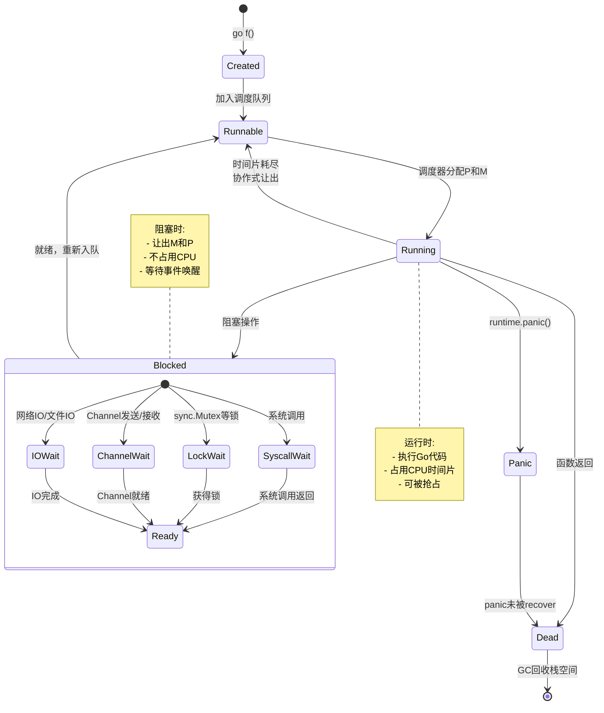
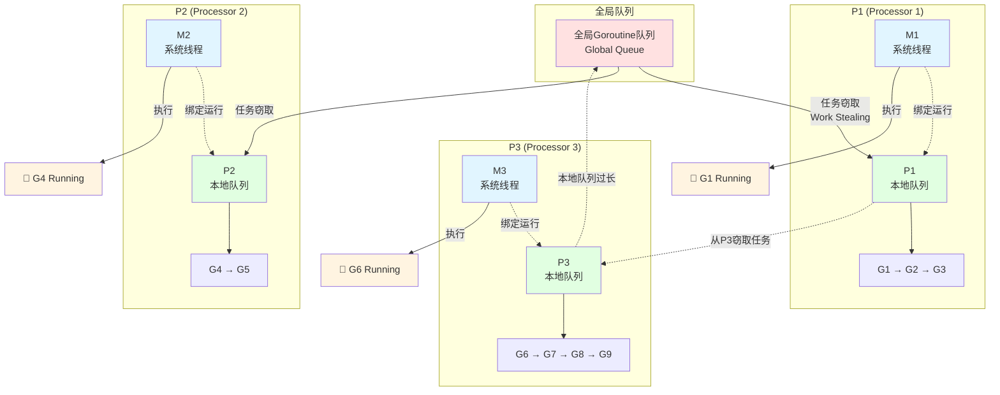

# Goroutine基础

> **简介**: 深入讲解Go语言的核心并发原语Goroutine，包括创建、调度、生命周期管理和最佳实践
> **版本**: Go 1.23+  
> **难度**: ⭐⭐⭐  
> **标签**: #并发 #goroutine #调度器 #并发原语

<!-- TOC START -->
- [Goroutine基础](#goroutine基础)
  - [📚 **理论分析**](#-理论分析)
    - [**Goroutine定义与原理**](#goroutine定义与原理)
      - [**形式化描述**](#形式化描述)
    - [**生命周期与调度**](#生命周期与调度)
      - [Goroutine生命周期可视化](#goroutine生命周期可视化)
    - [**调度机制**](#调度机制)
      - [G-P-M调度模型可视化](#g-p-m调度模型可视化)
  - [💻 **代码示例**](#-代码示例)
    - [**创建与运行Goroutine**](#创建与运行goroutine)
    - [**Goroutine并发执行**](#goroutine并发执行)
    - [**使用sync.WaitGroup等待Goroutine完成**](#使用syncwaitgroup等待goroutine完成)
    - [**Goroutine泄漏示例与避免**](#goroutine泄漏示例与避免)
  - [📊 **性能分析**](#-性能分析)
  - [🧪 **测试代码**](#-测试代码)
  - [🎯 **最佳实践**](#-最佳实践)
  - [🔍 **常见问题**](#-常见问题)
  - [📚 **扩展阅读**](#-扩展阅读)
<!-- TOC END -->


## 📋 目录


- [📚 **理论分析**](#-理论分析)
  - [**Goroutine定义与原理**](#goroutine定义与原理)
    - [**形式化描述**](#形式化描述)
  - [**生命周期与调度**](#生命周期与调度)
    - [Goroutine生命周期可视化](#goroutine生命周期可视化)
  - [**调度机制**](#调度机制)
    - [G-P-M调度模型可视化](#g-p-m调度模型可视化)
- [💻 **代码示例**](#-代码示例)
  - [**创建与运行Goroutine**](#创建与运行goroutine)
  - [**Goroutine并发执行**](#goroutine并发执行)
  - [**使用sync.WaitGroup等待Goroutine完成**](#使用syncwaitgroup等待goroutine完成)
  - [**Goroutine泄漏示例与避免**](#goroutine泄漏示例与避免)
- [📊 **性能分析**](#-性能分析)
- [🧪 **测试代码**](#-测试代码)
- [🎯 **最佳实践**](#-最佳实践)
- [🔍 **常见问题**](#-常见问题)
- [📚 **扩展阅读**](#-扩展阅读)

## 📚 **理论分析**

### **Goroutine定义与原理**

- Goroutine是Go语言的核心并发单元，极轻量级，由Go运行时调度。
- 每个Goroutine初始栈空间约2KB，可动态扩展。
- Goroutine通过`go`关键字创建，运行在Go调度器（G-P-M模型）之上。

#### **形式化描述**

```text
Goroutine ::= go FunctionCall
FunctionCall ::= identifier(arguments)
```

### **生命周期与调度**

- 创建：`go f()`立即返回，f在新Goroutine中异步执行
- 运行：由Go调度器分配到内核线程
- 阻塞：遇到IO、Channel、锁等操作时自动挂起
- 退出：函数返回或运行时panic

#### Goroutine生命周期可视化



### **调度机制**

- Go运行时采用协作式抢占调度，避免长时间阻塞
- G-P-M模型：G（Goroutine）、P（Processor）、M（Machine）
- Goroutine间切换开销极低

#### G-P-M调度模型可视化



**G-P-M模型关键点**:

- **G (Goroutine)**: 用户态协程，轻量级
- **P (Processor)**: 逻辑处理器，数量=GOMAXPROCS
- **M (Machine)**: 系统线程，与P绑定执行G
- **Work Stealing**: P本地队列空时从其他P或全局队列窃取任务

## 💻 **代码示例**

### **创建与运行Goroutine**

```go
package main
import (
    "fmt"
    "time"
)
func sayHello() {
    fmt.Println("Hello from goroutine!")
}
func main() {
    go sayHello()
    fmt.Println("Hello from main!")
    time.Sleep(time.Millisecond * 50)
}
```

### **Goroutine并发执行**

```go
package main
import (
    "fmt"
    "time"
)
func worker(id int) {
    fmt.Printf("Worker %d start\n", id)
    time.Sleep(time.Millisecond * 100)
    fmt.Printf("Worker %d done\n", id)
}
func main() {
    for i := 1; i <= 3; i++ {
        go worker(i)
    }
    time.Sleep(time.Millisecond * 200)
    fmt.Println("All workers launched")
}
```

### **使用sync.WaitGroup等待Goroutine完成**

```go
package main
import (
    "fmt"
    "sync"
)
func main() {
    var wg sync.WaitGroup
    for i := 1; i <= 3; i++ {
        wg.Add(1)
        go func(id int) {
            defer wg.Done()
            fmt.Printf("Worker %d\n", id)
        }(i)
    }
    wg.Wait()
    fmt.Println("All done")
}
```

### **Goroutine泄漏示例与避免**

```go
package main
import "time"
func leak() {
    ch := make(chan int)
    go func() {
        // 永远阻塞，泄漏
        ch <- 1
    }()
    time.Sleep(time.Millisecond * 10)
}
func main() {
    leak()
    // 正确做法：确保有接收方或关闭通道
}
```

## 📊 **性能分析**

- Goroutine创建和切换开销远低于系统线程
- 可轻松创建数万~百万级Goroutine
- 过多Goroutine会导致调度压力和内存消耗

## 🧪 **测试代码**

```go
package main
import (
    "sync"
    "testing"
)
func TestGoroutine(t *testing.T) {
    var wg sync.WaitGroup
    sum := 0
    for i := 0; i < 10; i++ {
        wg.Add(1)
        go func(x int) {
            defer wg.Done()
            sum += x // 存在竞态，演示用
        }(i)
    }
    wg.Wait()
    // 结果不确定，演示竞态
}
```

## 🎯 **最佳实践**

- 使用`sync.WaitGroup`等待所有Goroutine完成
- 避免在Goroutine中访问共享变量（用Channel或锁）
- 控制Goroutine数量，防止资源耗尽
- 保证每个Goroutine都有退出路径，避免泄漏

## 🔍 **常见问题**

- Q: Goroutine和线程有何区别？
  A: Goroutine由Go运行时调度，远比线程轻量
- Q: 如何安全地在Goroutine间传递数据？
  A: 使用Channel或同步原语
- Q: Goroutine泄漏如何排查？
  A: 使用pprof、trace等工具分析

## 📚 **扩展阅读**

- [Go官方文档-Goroutine](https://golang.org/doc/effective_go.html#goroutines)
- [Go by Example: Goroutines](https://gobyexample.com/goroutines)
- [Go Scheduler: G-P-M模型](https://blog.golang.org/2018/09/go-scheduler.html)

---

**文档维护者**: Go Documentation Team  
**最后更新**: 2025年10月20日  
**文档状态**: 完成  
**适用版本**: Go 1.25.3+
