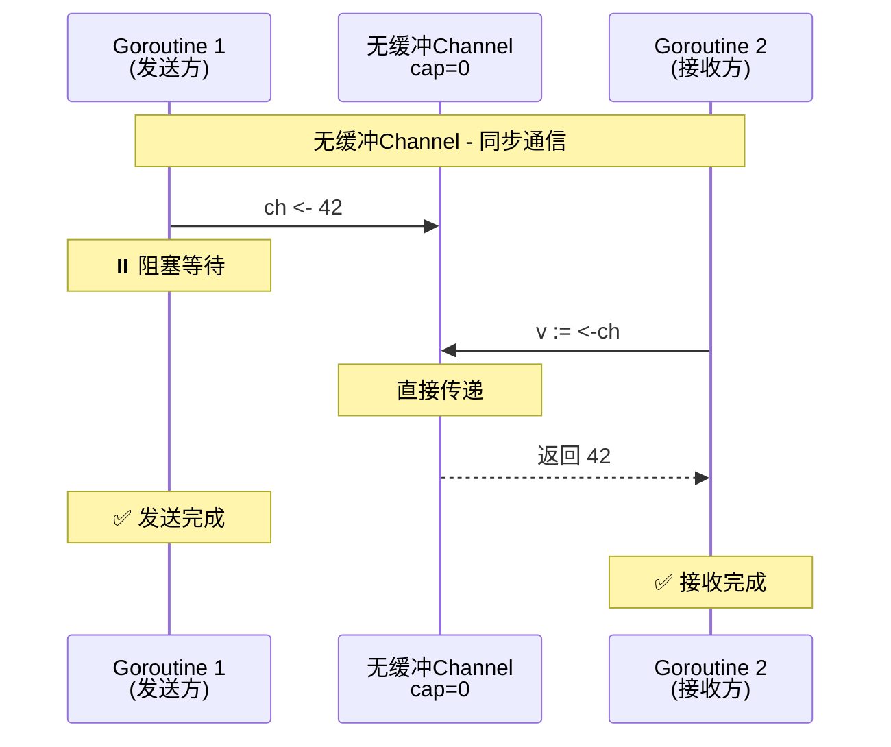
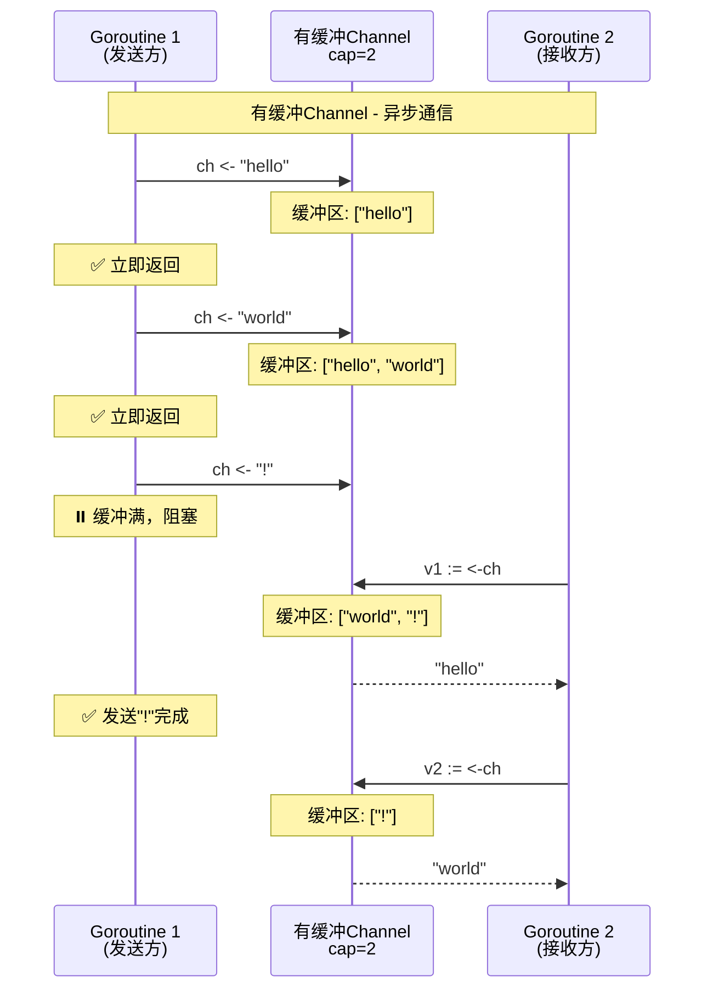
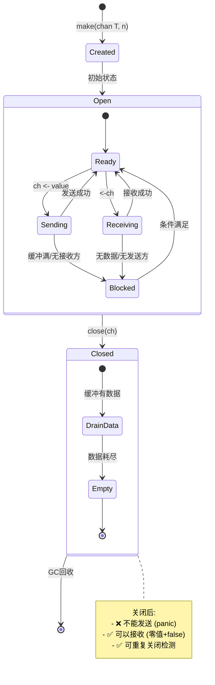
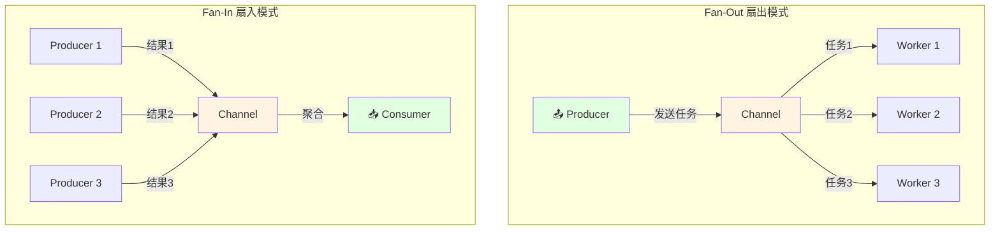

# Channel基础

> **简介**: 系统讲解Go语言的Channel通信机制，包括有缓冲/无缓冲Channel、单向Channel和关闭Channel
> **版本**: Go 1.23+  
> **难度**: ⭐⭐⭐  
> **标签**: #并发 #channel #通信 #CSP

<!-- TOC START -->
- [Channel基础](#channel基础)
  - [📚 **理论分析**](#-理论分析)
    - [**Channel定义与原理**](#channel定义与原理)
      - [**形式化描述**](#形式化描述)
    - [**Channel类型**](#channel类型)
    - [**同步与异步通信**](#同步与异步通信)
      - [无缓冲 vs 有缓冲Channel可视化](#无缓冲-vs-有缓冲channel可视化)
    - [**关闭Channel**](#关闭channel)
      - [Channel生命周期状态图](#channel生命周期状态图)
      - [多Goroutine通信模式](#多goroutine通信模式)
  - [💻 **代码示例**](#-代码示例)
    - [**无缓冲Channel通信**](#无缓冲channel通信)
    - [**有缓冲Channel通信**](#有缓冲channel通信)
    - [**单向Channel用法**](#单向channel用法)
    - [**关闭Channel与检测**](#关闭channel与检测)
  - [📊 **性能分析**](#-性能分析)
  - [🧪 **测试代码**](#-测试代码)
  - [🎯 **最佳实践**](#-最佳实践)
  - [🔍 **常见问题**](#-常见问题)
  - [📚 **扩展阅读**](#-扩展阅读)
<!-- TOC END -->


## 📋 目录


- [📚 **理论分析**](#-理论分析)
  - [**Channel定义与原理**](#channel定义与原理)
    - [**形式化描述**](#形式化描述)
  - [**Channel类型**](#channel类型)
  - [**同步与异步通信**](#同步与异步通信)
    - [无缓冲 vs 有缓冲Channel可视化](#无缓冲-vs-有缓冲channel可视化)
  - [**关闭Channel**](#关闭channel)
    - [Channel生命周期状态图](#channel生命周期状态图)
    - [多Goroutine通信模式](#多goroutine通信模式)
- [💻 **代码示例**](#-代码示例)
  - [**无缓冲Channel通信**](#无缓冲channel通信)
  - [**有缓冲Channel通信**](#有缓冲channel通信)
  - [**单向Channel用法**](#单向channel用法)
  - [**关闭Channel与检测**](#关闭channel与检测)
- [📊 **性能分析**](#-性能分析)
- [🧪 **测试代码**](#-测试代码)
- [🎯 **最佳实践**](#-最佳实践)
- [🔍 **常见问题**](#-常见问题)
- [📚 **扩展阅读**](#-扩展阅读)

## 📚 **理论分析**

### **Channel定义与原理**

- Channel是Go并发模型的核心通信机制，类型安全、阻塞同步。
- Channel本质是一个先进先出（FIFO）的队列，支持多生产者多消费者。
- 通过Channel实现Goroutine间的安全通信，避免共享内存竞争。

#### **形式化描述**

```text
ChannelType ::= 'chan' ElementType | 'chan' '<-' ElementType | '<-' 'chan' ElementType
Send ::= ch <- value
Receive ::= value := <-ch
Close ::= close(ch)
```

### **Channel类型**

- **无缓冲Channel**：`make(chan T)`，发送和接收必须同步配对
- **有缓冲Channel**：`make(chan T, n)`，发送时缓冲未满可立即返回
- **单向Channel**：`chan<- T`（只写），`<-chan T`（只读）

### **同步与异步通信**

- 无缓冲Channel实现同步通信，适合任务交接
- 有缓冲Channel实现异步通信，适合任务队列

#### 无缓冲 vs 有缓冲Channel可视化





### **关闭Channel**

- 关闭后不能再发送数据，但可继续接收直到数据耗尽
- 通过`v, ok := <-ch`判断Channel是否关闭

#### Channel生命周期状态图



#### 多Goroutine通信模式



## 💻 **代码示例**

### **无缓冲Channel通信**

```go
package main
import "fmt"
func main() {
    ch := make(chan int)
    go func() { ch <- 42 }()
    v := <-ch
    fmt.Println("received:", v)
}
```

### **有缓冲Channel通信**

```go
package main
import "fmt"
func main() {
    ch := make(chan string, 2)
    ch <- "hello"
    ch <- "world"
    fmt.Println(<-ch)
    fmt.Println(<-ch)
}
```

### **单向Channel用法**

```go
package main
import "fmt"
func send(ch chan<- int) { ch <- 1 }
func recv(ch <-chan int) { fmt.Println(<-ch) }
func main() {
    ch := make(chan int, 1)
    send(ch)
    recv(ch)
}
```

### **关闭Channel与检测**

```go
package main
import "fmt"
func main() {
    ch := make(chan int, 2)
    ch <- 1
    ch <- 2
    close(ch)
    for v := range ch {
        fmt.Println(v)
    }
}
```

## 📊 **性能分析**

- Channel通信比锁更高效，适合高并发场景
- 有缓冲Channel可提升吞吐量，但过大缓冲会增加内存消耗
- Channel关闭后读取为零值，需用`ok`判断

## 🧪 **测试代码**

```go
package main
import "testing"
func TestChannelSendRecv(t *testing.T) {
    ch := make(chan int, 1)
    ch <- 10
    v := <-ch
    if v != 10 {
        t.Errorf("expected 10, got %d", v)
    }
}
func TestChannelClosed(t *testing.T) {
    ch := make(chan int, 1)
    close(ch)
    _, ok := <-ch
    if ok {
        t.Errorf("expected closed channel to return ok=false")
    }
}
```

## 🎯 **最佳实践**

- 优先使用无缓冲Channel实现同步，缓冲Channel用于异步队列
- 只由发送方关闭Channel，接收方通过`range`或`ok`检测
- 避免对已关闭Channel发送数据
- 使用单向Channel限制接口权限

## 🔍 **常见问题**

- Q: Channel一定要关闭吗？
  A: 只需生产者关闭，消费者可检测
- Q: 关闭Channel后还能接收吗？
  A: 可以，直到数据耗尽
- Q: 如何避免死锁？
  A: 保证每个发送都有对应接收

## 📚 **扩展阅读**

- [Go官方文档-Channel](https://golang.org/ref/spec#Channel_types)
- [Go by Example: Channels](https://gobyexample.com/channels)
- [Go by Example: Channel Directions](https://gobyexample.com/channel-directions)

---

**文档维护者**: Go Documentation Team  
**最后更新**: 2025年10月20日  
**文档状态**: 完成  
**适用版本**: Go 1.25.3+
