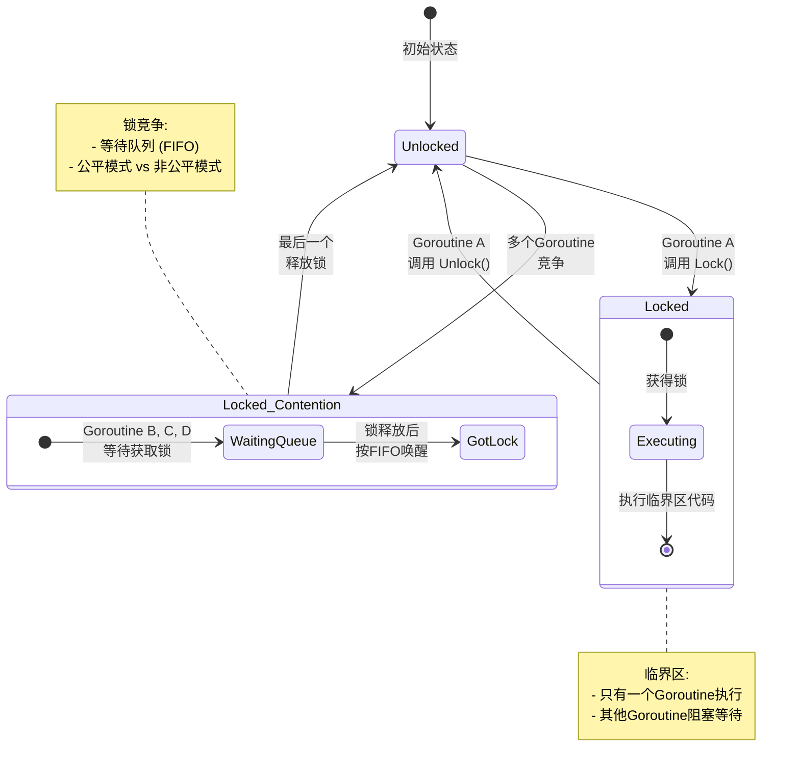
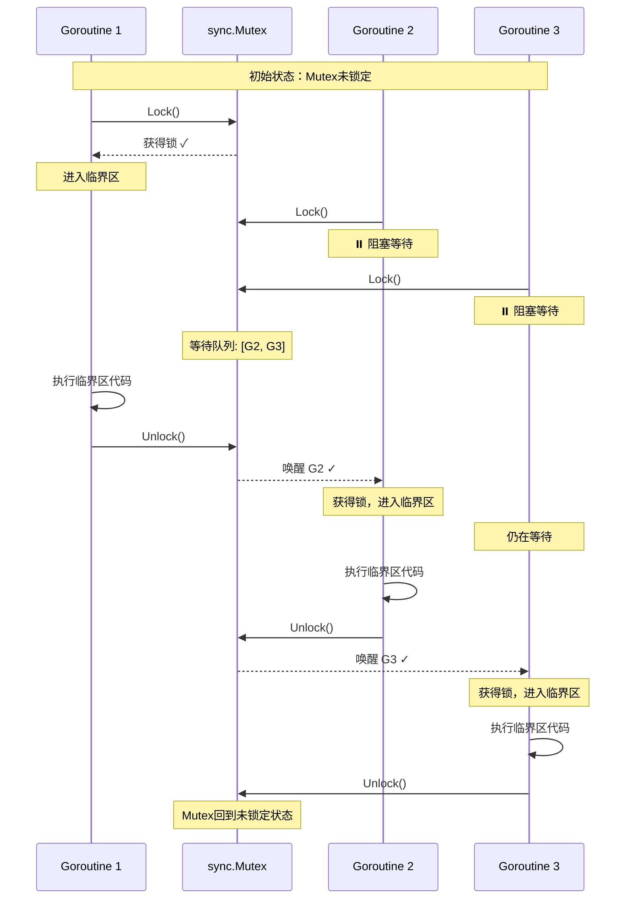
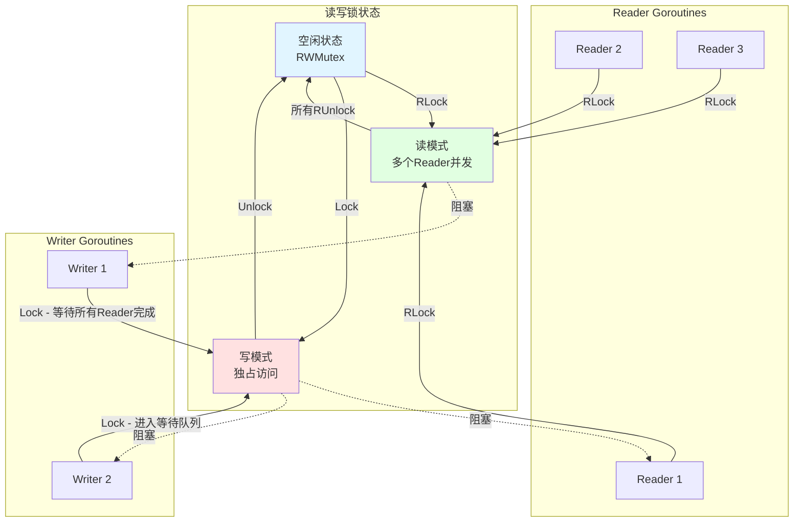
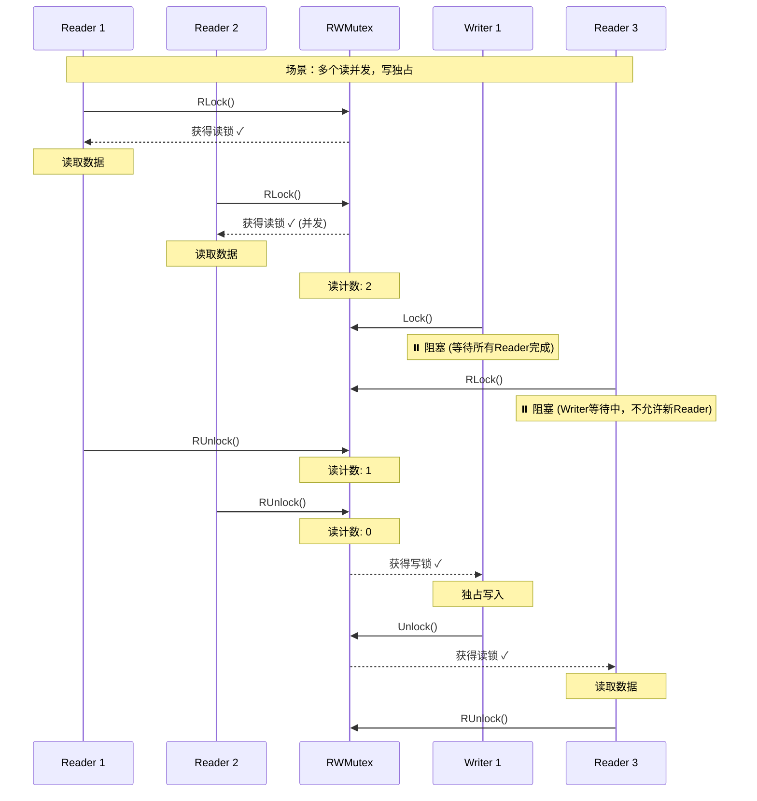
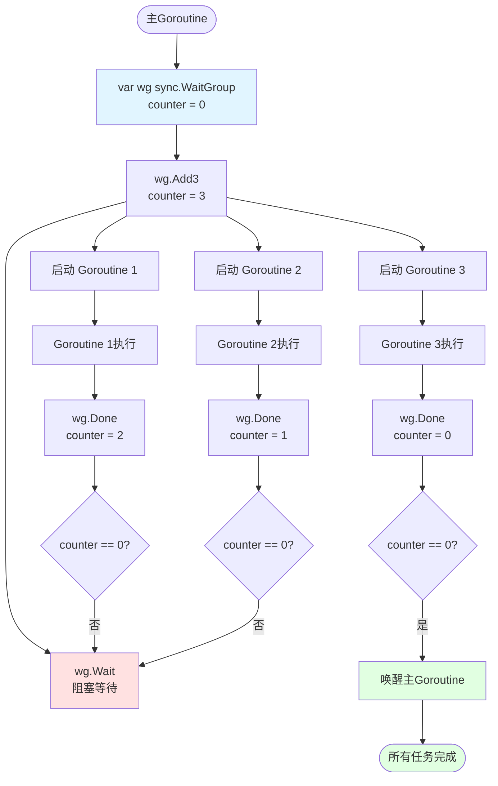
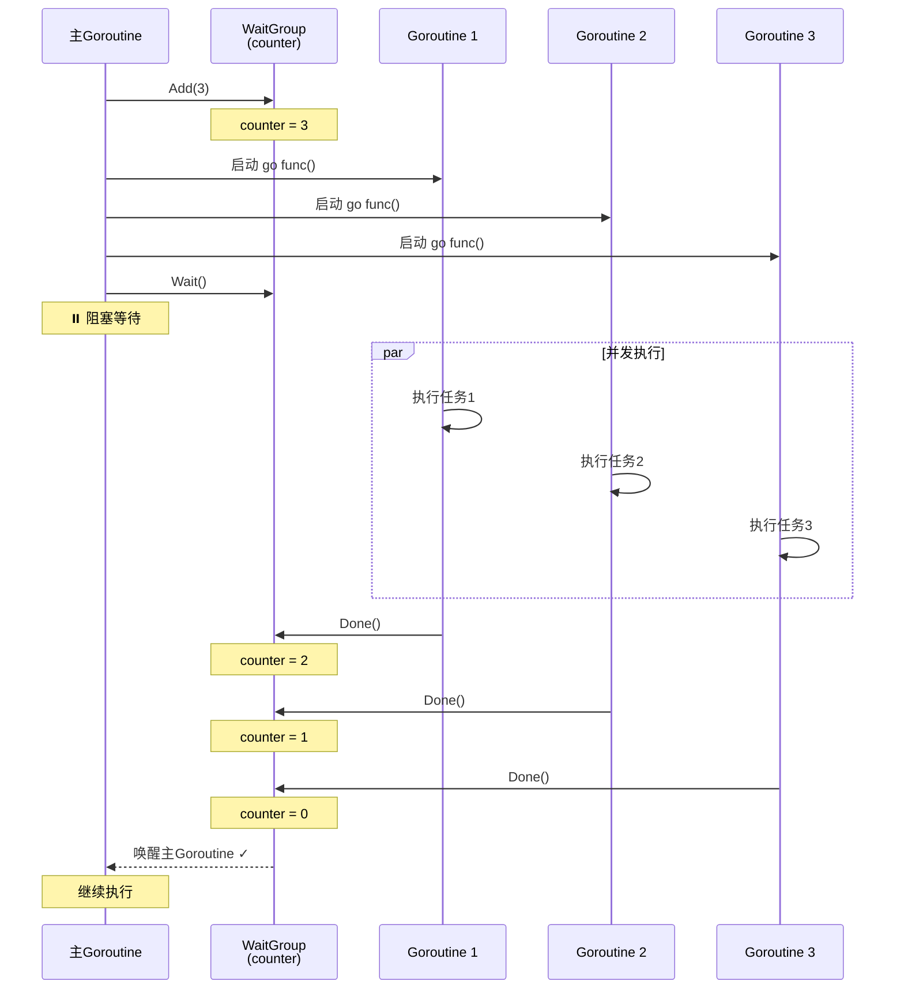
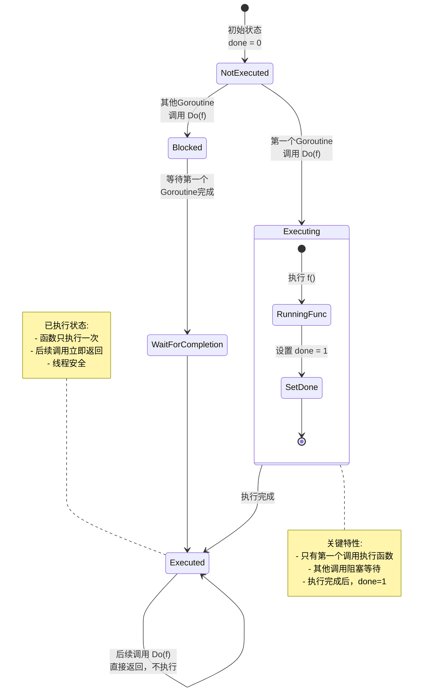
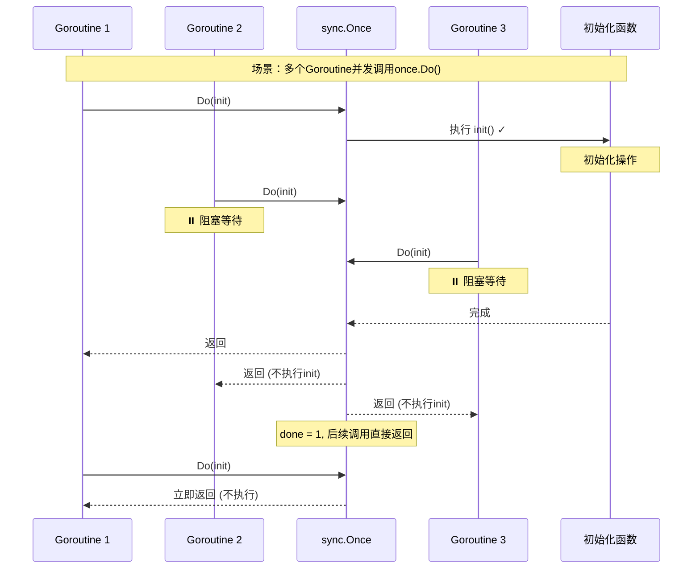

# sync包与并发安全模式

> **简介**: 详解Go标准库sync包的并发原语，包括Mutex、RWMutex、WaitGroup、Once等
> **版本**: Go 1.23+  
> **难度**: ⭐⭐⭐  
> **标签**: #并发 #sync #锁 #并发安全

<!-- TOC START -->
- [sync包与并发安全模式](#sync包与并发安全模式)
  - [1. 理论基础](#1-理论基础)
  - [2. 典型用法](#2-典型用法)
    - [互斥锁Mutex](#互斥锁mutex)
      - [Mutex状态机可视化](#mutex状态机可视化)
      - [Mutex并发访问时序图](#mutex并发访问时序图)
    - [读写锁RWMutex](#读写锁rwmutex)
      - [RWMutex并发控制可视化](#rwmutex并发控制可视化)
      - [RWMutex读写时序图](#rwmutex读写时序图)
    - [WaitGroup](#waitgroup)
      - [WaitGroup工作流程](#waitgroup工作流程)
      - [WaitGroup时序图](#waitgroup时序图)
    - [Once](#once)
      - [sync.Once单次执行保证](#synconce单次执行保证)
      - [多Goroutine调用Once时序图](#多goroutine调用once时序图)
  - [3. 工程分析与最佳实践](#3-工程分析与最佳实践)
  - [4. 常见陷阱](#4-常见陷阱)
  - [5. 单元测试建议](#5-单元测试建议)
  - [6. 参考文献](#6-参考文献)
<!-- TOC END -->


## 📋 目录


- [1. 理论基础](#1-理论基础)
- [2. 典型用法](#2-典型用法)
  - [互斥锁Mutex](#互斥锁mutex)
    - [Mutex状态机可视化](#mutex状态机可视化)
    - [Mutex并发访问时序图](#mutex并发访问时序图)
  - [读写锁RWMutex](#读写锁rwmutex)
    - [RWMutex并发控制可视化](#rwmutex并发控制可视化)
    - [RWMutex读写时序图](#rwmutex读写时序图)
  - [WaitGroup](#waitgroup)
    - [WaitGroup工作流程](#waitgroup工作流程)
    - [WaitGroup时序图](#waitgroup时序图)
  - [Once](#once)
    - [sync.Once单次执行保证](#synconce单次执行保证)
    - [多Goroutine调用Once时序图](#多goroutine调用once时序图)
- [3. 工程分析与最佳实践](#3-工程分析与最佳实践)
- [4. 常见陷阱](#4-常见陷阱)
- [5. 单元测试建议](#5-单元测试建议)
- [6. 参考文献](#6-参考文献)

## 1. 理论基础

Go的sync包提供了多种并发原语，保障多Goroutine环境下的数据一致性和同步。

- **互斥锁（Mutex）**：保证同一时刻只有一个Goroutine访问临界区。
- **读写锁（RWMutex）**：读操作可并发，写操作独占。
- **等待组（WaitGroup）**：用于等待一组Goroutine完成。
- **Once**：确保某段代码只执行一次。
- **Cond**：条件变量，支持复杂同步。

---

## 2. 典型用法

### 互斥锁Mutex

#### Mutex状态机可视化



#### Mutex并发访问时序图



```go
package main

import (
    "fmt"
    "sync"
    "time"
)

var (
    counter int
    mu      sync.Mutex
)

func increment(id int, wg *sync.WaitGroup) {
    defer wg.Done()
    
    mu.Lock()           // 获取锁
    defer mu.Unlock()   // 确保释放锁
    
    // 临界区：修改共享资源
    temp := counter
    time.Sleep(10 * time.Millisecond) // 模拟处理时间
    counter = temp + 1
    fmt.Printf("Goroutine %d: counter = %d\n", id, counter)
}

func main() {
    var wg sync.WaitGroup
    
    // 启动10个并发Goroutine
    for i := 1; i <= 10; i++ {
        wg.Add(1)
        go increment(i, &wg)
    }
    
    wg.Wait()
    fmt.Printf("Final counter: %d\n", counter) // 输出: 10
}
```

### 读写锁RWMutex

#### RWMutex并发控制可视化



#### RWMutex读写时序图



```go
package main

import (
    "fmt"
    "sync"
    "time"
)

type SafeMap struct {
    data map[string]int
    rw   sync.RWMutex
}

// 读操作：可并发
func (m *SafeMap) Get(key string) (int, bool) {
    m.rw.RLock()
    defer m.rw.RUnlock()
    
    val, ok := m.data[key]
    return val, ok
}

// 写操作：独占访问
func (m *SafeMap) Set(key string, value int) {
    m.rw.Lock()
    defer m.rw.Unlock()
    
    m.data[key] = value
}

func main() {
    sm := &SafeMap{
        data: make(map[string]int),
    }
    
    // 多个Reader并发读取
    for i := 0; i < 5; i++ {
        go func(id int) {
            for j := 0; j < 3; j++ {
                val, ok := sm.Get("key")
                fmt.Printf("Reader %d: %v, %v\n", id, val, ok)
                time.Sleep(10 * time.Millisecond)
            }
        }(i)
    }
    
    // 单个Writer写入
    go func() {
        for i := 0; i < 3; i++ {
            sm.Set("key", i)
            fmt.Printf("Writer: set key = %d\n", i)
            time.Sleep(50 * time.Millisecond)
        }
    }()
    
    time.Sleep(300 * time.Millisecond)
}
```

### WaitGroup

#### WaitGroup工作流程



#### WaitGroup时序图



```go
package main

import (
    "fmt"
    "sync"
    "time"
)

func worker(id int, wg *sync.WaitGroup) {
    defer wg.Done() // 确保Done被调用
    
    fmt.Printf("Worker %d: 开始工作\n", id)
    time.Sleep(time.Second)
    fmt.Printf("Worker %d: 完成工作\n", id)
}

func main() {
    var wg sync.WaitGroup
    
    // 启动5个worker
    for i := 1; i <= 5; i++ {
        wg.Add(1) // 每启动一个Goroutine，计数器+1
        go worker(i, &wg)
    }
    
    fmt.Println("主Goroutine: 等待所有worker完成...")
    wg.Wait() // 阻塞，直到计数器为0
    fmt.Println("主Goroutine: 所有worker已完成！")
}
```

### Once

#### sync.Once单次执行保证



#### 多Goroutine调用Once时序图



```go
package main

import (
    "fmt"
    "sync"
    "time"
)

var (
    instance *Singleton
    once     sync.Once
)

type Singleton struct {
    data string
}

// GetInstance 使用sync.Once实现线程安全的单例
func GetInstance() *Singleton {
    once.Do(func() {
        fmt.Println("创建Singleton实例（只执行一次）")
        time.Sleep(100 * time.Millisecond) // 模拟初始化耗时
        instance = &Singleton{data: "singleton instance"}
    })
    return instance
}

func main() {
    var wg sync.WaitGroup
    
    // 10个Goroutine并发调用GetInstance
    for i := 1; i <= 10; i++ {
        wg.Add(1)
        go func(id int) {
            defer wg.Done()
            inst := GetInstance()
            fmt.Printf("Goroutine %d: %p - %s\n", id, inst, inst.data)
        }(i)
    }
    
    wg.Wait()
    // 输出：所有Goroutine获得同一个实例（地址相同）
    // "创建Singleton实例"只打印一次
}
```

---

## 3. 工程分析与最佳实践

- 推荐优先使用channel实现同步，sync适合低层并发控制。
- Mutex/RWMutex适合保护共享资源，避免数据竞争。
- WaitGroup适合任务编排，避免忙等。
- Once适合单例、懒加载等场景。
- Cond适合复杂同步，需谨慎使用。
- 尽量缩小锁的粒度，减少锁竞争。

---

## 4. 常见陷阱

- 忘记Unlock会导致死锁。
- 多次Unlock会panic。
- WaitGroup的Add/Done不匹配会导致永久阻塞。
- RWMutex写锁不可重入。

---

## 5. 单元测试建议

- 测试并发场景下的数据一致性与死锁边界。
- 使用-race检测数据竞争。

---

## 6. 参考文献

- Go官方文档：<https://golang.org/pkg/sync/>
- Go Blog: <https://blog.golang.org/share-memory-by-communicating>
- 《Go语言高级编程》

---

**文档维护者**: Go Documentation Team  
**最后更新**: 2025年10月20日  
**文档状态**: 完成  
**适用版本**: Go 1.25.3+
