# Go代码质量控制完全指南

> **简介**: 全面的Go代码质量控制方法，包括静态分析、代码审查、质量指标和最佳实践

---

## 📋 目录


- [1. 📋 代码质量概述](#1--代码质量概述)
  - [质量维度](#质量维度)
  - [质量指标](#质量指标)
- [2. 🔍 静态代码分析](#2--静态代码分析)
  - [golangci-lint配置](#golangci-lint配置)
  - [核心Linters详解](#核心linters详解)
    - [errcheck - 错误处理检查](#errcheck---错误处理检查)
    - [gosimple - 简化代码](#gosimple---简化代码)
    - [gocyclo - 圈复杂度检查](#gocyclo---圈复杂度检查)
- [3. 📝 代码规范](#3--代码规范)
  - [命名规范](#命名规范)
  - [代码结构](#代码结构)
  - [注释规范](#注释规范)
- [4. 🎯 代码复杂度控制](#4--代码复杂度控制)
  - [圈复杂度（Cyclomatic Complexity)](#圈复杂度cyclomatic-complexity)
  - [认知复杂度（Cognitive Complexity)](#认知复杂度cognitive-complexity)
- [5. 🧹 代码重构技巧](#5--代码重构技巧)
  - [提取方法](#提取方法)
  - [简化条件表达式](#简化条件表达式)
  - [消除重复代码](#消除重复代码)
- [6. 🔐 安全检查](#6--安全检查)
  - [常见安全问题](#常见安全问题)
    - [SQL注入](#sql注入)
    - [命令注入](#命令注入)
    - [敏感信息泄露](#敏感信息泄露)
  - [gosec安全扫描](#gosec安全扫描)
- [7. 📊 代码审查最佳实践](#7--代码审查最佳实践)
  - [审查清单](#审查清单)
  - [审查流程](#审查流程)
- [8. 🎯 质量门禁](#8--质量门禁)
  - [质量门禁配置](#质量门禁配置)
  - [CI集成](#ci集成)
- [9. 💡 最佳实践](#9--最佳实践)
  - [DO's ✅](#dos-)
  - [DON'Ts ❌](#donts-)
- [10. 🔧 工具推荐](#10--工具推荐)
  - [静态分析工具](#静态分析工具)
  - [IDE插件](#ide插件)
- [📚 扩展阅读](#-扩展阅读)

## 1. 📋 代码质量概述

### 质量维度

代码质量包含多个维度：

| 维度 | 说明 | 衡量标准 |
|------|------|---------|
| **正确性** | 代码功能是否正确 | 测试覆盖率、Bug数量 |
| **可读性** | 代码是否易于理解 | 命名规范、注释质量 |
| **可维护性** | 代码是否易于修改 | 复杂度、耦合度 |
| **性能** | 代码执行效率 | Benchmark结果 |
| **安全性** | 代码是否安全 | 安全扫描结果 |
| **可测试性** | 代码是否易于测试 | 单元测试覆盖率 |

### 质量指标

```go
// 质量指标示例
type CodeQualityMetrics struct {
    TestCoverage      float64 // 测试覆盖率 (>80%)
    LinesOfCode       int     // 代码行数
    CyclomaticComplexity int  // 圈复杂度 (<15)
    DuplicationRate   float64 // 重复率 (<5%)
    TechnicalDebt     int     // 技术债务（小时）
    SecurityIssues    int     // 安全问题数量
    CodeSmells        int     // 代码坏味道数量
}

// 质量评分计算
func CalculateQualityScore(metrics CodeQualityMetrics) int {
    score := 100
    
    // 测试覆盖率扣分
    if metrics.TestCoverage < 80 {
        score -= int((80 - metrics.TestCoverage) / 2)
    }
    
    // 圈复杂度扣分
    if metrics.CyclomaticComplexity > 15 {
        score -= (metrics.CyclomaticComplexity - 15) * 2
    }
    
    // 代码重复扣分
    if metrics.DuplicationRate > 5 {
        score -= int((metrics.DuplicationRate - 5) * 3)
    }
    
    // 安全问题扣分
    score -= metrics.SecurityIssues * 5
    
    // 代码坏味道扣分
    score -= metrics.CodeSmells
    
    if score < 0 {
        score = 0
    }
    
    return score
}
```

---

## 2. 🔍 静态代码分析

### golangci-lint配置

完整的`.golangci.yml`配置：

```yaml
# .golangci.yml
run:
  timeout: 5m
  tests: true
  skip-dirs:
    - vendor
    - third_party
  skip-files:
    - ".*\\.pb\\.go$"

linters-settings:
  govet:
    check-shadowing: true
    enable-all: true
  
  gocyclo:
    min-complexity: 15
  
  dupl:
    threshold: 100
  
  goconst:
    min-len: 3
    min-occurrences: 3
  
  misspell:
    locale: US
  
  lll:
    line-length: 120
  
  goimports:
    local-prefixes: github.com/yourorg/yourproject
  
  gocritic:
    enabled-tags:
      - diagnostic
      - experimental
      - opinionated
      - performance
      - style
  
  funlen:
    lines: 100
    statements: 50
  
  gocognit:
    min-complexity: 20
  
  nestif:
    min-complexity: 4
  
  cyclop:
    max-complexity: 15
  
  errorlint:
    errorf: true
    asserts: true
    comparison: true

linters:
  enable:
    - bodyclose      # 检查HTTP响应体是否关闭
    - deadcode       # 检查未使用的代码
    - depguard       # 检查包依赖
    - dogsled        # 检查空白标识符赋值
    - dupl           # 检查代码重复
    - errcheck       # 检查未处理的错误
    - exportloopref  # 检查循环中的指针引用
    - funlen         # 检查函数长度
    - gochecknoinits # 检查init函数
    - goconst        # 检查可以提取为常量的字符串
    - gocritic       # Go代码评审
    - gocyclo        # 检查圈复杂度
    - gofmt          # 检查代码格式
    - goimports      # 检查import顺序
    - gomnd          # 检查魔法数字
    - goprintffuncname # 检查printf风格函数名
    - gosec          # 安全检查
    - gosimple       # 简化代码建议
    - govet          # Go官方检查工具
    - ineffassign    # 检查无效赋值
    - lll            # 检查行长度
    - misspell       # 检查拼写错误
    - nakedret       # 检查裸返回
    - nestif         # 检查嵌套深度
    - noctx          # 检查HTTP请求是否传递context
    - nolintlint     # 检查nolint指令
    - rowserrcheck   # 检查SQL Rows错误
    - staticcheck    # 静态检查
    - stylecheck     # 风格检查
    - typecheck      # 类型检查
    - unconvert      # 检查不必要的类型转换
    - unparam        # 检查未使用的参数
    - unused         # 检查未使用的常量、变量、函数等
    - whitespace     # 检查多余的空白
    - errorlint      # 错误处理检查
    - gocognit       # 认知复杂度
    - cyclop         # 包和函数的圈复杂度

issues:
  exclude-rules:
    # 排除测试文件的某些检查
    - path: _test\.go
      linters:
        - gomnd
        - funlen
        - dupl
    
    # 排除main函数的某些检查
    - path: cmd/
      linters:
        - gochecknoinits

  max-issues-per-linter: 0
  max-same-issues: 0

output:
  format: colored-line-number
  print-issued-lines: true
  print-linter-name: true
```

### 核心Linters详解

#### errcheck - 错误处理检查

```go
// ❌ 不推荐 - 忽略错误
file, _ := os.Open("file.txt")
defer file.Close()

// ✅ 推荐 - 处理错误
file, err := os.Open("file.txt")
if err != nil {
    return fmt.Errorf("failed to open file: %w", err)
}
defer file.Close()
```

#### gosimple - 简化代码

```go
// ❌ 不推荐 - 复杂写法
var s string
if condition {
    s = "yes"
} else {
    s = "no"
}

// ✅ 推荐 - 简化写法
s := "no"
if condition {
    s = "yes"
}

// 更简洁
s := map[bool]string{true: "yes", false: "no"}[condition]
```

#### gocyclo - 圈复杂度检查

```go
// ❌ 不推荐 - 圈复杂度过高 (>15)
func ProcessOrder(order Order) error {
    if order.Status == "pending" {
        if order.Amount > 1000 {
            if order.Customer.VIP {
                if order.Customer.CreditLimit > order.Amount {
                    // ... 嵌套过深
                }
            }
        }
    }
    // ...
}

// ✅ 推荐 - 降低复杂度
func ProcessOrder(order Order) error {
    if !isValidOrder(order) {
        return ErrInvalidOrder
    }
    
    if err := checkCredit(order); err != nil {
        return err
    }
    
    return processPayment(order)
}

func isValidOrder(order Order) bool {
    return order.Status == "pending" && order.Amount > 0
}

func checkCredit(order Order) error {
    if order.Amount <= 1000 {
        return nil
    }
    
    if !order.Customer.VIP {
        return ErrRequiresVIP
    }
    
    if order.Customer.CreditLimit < order.Amount {
        return ErrInsufficientCredit
    }
    
    return nil
}
```

---

## 3. 📝 代码规范

### 命名规范

```go
// ✅ 推荐的命名
type UserService struct {}      // 大驼峰（导出）
type userRepository struct {}   // 小驼峰（未导出）

func (s *UserService) GetUser(id int) (*User, error) {}  // 方法名大驼峰
func (s *UserService) validateEmail(email string) bool {} // 私有方法小驼峰

const MaxRetries = 3           // 常量大驼峰
const defaultTimeout = 30      // 私有常量小驼峰

var ErrUserNotFound = errors.New("user not found")  // 错误变量以Err开头

// ❌ 不推荐的命名
type user_service struct {}     // 不使用下划线
func GetUSER() {}               // 不全大写
const max_retries = 3           // 不使用下划线
var errUserNotFound = errors.New("...") // 导出的错误应该大写
```

### 代码结构

```go
// ✅ 推荐的文件结构
package service

import (
    // 标准库
    "context"
    "fmt"
    "time"
    
    // 第三方库
    "github.com/pkg/errors"
    
    // 项目内部包
    "myproject/internal/model"
    "myproject/internal/repository"
)

// 常量定义
const (
    defaultTimeout = 30 * time.Second
    maxRetries     = 3
)

// 类型定义
type UserService struct {
    repo repository.UserRepository
    cache Cache
}

// 构造函数
func NewUserService(repo repository.UserRepository) *UserService {
    return &UserService{
        repo: repo,
    }
}

// 公共方法
func (s *UserService) GetUser(ctx context.Context, id int) (*model.User, error) {
    // ...
}

// 私有方法
func (s *UserService) validateUser(user *model.User) error {
    // ...
}
```

### 注释规范

```go
// Package service 提供用户相关的业务逻辑处理
// 包注释应该在package语句之前
package service

// UserService 用户服务，负责用户相关的业务逻辑
// 类型注释应该以类型名开头
type UserService struct {
    repo repository.UserRepository // 用户数据仓库
    cache Cache                     // 缓存实例
}

// GetUser 根据ID获取用户信息
// 
// 参数:
//   - ctx: 请求上下文
//   - id: 用户ID
//
// 返回:
//   - *User: 用户对象
//   - error: 错误信息，如果用户不存在返回ErrUserNotFound
//
// 函数注释应该说明功能、参数和返回值
func (s *UserService) GetUser(ctx context.Context, id int) (*User, error) {
    // 先从缓存获取
    if user, ok := s.cache.Get(id); ok {
        return user, nil
    }
    
    // 从数据库查询
    user, err := s.repo.FindByID(ctx, id)
    if err != nil {
        return nil, fmt.Errorf("failed to get user: %w", err)
    }
    
    // 写入缓存
    s.cache.Set(id, user)
    
    return user, nil
}
```

---

## 4. 🎯 代码复杂度控制

### 圈复杂度（Cyclomatic Complexity)

圈复杂度衡量程序的复杂程度，通过计算代码中独立路径的数量。

**计算规则**:

- 基础值为1
- 每个if、for、case、&&、||增加1

```go
// 圈复杂度 = 1 (基础) + 2 (if) + 1 (&&) = 4
func Example1(a, b int) bool {
    if a > 0 {
        if b > 0 && a > b {
            return true
        }
    }
    return false
}

// ✅ 降低复杂度 - 提取函数
func Example2(a, b int) bool {
    if !isPositive(a) {
        return false
    }
    return isPositive(b) && a > b
}

func isPositive(n int) bool {
    return n > 0
}
```

**建议阈值**:

- < 10: 简单函数
- 10-15: 中等复杂度
- 15-20: 需要重构
- \> 20: 必须重构

### 认知复杂度（Cognitive Complexity)

认知复杂度更注重代码的可理解性。

```go
// 高认知复杂度
func ProcessData(data []int) int {
    result := 0
    for i := 0; i < len(data); i++ {
        if data[i] > 0 {
            if data[i] % 2 == 0 {
                for j := 0; j < data[i]; j++ {
                    if j % 3 == 0 {
                        result += j
                    }
                }
            }
        }
    }
    return result
}

// ✅ 降低认知复杂度
func ProcessData(data []int) int {
    result := 0
    for _, num := range data {
        result += processNumber(num)
    }
    return result
}

func processNumber(num int) int {
    if num <= 0 || num % 2 != 0 {
        return 0
    }
    
    sum := 0
    for i := 0; i < num; i += 3 {
        sum += i
    }
    return sum
}
```

---

## 5. 🧹 代码重构技巧

### 提取方法

```go
// ❌ 长方法
func CreateOrder(req CreateOrderRequest) (*Order, error) {
    // 验证用户
    user, err := db.Query("SELECT * FROM users WHERE id = ?", req.UserID)
    if err != nil {
        return nil, err
    }
    if user == nil {
        return nil, errors.New("user not found")
    }
    
    // 验证商品
    product, err := db.Query("SELECT * FROM products WHERE id = ?", req.ProductID)
    if err != nil {
        return nil, err
    }
    if product == nil {
        return nil, errors.New("product not found")
    }
    if product.Stock < req.Quantity {
        return nil, errors.New("insufficient stock")
    }
    
    // 计算价格
    totalPrice := product.Price * float64(req.Quantity)
    if user.VIP {
        totalPrice *= 0.9 // VIP 9折
    }
    
    // 创建订单
    order := &Order{
        UserID:    req.UserID,
        ProductID: req.ProductID,
        Quantity:  req.Quantity,
        Price:     totalPrice,
    }
    
    return order, nil
}

// ✅ 提取方法后
func CreateOrder(req CreateOrderRequest) (*Order, error) {
    user, err := validateUser(req.UserID)
    if err != nil {
        return nil, err
    }
    
    product, err := validateProduct(req.ProductID, req.Quantity)
    if err != nil {
        return nil, err
    }
    
    price := calculatePrice(product, req.Quantity, user.VIP)
    
    return buildOrder(req, price), nil
}

func validateUser(userID int) (*User, error) {
    user, err := db.Query("SELECT * FROM users WHERE id = ?", userID)
    if err != nil {
        return nil, fmt.Errorf("query user failed: %w", err)
    }
    if user == nil {
        return nil, ErrUserNotFound
    }
    return user, nil
}

func validateProduct(productID, quantity int) (*Product, error) {
    product, err := db.Query("SELECT * FROM products WHERE id = ?", productID)
    if err != nil {
        return nil, fmt.Errorf("query product failed: %w", err)
    }
    if product == nil {
        return nil, ErrProductNotFound
    }
    if product.Stock < quantity {
        return nil, ErrInsufficientStock
    }
    return product, nil
}

func calculatePrice(product *Product, quantity int, isVIP bool) float64 {
    price := product.Price * float64(quantity)
    if isVIP {
        price *= 0.9
    }
    return price
}

func buildOrder(req CreateOrderRequest, price float64) *Order {
    return &Order{
        UserID:    req.UserID,
        ProductID: req.ProductID,
        Quantity:  req.Quantity,
        Price:     price,
    }
}
```

### 简化条件表达式

```go
// ❌ 复杂条件
func CanPurchase(user *User, product *Product, quantity int) bool {
    if user != nil && user.Status == "active" && product != nil && 
       product.Stock >= quantity && (user.Balance >= product.Price * float64(quantity) || 
       user.CreditLimit >= product.Price * float64(quantity)) {
        return true
    }
    return false
}

// ✅ 简化条件
func CanPurchase(user *User, product *Product, quantity int) bool {
    if !isValidUser(user) || !isValidProduct(product, quantity) {
        return false
    }
    return hasEnoughFunds(user, product, quantity)
}

func isValidUser(user *User) bool {
    return user != nil && user.Status == "active"
}

func isValidProduct(product *Product, quantity int) bool {
    return product != nil && product.Stock >= quantity
}

func hasEnoughFunds(user *User, product *Product, quantity int) bool {
    totalCost := product.Price * float64(quantity)
    return user.Balance >= totalCost || user.CreditLimit >= totalCost
}
```

### 消除重复代码

```go
// ❌ 重复代码
func GetUserByID(id int) (*User, error) {
    var user User
    err := db.QueryRow("SELECT id, name, email FROM users WHERE id = ?", id).Scan(&user.ID, &user.Name, &user.Email)
    if err != nil {
        if err == sql.ErrNoRows {
            return nil, ErrUserNotFound
        }
        return nil, fmt.Errorf("query failed: %w", err)
    }
    return &user, nil
}

func GetUserByEmail(email string) (*User, error) {
    var user User
    err := db.QueryRow("SELECT id, name, email FROM users WHERE email = ?", email).Scan(&user.ID, &user.Name, &user.Email)
    if err != nil {
        if err == sql.ErrNoRows {
            return nil, ErrUserNotFound
        }
        return nil, fmt.Errorf("query failed: %w", err)
    }
    return &user, nil
}

// ✅ 消除重复
func GetUserByID(id int) (*User, error) {
    return queryUser("SELECT id, name, email FROM users WHERE id = ?", id)
}

func GetUserByEmail(email string) (*User, error) {
    return queryUser("SELECT id, name, email FROM users WHERE email = ?", email)
}

func queryUser(query string, arg interface{}) (*User, error) {
    var user User
    err := db.QueryRow(query, arg).Scan(&user.ID, &user.Name, &user.Email)
    if err != nil {
        if err == sql.ErrNoRows {
            return nil, ErrUserNotFound
        }
        return nil, fmt.Errorf("query failed: %w", err)
    }
    return &user, nil
}
```

---

## 6. 🔐 安全检查

### 常见安全问题

#### SQL注入

```go
// ❌ 不安全 - SQL注入风险
func GetUser(username string) (*User, error) {
    query := "SELECT * FROM users WHERE username = '" + username + "'"
    // 如果username是 "admin' OR '1'='1"，将返回所有用户
    rows, err := db.Query(query)
    // ...
}

// ✅ 安全 - 使用参数化查询
func GetUser(username string) (*User, error) {
    query := "SELECT * FROM users WHERE username = ?"
    rows, err := db.Query(query, username)
    // ...
}
```

#### 命令注入

```go
// ❌ 不安全 - 命令注入风险
func BackupDatabase(filename string) error {
    cmd := exec.Command("sh", "-c", "mysqldump -u root db > " + filename)
    // 如果filename是 "backup.sql; rm -rf /"，将执行删除命令
    return cmd.Run()
}

// ✅ 安全 - 验证输入并使用白名单
func BackupDatabase(filename string) error {
    // 验证文件名
    if !regexp.MustCompile(`^[a-zA-Z0-9_-]+\.sql$`).MatchString(filename) {
        return errors.New("invalid filename")
    }
    
    // 使用参数数组而不是字符串拼接
    cmd := exec.Command("mysqldump", "-u", "root", "db")
    file, err := os.Create(filename)
    if err != nil {
        return err
    }
    defer file.Close()
    
    cmd.Stdout = file
    return cmd.Run()
}
```

#### 敏感信息泄露

```go
// ❌ 不安全 - 打印敏感信息
func Login(username, password string) error {
    log.Printf("Login attempt: username=%s, password=%s", username, password)
    // ...
}

// ✅ 安全 - 不打印敏感信息
func Login(username, password string) error {
    log.Printf("Login attempt: username=%s", username)
    // 密码不应该被记录
    // ...
}
```

### gosec安全扫描

```bash
# 安装gosec
go install github.com/securego/gosec/v2/cmd/gosec@latest

# 运行安全扫描
gosec ./...

# 生成报告
gosec -fmt=json -out=results.json ./...
```

---

## 7. 📊 代码审查最佳实践

### 审查清单

**功能性**:

- [ ] 代码是否实现了需求
- [ ] 边界条件是否处理
- [ ] 错误处理是否完整
- [ ] 测试用例是否充分

**代码质量**:

- [ ] 命名是否清晰
- [ ] 注释是否充分
- [ ] 代码是否简洁
- [ ] 是否有重复代码

**性能**:

- [ ] 是否有性能问题
- [ ] 数据库查询是否优化
- [ ] 是否有不必要的计算

**安全性**:

- [ ] 是否有安全漏洞
- [ ] 输入是否验证
- [ ] 敏感信息是否保护

### 审查流程

```mermaid
graph LR
    A[提交PR] --> B[自动检查]
    B --> C{通过?}
    C -->|否| A
    C -->|是| D[代码审查]
    D --> E{通过?}
    E -->|否| F[修改代码]
    F --> D
    E -->|是| G[合并代码]
```



---

## 8. 🎯 质量门禁

### 质量门禁配置

```yaml
# .质量门禁.yml
quality-gate:
  # 测试覆盖率要求
  coverage:
    minimum: 80%
    
  # 代码复杂度要求
  complexity:
    max-cyclomatic: 15
    max-cognitive: 20
    
  # 代码重复率要求
  duplication:
    max-rate: 5%
    
  # 安全问题要求
  security:
    max-high: 0
    max-medium: 5
    
  # 代码规范要求
  linting:
    max-errors: 0
    max-warnings: 10
```

### CI集成

```yaml
# .github/workflows/quality-gate.yml
name: Quality Gate

on: [push, pull_request]

jobs:
  quality-check:
    runs-on: ubuntu-latest
    
    steps:
    - uses: actions/checkout@v3
    
    - name: Set up Go
      uses: actions/setup-go@v3
      with:
        go-version: 1.21
    
    # 测试和覆盖率
    - name: Run tests with coverage
      run: |
        go test -v -race -coverprofile=coverage.out ./...
        go tool cover -func=coverage.out
    
    # 检查覆盖率
    - name: Check coverage
      run: |
        COVERAGE=$(go tool cover -func=coverage.out | grep total | awk '{print $3}' | sed 's/%//')
        if (( $(echo "$COVERAGE < 80" | bc -l) )); then
          echo "Coverage $COVERAGE% is below 80%"
          exit 1
        fi
    
    # 代码质量检查
    - name: golangci-lint
      uses: golangci/golangci-lint-action@v3
      with:
        version: latest
        args: --timeout=5m
    
    # 安全扫描
    - name: Run Gosec Security Scanner
      uses: securego/gosec@master
      with:
        args: '-no-fail -fmt json -out results.json ./...'
    
    # 复杂度检查
    - name: Check complexity
      run: |
        go install github.com/fzipp/gocyclo/cmd/gocyclo@latest
        gocyclo -over 15 .
    
    # 代码重复检查
    - name: Check duplication
      run: |
        go install github.com/mibk/dupl@latest
        dupl -threshold 100 .
```

---

## 9. 💡 最佳实践

### DO's ✅

1. **编写自文档化的代码**
   - 使用清晰的命名
   - 添加必要的注释
   - 保持代码简洁

2. **遵循Go惯例**
   - 使用gofmt格式化代码
   - 遵循Go命名规范
   - 使用Go惯用法

3. **及早返回**
   - 使用guard子句
   - 减少嵌套层次
   - 提高代码可读性

4. **小函数原则**
   - 函数不超过50行
   - 单一职责
   - 易于测试

5. **定期重构**
   - 消除代码坏味道
   - 降低技术债务
   - 保持代码质量

### DON'Ts ❌

1. **不要忽略错误**
2. **不要写过长的函数**
3. **不要过度嵌套**
4. **不要重复代码**
5. **不要忽略代码审查反馈**

---

## 10. 🔧 工具推荐

### 静态分析工具

| 工具 | 用途 | 推荐指数 |
|------|------|---------|
| **golangci-lint** | 综合代码检查 | ⭐⭐⭐⭐⭐ |
| **gosec** | 安全扫描 | ⭐⭐⭐⭐⭐ |
| **gocyclo** | 圈复杂度检查 | ⭐⭐⭐⭐ |
| **dupl** | 代码重复检查 | ⭐⭐⭐⭐ |
| **staticcheck** | 高级静态分析 | ⭐⭐⭐⭐⭐ |

### IDE插件

**VS Code**:

- Go extension (官方)
- Error Lens
- SonarLint
- Better Comments

**GoLand**:

- 内置代码检查
- Code With Me
- .ignore

---

## 📚 扩展阅读

- [Go Code Review Comments](https://github.com/golang/go/wiki/CodeReviewComments)
- [Effective Go](https://golang.org/doc/effective_go.html)
- [golangci-lint文档](https://golangci-lint.run/)
- [Clean Code (Go)](https://github.com/Pungyeon/clean-go-article)

---

**文档维护者**: Go Documentation Team  
**最后更新**: 2025年10月24日  
**文档状态**: ✅ 完成  
**适用版本**: Go 1.21+
