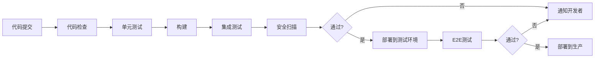

# Go CI/CD最佳实践完全指南

> **简介**: Go项目持续集成和持续部署的完整实践指南，包括GitHub Actions、GitLab CI、Jenkins等主流工具

**版本**: v1.0  
**更新日期**: 2025-10-29  
**适用于**: Go 1.25.3

---

**版本**: v1.0  
**更新日期**: 2025-10-29  
**适用于**: Go 1.25.3

---

---

## 📋 目录

- [1. CI/CD概述](#1.-cicd概述)
  - [CI/CD流程图](#cicd流程图)
  - [核心阶段](#核心阶段)
- [2. GitHub Actions](#2.-github-actions)
  - [完整工作流配置](#完整工作流配置)
  - [多阶段构建Dockerfile](#多阶段构建dockerfile)
- [3. GitLab CI/CD](#3.-gitlab-cicd)
  - [完整.gitlab-ci.yml](#完整.gitlab-ci.yml)
- [4. Jenkins](#4.-jenkins)
  - [Jenkinsfile](#jenkinsfile)
- [5. Docker集成](#5.-docker集成)
  - [Docker Compose开发环境](#docker-compose开发环境)
- [6. 部署策略](#6.-部署策略)
  - [蓝绿部署](#蓝绿部署)
  - [金丝雀发布](#金丝雀发布)
- [7. 最佳实践](#7.-最佳实践)
  - [DO's ✅](#dos)
  - [DON'Ts ❌](#donts)

## 1. CI/CD概述

### CI/CD流程图



### 核心阶段

| 阶段 | 说明 | 工具 |
|------|------|------|
| **代码检查** | 代码格式、静态分析 | gofmt, golangci-lint |
| **测试** | 单元测试、集成测试 | go test, testify |
| **构建** | 编译二进制文件 | go build |
| **打包** | 构建Docker镜像 | docker build |
| **部署** | 部署到目标环境 | kubectl, docker |

---

## 2. GitHub Actions

### 完整工作流配置

```yaml
# .github/workflows/ci.yml
name: Go CI/CD Pipeline

on:
  push:
    branches: [ main, develop ]
  pull_request:
    branches: [ main ]
  release:
    types: [created]

env:
  GO_VERSION: '1.21'
  REGISTRY: ghcr.io
  IMAGE_NAME: ${{ github.repository }}

jobs:
  # ==== 代码质量检查 ====
  lint:
    name: Lint
    runs-on: ubuntu-latest
    steps:
    - uses: actions/checkout@v3
    
    - name: Set up Go
      uses: actions/setup-go@v4
      with:
        go-version: ${{ env.GO_VERSION }}
    
    - name: Run golangci-lint
      uses: golangci/golangci-lint-action@v3
      with:
        version: latest
        args: --timeout=5m

  # ==== 单元测试 ====
  test:
    name: Test
    runs-on: ubuntu-latest
    steps:
    - uses: actions/checkout@v3
    
    - name: Set up Go
      uses: actions/setup-go@v4
      with:
        go-version: ${{ env.GO_VERSION }}
    
    - name: Run tests
      run: |
        go test -v -race -coverprofile=coverage.out -covermode=atomic ./...
    
    - name: Upload coverage to Codecov
      uses: codecov/codecov-action@v3
      with:
        file: ./coverage.out
        flags: unittests
        name: codecov-umbrella

  # ==== 安全扫描 ====
  security:
    name: Security Scan
    runs-on: ubuntu-latest
    steps:
    - uses: actions/checkout@v3
    
    - name: Run Gosec Security Scanner
      uses: securego/gosec@master
      with:
        args: '-no-fail -fmt sarif -out results.sarif ./...'
    
    - name: Upload SARIF file
      uses: github/codeql-action/upload-sarif@v2
      with:
        sarif_file: results.sarif

  # ==== 构建 ====
  build:
    name: Build
    runs-on: ubuntu-latest
    needs: [lint, test]
    strategy:
      matrix:
        goos: [linux, darwin, windows]
        goarch: [amd64, arm64]
        exclude:
          - goos: windows
            goarch: arm64
    steps:
    - uses: actions/checkout@v3
    
    - name: Set up Go
      uses: actions/setup-go@v4
      with:
        go-version: ${{ env.GO_VERSION }}
    
    - name: Build
      run: |
        GOOS=${{ matrix.goos }} GOARCH=${{ matrix.goarch }} \
        go build -v -ldflags="-s -w" -o bin/myapp-${{ matrix.goos }}-${{ matrix.goarch }} ./cmd/myapp
    
    - name: Upload artifacts
      uses: actions/upload-artifact@v3
      with:
        name: binaries
        path: bin/

  # ==== Docker构建和推送 ====
  docker:
    name: Build and Push Docker Image
    runs-on: ubuntu-latest
    needs: [lint, test, security]
    if: github.event_name != 'pull_request'
    permissions:
      contents: read
      packages: write
    steps:
    - uses: actions/checkout@v3
    
    - name: Set up Docker Buildx
      uses: docker/setup-buildx-action@v2
    
    - name: Log in to Container Registry
      uses: docker/login-action@v2
      with:
        registry: ${{ env.REGISTRY }}
        username: ${{ github.actor }}
        password: ${{ secrets.GITHUB_TOKEN }}
    
    - name: Extract metadata
      id: meta
      uses: docker/metadata-action@v4
      with:
        images: ${{ env.REGISTRY }}/${{ env.IMAGE_NAME }}
        tags: |
          type=ref,event=branch
          type=ref,event=pr
          type=semver,pattern={{version}}
          type=semver,pattern={{major}}.{{minor}}
          type=sha
    
    - name: Build and push
      uses: docker/build-push-action@v4
      with:
        context: .
        push: true
        tags: ${{ steps.meta.outputs.tags }}
        labels: ${{ steps.meta.outputs.labels }}
        cache-from: type=gha
        cache-to: type=gha,mode=max

  # ==== 部署到测试环境 ====
  deploy-staging:
    name: Deploy to Staging
    runs-on: ubuntu-latest
    needs: [docker]
    if: github.ref == 'refs/heads/develop'
    environment:
      name: staging
      url: https://staging.example.com
    steps:
    - uses: actions/checkout@v3
    
    - name: Deploy to Kubernetes
      uses: azure/k8s-deploy@v4
      with:
        manifests: |
          k8s/staging/deployment.yaml
          k8s/staging/service.yaml
        images: |
          ${{ env.REGISTRY }}/${{ env.IMAGE_NAME }}:${{ github.sha }}
        namespace: staging

  # ==== 部署到生产环境 ====
  deploy-production:
    name: Deploy to Production
    runs-on: ubuntu-latest
    needs: [docker]
    if: github.event_name == 'release'
    environment:
      name: production
      url: https://example.com
    steps:
    - uses: actions/checkout@v3
    
    - name: Deploy to Kubernetes
      uses: azure/k8s-deploy@v4
      with:
        manifests: |
          k8s/production/deployment.yaml
          k8s/production/service.yaml
        images: |
          ${{ env.REGISTRY }}/${{ env.IMAGE_NAME }}:${{ github.ref_name }}
        namespace: production
```

### 多阶段构建Dockerfile

```dockerfile
# Dockerfile
# ==== 构建阶段 ====
FROM golang:1.21-alpine AS builder

# 安装必要的工具
RUN apk add --no-cache git make

# 设置工作目录
WORKDIR /app

# 复制go mod文件
COPY go.mod go.sum ./
RUN go mod download

# 复制源代码
COPY . .

# 构建应用
RUN CGO_ENABLED=0 GOOS=linux go build \
    -ldflags="-s -w -X main.Version=${VERSION} -X main.BuildTime=$(date -u +%Y-%m-%dT%H:%M:%SZ)" \
    -o /app/myapp \
    ./cmd/myapp

# ==== 运行阶段 ====
FROM alpine:latest

# 安全: 创建非root用户
RUN addgroup -g 1000 app && \
    adduser -D -u 1000 -G app app

# 安装CA证书
RUN apk --no-cache add ca-certificates tzdata

WORKDIR /app

# 从构建阶段复制二进制文件
COPY --from=builder /app/myapp .

# 设置权限
RUN chown -R app:app /app

# 切换到非root用户
USER app

# 健康检查
HEALTHCHECK --interval=30s --timeout=3s --start-period=5s --retries=3 \
  CMD ["/app/myapp", "healthcheck"]

# 暴露端口
EXPOSE 8080

# 启动应用
ENTRYPOINT ["/app/myapp"]
```

---

## 3. GitLab CI/CD

### 完整.gitlab-ci.yml

```yaml
# .gitlab-ci.yml
stages:
  - lint
  - test
  - build
  - deploy

variables:
  GO_VERSION: "1.21"
  DOCKER_DRIVER: overlay2
  DOCKER_TLS_CERTDIR: "/certs"
  REGISTRY: registry.gitlab.com
  IMAGE_NAME: $CI_REGISTRY_IMAGE

# ==== 代码检查 ====
lint:
  stage: lint
  image: golangci/golangci-lint:latest
  script:
    - golangci-lint run --timeout 5m
  allow_failure: false

# ==== 单元测试 ====
test:
  stage: test
  image: golang:$GO_VERSION
  script:
    - go test -v -race -coverprofile=coverage.out ./...
    - go tool cover -func=coverage.out
  coverage: '/total:\s+\(statements\)\s+(\d+\.\d+)%/'
  artifacts:
    reports:
      coverage_report:
        coverage_format: cobertura
        path: coverage.out

# ==== 安全扫描 ====
security:
  stage: test
  image: securego/gosec:latest
  script:
    - gosec -fmt json -out results.json ./...
  artifacts:
    reports:
      sast: results.json
  allow_failure: true

# ==== 构建 ====
build:
  stage: build
  image: golang:$GO_VERSION
  script:
    - go build -v -ldflags="-s -w" -o bin/myapp ./cmd/myapp
  artifacts:
    paths:
      - bin/
    expire_in: 1 week

# ==== Docker构建 ====
docker:build:
  stage: build
  image: docker:latest
  services:
    - docker:dind
  before_script:
    - docker login -u $CI_REGISTRY_USER -p $CI_REGISTRY_PASSWORD $CI_REGISTRY
  script:
    - |
      if [[ "$CI_COMMIT_BRANCH" == "$CI_DEFAULT_BRANCH" ]]; then
        tag="latest"
      else
        tag="$CI_COMMIT_REF_SLUG"
      fi
    - docker build -t $IMAGE_NAME:$tag .
    - docker push $IMAGE_NAME:$tag
  only:
    - branches
    - tags

# ==== 部署到测试环境 ====
deploy:staging:
  stage: deploy
  image: bitnami/kubectl:latest
  script:
    - kubectl config use-context staging
    - kubectl set image deployment/myapp myapp=$IMAGE_NAME:$CI_COMMIT_SHORT_SHA -n staging
    - kubectl rollout status deployment/myapp -n staging
  environment:
    name: staging
    url: https://staging.example.com
  only:
    - develop

# ==== 部署到生产环境 ====
deploy:production:
  stage: deploy
  image: bitnami/kubectl:latest
  script:
    - kubectl config use-context production
    - kubectl set image deployment/myapp myapp=$IMAGE_NAME:$CI_COMMIT_TAG -n production
    - kubectl rollout status deployment/myapp -n production
  environment:
    name: production
    url: https://example.com
  only:
    - tags
  when: manual  # 需要手动触发
```

---

## 4. Jenkins

### Jenkinsfile

```groovy
// Jenkinsfile
pipeline {
    agent any
    
    environment {
        GO_VERSION = '1.21'
        REGISTRY = 'docker.io'
        IMAGE_NAME = 'myorg/myapp'
    }
    
    stages {
        stage('Checkout') {
            steps {
                checkout scm
            }
        }
        
        stage('Setup') {
            steps {
                sh '''
                    # 安装Go
                    wget https://go.dev/dl/go${GO_VERSION}.linux-amd64.tar.gz
                    tar -C /usr/local -xzf go${GO_VERSION}.linux-amd64.tar.gz
                    export PATH=$PATH:/usr/local/go/bin
                '''
            }
        }
        
        stage('Lint') {
            steps {
                sh '''
                    curl -sSfL https://raw.githubusercontent.com/golangci/golangci-lint/master/install.sh | sh -s -- -b $(go env GOPATH)/bin
                    golangci-lint run --timeout 5m
                '''
            }
        }
        
        stage('Test') {
            steps {
                sh '''
                    go test -v -race -coverprofile=coverage.out ./...
                '''
                
                // 发布测试报告
                junit 'test-results.xml'
                cobertura coberturaReportFile: 'coverage.out'
            }
        }
        
        stage('Build') {
            steps {
                sh '''
                    CGO_ENABLED=0 go build -ldflags="-s -w" -o bin/myapp ./cmd/myapp
                '''
                
                // 归档制品
                archiveArtifacts artifacts: 'bin/myapp', fingerprint: true
            }
        }
        
        stage('Docker Build') {
            steps {
                script {
                    docker.build("${IMAGE_NAME}:${BUILD_NUMBER}")
                }
            }
        }
        
        stage('Docker Push') {
            steps {
                script {
                    docker.withRegistry("https://${REGISTRY}", 'docker-credentials') {
                        docker.image("${IMAGE_NAME}:${BUILD_NUMBER}").push()
                        docker.image("${IMAGE_NAME}:${BUILD_NUMBER}").push('latest')
                    }
                }
            }
        }
        
        stage('Deploy to Staging') {
            when {
                branch 'develop'
            }
            steps {
                sh '''
                    kubectl set image deployment/myapp myapp=${IMAGE_NAME}:${BUILD_NUMBER} -n staging
                    kubectl rollout status deployment/myapp -n staging
                '''
            }
        }
        
        stage('Deploy to Production') {
            when {
                branch 'main'
            }
            steps {
                input message: 'Deploy to Production?', ok: 'Deploy'
                
                sh '''
                    kubectl set image deployment/myapp myapp=${IMAGE_NAME}:${BUILD_NUMBER} -n production
                    kubectl rollout status deployment/myapp -n production
                '''
            }
        }
    }
    
    post {
        always {
            cleanWs()
        }
        success {
            slackSend color: 'good', message: "Build Success: ${env.JOB_NAME} ${env.BUILD_NUMBER}"
        }
        failure {
            slackSend color: 'danger', message: "Build Failed: ${env.JOB_NAME} ${env.BUILD_NUMBER}"
        }
    }
}
```

---

## 5. Docker集成

### Docker Compose开发环境

```yaml
# docker-compose.yml
version: '3.8'

services:
  app:
    build:
      context: .
      dockerfile: Dockerfile.dev
    ports:
      - "8080:8080"
    volumes:
      - .:/app
      - go-mod-cache:/go/pkg/mod
    environment:
      - DATABASE_URL=postgres://user:pass@db:5432/mydb
      - REDIS_URL=redis://redis:6379
    depends_on:
      - db
      - redis
    command: go run cmd/myapp/main.go
  
  db:
    image: postgres:15-alpine
    environment:
      POSTGRES_USER: user
      POSTGRES_PASSWORD: pass
      POSTGRES_DB: mydb
    ports:
      - "5432:5432"
    volumes:
      - postgres-data:/var/lib/postgresql/data
  
  redis:
    image: redis:7-alpine
    ports:
      - "6379:6379"
    volumes:
      - redis-data:/data

volumes:
  go-mod-cache:
  postgres-data:
  redis-data:
```

---

## 6. 部署策略

### 蓝绿部署

```yaml
# k8s/blue-green-deployment.yaml
apiVersion: v1
kind: Service
metadata:
  name: myapp
spec:
  selector:
    app: myapp
    version: blue  # 切换到green时修改
  ports:
    - port: 80
      targetPort: 8080

---
apiVersion: apps/v1
kind: Deployment
metadata:
  name: myapp-blue
spec:
  replicas: 3
  selector:
    matchLabels:
      app: myapp
      version: blue
  template:
    metadata:
      labels:
        app: myapp
        version: blue
    spec:
      containers:
      - name: myapp
        image: myapp:1.0.0
        ports:
        - containerPort: 8080

---
apiVersion: apps/v1
kind: Deployment
metadata:
  name: myapp-green
spec:
  replicas: 3
  selector:
    matchLabels:
      app: myapp
      version: green
  template:
    metadata:
      labels:
        app: myapp
        version: green
    spec:
      containers:
      - name: myapp
        image: myapp:1.1.0
        ports:
        - containerPort: 8080
```

### 金丝雀发布

```yaml
# k8s/canary-deployment.yaml
apiVersion: apps/v1
kind: Deployment
metadata:
  name: myapp-stable
spec:
  replicas: 9  # 90%流量
  selector:
    matchLabels:
      app: myapp
      track: stable
  template:
    metadata:
      labels:
        app: myapp
        track: stable
    spec:
      containers:
      - name: myapp
        image: myapp:1.0.0

---
apiVersion: apps/v1
kind: Deployment
metadata:
  name: myapp-canary
spec:
  replicas: 1  # 10%流量
  selector:
    matchLabels:
      app: myapp
      track: canary
  template:
    metadata:
      labels:
        app: myapp
        track: canary
    spec:
      containers:
      - name: myapp
        image: myapp:1.1.0
```

---

## 7. 最佳实践

### DO's ✅

1. **自动化一切**
   - 自动化测试
   - 自动化构建
   - 自动化部署

2. **快速反馈**
   - 快速构建（<10分钟）
   - 即时通知
   - 清晰的错误信息

3. **安全优先**
   - 依赖扫描
   - 安全测试
   - 最小权限原则

4. **版本控制**
   - 语义化版本
   - Git标签
   - 变更日志

5. **监控和日志**
   - 构建监控
   - 部署监控
   - 详细日志

### DON'Ts ❌

1. ❌ 不要跳过测试
2. ❌ 不要在CI中使用固定密码
3. ❌ 不要忽略安全扫描结果
4. ❌ 不要直接部署到生产环境
5. ❌ 不要缺少回滚机制

---

**文档维护者**: Go Documentation Team  
**最后更新**: 2025-10-29  
**文档状态**: ✅ 完成  
**适用版本**: Go 1.21+
