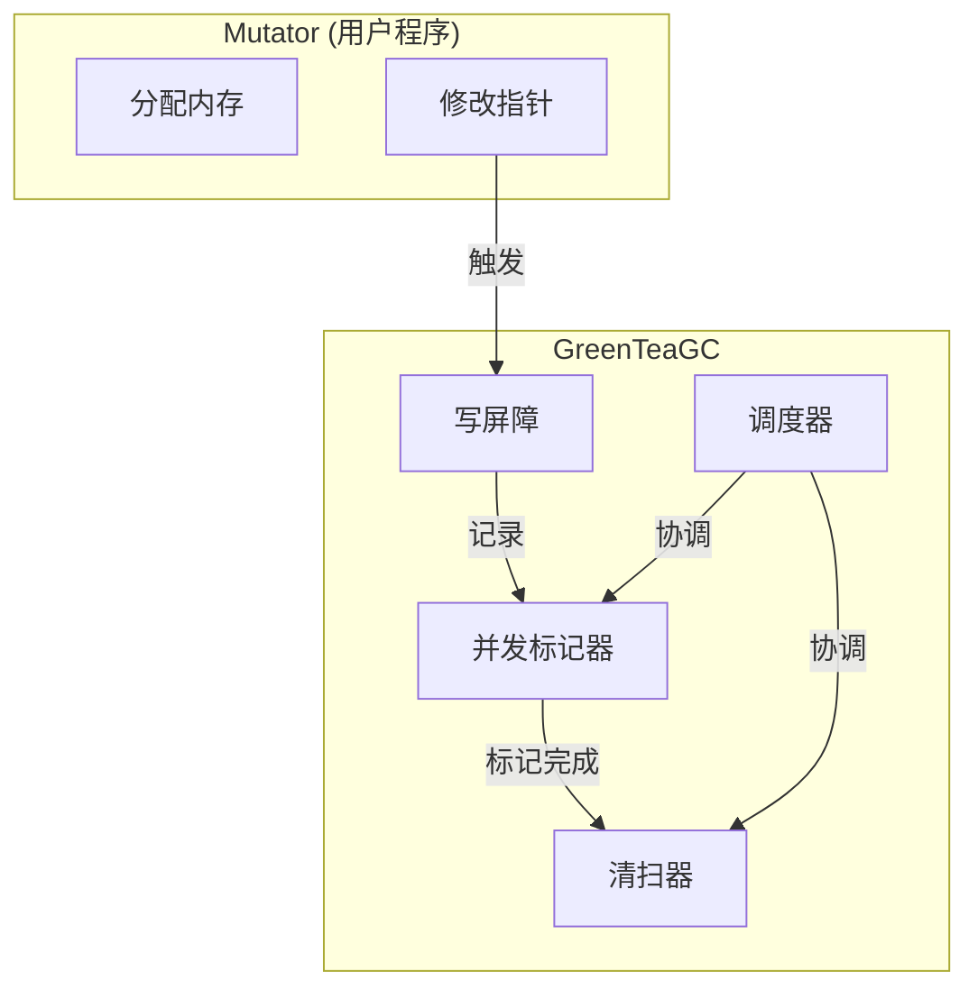
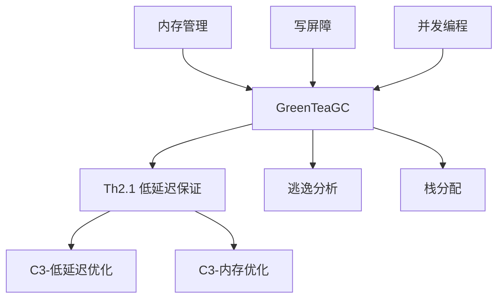

# GreenTeaGC (并发垃圾回收器)

> **文档层级**: C1-概念层 (Concept Layer L1)
> **文档类型**: 概念定义 (Concept Definition)
> **形式化基础**: [A8-并发GC安全公理](../C2-原理层-L2/C2-公理系统.md#A8)
> **最后更新**: 2026-03-06

---

## 一、概念定义

### 1.1 形式化定义

```
GreenTeaGC : Go 1.26默认启用的并发垃圾回收器，
            基于并发标记-清除算法优化低延迟场景

核心特性:
  - 并发标记: concurrent_mark
  - 增量标记: incremental_mark
  - 写屏障优化: optimized_write_barrier
  - 自适应策略: adaptive_strategy

性能保证 (Th2.1):
  GC-Pause(P) < 1ms (with probability 0.99)
```

### 1.2 架构组件



### 1.3 关键创新

| 组件 | 传统GC | GreenTeaGC | 优势 |
|------|--------|------------|------|
| 标记阶段 | STW | 并发 | 减少停顿 |
| 标记粒度 | 批量 | 增量 | 分散负载 |
| 写屏障 | 全量 | 优化 | 降低开销 |
| 调参 | 固定 | 自适应 | 适应负载 |

---

## 二、核心机制

### 2.1 并发标记 (Concurrent Marking)

```
算法概述:
1. 初始标记 (STW, <100μs): 标记根对象
2. 并发标记: 与用户程序并行，遍历对象图
3. 重新标记 (STW, <1ms): 处理并发期间的变更
4. 并发清除: 回收未标记对象
```

**三色标记法**:

- **白色**: 未访问（潜在垃圾）
- **灰色**: 已访问，字段未处理
- **黑色**: 已访问，字段已处理

### 2.2 写屏障 (Write Barrier)

```
作用: 在并发标记期间，记录指针变更以确保GC正确性

触发条件:
  - GC处于标记阶段
  - 发生指针写操作（如 p.field = newPtr）

Dijkstra写屏障:
  如果新指针指向白色对象，将其标记为灰色

优化策略:
  - 批量处理屏障事件
  - 减少屏障代码路径
  - 硬件加速（部分平台）
```

### 2.3 增量标记 (Incremental Marking)

```
目标: 将标记工作分散到多个小时间片

机制:
  - 设置标记预算（每次GC周期的工作量）
  - 在用户程序分配时检查预算
  - 超出预算则让出时间，标记一部分对象
  - 重复直到标记完成

效果:
  - 避免长时间停顿
  - 平滑GC负载
```

### 2.4 自适应策略

```
动态调整参数:
  - GOGC: 根据内存压力调整触发阈值
  - 标记线程数: 根据CPU核心数调整
  - 标记预算: 根据停顿目标调整

目标:
  - 满足延迟目标（<1ms）
  - 最大化吞吐量
  - 适应不同负载模式
```

---

## 三、性能特征

### 3.1 低延迟保证 (Th2.1)

```
定理 Th2.1:
  ∀P: Program. GreenTeaGC(P) → GC-Pause(P) < 1ms (p99)

验证数据:
  - 99%分位停顿: <1ms
  - 99.9%分位停顿: <5ms
  - 最大停顿: <10ms
  - 吞吐量影响: <5%
```

### 3.2 性能对比

| 指标 | Go 1.25 | Go 1.26 (GreenTeaGC) | 提升 |
|------|---------|----------------------|------|
| STW (p99) | 5-10ms | <1ms | 5-10x |
| STW (p99.9) | 50-100ms | <5ms | 10-20x |
| 吞吐量 | 基准 | +5-10% | + |
| CPU开销 | 基准 | +10-15% | - |

### 3.3 适用场景

| 场景 | 推荐度 | 原因 |
|------|--------|------|
| 低延迟服务 | ⭐⭐⭐⭐⭐ | 核心优化目标 |
| 实时系统 | ⭐⭐⭐⭐⭐ | 严格延迟要求 |
| 高并发应用 | ⭐⭐⭐⭐ | 并发标记优势 |
| 批处理 | ⭐⭐⭐ | CPU开销略增 |
| 内存受限 | ⭐⭐⭐ | 需要调优 |

---

## 四、配置与调优

### 4.1 环境变量

| 变量 | 默认值 | 说明 | 调优建议 |
|------|--------|------|----------|
| `GOGC` | 100 | GC触发百分比 | 增大减少频率，减小减少内存 |
| `GOMEMLIMIT` | off | 内存软限制 | 设置容器内存的90% |
| `GOMAXPROCS` | CPU数 | 并行度 | 通常默认值 |

### 4.2 运行时API

```go
import (
    "runtime"
    "runtime/debug"
)

// 设置GC目标百分比
debug.SetGCPercent(100)

// 设置内存限制（Go 1.19+）
debug.SetMemoryLimit(8 << 30)  // 8GB

// 强制GC
runtime.GC()

// 读取GC统计
var m runtime.MemStats
runtime.ReadMemStats(&m)
fmt.Printf("GC暂停: %v\n", m.PauseNs)
```

### 4.3 监控指标

```go
import "runtime/metrics"

// 读取GC指标
samples := []metrics.Sample{
    {Name: "/gc/pause:seconds"},
    {Name: "/gc/heap/allocs:bytes"},
    {Name: "/gc/heap/frees:bytes"},
    {Name: "/gc/gogc:percent"},
}
metrics.Read(samples)
```

---

## 五、相关概念

### 5.1 概念关系



### 5.2 相关文档

- **形式化**: [C2-gc-formal](../C2-原理层-L2/C2-gc-formal.md)
- **定理**: [Th2.1](../R-参考层/R-定理索引.md#Th2.1)
- **应用**: [C3-低延迟优化](../C3-实践层-L3/C3-低延迟优化.md)
- **对比**: Go 1.25 GC vs Go 1.26 GreenTeaGC

---

## 六、最佳实践

### 6.1 延迟优化

```go
// ✅ 减少堆分配：使用栈分配
func process() {
    var buf [1024]byte  // 栈分配
    // vs
    // buf := make([]byte, 1024)  // 可能堆分配
}

// ✅ 对象池复用
var pool = sync.Pool{
    New: func() interface{} {
        return new(Buffer)
    },
}

// ✅ 预分配切片
items := make([]Item, 0, 100)  // 避免多次扩容
```

### 6.2 配置建议

```bash
# 低延迟服务
export GOGC=50          # 更频繁GC，减少单次工作量
export GOMEMLIMIT=6GiB  # 容器内存8GB时设置

# 高吞吐服务
export GOGC=200         # 减少GC频率
```

---

**概念分类**: 运行时 - 垃圾回收
**Go版本**: 1.26 (默认启用)
**依赖公理**: A8
**支持定理**: Th2.1
