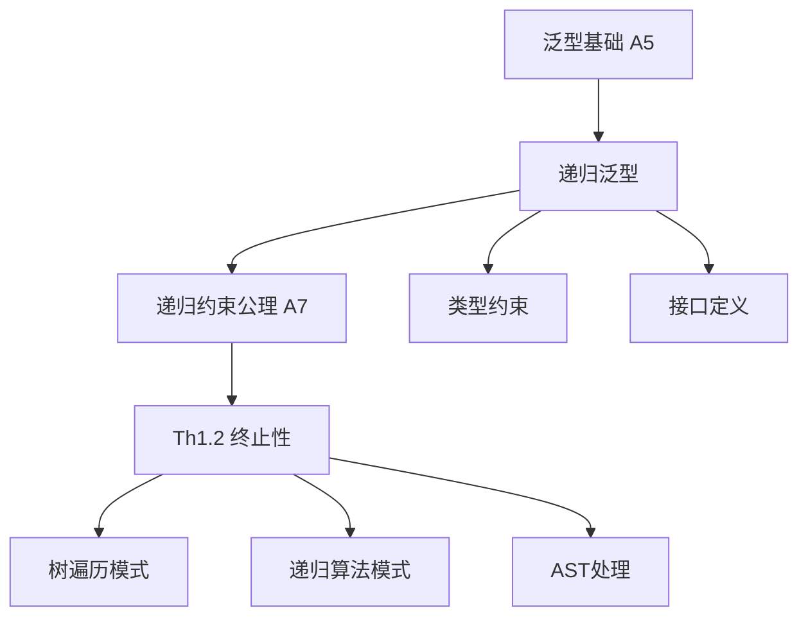

# 递归泛型约束 (Recursive Generic Constraints)

> **文档层级**: C1-概念层 (Concept Layer L1)
> **文档类型**: 概念定义 (Concept Definition)
> **形式化基础**: [A7-递归约束公理](../C2-原理层-L2/C2-公理系统.md#A7)
> **依赖**: 泛型基础 (Go 1.18+)
> **最后更新**: 2026-03-06

---

## 一、概念定义

### 1.1 形式化定义

```
递归类型约束 : 约束定义中引用自身类型参数的约束

形式定义:
  C[T C[T]] : Constraint

  其中:
    C 是约束名
    T 是类型参数
    C[T] 表示"T满足约束C"
    C[T C[T]] 表示"T满足以T自身为参数的约束C"

语义:
  T satisfies C[T C[T]] ↔ T implements C with T as argument
```

### 1.2 语法形式

```go
// 递归约束定义
type ConstraintName[TypeParam ConstraintName[TypeParam]] interface {
    Method(TypeParam) TypeParam
}

// 具体示例
type Adder[A Adder[A]] interface {
    Add(A) A
}
```

### 1.3 核心特征

1. **自引用**: 约束定义中引用自身
2. **参数化**: 类型参数作为约束的参数
3. **结构递归**: 递归必须是结构化的（保证终止）

---

## 二、核心性质

### 2.1 终止性保证 (Th1.2)

由[Th1.2](../R-参考层/R-定理索引.md#Th1.2)保证：

```
定理: ∀C[T C[T]]: Constraint. wellformed(C) → terminates(unfold(C))

直观解释:
  只要约束是结构递归的（每次递归问题规模减小），
  类型检查器的展开过程保证在有限步内终止。
```

### 2.2 与常规泛型的对比

| 特性 | 常规泛型 | 递归泛型 |
|------|----------|----------|
| 约束引用 | 其他类型 | 自身 |
| 语法 | `C[T]` | `C[T C[T]]` |
| 应用场景 | 通用容器 | 树/图遍历 |
| 终止性 | 天然 | 需结构递归保证 |

### 2.3 类型安全

```
性质: 递归泛型保持Go的类型安全性

原因:
  1. 约束检查在编译期完成
  2. 终止性保证类型检查器不会无限循环
  3. 类型参数仍然需要满足约束
```

---

## 三、典型应用

### 3.1 树结构遍历

```go
// 定义递归约束：树节点
type Node[T Node[T]] interface {
    Children() []T
}

// 通用树遍历函数
func Walk[T Node[T]](node T, fn func(T)) {
    fn(node)
    for _, child := range node.Children() {
        Walk(child, fn)  // 递归调用，类型安全
    }
}

// 具体实现
type FileNode struct {
    Name     string
    Children []*FileNode
}

func (f *FileNode) Children() []*FileNode {
    return f.Children
}

// 使用
Walk(root, func(n *FileNode) {
    fmt.Println(n.Name)
})
```

### 3.2 算术表达式抽象

```go
// 递归约束：表达式节点
type Expr[T Expr[T]] interface {
    Eval() float64
    Children() []T
}

type BinaryOp[T Expr[T]] struct {
    Op       string
    Left     T
    Right    T
}

func (b *BinaryOp[T]) Children() []T {
    return []T{b.Left, b.Right}
}

func (b *BinaryOp[T]) Eval() float64 {
    // 根据Op计算
}
```

### 3.3 链表/图操作

```go
// 链表节点
type ListNode[T ListNode[T]] struct {
    Value T
    Next  *ListNode[T]
}

// 递归泛型函数：链表反转
func Reverse[T any](head *ListNode[T]) *ListNode[T] {
    var prev *ListNode[T]
    curr := head
    for curr != nil {
        next := curr.Next
        curr.Next = prev
        prev = curr
        curr = next
    }
    return prev
}
```

---

## 四、约束条件

### 4.1 结构递归要求

```go
// ✅ 良好：结构递归
type Good[T Good[T]] interface {
    Children() []T  // 返回子节点，规模递减
}

// ❌ 错误：非结构递归（可能导致无限展开）
type Bad[T Bad[Bad[T]]] interface {  // 双重嵌套
    Method(T)
}
```

### 4.2 终止条件

```
结构递归的要求:
1. 必须存在基础情况（叶子节点）
2. 递归调用必须向基础情况推进
3. 递归深度必须有限
```

---

## 五、相关概念

### 5.1 概念关系



### 5.2 相关文档

- **基础**: [C1-术语体系](C1-术语体系.md) - 泛型相关术语
- **形式化**: [C2-recursive-generic-formal](../C2-原理层-L2/C2-recursive-generic-formal.md)
- **定理**: [Th1.2](../R-参考层/R-定理索引.md#Th1.2)
- **应用**: [C3-树遍历模式](../C3-实践层-L3/C3-树遍历模式.md)
- **对比**: Go 1.18泛型 vs Go 1.26递归泛型

---

## 六、版本演进

```
Go 1.18: 泛型基础引入
   ↓ 依赖
Go 1.23: 迭代器支持
   ↓ 依赖
Go 1.26: 递归泛型约束
   = 泛型 + 自引用约束

演进逻辑:
  泛型允许抽象类型 →
  递归泛型允许抽象自引用结构 →
  实现通用树/图算法
```

---

## 七、最佳实践

| 场景 | 推荐模式 | 示例 |
|------|----------|------|
| 树遍历 | 递归约束+Walker函数 | Walk[T Node[T]] |
| AST处理 | 访问者模式 | Visitor[T Expr[T]] |
| 图算法 | 约束+算法分离 | Graph[T Node[T]] |
| 链表操作 | 泛型函数 | Reverse[T any] |

### 7.1 设计建议

```go
// ✅ 推荐：约束专注于结构
type Node[T Node[T]] interface {
    Children() []T
}

// ✅ 推荐：算法与约束分离
func Walk[T Node[T]](node T, fn func(T))

// ✅ 推荐：提供基础实现
type BaseNode struct {
    Children []*BaseNode
}
```

---

**概念分类**: 语言特性 - 泛型
**Go版本**: 1.26+
**依赖**: Go 1.18泛型基础
**依赖公理**: A5, A7
**支持定理**: Th1.2
