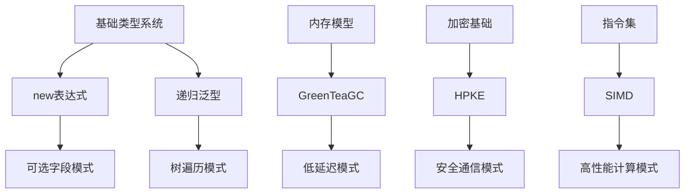

# Go 1.26 核心术语体系

> **文档层级**: C1-概念层 (Concept Layer L1)
> **文档类型**: 术语定义 (Terminology Definitions)
> **版本**: v2.0-formal
> **最后更新**: 2026-03-06

---

## 一、术语体系总览

### 1.1 层次结构

```
Go 1.26 术语体系
├── 基础术语
│   ├── 内存模型相关
│   ├── 类型系统相关
│   └── 泛型相关
├── 核心特性术语
│   ├── new表达式扩展
│   ├── 递归泛型约束
│   ├── GreenTeaGC
│   ├── HPKE
│   ├── SIMD加速
│   └── 其他特性
└── 派生术语
    ├── 模式术语
    ├── 优化术语
    └── 安全术语
```

### 1.2 术语依赖图



---

## 二、基础术语

### 2.1 内存模型相关

#### 🎯 内存分配 (Memory Allocation)

**形式定义**:

```
内存分配 : 为指定类型在堆或栈上分配一块连续内存区域的操作

符号: alloc(T) → *T
参数: T - 要分配内存的类型
返回: *T - 指向分配内存的指针
```

**性质**:

- **对齐性**: 分配的内存满足类型T的对齐要求
- **初始化**: 默认初始化为零值
- **位置**: 可能在栈或堆上（由逃逸分析决定）

**参见**:

- [A1-内存分配公理](../C2-原理层-L2/C2-公理系统.md#A1)

---

#### 🎯 逃逸分析 (Escape Analysis)

**形式定义**:

```
逃逸分析 : 编译时分析确定变量生命周期是否超出当前栈帧，
          决定是否需要在堆上分配的技术

逃逸条件: 变量地址被返回、赋值给全局变量、或传递给未知函数
栈分配条件: 变量仅在当前函数内使用且生命周期确定
```

**性质**:

- **静态分析**: 编译期确定，无运行时开销
- **优化导向**: 尽可能栈分配以减少GC压力
- **保守策略**: 不确定时选择堆分配

---

#### 🎯 写屏障 (Write Barrier)

**形式定义**:

```
写屏障 : 在并发GC期间，记录指针修改以确保GC正确性的机制

触发条件: GC标记阶段 + 指针赋值操作
操作: 将旧指针和新指针记录到GC工作队列
```

**类型**:

- **Dijkstra写屏障**: 黑对象赋值时记录
- **Yuasa写屏障**: 删除灰对象指针时记录

---

### 2.2 类型系统相关

#### 🎯 类型等价 (Type Equivalence)

**形式定义**:

```
类型等价 : 两个类型在内存表示和语义上完全相同

符号: T ≡ U
定义: T ≡ U ↔ sizeof(T) = sizeof(U) ∧ alignof(T) = alignof(U) ∧ layout(T) = layout(U)
```

**参见**:

- [A4-类型等价公理](../C2-原理层-L2/C2-公理系统.md#A4)

---

#### 🎯 类型约束 (Type Constraint)

**形式定义**:

```
类型约束 : 对泛型类型参数的限制条件，规定了类型必须实现的接口

语法: [T Constraint]
语义: T必须满足Constraint定义的方法集或类型集
```

**约束类型**:

- **接口约束**: `T interface{ Method() }`
- **类型集约束**: `T ~int | ~string`
- **复合约束**: `T Constraint1 | Constraint2`

---

### 2.3 泛型相关

#### 🎯 泛型实例化 (Generic Instantiation)

**形式定义**:

```
泛型实例化 : 将泛型代码中的类型参数替换为具体类型，生成具体代码的过程

符号: instantiate(F[T], ConcreteType)
结果: 具体化的类型和函数
```

**性质**:

- **编译期完成**: 实例化发生在编译阶段
- **代码生成**: 可能生成多份实例化代码（单态化）
- **类型安全**: 实例化后类型检查通过则运行时安全

**参见**:

- [A5-泛型实例化公理](../C2-原理层-L2/C2-公理系统.md#A5)

---

## 三、Go 1.26 核心术语

### 3.1 new表达式扩展

#### 🎯 new(expr) 表达式

**形式定义**:

```
new表达式 : Go 1.26引入的语法，允许用值初始化new分配的内存

语法形式: new(表达式)
参数: 表达式 - 任意可求值的表达式
返回: *T - 指向初始化后内存的指针（T为表达式类型）

语义等价: new(v) ≡ &v'  （其中v'是v的副本）
```

**历史演进**:

- **Go 1.0-1.25**: `new(T)` 仅支持类型参数，分配零值内存
- **Go 1.26**: 新增 `new(expr)` 支持表达式参数，分配并初始化

**使用场景**:

- 可选字段初始化
- 延迟初始化
- 构造函数简化

**参见**:

- [C2-new表达式形式化](../C2-原理层-L2/C2-new-expr-formal.md)
- [Th1.1-语义等价定理](../R-参考层/R-定理索引.md#Th1.1)

---

### 3.2 递归泛型约束

#### 🎯 递归类型约束 (Recursive Type Constraint)

**形式定义**:

```
递归类型约束 : 约束定义中引用自身类型参数的约束

语法形式: type C[T C[T]] interface { ... }
语义: 类型T必须满足以T自身为参数的约束C

示例:
  type Adder[A Adder[A]] interface {
      Add(A) A
  }

  解释: 类型A必须实现Adder[A]，即A必须有Add(A) A方法
```

**适用场景**:

- 树结构遍历
- 递归算法抽象
- 自引用数据结构

**参见**:

- [A7-递归约束公理](../C2-原理层-L2/C2-公理系统.md#A7)
- [Th1.2-终止性定理](../R-参考层/R-定理索引.md#Th1.2)

---

### 3.3 GreenTeaGC

#### 🎯 GreenTeaGC

**形式定义**:

```
GreenTeaGC : Go 1.26默认启用的并发垃圾回收器，
            基于并发标记-清除算法，优化低延迟场景

核心特性:
  - 并发标记: 与用户程序并发执行标记阶段
  - 增量标记: 将标记工作分散到多个时间片
  - 写屏障优化: 减少屏障开销
  - 自适应策略: 根据负载动态调整参数
```

**性能保证**:

- STW (Stop-The-World) 时间: < 1ms (99%分位)
- 吞吐量: 相比前版本提升5-10%
- 内存开销: 增加约10-15%用于并发标记

**配置参数**:

- `GOGC`: 触发GC的堆增长百分比
- `GOMEMLIMIT`: 内存限制
- `runtime.GOMAXPROCS`: 并行度

**参见**:

- [A8-并发GC公理](../C2-原理层-L2/C2-公理系统.md#A8)
- [Th2.1-低延迟定理](../R-参考层/R-定理索引.md#Th2.1)

---

### 3.4 HPKE (混合公钥加密)

#### 🎯 HPKE (Hybrid Public Key Encryption)

**形式定义**:

```
HPKE : RFC 9180标准的混合公钥加密方案，
      结合非对称加密（密钥封装）和对称加密（数据加密）

组件:
  - KEM: 密钥封装机制（如X25519, P-256）
  - KDF: 密钥派生函数（如HKDF-SHA256）
  - AEAD: 认证加密（如AES-GCM, ChaCha20-Poly1305）

操作模式:
  - Base: 基本模式，仅使用公钥
  - PSK: 预共享密钥模式
  - Auth: 认证模式
  - AuthPSK: 认证+PSK模式
```

**API层次**:

- **底层**: `kem.Scheme`, `hpke.Sender`, `hpke.Receiver`
- **中层**: `SingleShotSeal()`, `SingleShotOpen()`
- **高层**: 便捷函数封装

**参见**:

- [crypto/hpke包文档](https://pkg.go.dev/crypto/hpke)
- [RFC 9180](https://datatracker.ietf.org/doc/html/rfc9180)

---

### 3.5 SIMD加速

#### 🎯 SIMD (Single Instruction Multiple Data)

**形式定义**:

```
SIMD加速 : 利用CPU向量指令集（AVX2, AVX-512, NEON等）
          实现单指令处理多数据，提升计算密集型操作性能

Go 1.26支持:
  - bytes包: SIMD优化的字符串/字节操作
  - strings包: SIMD优化的字符串搜索
  - 条件支持: 取决于CPU和Go运行时检测
```

**支持的指令集**:

- **x86/x64**: AVX2 (256-bit), AVX-512 (512-bit)
- **ARM64**: NEON (128-bit), SVE (可变长度)

**加速场景**:

- 字节/字符串比较
- 字节/字符串搜索
- 数据复制
- 位操作

---

## 四、派生术语

### 4.1 模式术语

| 术语 | 定义 | 应用场景 |
|------|------|----------|
| 可选字段模式 | 使用new(expr)实现字段的延迟初始化 | API设计、可选配置 |
| 树遍历模式 | 使用递归泛型约束抽象树遍历算法 | AST遍历、树操作 |
| 构造者模式 | 使用new(expr)简化对象构造 | 对象初始化 |
| 安全信封模式 | 使用HPKE封装敏感数据 | 数据加密、密钥交换 |

### 4.2 优化术语

| 术语 | 定义 | 应用场景 |
|------|------|----------|
| 逃逸消除 | 编译器优化避免堆分配 | 性能关键代码 |
| 栈分配 | 在函数栈帧分配局部变量 | 减少GC压力 |
| 内联优化 | 将小函数体直接插入调用点 | 减少调用开销 |
| 向量化 | 使用SIMD指令批量处理数据 | 数值计算、数据处理 |

### 4.3 安全术语

| 术语 | 定义 | 应用场景 |
|------|------|----------|
| 密钥封装 | KEM操作，用公钥加密随机密钥 | HPKE密钥交换 |
| 前向保密 | 即使长期密钥泄露，历史会话仍安全 | 加密通信 |
| 秘密清零 | 从内存安全擦除敏感数据 | crypto/subtle |

---

## 五、术语索引

### 5.1 按字母排序

| 术语 | 定义 | 链接 |
|------|------|------|
| Escape Analysis | 逃逸分析 | [2.1节](#21-内存模型相关) |
| Generic Instantiation | 泛型实例化 | [2.3节](#23-泛型相关) |
| GreenTeaGC | 并发垃圾回收器 | [3.3节](#33-greenteagc) |
| HPKE | 混合公钥加密 | [3.4节](#34-hpke) |
| Memory Allocation | 内存分配 | [2.1节](#21-内存模型相关) |
| new(expr) | new表达式扩展 | [3.1节](#31-new表达式扩展) |
| Recursive Constraint | 递归类型约束 | [3.2节](#32-递归泛型约束) |
| SIMD | 单指令多数据 | [3.5节](#35-simd加速) |
| Type Constraint | 类型约束 | [2.2节](#22-类型系统相关) |
| Write Barrier | 写屏障 | [2.1节](#21-内存模型相关) |

### 5.2 按主题分组

**语言特性**:

- new表达式扩展
- 递归泛型约束
- 类型约束
- 泛型实例化

**运行时**:

- GreenTeaGC
- 内存分配
- 逃逸分析
- 写屏障

**标准库**:

- HPKE
- SIMD加速

---

## 六、术语关系图谱

```
                    ┌─ 内存分配 ─┐
                    ↓            ↓
基础术语 ──→ 逃逸分析 ──→ new(expr)
                    ↑            ↓
                    └─ 写屏障 ───┘      ┌─ 树遍历模式
                    ↓                    ↓
GreenTeaGC ←── 运行时 ──→ 递归泛型 ←── 类型约束
                                    ↓
                              泛型实例化
                                    ↓
                              模式应用
```

---

## 七、术语变更历史

| 版本 | 新增术语 | 变更说明 |
|------|----------|----------|
| Go 1.26 | new(expr), GreenTeaGC, HPKE, SIMD | 本版本主要新增 |
| Go 1.23 | range-over-func | 迭代器支持 |
| Go 1.22 | for-range整数 | 循环改进 |
| Go 1.21 | slices, maps, cmp | 泛型工具包 |
| Go 1.18 | 泛型基础 | 类型参数引入 |

---

**最后更新**: 2026-03-06
**术语版本**: v2.0-formal
**维护状态**: ✅ 核心术语已定义
