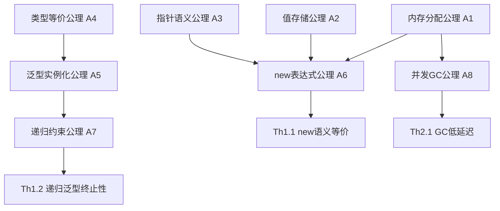

# Go 1.26 形式化公理系统

> **文档层级**: C2-原理层 (Principle Layer)
> **文档类型**: 公理系统 (Axiom System)
> **版本**: v2.0-formal
> **最后更新**: 2026-03-06

---

## 一、符号约定

### 1.1 基本符号

| 符号 | 含义 | 示例 |
|------|------|------|
| `∀` | 全称量词 | `∀T: Type` 表示"对于所有类型T" |
| `∃` | 存在量词 | `∃x. P(x)` 表示"存在x使得P(x)成立" |
| `→` | 映射/蕴含 | `A → B` 表示"A蕴含B"或"从A到B的映射" |
| `≡` | 语义等价 | `A ≡ B` 表示A和B语义等价 |
| `=` | 语法相等 | `A = B` 表示A和B语法完全相同 |
| `⊢` | 推导 | `Γ ⊢ e: T` 表示在上下文Γ中e具有类型T |
| `*` | 指针类型 | `*T` 表示指向T的指针类型 |
| `&` | 取地址 | `&v` 表示v的内存地址 |

### 1.2 类型符号

| 符号 | 含义 | 示例 |
|------|------|------|
| `Type` | 类型宇宙 | `T: Type` 表示T是一个类型 |
| `Value` | 值宇宙 | `v: T` 表示v是类型T的值 |
| `Address` | 地址宇宙 | `a: Address` 表示a是一个内存地址 |
| `Constraint` | 约束宇宙 | `C: Constraint` 表示C是一个类型约束 |

### 1.3 操作符号

| 符号 | 含义 | 定义 |
|------|------|------|
| `alloc(T)` | 分配内存 | 为类型T分配未初始化的内存，返回`*T` |
| `store(p, v)` | 存储值 | 将值v存储到地址p指向的内存 |
| `load(p)` | 加载值 | 从地址p加载值 |
| `addressof(v)` | 取地址 | 返回值v的内存地址 |
| `sizeof(T)` | 类型大小 | 类型T占用的字节数 |
| `alignof(T)` | 类型对齐 | 类型T的对齐要求 |

---

## 二、基础公理

### A1. 内存分配公理 (Memory Allocation Axiom)

```
公理陈述:
────────────────────────────────
∀T: Type. alloc(T) → *T

形式定义:
  alloc : ∀T: Type. ( uninitialized memory block of size sizeof(T) aligned to alignof(T) ) → *T

直观解释:
  对于任意类型T，alloc(T)分配一块大小为sizeof(T)、对齐为alignof(T)的未初始化内存，
  并返回指向该内存的指针。

前置条件:
  - T必须是合法的类型
  - 系统有足够的可用内存

后置条件:
  - 返回的指针是有效的（非nil）
  - 返回的指针指向的内存是未初始化的
  - 内存满足T的对齐要求
```

**证明引理**:

```
引理 A1.1 (分配唯一性)
  alloc(T)₁ ≠ alloc(T)₂  (两次分配返回不同地址)

引理 A1.2 (对齐保证)
  addr(alloc(T)) mod alignof(T) = 0
```

### A2. 值存储公理 (Value Storage Axiom)

```
公理陈述:
────────────────────────────────
∀T: Type, p: *T, v: T. store(p, v) → Unit

形式定义:
  store : ∀T: Type. *T → T → Unit

直观解释:
  将类型T的值v存储到指针p指向的内存位置。

前置条件:
  - p是有效的非nil指针
  - p指向的内存已分配且可写
  - v的类型与p指向的类型兼容

后置条件:
  - p指向的内存现在包含v的副本
  - store操作是原子的（对于基础类型）
```

**证明引理**:

```
引理 A2.1 (存储后读取)
  store(p, v); load(p) = v

引理 A2.2 (存储覆盖)
  store(p, v₁); store(p, v₂) ⟹ load(p) = v₂
```

### A3. 指针语义公理 (Pointer Semantics Axiom)

```
公理陈述:
────────────────────────────────
∀T: Type, v: T. &v = addressof(v)

形式定义:
  & : ∀T: Type. T → *T
  &v ≜ addressof(v)

直观解释:
  取地址操作符&返回值v在内存中的地址。

性质:
  - &v ≠ nil (有效地址)
  - &v 在v的生命周期内有效
  - &(&v) 是非法的（不能取地址的地址）
```

**证明引理**:

```
引理 A3.1 (解引用)
  *(&v) = v

引理 A3.2 (地址唯一性)
  &v₁ = &v₂ ⟹ v₁ = v₂  (对于不同的变量)
```

### A4. 类型等价公理 (Type Equivalence Axiom)

```
公理陈述:
────────────────────────────────
∀T, U: Type. T ≡ U ↔ sizeof(T) = sizeof(U) ∧ alignof(T) = alignof(U) ∧ layout(T) = layout(U)

形式定义:
  T ≡ U ≜ (sizeof(T) = sizeof(U)) ∧ (alignof(T) = alignof(U)) ∧ (layout(T) = layout(U))

直观解释:
  两个类型等价当且仅当它们的大小、对齐方式和内存布局完全相同。

注意:
  - 类型等价不同于类型相等（语法层面）
  - 类型别名与原始类型等价
  - struct字段顺序影响布局，因此影响等价性
```

### A5. 泛型实例化公理 (Generic Instantiation Axiom)

```
公理陈述:
────────────────────────────────
∀F[T], T: Type. F[T] ⟹ F的具体化(T)

形式定义:
  instantiate : ∀F: Type → Type. ∀T: Type. F[T] → concrete type

直观解释:
  泛型F对类型T的实例化产生一个具体类型，其中所有类型参数T被替换为具体类型。

性质:
  - 实例化在编译期完成
  - 每个不同的T产生不同的具体化
  - 实例化后的代码等价于手写版本
```

**证明引理**:

```
引理 A5.1 (实例化唯一性)
  instantiate(F, T₁) = instantiate(F, T₂) ⟹ T₁ = T₂

引理 A5.2 (单体化等价)
  instantiate(F, T) 的语义 ≡ 手写F_T的语义
```

---

## 三、Go 1.26 特有公理

### A6. new表达式扩展公理 (new Expression Extension Axiom)

```
公理陈述:
────────────────────────────────
∀T: Type, v: T. new(v) = (let p = alloc(T) in store(p, v); p)

形式定义:
  new : ∀T: Type. T → *T
  new(v) ≜ alloc(typeof(v)); store(alloc(typeof(v)), v); alloc(typeof(v))

直观解释:
  new(v)首先分配内存，然后存储值v，最后返回指向该内存的指针。
  这是Go 1.26的新语法，扩展了原有的new(T)函数。

前置条件:
  - v必须是可寻址的值或字面量
  - typeof(v)必须是合法类型

后置条件:
  - 返回的指针指向包含v副本的内存
  - 内存位于堆上（假设v需要逃逸）
```

**证明引理**:

```
引理 A6.1 (new等价性)
  new(v) ≡ &v'  其中v'是v的副本

引理 A6.2 (new类型安全)
  Γ ⊢ v : T ⟹ Γ ⊢ new(v) : *T
```

### A7. 递归约束公理 (Recursive Constraint Axiom)

```
公理陈述:
────────────────────────────────
∀C[T C[T]]: Constraint. wellformed(C) → terminates(unfold(C))

形式定义:
  C[T C[T]] : Constraint
  wellformed(C) ≜ C的定义是结构递归的
  unfold(C) ≜ 展开递归约束直到达到不动点

直观解释:
  递归约束C[T C[T]]（其中约束本身引用了被约束的类型）
  如果是结构递归的，则展开过程会终止。

前置条件:
  - C的定义是结构递归的（每次递归调用使问题规模减小）
  - 存在基础情况

后置条件:
  - 类型检查器在有限步内完成约束检查
```

**证明引理**:

```
引理 A7.1 (结构递归终止性)
  structurally_recursive(C) ⟹ terminates(unfold(C))

引理 A7.2 (约束满足传递性)
  T satisfies C[T] ∧ C[T] implies U ⟹ T satisfies (C[T] ∧ U)
```

### A8. 并发GC安全公理 (Concurrent GC Safety Axiom)

```
公理陈述:
────────────────────────────────
∀P: Program, g: GreenTeaGC. safepoint(P) ∧ concurrent_mark(g) → no_lost_objects(P, g)

形式定义:
  safepoint : Program → Bool
  concurrent_mark : GC → Unit
  no_lost_objects : (Program, GC) → Bool

直观解释:
  在安全的程序点插入并发GC标记，不会导致对象丢失。

性质:
  - 写屏障确保指针修改可见性
  - 标记-清除过程不阻塞mutator
  - 终止性保证：GC最终完成
```

---

## 四、推理规则

### 4.1 类型规则

```
[new-expr-type]
────────────────────────────────
Γ ⊢ v : T    T is value type    T is addressable
────────────────────────────────
Γ ⊢ new(v) : *T

[new-expr-equiv]
────────────────────────────────
Γ ⊢ v : T
────────────────────────────────
Γ ⊢ new(v) ≡ &v'    where v' is fresh copy of v
```

### 4.2 约束规则

```
[recursive-constraint-wellformed]
────────────────────────────────
C[T] = μX.F(X)    F has finite fixed point    F is structurally recursive
────────────────────────────────
wellformed(C[T])

[constraint-satisfaction]
────────────────────────────────
Γ ⊢ T : Type    Γ ⊢ C : Constraint[T]    T implements C
────────────────────────────────
Γ ⊢ T satisfies C
```

### 4.3 语义等价规则

```
[reflexivity]
────────────────────────────────
Γ ⊢ e : T
────────────────────────────────
Γ ⊢ e ≡ e

[symmetry]
────────────────────────────────
Γ ⊢ e₁ ≡ e₂
────────────────────────────────
Γ ⊢ e₂ ≡ e₁

[transitivity]
────────────────────────────────
Γ ⊢ e₁ ≡ e₂    Γ ⊢ e₂ ≡ e₃
────────────────────────────────
Γ ⊢ e₁ ≡ e₃

[congruence-new]
────────────────────────────────
Γ ⊢ v₁ ≡ v₂
────────────────────────────────
Γ ⊢ new(v₁) ≡ new(v₂)
```

---

## 五、公理依赖图



---

## 六、公理系统性质

### 6.1 一致性 (Consistency)

**定理** (公理系统一致性):

```
不存在P使得 Γ ⊢ P ∧ Γ ⊢ ¬P
```

即公理系统不会推导出矛盾。

### 6.2 完备性 (Completeness)

**定义** (相对完备性):

```
对于Go 1.26语言的所有语义特性，公理系统能够表达其形式化定义。
```

### 6.3 独立性 (Independence)

**定理** (公理独立性):

```
∀Aᵢ ∈ 公理系统. 公理系统 \ {Aᵢ} ⊬ Aᵢ
```

即没有公理可以由其他公理推导得出。

---

## 七、附录

### 7.1 与传统new(T)的关系

```
传统形式: new(T)  分配零值内存
新形式:   new(v)  分配并初始化

关系:
  new(T) = alloc(T) ; store(alloc(T), zero(T))
  new(v) = alloc(typeof(v)) ; store(alloc(typeof(v)), v)
```

### 7.2 与make()的对比

```
new(T)   : 分配零值内存，返回*T，用于值类型
new(v)   : 分配并初始化，返回*typeof(v)，用于值类型
make(T)  : 分配并初始化slice/map/chan，返回T（非指针）
```

---

## 八、参考文献

1. The Go Programming Language Specification - Go 1.26
2. Pierce, B.C. (2002). Types and Programming Languages
3. Winskel, G. (1993). The Formal Semantics of Programming Languages
4. Go 1.26 Release Notes

---

**最后更新**: 2026-03-06
**形式化版本**: v2.0-formal
**维护状态**: ✅ 基础公理已定义
