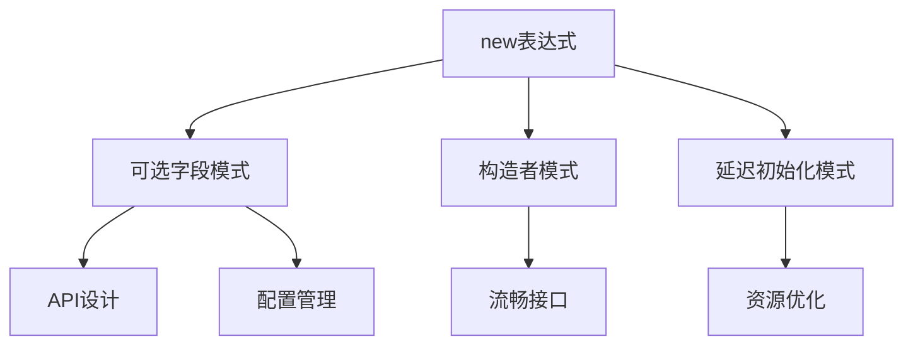

# 可选字段模式 (Optional Field Pattern)

> **文档层级**: C3-实践层 (Practice Layer L3)
> **文档类型**: 设计模式 (Design Pattern)
> **理论基础**: [Th1.1 new表达式语义等价](../R-参考层/R-定理索引.md#Th1.1)
> **最后更新**: 2026-03-06

---

## 一、模式概述

### 1.1 问题场景

在API设计和配置管理中，经常遇到可选字段的需求：

```go
// 传统方式：使用指针表示可选字段
type Config struct {
    Timeout  *int           // 可选，nil表示使用默认值
    Retries  *int           // 可选
    Endpoint *string        // 可选
}

// 问题：
// 1. 需要繁琐的取地址操作
// 2. 可读性差
// 3. 容易忘记处理nil
```

### 1.2 解决方案

使用Go 1.26的`new(expr)`语法简化可选字段处理：

```go
// Go 1.26方式：new(expr)让可选字段更优雅
type Config struct {
    Timeout  *int
    Retries  *int
    Endpoint *string
}

// 创建配置变得简单
config := Config{
    Timeout:  new(30),           // ✨ 简洁！
    Retries:  new(3),            // ✨ 清晰！
    Endpoint: new("api.example.com"),
}
```

**理论依据**: 由[Th1.1](../R-参考层/R-定理索引.md#Th1.1)可知，`new(v)`语义等价于`&v'`，因此是安全的语法糖。

---

## 二、模式实现

### 2.1 基础实现

```go
package optional

// Option 包装任意类型的可选值
type Option[T any] struct {
    value *T
    set   bool
}

// Some 创建一个包含值的可选类型
func Some[T any](v T) Option[T] {
    return Option[T]{
        value: new(v),  // Go 1.26: 简洁的初始化
        set:   true,
    }
}

// None 创建一个空的可选类型
func None[T any]() Option[T] {
    return Option[T]{}
}

// Get 获取值，如果不存在返回零值和false
func (o Option[T]) Get() (T, bool) {
    if !o.set {
        var zero T
        return zero, false
    }
    return *o.value, true
}

// OrElse 返回存在的值，否则返回默认值
func (o Option[T]) OrElse(defaultVal T) T {
    if v, ok := o.Get(); ok {
        return v
    }
    return defaultVal
}
```

### 2.2 API设计应用

```go
// 请求选项模式
package api

type RequestOptions struct {
    Timeout    *time.Duration
    MaxRetries *int
    Headers    map[string]string
}

type RequestOption func(*RequestOptions)

// 使用new(expr)简化选项创建
func WithTimeout(d time.Duration) RequestOption {
    return func(o *RequestOptions) {
        o.Timeout = new(d)  // Go 1.26 ✨
    }
}

func WithMaxRetries(n int) RequestOption {
    return func(o *RequestOptions) {
        o.MaxRetries = new(n)  // Go 1.26 ✨
    }
}

// 使用示例
func main() {
    client := api.NewClient()

    // 简洁的API调用
    resp, err := client.Get("/users",
        api.WithTimeout(5*time.Second),      // ✨ 简洁
        api.WithMaxRetries(3),                // ✨ 清晰
    )
}
```

---

## 三、进阶模式

### 3.1 构造者模式增强

```go
type ServerConfig struct {
    Host     *string
    Port     *int
    TLS      *bool
    CertFile *string
    KeyFile  *string
}

type ServerConfigBuilder struct {
    config ServerConfig
}

func NewServerConfig() *ServerConfigBuilder {
    return &ServerConfigBuilder{}
}

func (b *ServerConfigBuilder) WithHost(host string) *ServerConfigBuilder {
    b.config.Host = new(host)  // Go 1.26 ✨
    return b
}

func (b *ServerConfigBuilder) WithPort(port int) *ServerConfigBuilder {
    b.config.Port = new(port)  // Go 1.26 ✨
    return b
}

func (b *ServerConfigBuilder) WithTLS(cert, key string) *ServerConfigBuilder {
    b.config.TLS = new(true)        // Go 1.26 ✨
    b.config.CertFile = new(cert)   // Go 1.26 ✨
    b.config.KeyFile = new(key)     // Go 1.26 ✨
    return b
}

func (b *ServerConfigBuilder) Build() ServerConfig {
    return b.config
}

// 流畅的API
config := NewServerConfig().
    WithHost("localhost").
    WithPort(8443).
    WithTLS("cert.pem", "key.pem").
    Build()
```

### 3.2 配置合并模式

```go
// 配置合并：从多个来源合并配置
type DatabaseConfig struct {
    Host     *string
    Port     *int
    Username *string
    Password *string
    Database *string
}

// MergeConfigs 合并多个配置，后面的覆盖前面的
func MergeConfigs(configs ...DatabaseConfig) DatabaseConfig {
    var result DatabaseConfig

    for _, cfg := range configs {
        if cfg.Host != nil {
            result.Host = cfg.Host
        }
        if cfg.Port != nil {
            result.Port = cfg.Port
        }
        if cfg.Username != nil {
            result.Username = cfg.Username
        }
        if cfg.Password != nil {
            result.Password = cfg.Password
        }
        if cfg.Database != nil {
            result.Database = cfg.Database
        }
    }

    return result
}

// 使用示例
func loadConfig() DatabaseConfig {
    // 1. 默认配置
    defaults := DatabaseConfig{
        Host: new("localhost"),  // Go 1.26 ✨
        Port: new(5432),         // Go 1.26 ✨
    }

    // 2. 配置文件
    fileConfig := loadFromFile()

    // 3. 环境变量
    envConfig := loadFromEnv()

    // 合并：环境变量 > 配置文件 > 默认
    return MergeConfigs(defaults, fileConfig, envConfig)
}
```

---

## 四、最佳实践

### 4.1 适用场景

| 场景 | 推荐 | 示例 |
|------|------|------|
| API客户端配置 | ✅ 推荐 | HTTP客户端选项 |
| 数据库连接配置 | ✅ 推荐 | DSN参数 |
| 服务端配置 | ✅ 推荐 | 服务器参数 |
| 简单布尔标志 | ⚠️ 谨慎 | 可能不需要指针 |
| 必须字段 | ❌ 不推荐 | 直接使用值类型 |

### 4.2 性能考量

```go
// 小值类型：new(expr)可能分配堆内存
// 但逃逸分析可能优化到栈上

func createConfig() *int {
    return new(42)  // 可能逃逸到堆，也可能栈分配
}

// 优化建议：
// 1. 在热路径上考虑缓存
// 2. 批量创建时考虑对象池
// 3. 信任逃逸分析，不要过早优化
```

### 4.3 代码风格

```go
// ✅ 推荐：保持一致的风格
config := Config{
    Timeout:  new(30),
    Retries:  new(3),
    Endpoint: new("api.example.com"),
}

// ❌ 避免：混合风格
config := Config{
    Timeout:  new(30),    // new语法
    Retries:  &[]int{3}[0], // 不要这样！
}
```

---

## 五、相关模式

### 5.1 模式关系



### 5.2 相关文档

- **理论基础**: [C2-new-expr-formal](../C2-原理层-L2/C2-new-expr-formal.md)
- **定理支持**: [Th1.1 语义等价](../R-参考层/R-定理索引.md#Th1.1)
- **相关模式**: [C3-构造者模式](C3-构造者模式.md)
- **相关模式**: [C3-延迟初始化](C3-延迟初始化.md)

---

## 六、常见问题

### Q1: new(expr)和&哪个更好？

**A**: 语义等价，选择取决于场景：

- `new(v)`更简洁，适合初始化
- `&v`更明确，适合取已有变量的地址

### Q2: 会导致更多堆分配吗？

**A**: 逃逸分析决定是否堆分配。`new(v)`和`&v`在逃逸分析面前是等价的。

### Q3: 可以和旧版Go兼容吗？

**A**: 不能。Go 1.26+专属特性。需要兼容时使用传统`&T{v}`方式。

---

## 七、完整示例

```go
package main

import (
    "fmt"
    "time"
)

// Config 应用配置
type Config struct {
    AppName  *string
    Version  *string
    Debug    *bool
    Timeout  *time.Duration
    MaxConns *int
}

// ApplyDefaults 应用默认值
func (c *Config) ApplyDefaults() {
    if c.AppName == nil {
        c.AppName = new("MyApp")
    }
    if c.Version == nil {
        c.Version = new("1.0.0")
    }
    if c.Debug == nil {
        c.Debug = new(false)
    }
    if c.Timeout == nil {
        c.Timeout = new(30 * time.Second)
    }
    if c.MaxConns == nil {
        c.MaxConns = new(100)
    }
}

func main() {
    // 部分配置
    config := Config{
        AppName: new("ProductionApp"),
        Debug:   new(false),
    }

    // 应用默认值
    config.ApplyDefaults()

    fmt.Printf("App: %s v%s\n", *config.AppName, *config.Version)
    fmt.Printf("Debug: %v, Timeout: %v\n", *config.Debug, *config.Timeout)
}
```

---

**模式分类**: 设计模式 - 对象创建
**复杂度**: ⭐⭐ 中级
**Go版本**: 1.26+
**相关定理**: [Th1.1](../R-参考层/R-定理索引.md#Th1.1)
