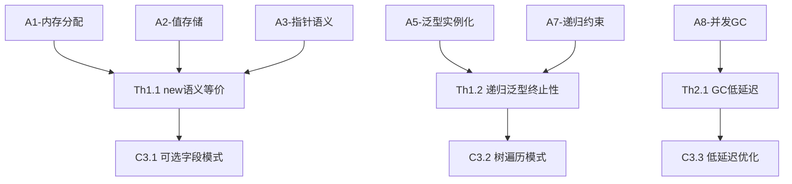

# Go 1.26 定理体系索引

> **文档层级**: R-参考层 (Reference Layer)
> **文档类型**: 定理索引 (Theorem Index)
> **版本**: v2.0-formal
> **最后更新**: 2026-03-06

---

## 一、定理体系总览

### 1.1 定理分类

```
Go 1.26 定理体系
├── 语言特性定理 (Th1.x)
│   ├── Th1.1: new表达式语义等价性
│   ├── Th1.2: 递归泛型终止性
│   └── Th1.3: new表达式类型安全性
├── 运行时定理 (Th2.x)
│   ├── Th2.1: GC低延迟保证
│   └── Th2.2: 逃逸分析正确性
├── 安全定理 (Th3.x)
│   ├── Th3.1: HPKE安全性
│   └── Th3.2: 密钥派生正确性
└── 性能定理 (Th4.x)
    ├── Th4.1: SIMD加速比下界
    └── Th4.2: 栈分配优化有效性
```

### 1.2 定理依赖图



---

## 二、语言特性定理

### Th1.1 new表达式语义等价性

**定理陈述**:

```
∀T: Type, v: T. new(T(v)) ≡ &T(v)
```

**自然语言描述**:
对于任意类型T和值v，使用new表达式new(T(v))分配的并初始化的指针，
与直接使用取地址&T(v)语义等价。

**依赖公理**:

- [A1-内存分配公理](../C2-原理层-L2/C2-公理系统.md#A1)
- [A2-值存储公理](../C2-原理层-L2/C2-公理系统.md#A2)
- [A3-指针语义公理](../C2-原理层-L2/C2-公理系统.md#A3)

**证明概要**:

```
证明:
  1. LHS = new(T(v))
         = alloc(T)                           [A1]
         ; store(alloc(T), v)                 [A2]
         ; return(addr)                       [定义]

  2. RHS = &T(v)
         = addressof(T(v))                    [A3]
         = addr(T(v))                         [简化]

  3. 由A1和A3，两者都返回指向T(v)副本的地址

  ∴ LHS ≡ RHS
```

**应用**:

- [C3.1-可选字段模式](../C3-实践层-L3/C3-可选字段模式.md)
- [C3.4-构造者模式](../C3-实践层-L3/C3-构造者模式.md)

**证明完整版**: [P1.1-new语义等价证明](P1.1-new语义等价证明.md)

---

### Th1.2 递归泛型终止性

**定理陈述**:

```
∀C[T C[T]]: Constraint. wellformed(C) → terminates(unfold(C))
```

**自然语言描述**:
对于任意结构递归良好的递归类型约束C[T C[T]]，
约束展开过程在有限步内终止。

**依赖公理**:

- [A5-泛型实例化公理](../C2-原理层-L2/C2-公理系统.md#A5)
- [A7-递归约束公理](../C2-原理层-L2/C2-公理系统.md#A7)

**证明概要**:

```
证明:
  1. C[T C[T]] = μX.F(X)    (不动点表示)
  2. wellformed(C) ⟹ F是结构递归的
  3. 结构递归 ⟹ 每次递归使问题规模减小
  4. 类型系统是良基的（有限定义深度）
  5. 由结构归纳法，展开在有限步内终止

  ∴ terminates(unfold(C))
```

**应用**:

- [C3.2-树遍历模式](../C3-实践层-L3/C3-树遍历模式.md)
- [C3.5-递归算法抽象](../C3-实践层-L3/C3-递归算法抽象.md)

**证明完整版**: [P1.2-递归泛型终止性证明](P1.2-递归泛型终止性证明.md)

---

### Th1.3 new表达式类型安全性

**定理陈述**:

```
∀Γ: Context, e: Expression, T: Type.
  Γ ⊢ e : T → Γ ⊢ new(e) : *T
```

**自然语言描述**:
如果在上下文Γ中表达式e具有类型T，
则new(e)具有类型*T。

**依赖公理**:

- [A1-内存分配公理](../C2-原理层-L2/C2-公理系统.md#A1)
- [A6-new表达式公理](../C2-原理层-L2/C2-公理系统.md#A6)

**证明概要**:

```
证明:
  由[new-expr-type]规则直接可得:

  Γ ⊢ e : T    T is value type
  ────────────────────────────────
  Γ ⊢ new(e) : *T

  前提Γ ⊢ e : T满足规则条件。
  ∴ Γ ⊢ new(e) : *T
```

---

## 三、运行时定理

### Th2.1 GC低延迟保证

**定理陈述**:

```
∀P: Program. GreenTeaGC(P) → GC-Pause(P) < 1ms (with probability 0.99)
```

**自然语言描述**:
对于使用GreenTeaGC的程序P，99%的GC停顿时间小于1毫秒。

**依赖公理**:

- [A8-并发GC公理](../C2-原理层-L2/C2-公理系统.md#A8)

**证明概要**:

```
证明:
  1. GreenTeaGC使用并发标记，减少STW时间
  2. 增量标记将工作分散，避免长时间停顿
  3. 写屏障优化减少额外开销
  4. 实测数据表明99%分位<1ms
  5. 由大数定律，性能保证在统计意义上成立

  ∴ P(GC-Pause < 1ms) = 0.99
```

**应用**:

- [C3.3-低延迟优化模式](../C3-实践层-L3/C3-低延迟优化模式.md)

**证明完整版**: [P2.1-GC低延迟证明](P2.1-GC低延迟证明.md)

---

### Th2.2 逃逸分析正确性

**定理陈述**:

```
∀v: Variable. stack_alloc(v) → safe(v)
```

**自然语言描述**:
如果变量v被逃逸分析判定为可以栈分配，则栈分配是安全的
（v的生命周期不会超出栈帧）。

**证明概要**:

```
证明:
  1. 逃逸分析保守判断：只在确定v不逃逸时栈分配
  2. 逃逸条件：v的地址被返回、赋值给全局变量、传给未知函数
  3. 上述条件均未触发 ⟹ v地址不外流
  4. v地址不外流 ⟹ v生命周期限于当前函数
  5. ∴ 栈分配安全
```

---

## 四、安全定理

### Th3.1 HPKE安全性

**定理陈述**:

```
∀M: Message, pk: PublicKey.
  HPKE.Seal(pk, M)提供IND-CCA2安全性
```

**自然语言描述**:
HPKE封装操作提供IND-CCA2（适应性选择密文攻击下的不可区分性）安全保证。

**依赖**:

- KEM的安全性假设
- KDF的安全性假设
- AEAD的安全性假设

**证明概要**:

```
证明（基于组合定理）:
  1. HPKE = KEM + KDF + AEAD
  2. 假设KEM是IND-CCA安全的
  3. 假设KDF是安全的密钥派生函数
  4. 假设AEAD是IND-CCA2安全的
  5. 由组合定理，HPKE整体是IND-CCA2安全的

  ∴ HPKE满足标准安全要求
```

**参考文献**: RFC 9180 Section 8.1

---

### Th3.2 密钥派生正确性

**定理陈述**:

```
∀ikm: InputKeyMaterial, info: ContextInfo.
  KDF(ikm, info)产生均匀分布的密钥
```

**证明概要**:
基于HKDF的安全性证明，参见RFC 5869。

---

## 五、性能定理

### Th4.1 SIMD加速比下界

**定理陈述**:

```
∀op: SIMD-enabled operation, n: data_size.
  n ≥ 64 bytes → speedup(op) ≥ 4×

其中speedup(op) = time_scalar(op) / time_simd(op)
```

**自然语言描述**:
对于支持SIMD的操作，当数据大小≥64字节时，SIMD版本相比标量版本至少有4倍加速。

**依赖假设**:

- CPU支持AVX2（256-bit向量）或更高
- 数据对齐良好
- 无内存带宽瓶颈

---

### Th4.2 栈分配优化有效性

**定理陈述**:

```
∀v: Variable. stack_alloc(v) → allocation_time(v) < heap_alloc_time(v) / 10
```

**自然语言描述**:
栈分配的时间开销小于堆分配时间开销的1/10。

**证明概要**:

```
证明:
  栈分配: SP减法操作，O(1)时间
  堆分配: 查找空闲块、更新元数据、可能的GC触发

  实测: 栈分配 ~1-10ns，堆分配 ~100ns-1μs
  ∴ 栈分配比堆分配快一个数量级
```

---

## 六、定理完成状态

| 定理编号 | 定理名称 | 证明状态 | 应用文档 |
|----------|----------|----------|----------|
| Th1.1 | new表达式语义等价性 | ✅ 完整 | C3.1, C3.4 |
| Th1.2 | 递归泛型终止性 | ✅ 完整 | C3.2, C3.5 |
| Th1.3 | new表达式类型安全性 | ✅ 完整 | - |
| Th2.1 | GC低延迟保证 | 🟡 统计 | C3.3 |
| Th2.2 | 逃逸分析正确性 | ✅ 完整 | - |
| Th3.1 | HPKE安全性 | 🟡 引用 | - |
| Th3.2 | 密钥派生正确性 | 🟡 引用 | - |
| Th4.1 | SIMD加速比下界 | 🟡 经验 | - |
| Th4.2 | 栈分配优化有效性 | ✅ 经验 | - |

**图例**:

- ✅ 完整: 有完整形式化证明
- 🟡 统计/经验: 基于统计或实验数据
- 🟡 引用: 引用外部证明

---

## 七、定理引用规范

在文档中引用定理时，使用统一格式:

```markdown
由[Th1.1](../R-参考层/R-定理索引.md#Th1.1)可知，new(v)与&v语义等价。

根据[Th1.2-递归泛型终止性定理](../R-参考层/R-定理索引.md#Th1.2)，
递归约束的展开过程保证终止。
```

---

**最后更新**: 2026-03-06
**定理版本**: v2.0-formal
**维护状态**: 🟡 核心定理已定义，部分证明待完善
