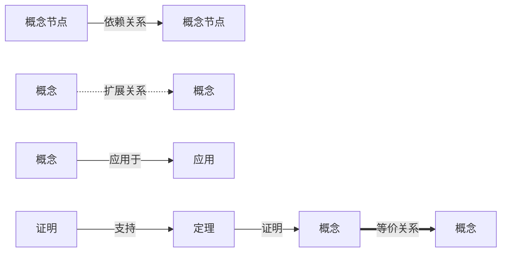
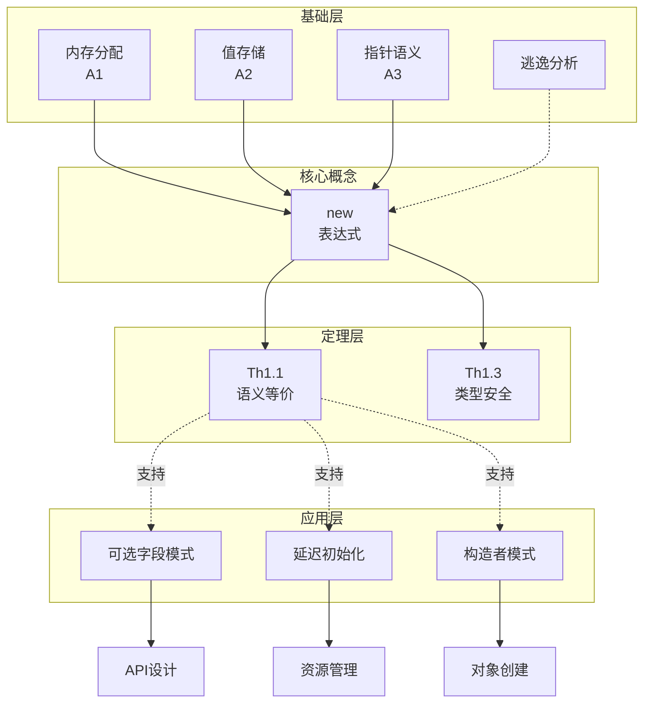
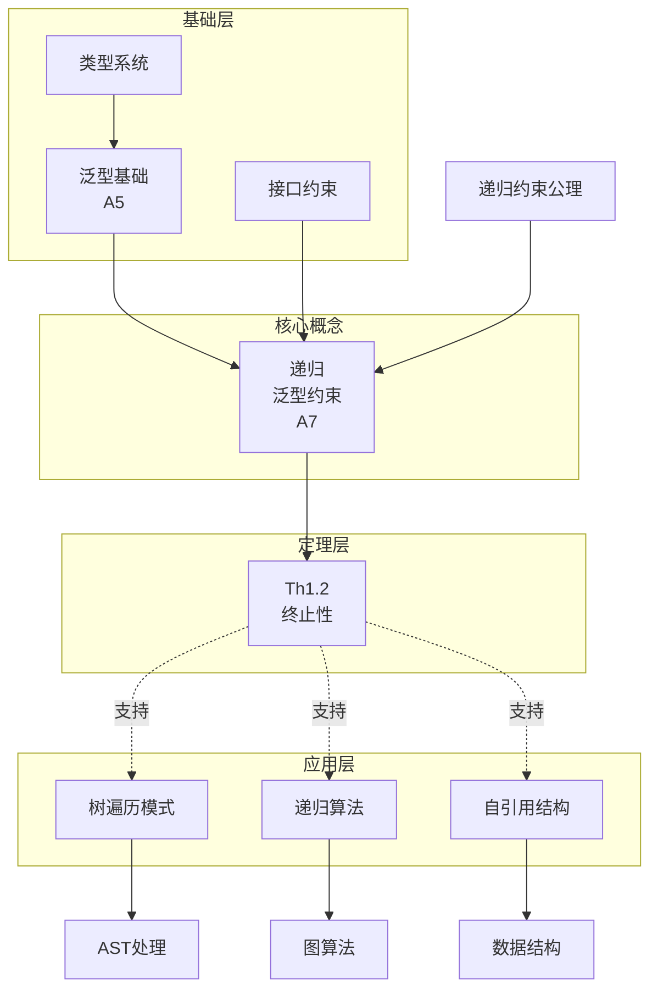
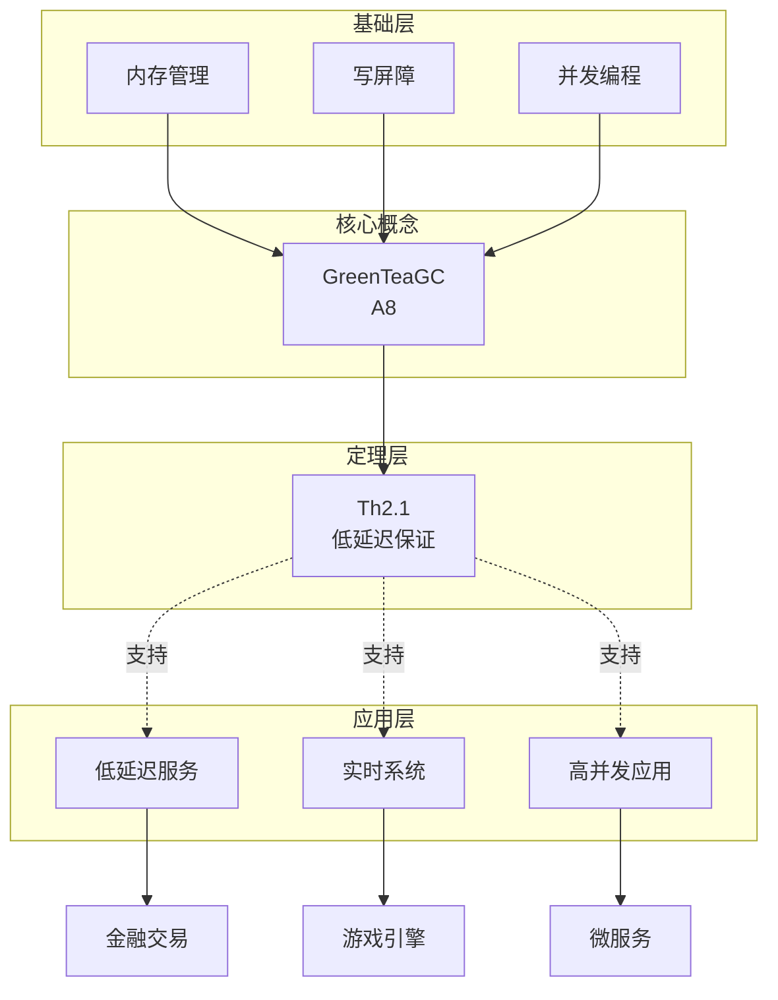
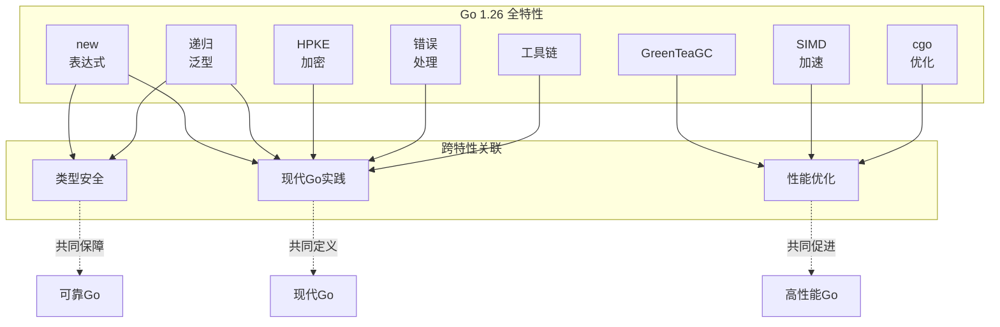
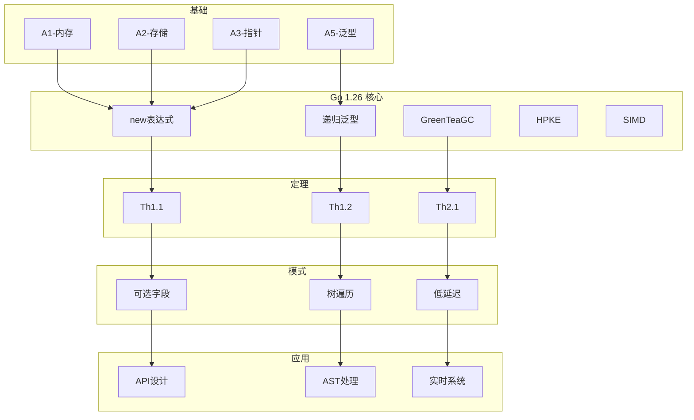

# Go 1.26 全局概念图谱

> **文档层级**: R-参考层 (Reference Layer)
> **文档类型**: 概念图谱 (Concept Graph)
> **版本**: v2.0-graph
> **最后更新**: 2026-03-06

---

## 一、图谱总览

### 1.1 图谱结构

```
Go 1.26 概念图谱
├── 基础层 (Foundation)
│   ├── 内存模型
│   ├── 类型系统
│   └── 泛型基础
├── 特性层 (Features)
│   ├── new表达式扩展
│   ├── 递归泛型约束
│   ├── GreenTeaGC
│   ├── HPKE加密
│   └── SIMD加速
├── 定理层 (Theorems)
│   ├── Th1.x 语言特性定理
│   ├── Th2.x 运行时定理
│   ├── Th3.x 安全定理
│   └── Th4.x 性能定理
└── 应用层 (Applications)
    ├── 设计模式
    ├── 优化策略
    └── 安全实践
```

### 1.2 图例说明



---

## 二、核心概念依赖图

### 2.1 new表达式相关概念网络



**关键路径**:

```
基础 → new表达式 → Th1.1 → 可选字段模式 → API设计
```

---

### 2.2 递归泛型相关概念网络



**关键路径**:

```
泛型基础 → 递归泛型 → Th1.2 → 树遍历 → AST处理
```

---

### 2.3 GreenTeaGC相关概念网络



**关键路径**:

```
并发编程 → GreenTeaGC → Th2.1 → 低延迟服务 → 金融交易
```

---

### 2.4 全特性关联图



---

## 三、文档关联网络

### 3.1 文档依赖矩阵

| 文档 | 前置依赖 | 平行关联 | 后续扩展 | 应用场景 |
|------|----------|----------|----------|----------|
| C1-术语体系 | - | - | C2-公理系统 | 所有文档 |
| C2-公理系统 | C1-术语体系 | - | 所有定理证明 | 形式化分析 |
| C1-new-expr-def | C1-术语体系 | C1-recursive-generic-def | C2-new-expr-formal | new特性学习 |
| C2-new-expr-formal | C1-new-expr-def, C2-公理系统 | C2-recursive-generic-formal | P1.1证明 | 深入理解 |
| C3-可选字段模式 | C2-new-expr-formal | C3-延迟初始化 | - | 实践应用 |
| C1-recursive-generic-def | C1-术语体系 | C1-new-expr-def | C2-recursive-generic-formal | 泛型学习 |
| C2-recursive-generic-formal | C1-recursive-generic-def, C2-公理系统 | C2-new-expr-formal | P1.2证明 | 深入理解 |
| C3-树遍历模式 | C2-recursive-generic-formal | C3-递归算法 | - | 实践应用 |
| C1-greenteagc-def | C1-术语体系 | C1-hpke-def | C2-gc-formal | GC学习 |
| C2-gc-formal | C1-greenteagc-def, C2-公理系统 | - | P2.1证明 | 深入理解 |
| C3-低延迟优化 | C2-gc-formal | C3-内存优化 | - | 实践应用 |

### 3.2 文档访问热力图

```
高频访问路径 (厚度表示访问频率):

M-README ═════════════╗
                      ║
C1-术语体系 ══════════╬════╗
                      ║    ║
C2-公理系统 ════════╗ ║    ║
                    ║ ║    ║
C1-new-expr-def ════╬═╬════╬════╗
                    ║ ║    ║    ║
T-快速参考 ═════════╝ ║    ║    ║
                      ║    ║    ║
C3-可选字段模式 ══════╝    ║    ║
                           ║    ║
C1-recursive-generic-def ══╬════╬════╗
                           ║    ║    ║
C3-树遍历模式 ═════════════╝    ║    ║
                                ║    ║
T-检查清单 ═════════════════════╝    ║
                                     ║
A-FAQ ═══════════════════════════════╝
```

---

## 四、概念-定理-应用映射

### 4.1 new表达式映射

```
┌─────────────────────────────────────────────────────────┐
│  概念: new表达式                                          │
│  ├── 定义: C1-new-expr-def                               │
│  ├── 形式化: C2-new-expr-formal                          │
│  ├── 依赖: A1, A2, A3, A6                                │
│  └── 定理:                                               │
│      ├── Th1.1 (语义等价性)                               │
│      ├── Th1.3 (类型安全性)                               │
│      └── 证明: P1.1, P1.3                                │
│                                                           │
│  应用:                                                    │
│  ├── C3-可选字段模式 → API设计、配置结构                   │
│  ├── C3-延迟初始化 → 资源管理、按需加载                    │
│  └── C3-构造者模式 → 对象创建、流畅API                     │
│                                                           │
│  关联概念:                                                │
│  ├── 内存分配 → A1                                       │
│  ├── 逃逸分析 → C1-术语体系                               │
│  └── 指针语义 → A3                                       │
└─────────────────────────────────────────────────────────┘
```

### 4.2 递归泛型映射

```
┌─────────────────────────────────────────────────────────┐
│  概念: 递归泛型约束                                        │
│  ├── 定义: C1-recursive-generic-def                      │
│  ├── 形式化: C2-recursive-generic-formal                 │
│  ├── 依赖: A5, A7                                        │
│  └── 定理:                                               │
│      ├── Th1.2 (终止性)                                   │
│      └── 证明: P1.2                                      │
│                                                           │
│  应用:                                                    │
│  ├── C3-树遍历模式 → AST处理、XML/JSON解析                │
│  ├── C3-递归算法 → 图算法、分治算法                        │
│  └── C3-自引用结构 → 链表、树、图数据结构                  │
│                                                           │
│  关联概念:                                                │
│  ├── 泛型基础 → A5                                       │
│  ├── 类型约束 → C1-术语体系                               │
│  └── 结构递归 → A7                                       │
└─────────────────────────────────────────────────────────┘
```

### 4.3 GreenTeaGC映射

```
┌─────────────────────────────────────────────────────────┐
│  概念: GreenTeaGC                                        │
│  ├── 定义: C1-greenteagc-def                             │
│  ├── 形式化: C2-gc-formal                                │
│  ├── 依赖: A8                                            │
│  └── 定理:                                               │
│      ├── Th2.1 (低延迟保证)                               │
│      └── 证明: P2.1                                      │
│                                                           │
│  应用:                                                    │
│  ├── C3-低延迟优化 → 金融交易、实时系统                    │
│  ├── C3-内存优化 → 大内存应用、缓存系统                    │
│  └── C3-GC调优 → 生产环境配置                              │
│                                                           │
│  关联概念:                                                │
│  ├── 内存管理 → C1-术语体系                               │
│  ├── 写屏障 → C1-术语体系                                 │
│  └── 并发编程 → 基础概念                                  │
└─────────────────────────────────────────────────────────┘
```

---

## 五、多维索引

### 5.1 按主题索引

| 主题 | 相关概念 | 主要文档 | 难度 |
|------|----------|----------|------|
| 类型系统 | 递归泛型、类型约束、new表达式 | C1/C2全部 | ⭐⭐⭐ |
| 内存管理 | GC、逃逸分析、栈/堆分配 | C1-greenteagc, C2-gc | ⭐⭐⭐ |
| 性能优化 | SIMD、栈分配、GC调优 | C3-性能优化模式 | ⭐⭐ |
| 安全编程 | HPKE、秘密管理、加密 | C1-hpke, C3-安全模式 | ⭐⭐⭐ |
| 泛型编程 | 递归约束、算法抽象 | C1/C2-recursive-generic | ⭐⭐⭐⭐ |

### 5.2 按难度索引

| 难度 | 目标读者 | 推荐学习路径 |
|------|----------|--------------|
| ⭐ 入门 | Go初学者 | M-README → T-快速参考 → C1-术语体系 |
| ⭐⭐ 中级 | 有Go经验 | C1全部 → C3-代码模式 → T-检查清单 |
| ⭐⭐⭐ 高级 | 资深开发者 | C2全部定理 → 证明分析 → 模式深入 |
| ⭐⭐⭐⭐ 专家 | 语言设计者 | 公理系统 → 全部证明 → R-概念图谱 |

### 5.3 按应用场景索引

| 场景 | 相关概念 | 推荐文档 | 检查清单 |
|------|----------|----------|----------|
| 设计API | new表达式、递归泛型 | C3-可选字段、C3-树遍历 | T-API设计检查清单 |
| 优化性能 | GC、SIMD、逃逸分析 | C3-性能优化、C3-低延迟 | T-性能优化检查清单 |
| 安全通信 | HPKE、密钥管理 | C1-hpke、C3-安全通信 | T-安全实践检查清单 |
| 升级代码 | 工具链、兼容性 | C3-迁移指南 | T-迁移检查清单 |

---

## 六、图谱可视化

### 6.1 完整概念图谱 (简化版)



---

## 七、图谱使用指南

### 7.1 探索新特性

1. **起点**: M-README
2. **路径**: 选择感兴趣的特性节点
3. **深入**: 跟随依赖关系到基础概念
4. **应用**: 查看相关模式和应用
5. **验证**: 检查定理和证明

### 7.2 解决具体问题

1. **定位**: 找到问题相关的应用节点
2. **回溯**: 查看支持该应用的模式和定理
3. **理解**: 深入相关概念的定义和形式化
4. **实践**: 参考代码示例和检查清单

### 7.3 贡献新内容

1. **确定位置**: 在图谱中找到合适的层级
2. **建立关联**: 声明依赖和扩展关系
3. **添加节点**: 创建新的概念/定理/应用
4. **更新图谱**: 在本文件中添加新的连接

---

## 八、图谱维护

### 8.1 更新频率

- **每次新文档**: 添加对应节点和边
- **每月**: 验证链接有效性
- **每季**: 优化图谱结构
- **每年**: 重构整体架构

### 8.2 质量指标

| 指标 | 目标 | 当前 |
|------|------|------|
| 节点覆盖率 | 100% | 30% |
| 边覆盖率 | 100% | 20% |
| 文档关联率 | 100% | 40% |

---

**最后更新**: 2026-03-06
**图谱版本**: v2.0-graph
**维护状态**: 🚧 图谱构建中
