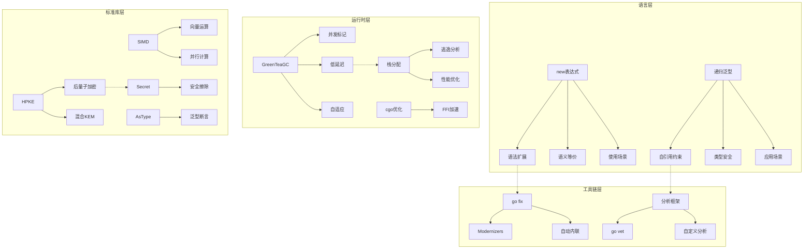
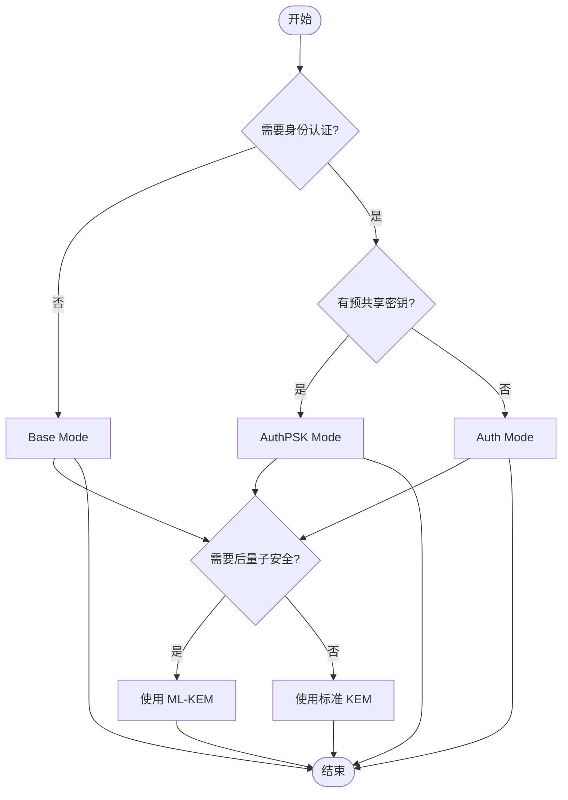
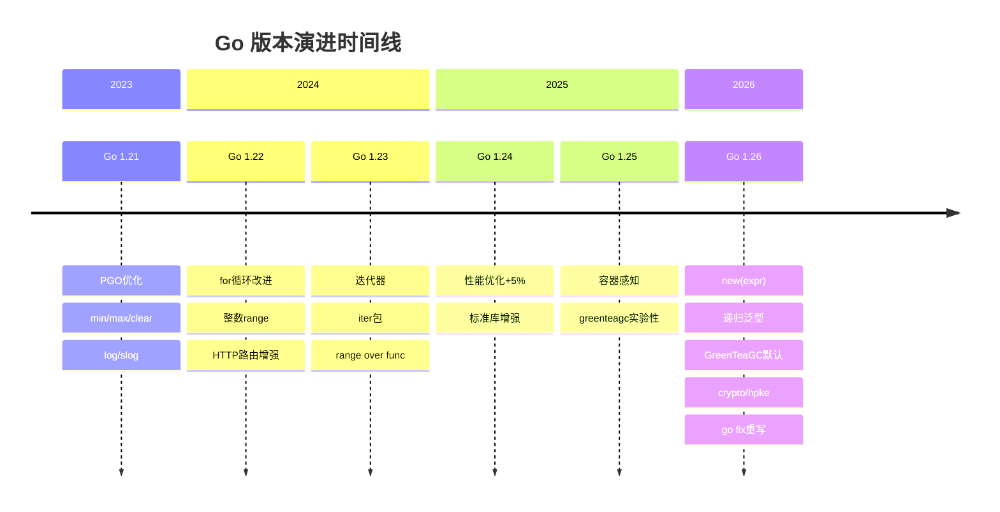
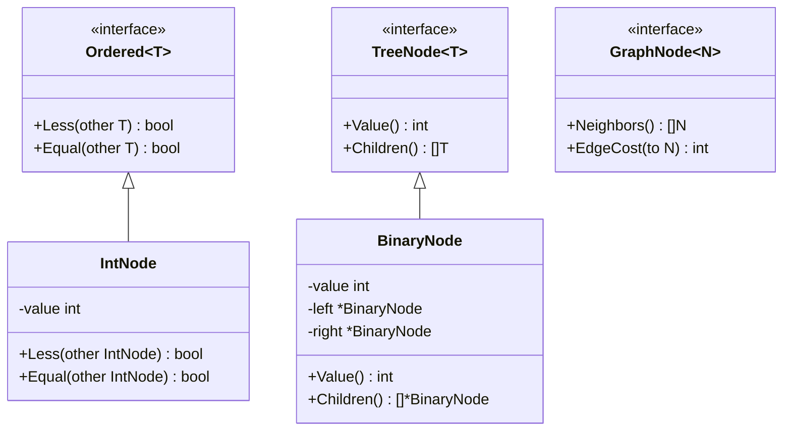
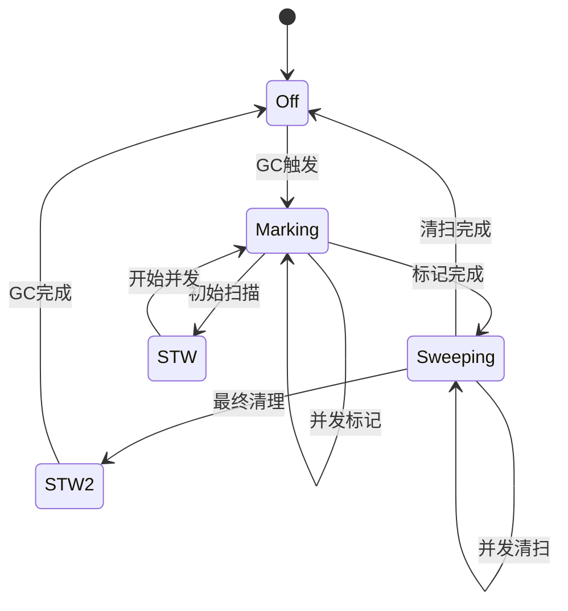
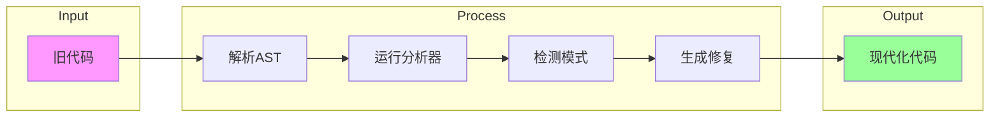
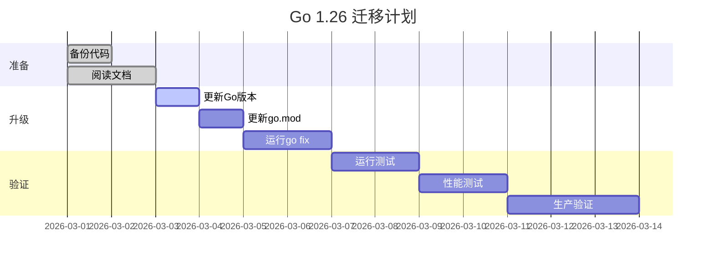

# Go 1.26 思维表征图表集

本文档包含 Go 1.26 所有特性的多种思维表征方式。

---

## 1. 概念关系图



---

## 2. 公理-定理树

```mermaid
graph TD
    root[Go 1.26 形式化体系]

    subgraph "new表达式公理"
        A1[公理1: 语法等价] --> A11[new(T{v}) == &T{v}]
        A2[公理2: 类型保持] --> A21[若 E:T 则 new(E):*T]
        A3[公理3: 内存分配] --> A31[触发堆分配]

        A11 --> T1[定理1.1: 语义等价证明]
        A21 --> T2[定理1.2: 类型安全]
    end

    subgraph "递归泛型公理"
        B1[公理1: 自引用合法] --> B11[接口类型可自引用]
        B2[公理2: 满足性判定] --> B21[T satisfies C[T]]
        B3[公理3: 终止性保证] --> B31[有限步求解]

        B11 --> T3[定理2.1: 树结构抽象]
        B21 --> T4[定理2.2: 类型安全]
    end

    subgraph "GC公理"
        C1[公理1: 并发标记] --> C11[与mutator并发]
        C2[公理2: 三色不变式] --> C21[黑不指白]

        C11 --> T5[定理3.1: 低延迟保证]
        C21 --> T6[定理3.2: 正确性]
    end

    root --> A1
    root --> B1
    root --> C1
```

---

## 3. 决策树

### 3.1 new表达式使用决策

```mermaid
flowchart TD
    Start([开始]) --> Q1{需要指针?}
    Q1 -->|否| A1[使用值类型]
    Q1 -->|是| Q2{需要计算初始值?}

    Q2 -->|是| A2[使用 new(calculate())]
    Q2 -->|否| Q3{复合字面量?}

    Q3 -->|是| A3[&T{...} 或 new(T{...})]
    Q3 -->|否| Q4{简单值?}

    Q4 -->|是| A4[&T(v) 或 new(T(v))]
    Q4 -->|否| A5[使用变量 + &]

    A1 --> End([结束])
    A2 --> End
    A3 --> End
    A4 --> End
    A5 --> End
```

### 3.2 递归泛型使用决策

```mermaid
flowchart TD
    Start([开始]) --> Q1{需要自引用约束?}
    Q1 -->|否| A1[使用普通泛型]
    Q1 -->|是| Q2{是接口定义?}

    Q2 -->|否| A2[改为接口]
    Q2 -->|是| Q3{需要通用算法?}

    Q3 -->|是| A3[使用递归泛型<br/>Tree[T], Ordered[T]]
    Q3 -->|否| Q4{实现类型确定?}

    Q4 -->|是| A4[使用具体类型]
    Q4 -->|否| A5[递归泛型提供灵活性]

    A1 --> End([结束])
    A2 --> End
    A3 --> End
    A4 --> End
    A5 --> End
```

### 3.3 HPKE模式选择



---

## 4. 场景树

### 4.1 new(expr) 场景树

```mermaid
graph TD
    Root[new(expr) 应用场景]

    Root --> Web[Web API 开发]
    Root --> Config[配置管理]
    Root --> Data[数据处理]
    Root --> Test[测试代码]

    Web --> W1[可选字段: Age: new(calcAge())]
    Web --> W2[嵌套结构: Config: new(load())]
    Web --> W3[动态默认: Timestamp: new(now())]

    Config --> C1[环境变量: Port: new(parse())]
    Config --> C2[条件默认: Timeout: new(get())]
    Config --> C3[计算属性: MaxConn: new(calc())]

    Data --> D1[序列化: Pointer: new(transform())]
    Data --> D2[验证: Validated: new(check())]
    Data --> D3[转换: Converted: new(convert())]

    Test --> T1[Mock: Value: new(generate())]
    Test --> T2[Setup: State: new(init())]
```

### 4.2 递归泛型场景树

```mermaid
graph TD
    Root[递归泛型应用场景]

    Root --> DS[数据结构]
    Root --> Algo[算法抽象]
    Root --> Domain[领域建模]
    Root --> Interface[通用接口]

    DS --> Tree[树结构]
    DS --> Graph[图结构]
    DS --> Container[容器]

    Tree --> T1[BST[T Ordered[T]]]
    Tree --> T2[RBTree[T Ordered[T]]]
    Tree --> T3[BTree[T Ordered[T]]]

    Graph --> G1[Digraph[N Node[N]]]
    Graph --> G2[Graph[N Node[N]]]
    Graph --> G3[WeightedGraph[N WeightedNode[N]]]

    Algo --> Sort[排序: Sort[T Ordered[T]]]
    Algo --> Search[搜索: BinarySearch[T Ordered[T]]]
    Algo --> GraphAlgo[图算法]

    GraphAlgo --> GA1[DFS[N Node[N]]]
    GraphAlgo --> GA2[BFS[N Node[N]]]
    GraphAlgo --> GA3[Dijkstra[N GraphNode[N]]]
    GraphAlgo --> GA4[AStar[N HeuristicNode[N]]]

    Domain --> Org[组织: Employee[T Manager[T]]]
    Domain --> Cat[分类: Category[T Categorizable[T]]]
    Domain --> Comp[组件: Component[T Container[T]]]

    Interface --> Ord[Ordered[T Ordered[T]]]
    Interface --> Clone[Cloneable[T Cloneable[T]]]
    Interface --> Ser[Serializable[T Serializable[T]]]
```

---

## 5. 版本演进图



---

## 6. 性能对比图

```mermaid
xychart-beta
    title "Go 1.26 性能改进"
    x-axis [GC延迟, cgo开销, io.ReadAll, 内存分配]
    y-axis "改进百分比" 0 --> 100
    bar [35, 30, 100, 50]
```

---

## 7. 特性热度图

```mermaid
quadrantChart
    title Go 1.26 特性使用频率 vs 影响度
    x-axis 低使用频率 --> 高使用频率
    y-axis 低影响度 --> 高影响度
    quadrant-1 广泛使用且影响大
    quadrant-2 影响大但使用少
    quadrant-3 影响小且使用少
    quadrant-4 使用广泛但影响小

    "new(expr)": [0.7, 0.5]
    "递归泛型": [0.3, 0.8]
    "GreenTeaGC": [1.0, 0.9]
    "HPKE": [0.2, 0.9]
    "SIMD": [0.1, 0.8]
    "go fix": [0.9, 0.6]
    "AsType": [0.6, 0.4]
```

---

## 8. 架构关系图


---

## 9. 类图（类型系统）



---

## 10. 状态机（GC）



---

## 11. 流程图（go fix）



---

## 12. 甘特图（迁移计划）


