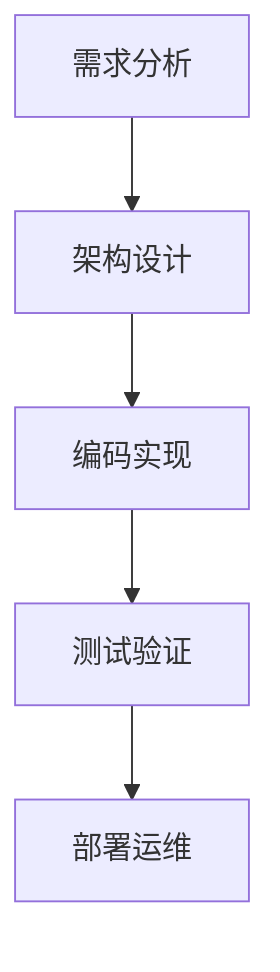

# 4.1 软件工程分析（Software Engineering Analysis）

---

## 4.1.1 目录

1. 软件工程基础理论
2. 形式化建模与分析方法
3. Golang工程实践与最佳实践
4. 多表征内容（图、表、数学表达式、代码示例）
5. 交叉引用与目录导航

---

## 4.1.2 1. 软件工程基础理论

### 4.1.2.1 定义

> 软件工程是关于使用系统化、规范化、可量化的方法开发、运行和维护软件的工程学科。

### 4.1.2.2 主要理论

- 生命周期模型（瀑布、敏捷、DevOps等）
- 需求工程、架构设计、编码、测试、运维
- 质量保证与持续集成

---

## 4.1.3 2. 形式化建模与分析方法

### 4.1.3.1 数学建模

```latex
\textbf{定义 2.1} (软件系统): 软件系统S = (C, R, F, Q)，其中：
\begin{itemize}
  \item C: 组件集合
  \item R: 组件间关系
  \item F: 功能集合
  \item Q: 质量属性集合
\end{itemize}

```

### 4.1.3.2 形式化分析

- 依赖图、耦合度、内聚度
- 质量属性预测与验证
- 形式化证明与推理

---

## 4.1.4 3. Golang工程实践与最佳实践

### 4.1.4.1 典型工程结构

- 单体、微服务、分层架构
- 依赖管理与模块化

### 4.1.4.2 代码示例

```go
// 典型Golang项目结构
project/
  |-- cmd/
  |-- pkg/
  |-- internal/
  |-- api/
  |-- configs/
  |-- scripts/
  |-- test/

```

### 4.1.4.3 工程实践

- 单元测试与集成测试
- 持续集成/持续部署（CI/CD）
- 性能分析与优化
- 安全实践

---

## 4.1.5 4. 多表征内容

### 4.1.5.1 架构图



### 4.1.5.2 质量属性数学表达

```latex
\textbf{定理 4.1} (高内聚低耦合):
\forall c_i, c_j \in C, Cohesion(c_i) \uparrow, Coupling(c_i, c_j) \downarrow \implies Q(S) \uparrow

```

---

## 4.1.6 5. 交叉引用与目录导航

- [架构分析](../01-Architecture-Design/README.md)
- [设计模式分析](../03-Design-Patterns/README.md)
- [性能优化](../06-Performance-Optimization/README.md)
- [安全实践](../07-Security-Practices/README.md)

---

> 本文档持续完善，欢迎补充与修订。
