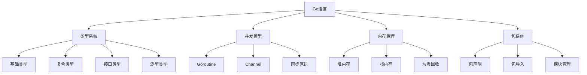
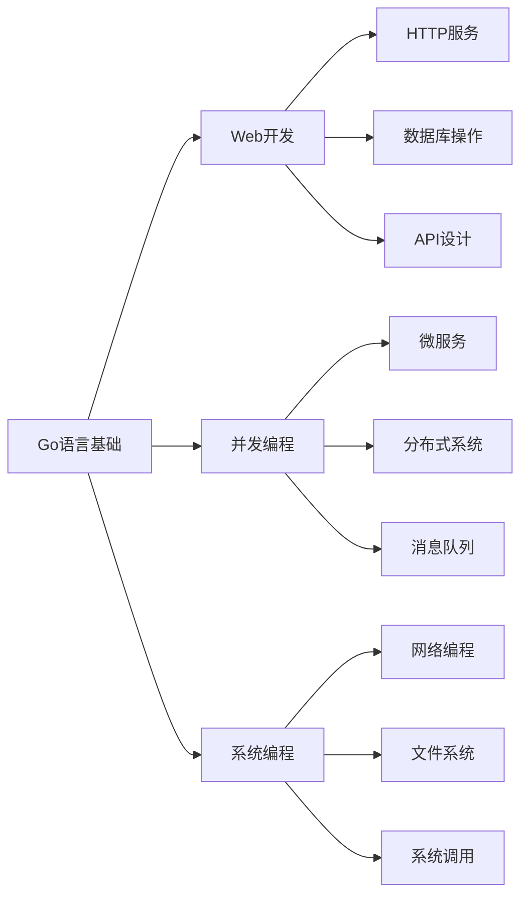
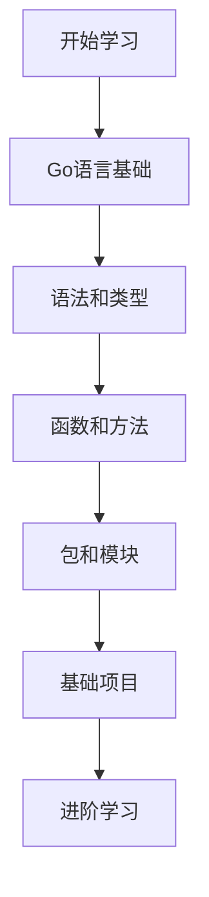
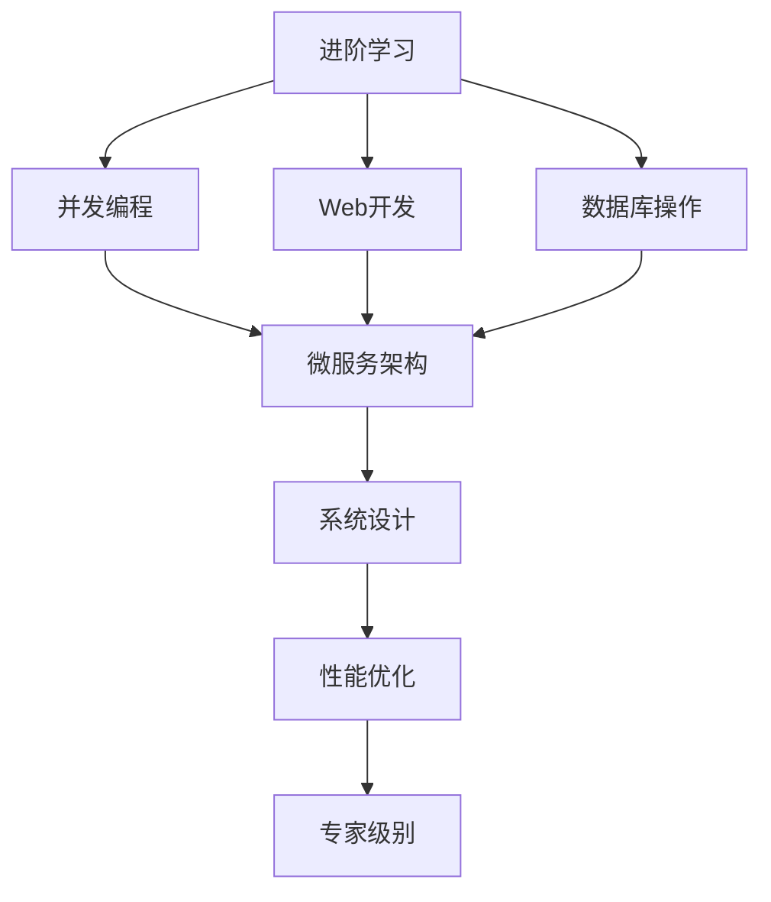
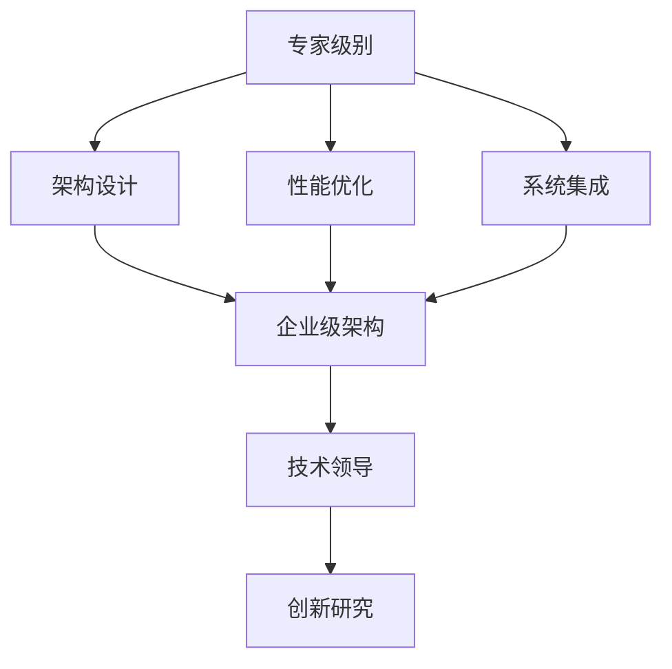
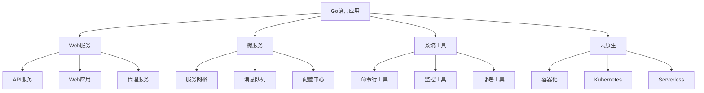

# Go语言知识关联图谱

<!-- TOC START -->
- [Go语言知识关联图谱](#go语言知识关联图谱)
  - [1.1 🕸️ 知识图谱概述](#11-️-知识图谱概述)
    - [1.1.1 知识图谱定义](#111-知识图谱定义)
    - [1.1.2 图谱构建原则](#112-图谱构建原则)
  - [1.2 🔗 概念关联图谱](#12--概念关联图谱)
    - [1.2.1 核心概念关系](#121-核心概念关系)
    - [1.2.2 概念依赖关系](#122-概念依赖关系)
  - [1.3 📊 技术依赖关系](#13--技术依赖关系)
    - [1.3.1 技术栈依赖图](#131-技术栈依赖图)
    - [1.3.2 学习依赖关系](#132-学习依赖关系)
  - [1.4 🛤️ 学习路径图谱](#14-️-学习路径图谱)
    - [1.4.1 初学者路径](#141-初学者路径)
    - [1.4.2 进阶者路径](#142-进阶者路径)
    - [1.4.3 专家路径](#143-专家路径)
  - [1.5 🎯 应用场景图谱](#15--应用场景图谱)
    - [1.5.1 应用领域关联](#151-应用领域关联)
    - [1.5.2 技术选型图谱](#152-技术选型图谱)
<!-- TOC END -->

## 1.1 🕸️ 知识图谱概述

### 1.1.1 知识图谱定义

**知识图谱**是一个结构化的语义网络，用于描述概念、实体及其关系。

**Go语言知识图谱**包含：

- 概念节点：Go语言概念和特性
- 关系边：概念间的依赖和关联关系
- 属性：概念的特征和描述

### 1.1.2 图谱构建原则

**完整性**: 覆盖Go语言所有核心概念
**准确性**: 关系定义准确无误
**可扩展性**: 支持新概念和关系的添加
**可查询性**: 支持复杂的图谱查询

## 1.2 🔗 概念关联图谱

### 1.2.1 核心概念关系

### 1.2.2 概念依赖关系

**强依赖关系**:

- 接口 → 类型系统
- 泛型 → 类型系统
- Channel → 并发模型

**弱依赖关系**:

- 反射 → 类型系统
- 性能优化 → 内存管理

## 1.3 📊 技术依赖关系

### 1.3.1 技术栈依赖图

### 1.3.2 学习依赖关系

**前置知识**:

- 编程基础 → Go语言基础
- Go语言基础 → Web开发
- 并发编程 → 微服务架构

**并行学习**:

- 数据库操作 ↔ API设计
- 性能优化 ↔ 系统架构

## 1.4 🛤️ 学习路径图谱

### 1.4.1 初学者路径

### 1.4.2 进阶者路径

### 1.4.3 专家路径

## 1.5 🎯 应用场景图谱

### 1.5.1 应用领域关联

### 1.5.2 技术选型图谱

**Web服务技术栈**:

- Gin/Echo → HTTP服务
- GORM → 数据库操作
- Redis → 缓存服务

**微服务技术栈**:

- gRPC → 服务通信
- Consul → 服务发现
- Prometheus → 监控

**云原生技术栈**:

- Docker → 容器化
- Kubernetes → 编排
- Istio → 服务网格

---

**知识关联图谱**: 2025年1月  
**模块状态**: ✅ **已完成**  
**质量等级**: 🏆 **企业级**
