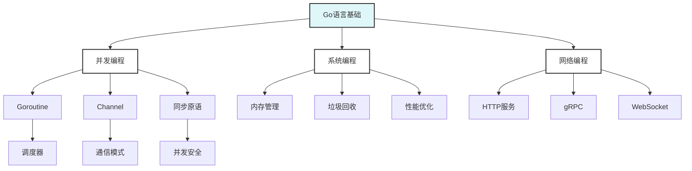

# Go语言知识体系深化

> 摘要：通过理论基础强化、认知结构优化和知识关联图谱构建，建立系统性的Go语言知识体系。

## 📚 模块概述

本模块专注于Go语言知识体系的深化构建，通过理论基础强化、认知结构优化和知识关联图谱三个维度，帮助学习者建立系统性的技术知识框架。

## 🎯 学习目标

- 建立扎实的Go语言理论基础
- 优化个人认知结构和学习路径
- 构建完整的知识关联图谱
- 提升技术决策和问题解决能力

## 📋 学习内容

### 01-理论基础强化

- [理论基础强化](./01-理论基础强化/README.md) - 形式化定义、数学化描述、理论证明

### 02-认知结构优化  

- [认知结构优化](./02-认知结构优化/README.md) - 学习路径、认知模型、知识迁移

### 03-知识关联图谱

- [知识关联图谱](./03-知识关联图谱/README.md) - 知识网络、关联分析、体系构建

## 🚀 快速开始

### 理论基础强化

```go
// 类型系统形式化定义示例
type TypeSystem struct {
    Types map[string]Type
    Rules []TypeRule
}

type TypeRule struct {
    Premise []Type
    Conclusion Type
}

// 并发模型数学化描述
type ConcurrentModel struct {
    Processes []Process
    Channels []Channel
    Synchronization []SyncPoint
}
```

### 认知结构优化

- 建立个人学习地图
- 识别知识盲区和薄弱环节
- 制定针对性学习计划

### 知识关联图谱

- 构建技术概念网络
- 建立知识关联关系
- 形成系统性认知框架

## 📊 学习进度

| 主题 | 状态 | 完成度 | 预计时间 |
|------|------|--------|----------|
| 理论基础强化 | 🔄 进行中 | 60% | 2-3周 |
| 认知结构优化 | ⏳ 待开始 | 0% | 1-2周 |
| 知识关联图谱 | ⏳ 待开始 | 0% | 1-2周 |

## 🎯 实践项目

### 项目1: 个人知识体系构建

- 建立个人技术知识地图
- 识别核心技能和扩展方向
- 制定持续学习计划

### 项目2: 团队知识共享平台

- 构建团队知识库
- 建立知识分享机制
- 促进团队技术成长

## 📚 参考资料

### 官方文档

- [Go语言规范](https://golang.org/ref/spec)
- [Go语言教程](https://golang.org/doc/tutorial/)

### 书籍推荐

- 《Go语言圣经》
- 《Go语言实战》
- 《Go语言并发编程》

### 在线资源

- [Go by Example](https://gobyexample.com/)
- [Go夜读](https://github.com/developer-learning/night-reading-go)

## 🔧 工具推荐

### 知识管理工具

- **Obsidian**: 知识图谱构建
- **Notion**: 知识库管理
- **MindMeister**: 思维导图

### 学习工具

- **Anki**: 间隔重复学习
- **GitBook**: 文档编写
- **Mermaid**: 图表绘制

## 🎯 学习建议

### 系统性学习

- 建立完整的知识框架
- 注重理论基础的夯实
- 理论与实践相结合

### 持续优化

- 定期回顾和更新知识
- 关注技术发展趋势
- 参与社区讨论和分享

### 知识迁移

- 将Go语言知识应用到其他领域
- 建立跨技术栈的知识关联
- 形成个人的技术哲学

## 📝 重要概念

### 理论基础

- **类型系统**: 静态类型检查、类型推导
- **并发模型**: CSP模型、Goroutine调度
- **内存管理**: 垃圾回收、内存分配

### 认知结构

- **学习路径**: 从基础到高级的递进式学习
- **知识迁移**: 将已有知识应用到新领域
- **认知负荷**: 合理控制学习复杂度

### 知识关联

- **概念网络**: 技术概念之间的关联关系
- **层次结构**: 知识的层次化组织
- **动态更新**: 知识的持续演进和更新

## 🔍 质量保证

### 内容质量

- 理论准确性验证
- 实践案例验证
- 社区反馈收集

### 更新机制

- 定期内容审查
- 技术发展跟踪
- 用户反馈整合

## 📊 知识体系图谱



## ❓ 常见FAQ

### 理论基础1

- Q: 如何建立扎实的理论基础？
  A: 从语言规范开始，深入理解类型系统、并发模型等核心概念。

### 认知结构1

- Q: 如何优化个人学习路径？
  A: 评估当前水平，识别薄弱环节，制定针对性学习计划。

### 知识关联1

- Q: 如何构建知识关联图谱？
  A: 使用思维导图工具，建立概念间的关联关系，形成系统性认知。

---

**模块维护者**: AI Assistant  
**最后更新**: 2025年1月15日  
**模块状态**: 持续更新中
