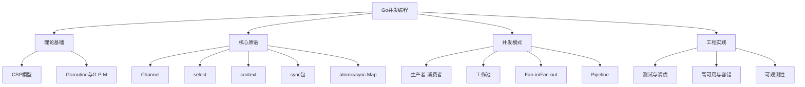

# 2.1 Go并发编程内容总结与知识体系图谱

<!-- TOC START -->
- [2.1 Go并发编程内容总结与知识体系图谱](#21-go并发编程内容总结与知识体系图谱)
  - [2.1.1 1. 内容闭环](#211-1-内容闭环)
  - [2.1.2 2. Go并发特色与工程价值](#212-2-go并发特色与工程价值)
  - [2.1.3 3. 进阶建议](#213-3-进阶建议)
  - [2.1.4 4. 未来趋势](#214-4-未来趋势)
  - [2.1.5 2. 知识体系图谱](#215-2-知识体系图谱)
  - [2.1.6 3. 学习建议与进阶路线](#216-3-学习建议与进阶路线)
  - [2.1.7 4. 参考文献](#217-4-参考文献)
<!-- TOC END -->

## 2.1.1 1. 内容闭环

- 理论基础（CSP、GPM模型、调度器原理）
- 关键技术（Goroutine、Channel、select/context、sync包、原子操作、并发安全容器）
- 常见并发模式（生产者-消费者、工作池、fan-in/fan-out、pipeline等）
- 工程分析与性能优化（调度、GOMAXPROCS、锁优化、无锁并发、泄漏检测）
- 测试建议与工具（race、bench、pprof、trace）
- FAQ与常见陷阱
- 开源项目案例与进阶专题

## 2.1.2 2. Go并发特色与工程价值

- 原生CSP模型、轻量级Goroutine、Channel通信、调度器高效
- 适合高并发、云原生、微服务、分布式场景
- 关注性能、可维护性、扩展性与工程落地

## 2.1.3 3. 进阶建议

- 深入理解调度器、内存模型、锁与无锁、并发安全容器
- 多做模式对比与适用性分析，结合实际业务与开源项目持续实践
- 关注Go新特性（如sync/atomic、泛型并发容器等）

## 2.1.4 4. 未来趋势

- 云原生、服务网格、分布式系统下的并发新模式
- 自动化、可观测性、韧性设计等工程化新需求

---

## 2.1.5 2. 知识体系图谱

---

## 2.1.6 3. 学习建议与进阶路线

- 建议先掌握Goroutine、Channel、select等基础原语，再深入sync、atomic等底层机制。
- 多实践常见并发模式，结合实际业务场景设计高效并发方案。
- 善用-race、pprof等工具进行并发调试与性能分析。
- 关注Go官方博客、社区最佳实践，持续学习新特性（如Go 1.22调度器优化等）。
- 进阶可学习分布式系统、微服务、云原生等更高层次并发与工程实践。

---

## 2.1.7 4. 参考文献

- Go官方文档：<https://golang.org/doc/>
- Go Blog: <https://blog.golang.org/>
- 《Go语言高级编程》
