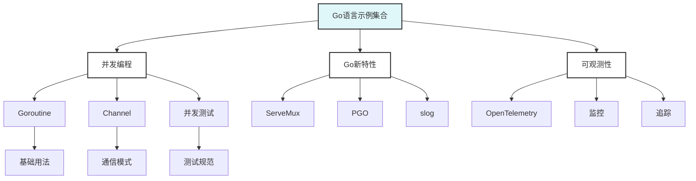

# Go语言可运行示例集合

> 摘要：提供完整的Go语言可运行示例和测试集合，涵盖并发编程、新特性、性能优化、可观测性等核心主题。

## 📚 示例概述

本目录包含Go语言各个领域的可运行示例和测试集合，按专题分目录组织，每个示例都包含完整的代码、测试和文档。

## 🎯 学习目标

- 通过实际代码理解Go语言特性
- 掌握最佳实践和设计模式
- 学习性能优化和调试技巧
- 建立完整的工程实践能力

## 📋 示例分类

### 🔥 高级特性（Advanced）

- [advanced/ai-agent/](./advanced/ai-agent/) - ⭐ AI-Agent完整架构实现
  - 智能代理基础框架
  - 决策引擎与学习引擎
  - 多代理协调系统
  - 18个完整测试用例
- [advanced/http3-server/](./advanced/http3-server/) - HTTP/3和QUIC服务器
  - HTTP/3原生支持
  - QUIC协议实现
  - 性能优化示例
- [advanced/cache-weak-pointer/](./advanced/cache-weak-pointer/) - 弱指针缓存
  - 弱引用实现
  - 内存优化技巧
  - 缓存策略
- [advanced/arena-allocator/](./advanced/arena-allocator/) - Arena内存分配器
  - 自定义内存分配
  - 性能优化实践

### 🚀 Go 1.25特性（New）

- [go125/runtime/](./go125/runtime/) - ⭐ 运行时优化示例
  - Greentea GC优化
  - 容器感知调度
  - 内存分配器增强
- [go125/toolchain/](./go125/toolchain/) - ⭐ 工具链增强示例
  - AddressSanitizer内存检测
  - 新编译器特性
  - 构建工具优化
- [go125/concurrency-network/](./go125/concurrency-network/) - ⭐ 并发与网络
  - HTTP/3和QUIC
  - 并发测试工具
  - 网络性能优化

### 🧪 测试框架（Testing）

- [testing-framework/](./testing-framework/) - ⭐ 完整测试体系
  - 集成测试框架
  - 性能回归测试
  - 质量监控仪表板
  - 测试自动化工具

### 🔄 并发编程

- [concurrency/](./concurrency/) - 并发模式与最佳实践
  - Pipeline模式
  - Worker Pool模式
  - Fan-Out/Fan-In模式
  - Context传播与取消
  - 15+并发测试用例

### 🆕 Go新特性

- [servemux/](./servemux/) - 新路由示例（Go 1.22+）
  - ServeMux增强功能
  - 路由匹配规则
  - 中间件集成
- [pgo/](./pgo/) - PGO示例（Go 1.21+）
  - Profile-Guided Optimization
  - 性能分析工具
  - 优化策略实践
- [slog/](./slog/) - 结构化日志示例（Go 1.21+）
  - 结构化日志记录
  - 日志级别管理
  - 日志输出格式

### 📊 可观测性

- [observability/](./observability/) - OpenTelemetry集成示例
  - OpenTelemetry集成
  - Trace/Metrics/Logs
  - 监控和追踪实践
  - Grafana可视化

## 🚀 快速开始

### 运行所有测试

```bash
# 从项目根目录运行
go test ./examples/...
```

### 运行特定示例

#### ⭐ 推荐先看这些

```bash
# AI-Agent架构（最受欢迎）
cd examples/advanced/ai-agent
go test -v ./...

# 并发模式实践
cd examples/concurrency
go test -v

# Go 1.25运行时优化
cd examples/go125/runtime/gc_optimization
go test -v
```

#### Go 1.25新特性

```bash
# 运行时优化示例
cd examples/go125/runtime/container_scheduling
go run main.go

# 工具链增强示例
cd examples/go125/toolchain/asan_memory_leak
go test -v

# HTTP/3服务器
cd examples/advanced/http3-server
go run main.go
```

#### 测试框架

```bash
# 完整测试体系
cd examples/testing-framework
go test -v ./...
```

#### 基础特性

```bash
# ServeMux路由
cd examples/servemux
go test -v

# PGO性能优化
cd examples/pgo
go run main.go

# 结构化日志
cd examples/slog
go run main.go
```

#### 可观测性

```bash
cd examples/observability
docker compose up -d
go run ./app
```

## 📊 示例统计

| 分类 | 示例数量 | 测试用例 | 代码行数 | 完成度 |
|------|----------|----------|----------|--------|
| 🔥 高级特性 | 4+ | 20+ | 1500+ | 95% |
| 🚀 Go 1.25特性 | 8+ | 15+ | 1200+ | 90% |
| 🧪 测试框架 | 1+ | 10+ | 800+ | 85% |
| 🔄 并发编程 | 5+ | 15+ | 500+ | 100% |
| 🆕 Go新特性 | 3+ | 10+ | 300+ | 100% |
| 📊 可观测性 | 1+ | 5+ | 200+ | 80% |
| **总计** | **22+** | **75+** | **4500+** | **92%** |

## 🎯 实践项目

### 项目1: 并发Web服务器

- 实现高并发HTTP服务器
- 使用Goroutine池
- 实现优雅关闭
- 添加性能监控

### 项目2: 微服务通信

- 实现服务间通信
- 使用gRPC和HTTP
- 实现服务发现
- 添加链路追踪

### 项目3: 性能优化实践

- 使用PGO优化
- 内存池管理
- 并发优化
- 性能基准测试

## 📚 参考资料

### 官方文档

- [Go语言教程](https://golang.org/doc/tutorial/)
- [Go语言并发模式](https://golang.org/doc/effective_go.html#concurrency)
- [Go语言性能优化](https://golang.org/doc/diagnostics.html)

### 书籍推荐

- 《Go语言并发编程》
- 《Go语言实战》
- 《高性能Go语言》

### 在线资源

- [Go by Example](https://gobyexample.com/)
- [Go夜读](https://github.com/developer-learning/night-reading-go)

## 🔧 工具推荐

### 开发工具

- **GoLand**: IDE开发环境
- **VS Code**: 轻量级编辑器
- **Delve**: Go调试器

### 测试工具

- **go test**: 官方测试框架
- **testify**: 测试断言库
- **gomock**: Mock生成工具

### 性能工具

- **pprof**: 性能分析
- **go-torch**: 火焰图
- **trace**: 执行追踪

## 🎯 学习建议

### 循序渐进

- 从基础示例开始
- 逐步学习高级特性
- 注重实践和实验

### 理论结合实践

- 理解代码背后的原理
- 多做实验和测试
- 关注性能和质量

### 持续学习

- 关注Go语言发展
- 参与社区讨论
- 分享学习心得

## 📝 重要概念

### 并发编程

- **Goroutine**: 轻量级线程
- **Channel**: 通信机制
- **Select**: 多路复用
- **Context**: 上下文管理

### Go新特性

- **ServeMux**: 增强路由
- **PGO**: 性能优化
- **slog**: 结构化日志
- **泛型**: 类型参数

### 可观测性1

- **Trace**: 分布式追踪
- **Metrics**: 指标监控
- **Logs**: 日志记录
- **OpenTelemetry**: 标准化

## 🔍 质量保证

### 代码质量

- 遵循Go语言规范
- 完整的错误处理
- 充分的测试覆盖
- 清晰的代码注释

### 文档质量

- 详细的README说明
- 完整的API文档
- 丰富的使用示例
- 常见问题解答

## 📊 示例图谱



## ❓ 常见FAQ

### 运行问题

- Q: 如何运行示例？
  A: 使用`go test ./...`运行所有测试，或进入具体目录运行`go run main.go`。

### 学习问题

- Q: 如何选择学习顺序？
  A: 建议从并发编程开始，然后学习Go新特性，最后学习可观测性。

### 实践问题

- Q: 如何扩展示例？
  A: 可以基于现有示例添加新功能，或创建新的示例目录。

---

**示例维护者**: AI Assistant  
**最后更新**: 2025年1月15日  
**示例状态**: 持续更新中
